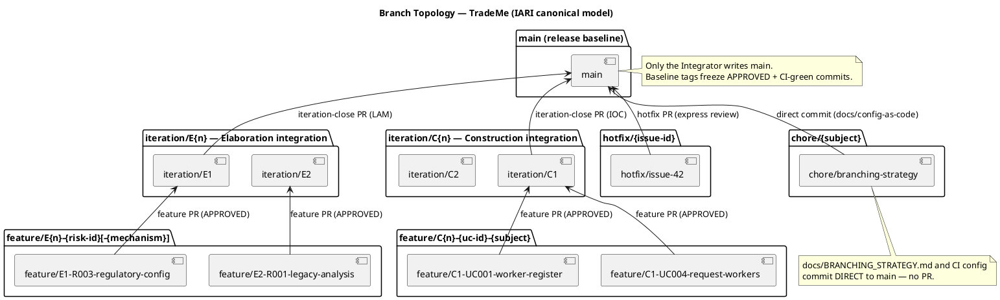
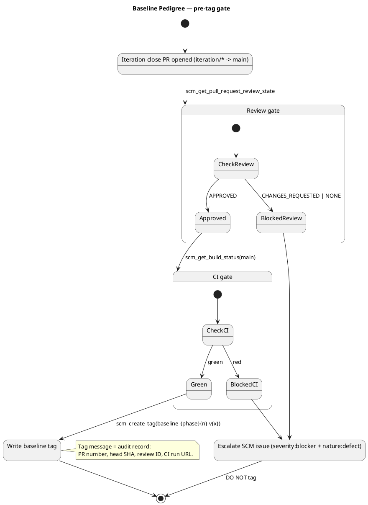

# TradeMe Branching Strategy

## Document Control

| Field | Value |
|---|---|
| Phase | Inception |
| Status | Published — iteration 1 |
| Milestone Target | End-of-Inception review |

## Purpose

This file is configuration-as-code: the workspace hierarchy (developer → integration → release) that every role consumes. It is committed DIRECT to `main` via `scm_commit_files` — never opened as a PR. PRs are for source code; this file is documentation that downstream consumers (Integrator, Implementer, Reviewer) must read without a review gate.

## Branch Topology

## Baseline Pedigree

## Naming Conventions

### Branches

| Pattern | Purpose | Phase |
|---|---|---|
| `feature/E{n}-{risk-id}[-{mechanism}]` | Evolutionary architectural mechanism (based on `iteration/E{n}`, integrated like a feature) | Elaboration |
| `feature/C{n}-{uc-id}-{subject}` | Feature branch realizing a use case | Construction |
| `iteration/E{n}` | Elaboration integration workspace | Elaboration |
| `iteration/C{n}` | Construction integration workspace | Construction |
| `hotfix/{issue-id}` | Transition hotfix from `main` | Transition |
| `chore/{subject}` | Non-functional repo maintenance (branching strategy, CI config) | Any |

Non-conforming branches are surfaced as SCM issues with `severity:minor` + `nature:defect` + `naming-violation` labels.

### Baseline Tags

`baseline-{phase}{n}-v{x}` where `phase` ∈ {elaboration, construction, transition}, `n` is the iteration number, and `x` is the patch version starting at 1.

- `baseline-elaboration-E1-v1` — Elaboration architecture baseline (iteration 1)
- `baseline-construction-C1-v1` — Construction iteration baseline (iteration 1)
- `baseline-transition-T1-v1` — Transition release baseline (release 1)

Re-tagging with a higher patch (`v2`, `v3`…) is justified ONLY after a rollback or a post-baseline critical fix. Normal iteration work targets the NEXT iteration's tag.

## Canonical Branching Model per Phase

### Inception

Documentation only; normally no implementation code. A feasibility mechanism, if genuinely required for risk reduction, is built evolutionarily in `src/` on `feature/I{n}-{subject}` (never throwaway).

### Elaboration — evolutionary architectural mechanism (mirrors Construction)

The architectural prototype is EVOLUTIONARY — it becomes the Construction baseline, not throwaway sample code. A technical risk is retired by ANALYSIS (the Software Architect reasons feasibility — no code) or by building the REAL mechanism in `src/` on `feature/E{n}-{risk-id}[-{mechanism}]` based on `iteration/E{n}`.

- The Architect records the decision as a process fact (`record_poc_decision`: `analysis-only` | `single-mechanism` | `candidates`).
- The Code Reviewer opens + reviews each mechanism PR (base `iteration/E{n}`) as production.
- The Integrator merges the APPROVED mechanism into `iteration/E{n}`.
- For competing `candidates` the Architect selects the winner and the Integrator closes the loser's PR (`scm_close_pull_request`) per the recorded decision.
- At LAM close the Integrator opens `iteration/E{n} → main`; the Deliver bookend merges the reviewed baseline.

There is **no** `samples/poc/` and **no** ephemeral `poc/*` branch.

### Construction — feature branches

UC realizations on `feature/C{n}-{uc-id}-{subject}` based on `iteration/C{n}`; the Code Reviewer reviews, the Integrator merges APPROVED into `iteration/C{n}` and opens `iteration/C{n} → main` at IOC.

### Transition — hotfixes

`hotfix/{issue-id}` from `main`, express review, merge to `main` with a patch baseline tag.

## Cross-Phase Invariants

- Only the Integrator writes `iteration/*` and `main` (no other role pushes there).
- `ready-for-review` is the Implementer → Code Reviewer handoff label.
- A baseline tag freezes only an APPROVED + CI-green commit.
- One baseline tag per iteration close — never mid-iteration.

## Traceability

| Element | Traces From | Link Type | Traces To |
|---|---|---|---|
| Branch topology (main/iteration/feature/hotfix) | CON-017 (multi/single-tenant), CON-020 (legacy coexistence) | Derives | Integrator, Implementer, Reviewer workflows |
| Baseline pedigree (pre-tag gate) | CON-014 (regulatory reporting), AC-006 (audit) | Derives | Baseline tags |
| Naming conventions | R001/R002 (lean, auditable process) | Derives | Branch/tag names |
