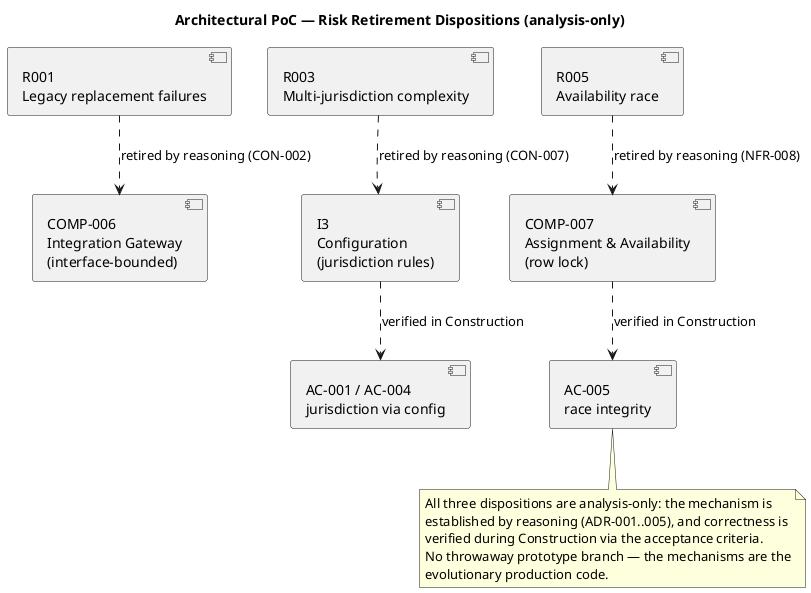

## Document Control

| Field | Value |
|---|---|
| Phase | Elaboration |
| Status | Draft — iteration 2 |
| Milestone Target | End-of-Elaboration review (Lifecycle Architecture Milestone) |

## Objective and Risks Addressed

This artifact records how the architectural risks are retired. The objective is to establish — before Construction — that the baselined architecture satisfies the two constraints the legacy system could not (CON-001 cloud deployment, CON-002 external connectivity), and that the multi-jurisdiction and availability-race mechanisms are sound.

| Risk | Exposure | Constraint Under Test | Disposition |
|---|---|---|---|
| R001 | 12 (SIGNIFICANT) | CON-001 (cloud), CON-002 (external integration) | analysis-only |
| R003 | 12 (SIGNIFICANT) | CON-007 (jurisdiction configuration), NFR-003 | analysis-only |
| R005 | 12 (SIGNIFICANT) | NFR-008 (availability race), AC-005 | analysis-only |

All three dispositions are **analysis-only**: the mechanism is established by reasoning against the baselined architecture (ADR-001..ADR-005), and correctness is verified during Construction via the acceptance criteria. No throwaway prototype branch is created — the mechanisms are the evolutionary production code in `src/`.

## Approach

The PoC strategy is **reasoned disposition, not empirical prototype**. The decision to retire each risk by analysis rather than by building a throwaway prototype rests on three facts:

1. **The stack is cloud-native by construction.** Node.js (LTS) + TypeScript, PostgreSQL, and Keycloak are all standard cloud-deployable technologies. There is no legacy constraint — no on-premise-only dependency, no proprietary runtime — that would prevent cloud deployment (CON-001). The legacy's inability to move to cloud was a property of the *legacy*, not of the problem domain.
2. **External integration is interface-bounded.** COMP-006 (Integration Gateway) exposes `IIntegration`; all external connectivity (contractor AP systems, credential validators) flows through that interface. HTTP-based integration is a standard, well-understood pattern; the legacy's inability to connect to external systems was a property of the *legacy*, not of the problem domain (CON-002).
3. **The race and jurisdiction mechanisms are established patterns.** The availability race (NFR-008) is resolved by the PostgreSQL row-lock pattern (`SELECT ... FOR UPDATE`) in COMP-007 — the canonical solution to exactly this race. Configuration-over-code for jurisdiction rules (CON-007) is realized by the Configuration subsystem (I3) — a well-established pattern.

The organizational root-cause analysis (why past replacement attempts failed — R001's deeper question) is a management activity, not a technical PoC; it is owned by the Project Manager and tracked in the Risk List.

## Results and Findings

| Risk | Acceptance Criteria | Result |
|---|---|---|
| R001 | The chosen stack (Node.js LTS + TypeScript, PostgreSQL, Keycloak) is cloud-native by construction — no legacy constraint prevents cloud deployment (CON-001). External integration is interface-bounded via COMP-006 — no legacy constraint prevents external connectivity (CON-002). | **Met by reasoning.** Cloud deployment and HTTP-based integration are standard, well-understood patterns; feasibility is established by ADR-001, ADR-003, ADR-005. |
| R003 | Configuration-driven compliance (CON-007, NFR-003) is realized by the configuration subsystem (I3) as the single source of jurisdiction rules. | **Met by reasoning.** Configuration-over-code is a well-established pattern (ADR-002, COMP-003). Expressiveness of the configuration schema is validated during Construction via AC-001 and AC-004. |
| R005 | The availability race (NFR-008, AC-005) is resolved by the atomic availability check in COMP-007 (row lock: `SELECT ... FOR UPDATE`). | **Met by reasoning.** The row lock is the standard PostgreSQL pattern for exactly this race; the UC-004 sequence diagram documents the BEGIN / SELECT FOR UPDATE / COMMIT / ROLLBACK flow. Correctness is validated during Construction via AC-005. |

**Finding:** No empirical prototype was required. The three risks are retired by analysis because each mechanism is a standard, well-understood pattern applied to a problem whose legacy constraints were properties of the *legacy system*, not of the problem domain. The residual risk is not "will the mechanism work" but "will the mechanism be correctly implemented" — and that is the work of Construction, verified by AC-001, AC-004, AC-005.

## Architectural Implications

1. **No throwaway code.** The mechanisms that retire these risks are the evolutionary production code: COMP-006 (Integration Gateway), I3 (Configuration), COMP-007 (Assignment & Availability). The Implementer builds them in `src/` as the Construction baseline, not as a disposable prototype.
2. **Verification is deferred to Construction, not skipped.** The analysis-only disposition establishes *feasibility*; it does not establish *correctness*. AC-001 (new jurisdiction via configuration alone), AC-004 (two jurisdictions with different rules), and AC-005 (race integrity) remain the verification anchors, exercised during Construction.
3. **The fallback for R005 stands.** If the row-lock atomic check cannot be closed atomically in practice, the Risk List (R005) records the fallback: serialize assignment through a single availability ledger and accept a modest throughput cost (CON-021 says throughput is not binding).
4. **R001's organizational root cause is out of scope for this artifact.** The deeper question of why past replacement attempts failed is a management/leadership activity (R002), owned by the Project Manager, not a technical PoC deliverable.

## Traceability

| Element | Traces From | Link Type | Traces To |
|---|---|---|---|
| Architectural Proof-of-Concept | R001, R003, R005 | DependsOn | Software Architecture Document (COMP-006, I3, COMP-007) |
| R001 disposition | CON-001, CON-002 | DependsOn | ADR-001, ADR-003, ADR-005 |
| R003 disposition | CON-007, NFR-003, AC-001, AC-004 | DependsOn | COMP-003, I3 |
| R005 disposition | NFR-008, AC-005 | DependsOn | COMP-007, UC-004 |