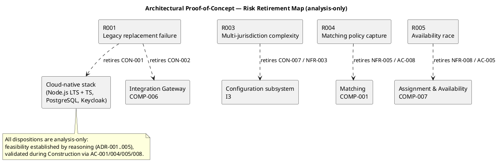

## Document Control

| Field | Value |
|---|---|
| Phase | Elaboration |
| Status | Draft — iteration 2 |
| Milestone Target | End-of-Elaboration review (Lifecycle Architecture Milestone) |

## Objective and Risks Addressed

The Architectural Proof-of-Concept retires the technical risks that the Risk List flagged as requiring empirical validation before the Lifecycle Architecture Milestone can close. The objective is to establish — by reasoning where the mechanism is a well-understood pattern, and by executable prototype where it is not — that the baselined architecture (SAD, ADR-001..005) can satisfy the constraints the legacy system could not.

**Risks in scope this iteration:**

| Risk | Exposure | Magnitude | Constraint(s) at stake | Retirement mode |
|---|---|---|---|---|
| R001 | 12 | SIGNIFICANT | CON-001 (cloud), CON-002 (external integration) | analysis-only |
| R003 | 12 | SIGNIFICANT | CON-007, NFR-003 (configuration-driven compliance) | analysis-only |
| R004 | 12 | SIGNIFICANT | FR-018, NFR-005, AC-008 (matching policy capture) | analysis-only |
| R005 | 12 | SIGNIFICANT | NFR-008, AC-005 (availability race) | analysis-only |

**R002** (leadership tension, exposure 16, HIGH) is a management-relationship risk, not a technical one — no artifact retires it; only the evidence trail (traceability + review record) manages it. It is owned by the Project Manager and is out of scope for this PoC.

## Approach

Every in-scope risk is retired **analysis-only**: the mechanism that retires it is a well-established, well-understood pattern whose feasibility is established by reasoning against the baselined architecture, and whose correctness is validated during Construction against a named acceptance criterion. No throwaway prototype branch is warranted — there is no mechanism whose behavior is uncertain enough to require empirical demonstration before the design can be trusted.

The decision rule applied per risk: **analysis-only** when the mechanism is a proven pattern (configuration-over-code, row-lock atomicity, interface-bounded integration, cloud-native stack) and the residual uncertainty is about *expressiveness* (does the configuration schema cover a new jurisdiction's rules?) rather than *feasibility* (can the mechanism work at all?). Expressiveness is validated by acceptance criteria during Construction, not by a prototype now.

## Results and Findings

### R001 — Legacy replacement failure (CON-001 cloud, CON-002 external integration)

**Disposition: analysis-only.** The legacy's two binding limitations — cannot move to cloud-hosted infrastructure, cannot connect to external systems — are both retired by the baselined stack *by construction*:

- **CON-001 (cloud):** Node.js (LTS) + TypeScript, PostgreSQL, and Keycloak are all cloud-native by construction. None carries a legacy on-premises constraint. The Deployment View (SAD) already models both multi-tenant and single-tenant cloud topologies (CON-017). Cloud deployment of this stack is a standard, well-understood operation — no empirical demonstration is needed to establish feasibility.
- **CON-002 (external integration):** External connectivity is interface-bounded via COMP-006 Integration Gateway (NFR-007). HTTP-based integration with contractor AP systems (FR-017) and credential validators (STK-005) is a standard pattern. The interface boundary is already baselined in the Logical View.

The *organizational* root cause of past failures (why the legacy replacement attempts failed) is a management activity, not a technical PoC — it is owned by the Project Manager under R002 and is not addressable by any prototype.

### R003 — Multi-jurisdiction regulatory complexity (CON-007, NFR-003)

**Disposition: analysis-only.** Configuration-driven compliance is realized by the Configuration subsystem (I3) as the single source of jurisdiction rules — labor law, tax, certification, reporting, currency. Configuration-over-code is a well-established pattern; the mechanism is established by reasoning (ADR-002, COMP-003). The residual uncertainty is *expressiveness* — whether a given jurisdiction's rules can be expressed in the configuration schema — which is validated during Construction via **AC-001** (new jurisdiction via configuration alone) and **AC-004** (two jurisdictions with different rules produce correct jurisdiction-specific behavior). No empirical PoC is required.

### R004 — Matching policy capture (FR-018, NFR-005, AC-008)

**Disposition: analysis-only.** The hand-tuned matching policy that lives in 220 representatives' heads is captured in configurable, explainable, deterministic form by COMP-001 Matching. Business Modeling remains active to extract the manual brokerage process; the policy is codified as configuration, not code (ADR-002). The residual uncertainty is *expressiveness* — whether the policy can be fully codified — validated during Construction via **AC-008** (policy adjusted via configuration, not code). The Risk List records the fallback: ship a first-acceptable-match default with a published weighting extension point if the policy cannot be fully codified.

### R005 — Availability race condition (NFR-008, AC-005)

**Disposition: analysis-only.** The match→assign transition is an atomic availability check in COMP-007 — a `SELECT ... FOR UPDATE` row lock on worker availability, documented in the UC-004 sequence diagram (BEGIN / SELECT FOR UPDATE / COMMIT / ROLLBACK). The row lock is the standard PostgreSQL pattern for exactly this race. Correctness is validated during Construction via **AC-005**. The fallback (single availability ledger) is recorded in the Risk List (R005) if atomicity cannot be achieved.

## Architectural Implications

1. **No throwaway prototype branch.** All four risks retire by reasoning; there is no mechanism to build this iteration. The Implementer builds the *evolutionary* mechanisms (COMP-001, COMP-003, COMP-007, COMP-006) directly in `src/` during Construction — they are production code, not samples.

2. **Verification is deferred to Construction acceptance criteria.** The PoC establishes *feasibility*; the acceptance criteria (AC-001, AC-004, AC-005, AC-008) establish *correctness*. The Risk List statuses (R001, R003, R004, R005 = MITIGATING/IMPROVING) remain accurate: mitigations are baselined as design, verification is the work of Construction.

3. **R002 remains the open HIGH risk.** It is a leadership-relationship risk that no technical artifact retires. The evidence trail (traceability + review record) is the only management lever, owned by the Project Manager.

4. **The baselined architecture is unchanged.** No finding from this PoC requires a revision to the SAD, ADRs, or subsystem decomposition. The analysis confirms the modular-monolith decision (ADR-001) and the decomposition-by-change strategy (ADR-002) are sound against the declared constraints.

## Traceability

| Element | Traces From | Link Type | Traces To |
|---|---|---|---|
| R001 | CON-001, CON-002 | DependsOn | ADR-001, ADR-003, ADR-005, COMP-006 |
| R003 | CON-007, NFR-003, AC-001, AC-004 | DependsOn | COMP-003, Configuration (I3) |
| R004 | FR-018, NFR-005, AC-008 | DependsOn | COMP-001 |
| R005 | NFR-008, AC-005 | DependsOn | COMP-007 |
