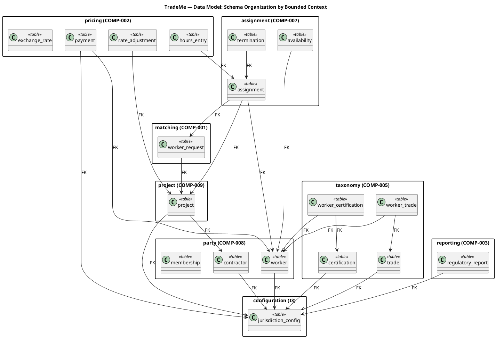
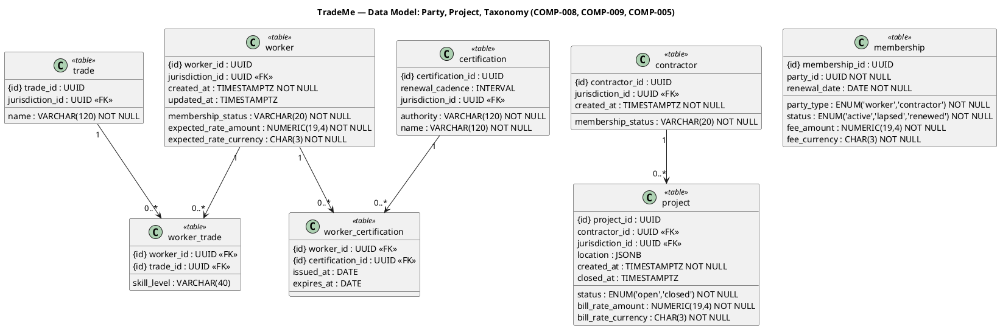
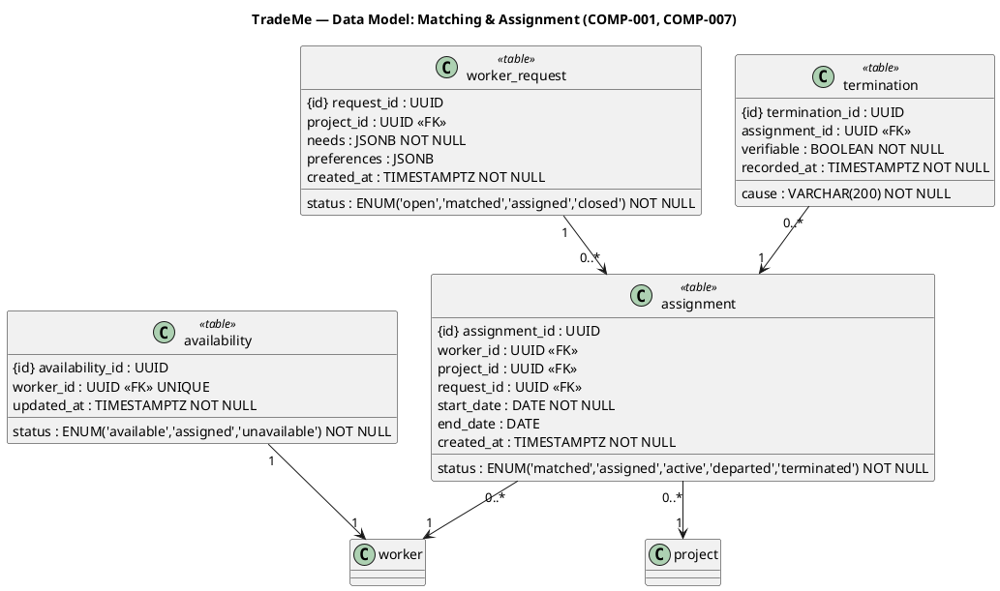
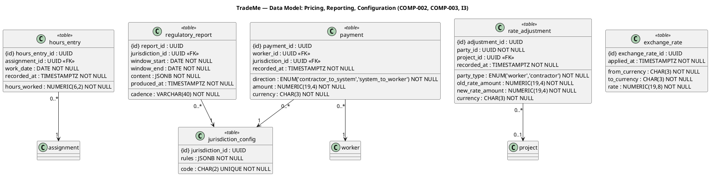

## Document Control
| Field | Value |
|---|---|
| Phase | Elaboration |
| Status | Draft — iteration 1 |
| Milestone Target | End-of-Elaboration review (Lifecycle Architecture Milestone) |
| Database Engine | PostgreSQL (latest) — stakeholder-declared (REQ-029) |

## Entity-Relationship Overview

This Data Model maps the persistent design classes from the Design Model (ACL-013..ACL-023 and their design-class elaborations) to physical PostgreSQL tables. It is a **complement** to the Design Model, not a replacement: every table traces to a persistent class, and every class's persistence is specified here.

**Binding constraints inherited from the SAD and Supplementary Specification:**
- **Money is never a bare number (ADR-004).** Every monetary column is `NUMERIC(19,4)` (exact) paired with a `CHAR(3)` currency column. No `FLOAT`/`DOUBLE`/`REAL` appears on any monetary path. The driver's type handling is configured so `NUMERIC` is never degraded to a floating-point number on read.
- **Append-only for financial and assignment transactions (REQ-003, AC-006).** `payment`, `termination`, `rate_adjustment`, `exchange_rate`, and `regulatory_report` are append-only — never updated in place.
- **Retention (CON-015, REQ-004).** No `DELETE` path exists for retained records; retention is enforced by policy, not by schema.
- **Residency (CON-016, REQ-005).** Personal data is scoped by `jurisdiction_id`; single-tenant deployment isolates a jurisdiction's data at the database level.
- **Exact numeric never degrades to float (ADR-004).** `NUMERIC` columns are the only numeric type for money and hours.
- **Availability race (NFR-008, REQ-011, AC-005).** The `availability` table is the serialized race point — a single row per worker, locked with `SELECT ... FOR UPDATE` during the match→assign transition.

**Schema organization** follows the SAD's subsystem decomposition (bounded contexts). Each subsystem owns its tables; cross-context references are foreign keys only (no cross-context joins through internals).

## Entities and Attributes

### Party (COMP-008) + Project (COMP-009) + Taxonomy (COMP-005)

**Design notes:**
- `worker` and `contractor` are separate tables (not a single `party` table) because their attributes diverge (worker carries trades/certifications/expected rate; contractor does not). `membership` is a shared table keyed by `party_type` + `party_id` (polymorphic association) — the membership lifecycle (FR-010, FR-011) is identical for both parties.
- `worker_trade` and `worker_certification` are junction tables realizing the M:N relationships between a worker and the configurable taxonomy (CON-018). The taxonomy itself (`trade`, `certification`) is configurable data, not a hard-coded enumeration.
- `expected_rate` and `bill_rate` are Money pairs (`_amount` NUMERIC + `_currency` CHAR(3)) per ADR-004. Rate varies by trade/skill/experience/project/location/union/certifications (FR-001) — the per-trade rate detail lives in `worker_trade`/`rate_adjustment`, not as a single scalar.
- `project.location` is JSONB (a GeoArea value object) — the location model is not yet stable enough to warrant a normalized geometry table at this scale (CON-021).

### Matching (COMP-001) + Assignment (COMP-007)

**Design notes:**
- `availability` is the **serialized race point** (NFR-008, REQ-011, AC-005). One row per worker (`worker_id UNIQUE`); the match→assign transition locks this row (`SELECT ... FOR UPDATE`) and flips `status` atomically. Exactly one assignment commits; the losing request reverts to matching (FR-019).
- `assignment.status` mirrors the Design Model's state machine (Matched → Assigned → Active → Departed → Terminated). `departed` is a reversible state (worker returns, UC-005); `terminated` is terminal.
- `termination` is append-only (REQ-003) and records the deviation from commitment (CON-013). `verifiable` encodes the CON-006/CON-013 gate — a non-verifiable termination is rejected at the application layer and never reaches this table.
- `worker_request.needs` and `.preferences` are JSONB: the needs (trades, skill levels, location, duration, rate) and preferences (soft signals, CON-006) are structured but evolve with the matching policy (NFR-005, AC-008). Keeping them as JSONB avoids a schema change every time the policy gains a factor.

### Pricing (COMP-002) + Reporting (COMP-003) + Configuration (I3)

**Design notes:**
- `payment` is append-only (REQ-003, AC-006) and records both directions of the financial-intermediary flow (CON-004): `contractor_to_system` and `system_to_worker`. `amount` is `NUMERIC(19,4)` + `currency` (ADR-004).
- `exchange_rate` records the rate + moment applied for every currency conversion (FR-022, ADR-004) — conversion is explicit and auditable, never implicit.
- `rate_adjustment` records worker/contractor rate changes (FR-023) without active price-setting. It is append-only; the current rate is the latest row, not an in-place update.
- `jurisdiction_config.rules` is JSONB — the single source of jurisdiction rules (tax, wage floors, risk premiums, reporting format/cadence, certification mandates) per CON-007/NFR-003/AC-001. A new jurisdiction is a new row, not a code change.
- `regulatory_report.content` is JSONB — the assembled report in the jurisdiction's required format (CON-014). The report is append-only (a produced report is never rewritten).

## Constraints and Indexes

### Primary and Foreign Keys

| Table | PK | FKs (→ referenced table) | Cascade policy |
|---|---|---|---|
| worker | worker_id | jurisdiction_id → jurisdiction_config | RESTRICT |
| contractor | contractor_id | jurisdiction_id → jurisdiction_config | RESTRICT |
| membership | membership_id | (polymorphic party_id — no FK) | — |
| project | project_id | contractor_id → contractor; jurisdiction_id → jurisdiction_config | RESTRICT |
| trade | trade_id | jurisdiction_id → jurisdiction_config | RESTRICT |
| certification | certification_id | jurisdiction_id → jurisdiction_config | RESTRICT |
| worker_trade | (worker_id, trade_id) | worker_id → worker; trade_id → trade | CASCADE |
| worker_certification | (worker_id, certification_id) | worker_id → worker; certification_id → certification | CASCADE |
| worker_request | request_id | project_id → project | RESTRICT |
| assignment | assignment_id | worker_id → worker; project_id → project; request_id → worker_request | RESTRICT |
| availability | availability_id | worker_id → worker (UNIQUE) | CASCADE |
| termination | termination_id | assignment_id → assignment | RESTRICT |
| hours_entry | hours_entry_id | assignment_id → assignment | RESTRICT |
| payment | payment_id | worker_id → worker; jurisdiction_id → jurisdiction_config | RESTRICT |
| rate_adjustment | adjustment_id | project_id → project (nullable) | RESTRICT |
| exchange_rate | exchange_rate_id | (none) | — |
| regulatory_report | report_id | jurisdiction_id → jurisdiction_config | RESTRICT |
| jurisdiction_config | jurisdiction_id | (none) | — |

**Cascade rationale:** `RESTRICT` is the default — retained records (CON-015) must never be silently deleted by a cascade. `CASCADE` is used only for the two junction tables (`worker_trade`, `worker_certification`) and `availability`, where the child row is meaningless without its parent and deletion of the parent (a worker) legitimately removes the dependent rows. `membership.party_id` is a polymorphic reference (worker OR contractor) and therefore carries no FK — integrity is enforced at the application layer via `party_type`.

### Indexes (each justified by a specific access pattern)

| Index | Table | Columns | Justification |
|---|---|---|---|
| `idx_availability_worker` | availability | worker_id (UNIQUE) | The match→assign race point (NFR-008, REQ-011): `SELECT ... FOR UPDATE` on worker availability must hit exactly one row in O(1). |
| `idx_assignment_worker_status` | assignment | worker_id, status | UC-004/UC-014: find a worker's active assignments; the availability check and termination flow both query by worker + status. |
| `idx_assignment_project` | assignment | project_id | UC-005/UC-021: list assignments on a project (arrival/departure tracking, project close). |
| `idx_hours_entry_assignment_date` | hours_entry | assignment_id, work_date | UC-006/UC-012: the payment run aggregates hours by assignment within a window (REQ-013 p95 ≤ 2s on the interactive hours-entry path). |
| `idx_payment_worker_recorded` | payment | worker_id, recorded_at | UC-012/UC-013: payment history per worker and the reporting window scan (labor activity, payment flows). |
| `idx_worker_request_project` | worker_request | project_id | UC-004: a contractor's requests for a project. |
| `idx_worker_trade_trade` | worker_trade | trade_id | UC-004: `availableWorkers(trades, location)` — the matching candidate search filters by trade. |
| `idx_worker_jurisdiction` | worker | jurisdiction_id | Residency scoping (CON-016) and jurisdiction-scoped reporting (UC-013). |
| `idx_project_contractor` | project | contractor_id | UC-003/UC-015: a contractor's projects. |
| `idx_regulatory_report_jurisdiction_window` | regulatory_report | jurisdiction_id, window_start | UC-013: report lookup by jurisdiction + window (CON-014 cadence). |

**Index strategy note:** Throughput is not a binding constraint (CON-021, REQ-014), so the index set is deliberately minimal — one index per access pattern exercised by the architecturally significant use cases, no speculative indexes. The one performance constraint is interactive-channel responsiveness (REQ-013, p95 ≤ 2s), which the `availability`, `assignment`, and `hours_entry` indexes serve directly.

### Check Constraints and Enums

- `membership.status` ∈ {active, lapsed, renewed} — membership lifecycle (FR-010).
- `assignment.status` ∈ {matched, assigned, active, departed, terminated} — mirrors the Design Model state machine (CON-013).
- `availability.status` ∈ {available, assigned, unavailable} — the race-point state.
- `payment.direction` ∈ {contractor_to_system, system_to_worker} — the two financial-intermediary flows (CON-004).
- `hours_entry.hours_worked > 0` — a negative or zero hours entry is invalid (FR-006).
- `termination.verifiable` is BOOLEAN NOT NULL — the CON-006/CON-013 gate is enforced at the application layer; the column records the outcome.

### Migration Strategy (baseline)

This is the **baseline schema** (version 1). It is created by a single idempotent migration script (`0001_baseline.sql`) that:
1. Creates `jurisdiction_config` first (no dependencies), then `worker`/`contractor`/`trade`/`certification`, then the dependent tables.
2. Creates all indexes after the tables.
3. Is idempotent — re-running against an empty database is a no-op; against a populated database it is guarded by `IF NOT EXISTS`.

**Forward-only policy:** All financial and assignment tables (`payment`, `termination`, `rate_adjustment`, `exchange_rate`, `regulatory_report`, `assignment`) are append-only. Future schema changes to these tables are **additive** (new columns, new tables) — never destructive (no column drop, no in-place type change). Rollback for a destructive change is a new migration that restores the prior shape, not an in-place revert.

**Retention (CON-015):** No `DELETE` path exists in the schema for retained records. Retention is enforced by policy (the longest applicable jurisdiction window); the schema simply never deletes.

## Traceability

| Element | Traces From | Link Type | Traces To |
|---|---|---|---|
| TBL-001 worker | ACL-013 Worker | Specifies | CLS-009 PartyService |
| TBL-002 contractor | ACL-014 Contractor | Specifies | CLS-009 PartyService |
| TBL-003 membership | ACL-014 (membership), FR-010, FR-011 | Specifies | COMP-008 |
| TBL-004 project | ACL-015 Project | Specifies | CLS-010 ProjectService |
| TBL-005 trade | ACL-023 (taxonomy), CON-018 | Specifies | CLS-011 TaxonomyService |
| TBL-006 certification | ACL-023 Certification, CON-018 | Specifies | CLS-011 TaxonomyService |
| TBL-007 worker_trade | ACL-013 (trades), CON-018 | Specifies | COMP-008 |
| TBL-008 worker_certification | ACL-013 (certifications), CON-018 | Specifies | COMP-008 |
| TBL-009 worker_request | ACL-016 WorkerRequest | Specifies | CLS-001 MatchingService |
| TBL-010 assignment | ACL-017 Assignment, CON-013 | Specifies | CLS-003 AssignmentService |
| TBL-011 availability | ACL-018 Availability, NFR-008, AC-005 | Specifies | CLS-004 AvailabilityLedger |
| TBL-012 termination | ACL-017 (deviation), CON-013, REQ-003 | Specifies | CLS-003 AssignmentService |
| TBL-013 hours_entry | ACL-019 HoursEntry | Specifies | CLS-005 PricingService |
| TBL-014 payment | ACL-020 Payment, REQ-003, ADR-004 | Specifies | CLS-005 PricingService |
| TBL-015 rate_adjustment | FR-023, CON-019 | Specifies | CLS-005 PricingService |
| TBL-016 exchange_rate | FR-022, ADR-004 | Specifies | CLS-007 CurrencyConverter |
| TBL-017 regulatory_report | ACL-021 RegulatoryReport, CON-014 | Specifies | COMP-003 |
| TBL-018 jurisdiction_config | ACL-022 JurisdictionConfig, NFR-003, AC-001 | Specifies | I3 Configuration |
