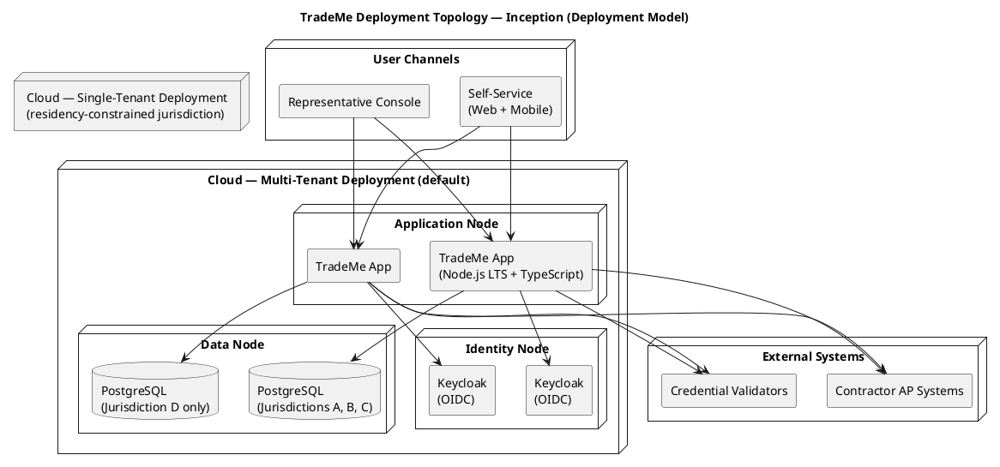

## Document Control
| Field | Value |
|---|---|
| Phase | Inception |
| Status | Draft — iteration 3 |
| Milestone Target | End-of-Inception review |

## Deployment Topology

**Deployment mode: Custom-built** (a bespoke system deployed to the company's own cloud infrastructure, not shrink-wrapped or downloadable). This is the only mode consistent with the declared scope: the system is a financial intermediary (CON-004) operating jurisdiction-specific compliance (CON-007), deployed to a small number of long-lived country-level environments (CON-017).

**Strategy (Inception baseline):** The same software artifact deploys in two topologies, chosen at deployment time through configuration — never a code branch (CON-017, AC-002):

1. **Multi-tenant (default)** — one instance serves multiple jurisdictions sharing a single PostgreSQL store, with jurisdiction rules held in configuration (CON-007, NFR-003).
2. **Single-tenant** — a dedicated instance for a jurisdiction whose personal-data-residency rules (CON-016) forbid cross-border data. Same software, isolated data node.

The number of deployments is small (countries, not customers) and long-lived; no rapid provisioning is required (CON-017). The identity provider (Keycloak over OIDC, ADR-005) is likewise a deployment-time configuration choice.

## Nodes and Connectors

| Node | Role | Artifacts Deployed | Notes |
|---|---|---|---|
| Application Node | Runs the TradeMe modular monolith (Node.js LTS + TypeScript) | Single deployable containing COMP-001..COMP-009 | One per deployment; in-process orchestration (ADR-001) |
| Data Node | Persistence | PostgreSQL (latest) | Multi-tenant: shared store, jurisdiction-scoped rows; single-tenant: isolated store |
| Identity Node | Authentication/authorization | Keycloak (OIDC) | Provider chosen at deployment time (ADR-005) |
| External — Contractor AP Systems | Payment submission from contractors (FR-017, near-term) | — | Reached via Integration Gateway (COMP-006) |
| External — Credential Validators | Certification verification (STK-005) | — | Reached via Integration Gateway (COMP-006) |

**Connectors (communication paths):**

| From | To | Protocol | Notes |
|---|---|---|---|
| Self-Service / Representative Console | Application Node | HTTPS | Channel equivalence (NFR-006); both reach the same orchestration |
| Application Node | Data Node | PostgreSQL wire | Driver type-handling configured so exact numeric columns never degrade to floats (ADR-004) |
| Application Node | Identity Node | OIDC | Deployment-time provider selection |
| Application Node | External systems | HTTPS (outbound) | Via COMP-006; integrations added without restructuring (NFR-007) |

## Environment Mapping

**Target environments** (small, long-lived — CON-017):

| Environment | Purpose | Topology | Jurisdictions |
|---|---|---|---|
| Development | Iteration build/test | Multi-tenant (single instance) | Synthetic test jurisdictions |
| Staging (acceptance gate 1) | Pre-production verification on the development site | Mirrors production topology | Representative jurisdiction set |
| Production — multi-tenant | Live brokerage (default) | Multi-tenant | UK, Ireland, Canada + existing footprint |
| Production — single-tenant | Residency-constrained jurisdiction(s) | Single-tenant | As required by CON-016 |

**Rollout approach:** Jurisdiction-by-jurisdiction, configuration-first. A new jurisdiction is added by describing its labor law, certification framework, tax rules, reporting requirements, and currency in deployment configuration (AC-001) — no code change. Each jurisdiction is brought online independently, so a defect in one jurisdiction's configuration does not affect others already live.

**Two-gate acceptance (mandatory):**
1. **Gate 1 — development/staging site:** the release passes functional and compliance verification on the staging environment before any production deployment.
2. **Gate 2 — install site:** the release is verified on the production install site (per-jurisdiction smoke + compliance checks) before being declared live.

**Rollback criteria:** A production deployment is rolled back when (a) a jurisdiction's regulatory reporting fails to produce complete, on-time output (CON-014), (b) the availability race produces an inconsistent state (NFR-008, AC-005), or (c) a monetary path exhibits a bare floating-point amount (ADR-004 — critical defect). Rollback restores the prior SCM release (versioned, tagged, traceable); the tamper-evident audit trail (REQ-003) is preserved across rollback.

**Legacy coexistence:** The legacy system continues to operate alongside the new system (CON-020); no historical data migration. The new system serves new geographies and channels only.

## Traceability

| Element | Traces From | Link Type | Traces To |
|---|---|---|---|
| Multi-tenant topology | CON-017, AC-002 | DependsOn | SAD Deployment View |
| Single-tenant topology | CON-016, CON-017, AC-002 | DependsOn | SAD Deployment View |
| Configuration-first rollout | CON-007, NFR-003, AC-001 | DependsOn | COMP-003, COMP-005 |
| Two-gate acceptance | CON-014, AC-006 | DependsOn | Test Plan |
| Rollback criteria | NFR-008, AC-005, ADR-004 | DependsOn | COMP-007, COMP-002 |
| Identity node | ADR-005, CON-017 | DependsOn | Security (I4) |
| External connectors | NFR-007, FR-017, STK-005 | DependsOn | COMP-006 |
