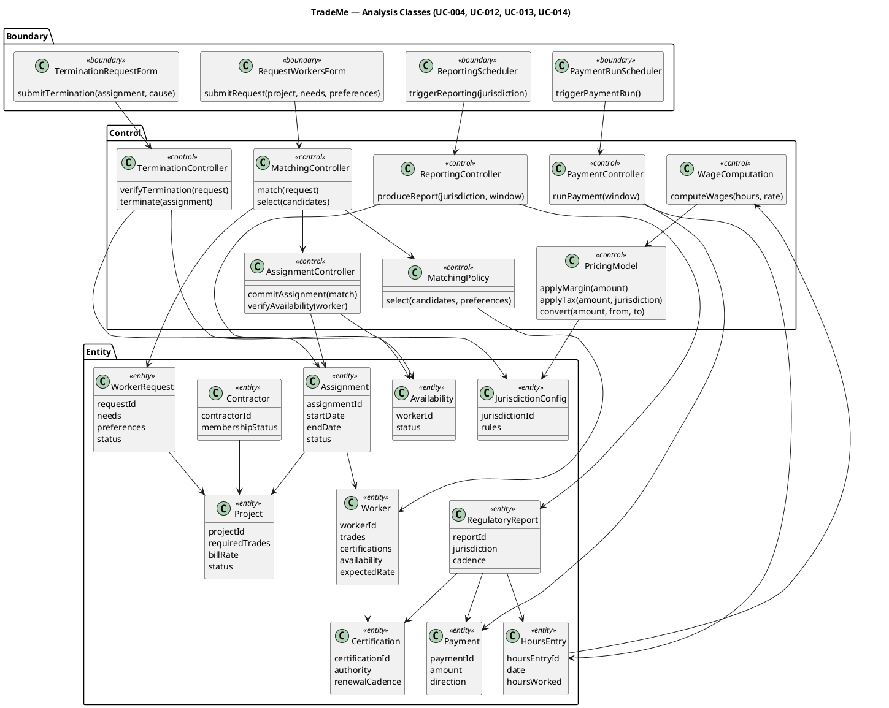
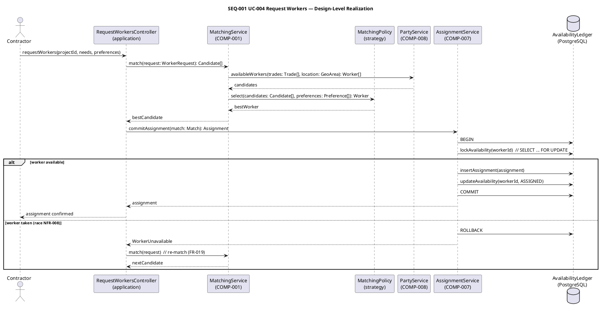
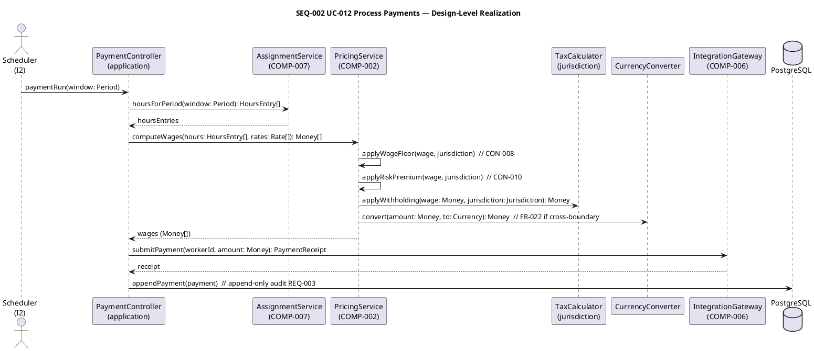
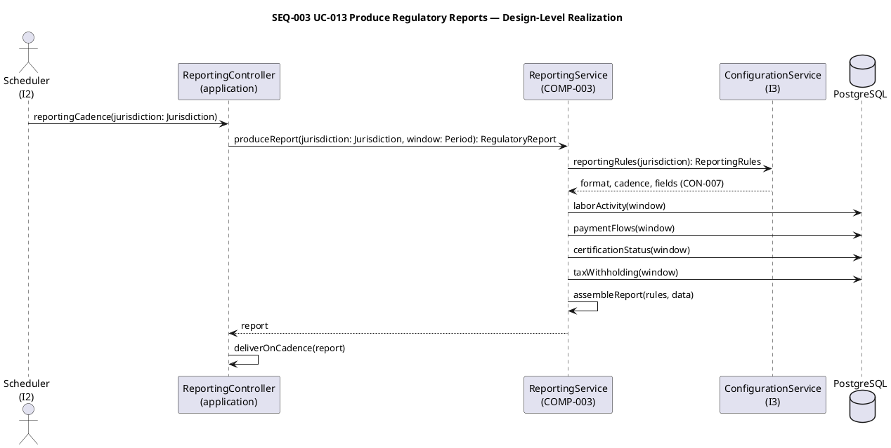
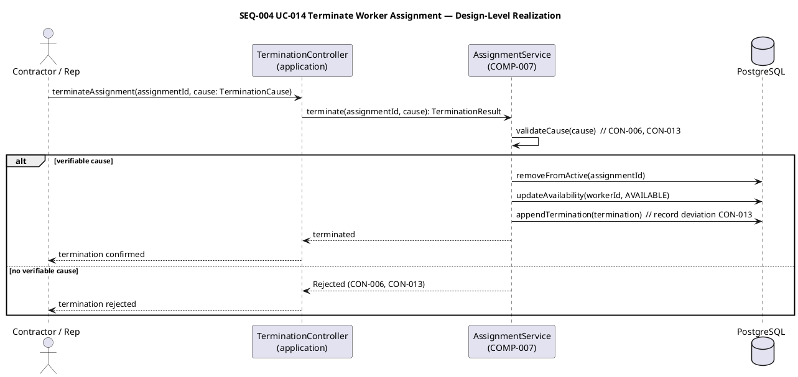
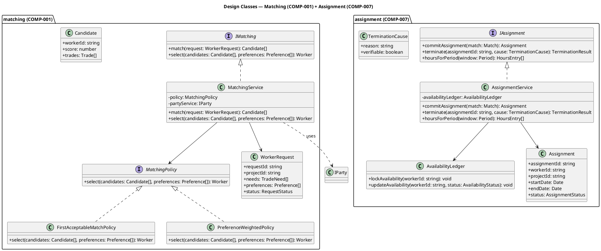
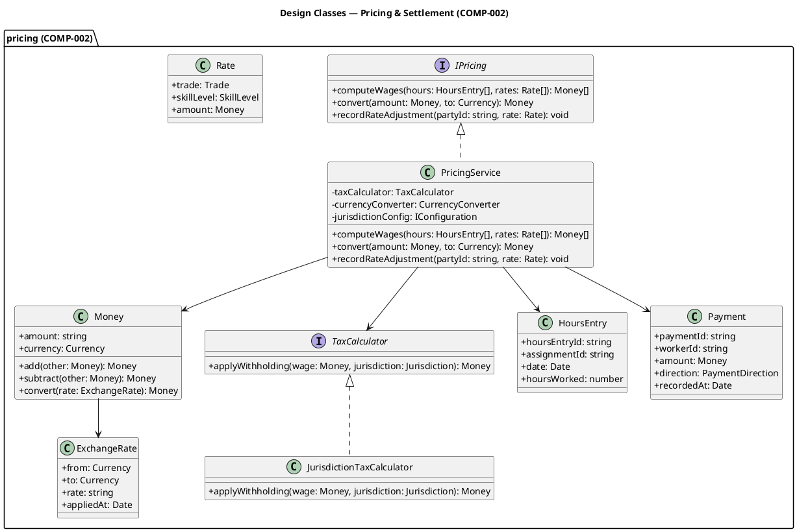
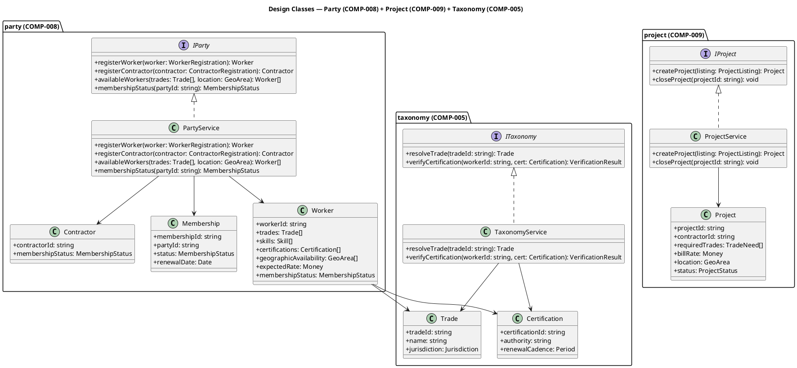
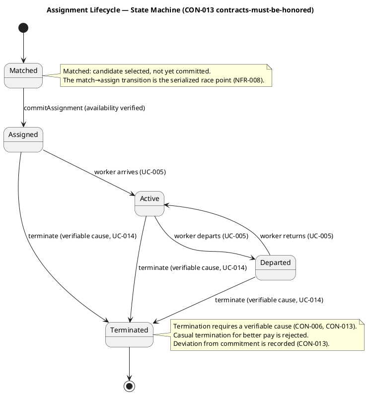
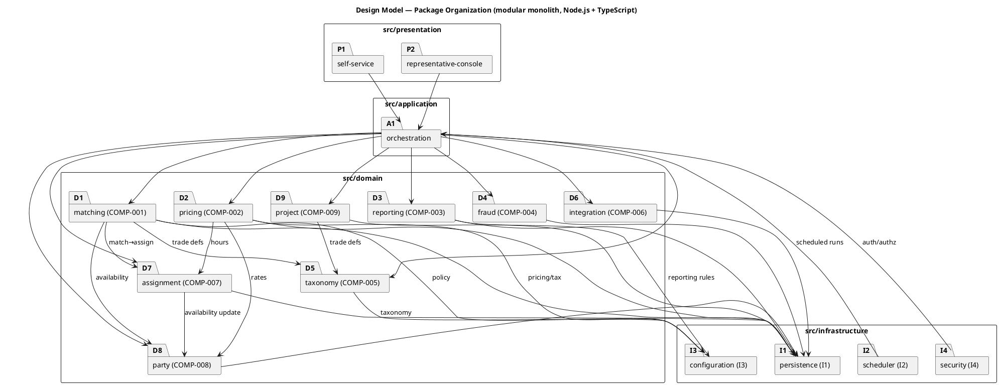

## Document Control
| Field | Value |
|---|---|
| Phase | Elaboration |
| Status | Draft — iteration 1 (Design stage) |
| Milestone Target | End-of-Elaboration review (Lifecycle Architecture Milestone) |

## Design Overview

This Design Model realizes the architecturally significant use cases identified in the Software Architecture Document (SAD) Use-Case View: **UC-004 Request Workers**, **UC-012 Process Payments**, **UC-013 Produce Regulatory Reports**, **UC-014 Terminate Worker Assignment**. These four use cases exercise every architectural view and are the validation anchor for the design.

The design operates strictly within the subsystem boundaries the SAD baselined (COMP-001..COMP-009, I1..I4). Analysis classes (Domain Model) map to those subsystems; design classes with full signatures are elaborated in Design Packages and Classes; the collaborations that realize each use case are specified in Use-Case Realizations; the subsystem-boundary contracts are specified in Interface Contracts.

**Binding design guidelines inherited from the SAD** (must hold in every downstream artifact):
1. Interface-bounded modules — no module depends on another's internals.
2. Money is a value object, never a bare number (ADR-004) — a bare float on any monetary path is a critical defect.
3. Decompose by change, not by feature.
4. Configuration over code for jurisdiction rules (CON-007).
5. Channel equivalence (NFR-006) — self-service and representative console reach the same orchestration.
6. No distributed transaction coordination (ADR-001, CON-021).
7. Exact numeric columns never degrade to float (ADR-004).
8. Append-only for financial and assignment transactions (REQ-003, AC-006).

**Technology stack (stakeholder-declared, REQ-029):** Node.js on the current LTS line with TypeScript; PostgreSQL (latest); Keycloak over OIDC. Design class signatures use TypeScript idioms consistent with this stack; no library type is pinned beyond what the stakeholder declared.

## Domain Model

The analysis classes below are the behavioral decomposition of the four architecturally significant use cases into boundary, control, and entity classes. They are the bridge from the Use-Case Model's flows to the SAD's subsystem interfaces. Each control class maps to a subsystem's encapsulated decision; each entity maps to a persistent business object (already seeded in the Business Object Model).

### Analysis Class Responsibilities

| ID | Class | Stereotype | Responsibility | Maps To (SAD) |
|---|---|---|---|---|
| ACL-001 | RequestWorkersForm | boundary | Captures contractor's worker request (project, needs, preferences) on the self-service or representative channel | Presentation → Application |
| ACL-002 | TerminationRequestForm | boundary | Captures termination request with verifiable cause | Presentation → Application |
| ACL-003 | PaymentRunScheduler | boundary | Time trigger for the scheduled payment run | Scheduler (I2) |
| ACL-004 | ReportingScheduler | boundary | Time trigger for jurisdiction-specific reporting cadence | Scheduler (I2) |
| ACL-005 | MatchingController | control | Orchestrates match→select→commit; the UC-004 flow | COMP-001 (IMatching) |
| ACL-006 | MatchingPolicy | control | Deterministic, explainable, configurable selection (NFR-005, AC-008) | COMP-001 (IMatching) |
| ACL-007 | AssignmentController | control | Atomic availability check + commitment (NFR-008, AC-005, CON-013) | COMP-007 (IAssignment) |
| ACL-008 | TerminationController | control | Verifies termination cause; releases worker; records deviation (CON-013) | COMP-007 (IAssignment) |
| ACL-009 | WageComputation | control | Computes wages from hours and rates (FR-007) | COMP-002 (IPricing) |
| ACL-010 | PricingModel | control | Margin, tax withholding, currency conversion (CON-004, CON-009, FR-022) | COMP-002 (IPricing) |
| ACL-011 | PaymentController | control | Orchestrates the payment run (UC-012) | COMP-002 (IPricing) |
| ACL-012 | ReportingController | control | Assembles jurisdiction-configured reports (CON-007, CON-014) | COMP-003 (IReporting) |
| ACL-013 | Worker | entity | Worker identity, trades, certifications, availability, expected rate | COMP-008 (IParty) |
| ACL-014 | Contractor | entity | Contractor identity, membership status | COMP-008 (IParty) |
| ACL-015 | Project | entity | Project listing: trades, bill rate, status | COMP-009 (IProject) |
| ACL-016 | WorkerRequest | entity | A contractor's request for workers (needs, preferences, status) | COMP-001 (IMatching) |
| ACL-017 | Assignment | entity | The commitment between worker and project (CON-013) | COMP-007 (IAssignment) |
| ACL-018 | Availability | entity | Worker availability ledger — the serialized race point (NFR-008) | COMP-007 (IAssignment) |
| ACL-019 | HoursEntry | entity | Recorded hours against an assignment | COMP-002 (IPricing) |
| ACL-020 | Payment | entity | Financial transaction (append-only, tamper-evident) | COMP-002 (IPricing) |
| ACL-021 | RegulatoryReport | entity | Produced report per jurisdiction/cadence | COMP-003 (IReporting) |
| ACL-022 | JurisdictionConfig | entity | Jurisdiction rules (tax, wage floors, reporting) — configuration, not code | Configuration (I3) |
| ACL-023 | Certification | entity | Worker credential with authority and renewal cadence | COMP-005 (ITaxonomy) |

### Design Mechanism Resolution

Each analysis mechanism from the SAD is resolved to a design mechanism (pattern + properties). No product is named where the stakeholder did not declare one.

| Analysis Mechanism | Design Mechanism (pattern) | Properties It Must Hold |
|---|---|---|
| Availability race (NFR-008) | Atomic availability check — row lock on the Availability ledger inside COMP-007; single availability ledger as fallback | Exactly one assignment committed; the other request reverts to matching; no inconsistent state (AC-005) |
| Money (ADR-004) | Money value object — exact amount + currency; same-currency arithmetic only; explicit conversion records rate + moment | No bare float on any monetary path; two edges closed (DB driver + JSON) |
| Matching policy (NFR-005) | Strategy pattern — MatchingPolicy is a configurable, published, deterministic selection strategy | Policy adjustable via configuration, not code (AC-008); selection transparent |
| Jurisdiction rules (NFR-003) | Configuration-as-data — JurisdictionConfig is the single source of jurisdiction rules | New jurisdiction added via configuration alone (AC-001) |
| Audit (REQ-003) | Append-only event log for financial and assignment transactions | Tamper-evident, correctly-ordered (AC-006) |

## Use-Case Realizations

Each architecturally significant use case is realized as a collaboration of design classes (full signatures) across the subsystem interfaces the SAD baselined. The sequence diagrams below are the formal contract the Implementer translates into code. They refine the SAD's Logical-view realizations to design-class granularity: concrete service classes, strategy interfaces, value objects, and the availability ledger.

### SEQ-001 — UC-004 Request Workers (match→assign, race resolution)

**Design decisions:**
- `MatchingPolicy` is a Strategy interface (CLS-002) with two concrete strategies — `FirstAcceptableMatchPolicy` and `PreferenceWeightedPolicy` — selected by configuration (AC-008, NFR-005). The policy is injected into `MatchingService`, not hard-coded.
- The availability race (NFR-008, AC-005) is resolved inside `AssignmentService.commitAssignment` via a row lock on the `AvailabilityLedger` (`SELECT ... FOR UPDATE`). Exactly one assignment commits; the losing request reverts to matching (FR-019).
- `WorkerRequest` carries the contractor's needs and preferences; preferences are soft signals (CON-006), never hard exclusions.

### SEQ-002 — UC-012 Process Payments (financial intermediary)

**Design decisions:**
- Every monetary amount is a `Money` value object (CLS-008) — exact amount + currency, no bare float (ADR-004). Wage floor (CON-008), risk premium (CON-010), tax withholding (CON-009), and currency conversion (FR-022) are applied in sequence inside `PricingService`.
- `TaxCalculator` is a jurisdiction-strategy interface (CLS-010); `JurisdictionTaxCalculator` reads rules from the Configuration subsystem (I3), not from code (CON-007).
- `CurrencyConverter` records the `ExchangeRate` (rate + moment applied) — conversion is explicit and auditable (ADR-004).
- Payment records are appended, never updated in place (REQ-003, AC-006).

### SEQ-003 — UC-013 Produce Regulatory Reports (jurisdiction-configured)

**Design decisions:**
- Reporting rules (format, cadence, fields) come from the Configuration subsystem (I3) — a new jurisdiction's reporting is configuration, not code (AC-001, NFR-003, CON-007).
- The report assembles four data families (labor activity, payment flows, certification status, tax withholding) from the retained-data store (CON-015).

### SEQ-004 — UC-014 Terminate Worker Assignment (contracts-must-be-honored)

**Design decisions:**
- `TerminationCause` carries a `verifiable` flag; a termination without a verifiable cause is rejected (CON-006, CON-013). Casual termination for better pay is not a path the design enables.
- The termination is appended (deviation from commitment recorded, CON-013) and the worker's availability is released to `AVAILABLE` in the same transaction.

## Design Packages and Classes

Design classes with full signatures, organized by subsystem package. Each subsystem exposes an interface; concrete classes implement it. Dependencies cross subsystem boundaries only through interfaces (SAD guideline 1).

### Matching (COMP-001) + Assignment (COMP-007)

### Pricing & Settlement (COMP-002)

### Party (COMP-008) + Project (COMP-009) + Taxonomy (COMP-005)

### Assignment Lifecycle — State Machine (CON-013 contracts-must-be-honored)

### Package Organization (modular monolith, Node.js + TypeScript)

## Interface Contracts

The subsystem-boundary interfaces, with operation signatures and pre/postconditions. These are the formal contracts the Implementer codes against; no module depends on another's internals (SAD guideline 1).

### INT-001 — IMatching (COMP-001)

| Operation | Signature | Precondition | Postcondition |
|---|---|---|---|
| match | `match(request: WorkerRequest): Candidate[]` | `request` has valid projectId and non-empty needs | Returns candidates from the available worker population matching the needs |
| select | `select(candidates: Candidate[], preferences: Preference[]): Worker` | `candidates` non-empty | Returns exactly one worker per the configured policy; selection is deterministic and explainable (NFR-005) |

### INT-002 — IAssignment (COMP-007)

| Operation | Signature | Precondition | Postcondition |
|---|---|---|---|
| commitAssignment | `commitAssignment(match: Match): Assignment` | `match` references an available worker | Exactly one assignment committed OR `WorkerUnavailable` returned (race resolved, NFR-008); availability ledger updated atomically |
| terminate | `terminate(assignmentId: string, cause: TerminationCause): TerminationResult` | `assignmentId` references an active assignment | If cause verifiable: assignment terminated, worker released to AVAILABLE, deviation recorded (CON-013); else rejected (CON-006) |
| hoursForPeriod | `hoursForPeriod(window: Period): HoursEntry[]` | `window` is a valid period | Returns all hours entries within the window |

### INT-003 — IPricing (COMP-002)

| Operation | Signature | Precondition | Postcondition |
|---|---|---|---|
| computeWages | `computeWages(hours: HoursEntry[], rates: Rate[]): Money[]` | hours and rates present | Returns wages as Money[] with wage floor (CON-008), risk premium (CON-010), tax withholding (CON-009) applied |
| convert | `convert(amount: Money, to: Currency): Money` | `amount.currency != to` | Returns converted Money; the ExchangeRate (rate + moment) is recorded (ADR-004) |
| recordRateAdjustment | `recordRateAdjustment(partyId: string, rate: Rate): void` | party registered | Rate adjustment recorded; no active price-setting (FR-023) |

### INT-004 — IParty (COMP-008)

| Operation | Signature | Precondition | Postcondition |
|---|---|---|---|
| registerWorker | `registerWorker(worker: WorkerRegistration): Worker` | none | Worker record created; membership initiated |
| registerContractor | `registerContractor(contractor: ContractorRegistration): Contractor` | none | Contractor record created; membership initiated |
| availableWorkers | `availableWorkers(trades: Trade[], location: GeoArea): Worker[]` | trades non-empty | Returns workers available in the location with matching trades |
| membershipStatus | `membershipStatus(partyId: string): MembershipStatus` | party exists | Returns current membership status |

### INT-005 — IProject (COMP-009)

| Operation | Signature | Precondition | Postcondition |
|---|---|---|---|
| createProject | `createProject(listing: ProjectListing): Project` | contractor registered, membership active | Project listing created |
| closeProject | `closeProject(projectId: string): void` | project exists | Project moved to closed state; workers released via termination flow (UC-014); records retained (CON-015) |

### INT-006 — ITaxonomy (COMP-005)

| Operation | Signature | Precondition | Postcondition |
|---|---|---|---|
| resolveTrade | `resolveTrade(tradeId: string): Trade` | tradeId present | Returns the trade definition from configurable taxonomy (CON-018) |
| verifyCertification | `verifyCertification(workerId: string, cert: Certification): VerificationResult` | worker and cert present | Returns verification result; verification strategy deferred (out-of-cycle) |

## Traceability

| Element | Traces From | Link Type | Traces To |
|---|---|---|---|
| ACL-005 MatchingController | UC-004 | Derives | COMP-001 |
| ACL-006 MatchingPolicy | UC-004, NFR-005, AC-008 | Derives | COMP-001 |
| ACL-007 AssignmentController | UC-004, NFR-008, AC-005, CON-013 | Derives | COMP-007 |
| ACL-008 TerminationController | UC-014, CON-013 | Derives | COMP-007 |
| ACL-009 WageComputation | UC-006, FR-007 | Derives | COMP-002 |
| ACL-010 PricingModel | UC-012, CON-004, CON-009, FR-022 | Derives | COMP-002 |
| ACL-011 PaymentController | UC-012 | Derives | COMP-002 |
| ACL-012 ReportingController | UC-013, CON-007, CON-014 | Derives | COMP-003 |
| ACL-013 Worker | UC-001 | Derives | COMP-008 |
| ACL-014 Contractor | UC-002 | Derives | COMP-008 |
| ACL-015 Project | UC-003 | Derives | COMP-009 |
| ACL-016 WorkerRequest | UC-004 | Derives | COMP-001 |
| ACL-017 Assignment | UC-004, CON-013 | Derives | COMP-007 |
| ACL-018 Availability | NFR-008, AC-005 | Derives | COMP-007 |
| ACL-019 HoursEntry | UC-006 | Derives | COMP-002 |
| ACL-020 Payment | UC-012, REQ-003 | Derives | COMP-002 |
| ACL-021 RegulatoryReport | UC-013, CON-014 | Derives | COMP-003 |
| ACL-022 JurisdictionConfig | NFR-003, CON-007, AC-001 | Derives | I3 |
| ACL-023 Certification | UC-007, CON-018 | Derives | COMP-005 |
| CLS-001 MatchingService | UC-004 | Realizes | UC-004 |
| CLS-002 MatchingPolicy | NFR-005, AC-008 | Realizes | UC-004 |
| CLS-003 AssignmentService | NFR-008, AC-005, CON-013 | Realizes | UC-004, UC-014 |
| CLS-004 AvailabilityLedger | NFR-008, AC-005 | Realizes | UC-004 |
| CLS-005 PricingService | CON-004, CON-009, FR-022 | Realizes | UC-012 |
| CLS-006 TaxCalculator | CON-009, CON-007 | Realizes | UC-012 |
| CLS-007 CurrencyConverter | FR-022 | Realizes | UC-012 |
| CLS-008 Money | ADR-004, CON-004 | Realizes | UC-012, UC-006 |
| CLS-009 PartyService | UC-001, UC-002 | Realizes | UC-001, UC-002 |
| CLS-010 ProjectService | UC-003 | Realizes | UC-003 |
| CLS-011 TaxonomyService | CON-018 | Realizes | UC-001, UC-003 |
| INT-001 IMatching | UC-004 | Specifies | COMP-001 |
| INT-002 IAssignment | UC-004, UC-014 | Specifies | COMP-007 |
| INT-003 IPricing | UC-012 | Specifies | COMP-002 |
| INT-004 IParty | UC-001, UC-002 | Specifies | COMP-008 |
| INT-005 IProject | UC-003 | Specifies | COMP-009 |
| INT-006 ITaxonomy | CON-018 | Specifies | COMP-005 |
| SEQ-001 | UC-004 | Realizes | UC-004 |
| SEQ-002 | UC-012 | Realizes | UC-012 |
| SEQ-003 | UC-013 | Realizes | UC-013 |
| SEQ-004 | UC-014 | Realizes | UC-014 |
