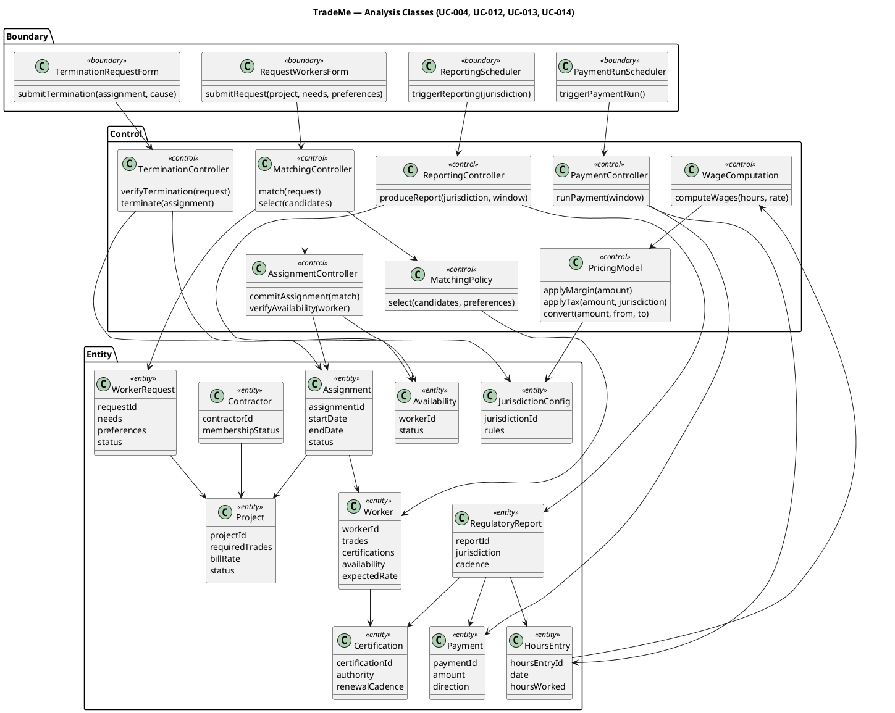

## Document Control
| Field | Value |
|---|---|
| Phase | Elaboration |
| Status | Draft — iteration 1 (Analysis Model stage) |
| Milestone Target | End-of-Elaboration review (Lifecycle Architecture Milestone) |

## Design Overview

This Design Model realizes the architecturally significant use cases identified in the Software Architecture Document (SAD) Use-Case View: **UC-004 Request Workers**, **UC-012 Process Payments**, **UC-013 Produce Regulatory Reports**, **UC-014 Terminate Worker Assignment**. These four use cases exercise every architectural view and are the validation anchor for the design.

The design operates strictly within the subsystem boundaries the SAD baselined (COMP-001..COMP-009, I1..I4). Analysis classes identified here map to those subsystems; design classes (full signatures) are elaborated in the Design Packages and Classes section in a later stage of this iteration.

**Binding design guidelines inherited from the SAD** (must hold in every downstream artifact):
1. Interface-bounded modules — no module depends on another's internals.
2. Money is a value object, never a bare number (ADR-004) — a bare float on any monetary path is a critical defect.
3. Decompose by change, not by feature.
4. Configuration over code for jurisdiction rules (CON-007).
5. Channel equivalence (NFR-006) — self-service and representative console reach the same orchestration.
6. No distributed transaction coordination (ADR-001, CON-021).
7. Exact numeric columns never degrade to float (ADR-004).
8. Append-only for financial and assignment transactions (REQ-003, AC-006).

## Domain Model

The analysis classes below are the behavioral decomposition of the four architecturally significant use cases into boundary, control, and entity classes. They are the bridge from the Use-Case Model's flows to the SAD's subsystem interfaces. Each control class maps to a subsystem's encapsulated decision; each entity maps to a persistent business object (already seeded in the Business Object Model).

### Analysis Class Responsibilities

| ID | Class | Stereotype | Responsibility | Maps To (SAD) |
|---|---|---|---|---|
| ACL-001 | RequestWorkersForm | boundary | Captures contractor's worker request (project, needs, preferences) on the self-service or representative channel | Presentation → Application |
| ACL-002 | TerminationRequestForm | boundary | Captures termination request with verifiable cause | Presentation → Application |
| ACL-003 | PaymentRunScheduler | boundary | Time trigger for the scheduled payment run | Scheduler (I2) |
| ACL-004 | ReportingScheduler | boundary | Time trigger for jurisdiction-specific reporting cadence | Scheduler (I2) |
| ACL-005 | MatchingController | control | Orchestrates match→select→commit; the UC-004 flow | COMP-001 (IMatching) |
| ACL-006 | MatchingPolicy | control | Deterministic, explainable, configurable selection (NFR-005, AC-008) | COMP-001 (IMatching) |
| ACL-007 | AssignmentController | control | Atomic availability check + commitment (NFR-008, AC-005, CON-013) | COMP-007 (IAssignment) |
| ACL-008 | TerminationController | control | Verifies termination cause; releases worker; records deviation (CON-013) | COMP-007 (IAssignment) |
| ACL-009 | WageComputation | control | Computes wages from hours and rates (FR-007) | COMP-002 (IPricing) |
| ACL-010 | PricingModel | control | Margin, tax withholding, currency conversion (CON-004, CON-009, FR-022) | COMP-002 (IPricing) |
| ACL-011 | PaymentController | control | Orchestrates the payment run (UC-012) | COMP-002 (IPricing) |
| ACL-012 | ReportingController | control | Assembles jurisdiction-configured reports (CON-007, CON-014) | COMP-003 (IReporting) |
| ACL-013 | Worker | entity | Worker identity, trades, certifications, availability, expected rate | COMP-008 (IParty) |
| ACL-014 | Contractor | entity | Contractor identity, membership status | COMP-008 (IParty) |
| ACL-015 | Project | entity | Project listing: trades, bill rate, status | COMP-009 (IProject) |
| ACL-016 | WorkerRequest | entity | A contractor's request for workers (needs, preferences, status) | COMP-001 (IMatching) |
| ACL-017 | Assignment | entity | The commitment between worker and project (CON-013) | COMP-007 (IAssignment) |
| ACL-018 | Availability | entity | Worker availability ledger — the serialized race point (NFR-008) | COMP-007 (IAssignment) |
| ACL-019 | HoursEntry | entity | Recorded hours against an assignment | COMP-002 (IPricing) |
| ACL-020 | Payment | entity | Financial transaction (append-only, tamper-evident) | COMP-002 (IPricing) |
| ACL-021 | RegulatoryReport | entity | Produced report per jurisdiction/cadence | COMP-003 (IReporting) |
| ACL-022 | JurisdictionConfig | entity | Jurisdiction rules (tax, wage floors, reporting) — configuration, not code | Configuration (I3) |
| ACL-023 | Certification | entity | Worker credential with authority and renewal cadence | COMP-005 (ITaxonomy) |

### Design Mechanism Resolution

Each analysis mechanism from the SAD is resolved to a design mechanism (pattern + properties). No product is named where the stakeholder did not declare one.

| Analysis Mechanism | Design Mechanism (pattern) | Properties It Must Hold |
|---|---|---|
| Availability race (NFR-008) | Atomic availability check — row lock on the Availability ledger inside COMP-007; single availability ledger as fallback | Exactly one assignment committed; the other request reverts to matching; no inconsistent state (AC-005) |
| Money (ADR-004) | Money value object — exact amount + currency; same-currency arithmetic only; explicit conversion records rate + moment | No bare float on any monetary path; two edges closed (DB driver + JSON) |
| Matching policy (NFR-005) | Strategy pattern — MatchingPolicy is a configurable, published, deterministic selection strategy | Policy adjustable via configuration, not code (AC-008); selection transparent |
| Jurisdiction rules (NFR-003) | Configuration-as-data — JurisdictionConfig is the single source of jurisdiction rules | New jurisdiction added via configuration alone (AC-001) |
| Audit (REQ-003) | Append-only event log for financial and assignment transactions | Tamper-evident, correctly-ordered (AC-006) |

## Traceability

| Element | Traces From | Link Type | Traces To |
|---|---|---|---|
| ACL-005 MatchingController | UC-004 | Derives | COMP-001 |
| ACL-006 MatchingPolicy | UC-004, NFR-005, AC-008 | Derives | COMP-001 |
| ACL-007 AssignmentController | UC-004, NFR-008, AC-005, CON-013 | Derives | COMP-007 |
| ACL-008 TerminationController | UC-014, CON-013 | Derives | COMP-007 |
| ACL-009 WageComputation | UC-006, FR-007 | Derives | COMP-002 |
| ACL-010 PricingModel | UC-012, CON-004, CON-009, FR-022 | Derives | COMP-002 |
| ACL-011 PaymentController | UC-012 | Derives | COMP-002 |
| ACL-012 ReportingController | UC-013, CON-007, CON-014 | Derives | COMP-003 |
| ACL-013 Worker | UC-001 | Derives | COMP-008 |
| ACL-014 Contractor | UC-002 | Derives | COMP-008 |
| ACL-015 Project | UC-003 | Derives | COMP-009 |
| ACL-016 WorkerRequest | UC-004 | Derives | COMP-001 |
| ACL-017 Assignment | UC-004, CON-013 | Derives | COMP-007 |
| ACL-018 Availability | NFR-008, AC-005 | Derives | COMP-007 |
| ACL-019 HoursEntry | UC-006 | Derives | COMP-002 |
| ACL-020 Payment | UC-012, REQ-003 | Derives | COMP-002 |
| ACL-021 RegulatoryReport | UC-013, CON-014 | Derives | COMP-003 |
| ACL-022 JurisdictionConfig | NFR-003, CON-007, AC-001 | Derives | I3 |
| ACL-023 Certification | UC-007, CON-018 | Derives | COMP-005 |
