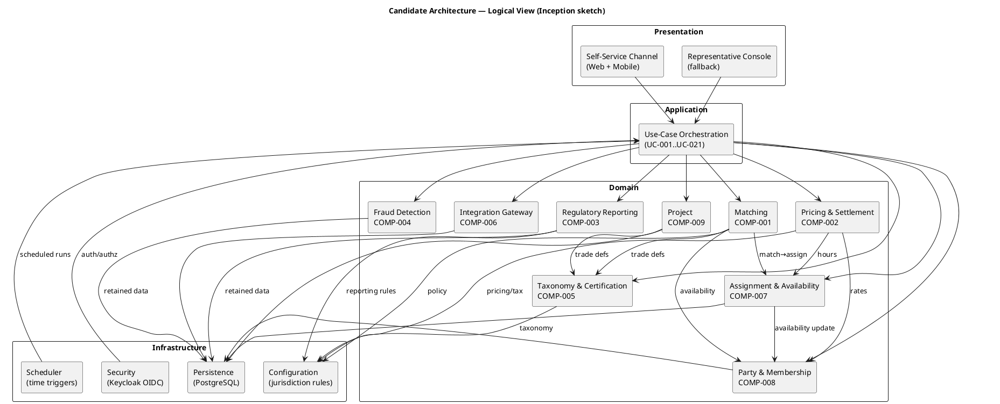
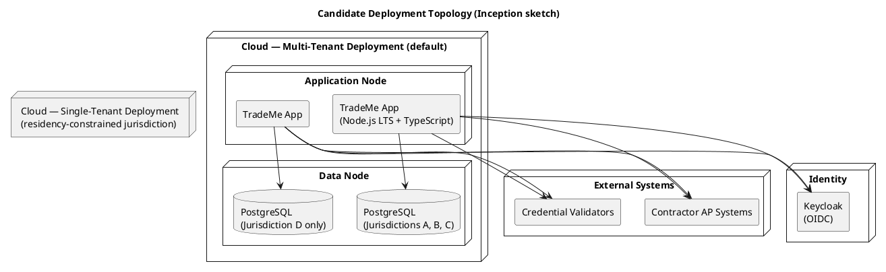

## Document Control

| Field | Value |
|---|---|
| Phase | Inception |
| Status | Draft — iteration 1 (candidate architecture) |
| Milestone Target | End-of-Inception review |

## Architectural Representation

This document presents the **candidate architecture** for the TradeMe marketplace front door. Per RUP Inception, this is a *sketch* — sufficient to surface architectural risk and guide Elaboration planning, not a baselined 4+1 model. The Logical and Deployment views are elaborated here; the Process, Implementation, and Data views are described at sketch level and will be baselined in Elaboration.

The architecture is represented using the 4+1 view model. The Use-Case view (UC-004, UC-012, UC-013, UC-014) is the validation anchor; every other view must be traceable to a scenario from one of these architecturally significant use cases.

## Architectural Goals and Constraints

**Goals** (trace to Business Goals):
- **BG-001** — expand to UK, Ireland, Canada via an automated front door → configuration-driven jurisdiction (CON-007, NFR-003), not per-country code.
- **BG-002** — replace 220 representatives with self-service → channel equivalence (NFR-006) between self-service and the fallback representative console.

**Binding constraints** (trace to declared constraints):
- **CON-021** — throughput is NOT a binding constraint. This is the single most important architectural input: it forbids over-engineering for scale and directly shapes the architectural-style decision (ADR-001).
- **CON-022** — operable by a small team, maintainable over a long horizon. Forbids heavyweight distributed infrastructure.
- **CON-017** — multi-tenant default, single-tenant where residency requires (CON-016). Both topologies from the same software, chosen at deployment time.
- **CON-018 / CON-019** — taxonomy and pricing model are evolvable configurable data, not hard-coded.
- **CON-020** — legacy operates alongside; no historical data migration.

**Declared technology stack** (stakeholder decision, iteration 1):
- Application runtime: **Node.js on the current LTS line, with TypeScript**.
- Data store: **PostgreSQL (latest)**.
- Identity provider: **Keycloak over OIDC**, with the provider chosen at deployment time through configuration.

**Risk-driven priorities** (trace to Risk List):
- **R003** (multi-jurisdiction) → configuration-driven compliance is the central architectural mechanism.
- **R005** (availability race) → the match→assign transition is an atomic availability check (COMP-007).
- **R004** (matching policy capture) → matching policy is a configurable, explainable component (COMP-001).

## Use-Case View

The architecturally significant use cases, prioritized by risk + coverage + criticality, drive the architecture. This prioritized list is the input the Project Manager uses to plan Elaboration iterations.

| Priority | Use Case | Architectural Significance | Risk Addressed |
|---|---|---|---|
| 1 | UC-004 Request Workers (matching + assignment) | Core brokerage; matching policy configurable (NFR-005); availability race (NFR-008) | R004, R005 |
| 2 | UC-012 Process Payments | Financial intermediary; pricing evolvable (CON-019); currency (FR-022); tax (CON-009) | R003 |
| 3 | UC-013 Produce Regulatory Reports | Jurisdiction variation (CON-007); retention (CON-015); audit (AC-006) | R003 |
| 4 | UC-014 Terminate Worker Assignment | Contracts-must-be-honored (CON-013); tamper-evident audit (REQ-003) | R003 |

These four use cases exercise every architectural view: they span the self-service and fallback channels (Process), the matching/pricing/reporting subsystems (Logical), the multi/single-tenant topology (Deployment), and the retained-data store (Data).

## Logical View

The system is decomposed into **subsystems that encapsulate areas of change**, not areas of function. Each subsystem corresponds to a "Volatility: High" area identified in the Use-Case Model, or to a stable domain aggregate. Subsystems communicate only through interfaces; no subsystem depends on another's internals.

### Subsystem Catalog

| ID | Subsystem | Encapsulated Change (Volatility) | Key Interfaces (to be specified in Elaboration) |
|---|---|---|---|
| COMP-001 | Matching | Matching policy (NFR-005, AC-008); fairness objectives | `match(request) → candidates`, `select(candidates) → best` |
| COMP-002 | Pricing & Settlement | Pricing model (CON-019); currency (FR-022); tax (CON-009); wage floors/premiums (CON-008, CON-010) | `computeWages(hours, rates)`, `convert(amount, from, to)` |
| COMP-003 | Regulatory Reporting | Jurisdiction variation (R003, CON-007); format/cadence (CON-014) | `produceReport(jurisdiction, window)` |
| COMP-004 | Fraud Detection | Detection approach (FR-016, deferred) | `scan(patterns) → alerts` |
| COMP-005 | Taxonomy & Certification | Trade/skill taxonomy (CON-018); certification frameworks (CON-018) | `resolveTrade(id)`, `verifyCertification(worker, cert)` |
| COMP-006 | Integration Gateway | Integration extensibility (NFR-007); AP systems (FR-017); validators (STK-005) | `submitPayment(contractor)`, `queryValidator(credential)` |
| COMP-007 | Assignment & Availability | Availability race (NFR-008, AC-005); commitment lifecycle (CON-013) | `commitAssignment(match)`, `terminate(assignment)` |
| COMP-008 | Party & Membership | Stable (Low volatility) | `registerWorker`, `registerContractor`, `membershipStatus` |
| COMP-009 | Project | Stable (Low volatility) | `createProject`, `closeProject` |

**Decomposition rationale:** COMP-001, COMP-002, COMP-003, COMP-004 each encapsulate a single "Volatility: High" decision from the Use-Case Model. COMP-005 encapsulates the configurable-data constraint (CON-018). COMP-006 encapsulates integration extensibility (NFR-007). COMP-007 encapsulates the race-condition integrity concern (NFR-008). COMP-008 and COMP-009 are stable domain aggregates. No subsystem is named after a feature or a layer — each is named after the *decision it hides*.

## Process View

Sketch level. The system has three concurrency concerns, all modest (CON-021):

1. **Interactive channels** — self-service (web/mobile) and representative console. Both reach the same Application orchestration (channel equivalence, NFR-006). Responsiveness is a constraint (NFR-009); throughput is not.
2. **Scheduled triggers** — recurring membership fees (UC-009), payment runs (UC-012), regulatory reports (UC-013), fraud scans (UC-017). These are time-driven, not user-driven.
3. **The availability race** — the match→assign transition (UC-004) is the one place where concurrent access to worker availability must be serialized (NFR-008, AC-005). This is resolved inside COMP-007 as an atomic availability check; the Risk List (R005) records the fallback of a single availability ledger if atomicity cannot be achieved.

No distributed transaction coordination is required at this scale; the modular monolith (ADR-001) keeps these concerns within a single process boundary.

## Deployment View

The same software artifact deploys in two topologies (CON-017): multi-tenant by default, single-tenant where personal-data residency (CON-016) forces it. The choice is a deployment-time configuration decision, not a code branch. The number of deployments is small (countries, not customers) and long-lived — no rapid provisioning is required (CON-017). The identity provider (Keycloak over OIDC) is likewise chosen at deployment time through configuration. The Deployment Model (optional artifact, FIRED) will elaborate nodes and connectors in Elaboration.

## Implementation View

Sketch level. The modular monolith (ADR-001) is organized as a single deployable on **Node.js (current LTS line) with TypeScript**, with internal module boundaries mirroring the Logical-view subsystems (COMP-001..COMP-009). Each subsystem is a module with a published interface; modules depend only on interfaces, not on each other's internals. This preserves the option to extract a subsystem into a separate service later (e.g., if fraud detection or reporting grows) without restructuring — the interface boundary is already in place. Source layout, build structure, and `CONTRIBUTING.md` are due in Elaboration (per Development Case).

## Data View

Sketch level. The Data Model (optional artifact, FIRED) will own the entity detail. The persistence store is **PostgreSQL (latest)**. At the architectural level, the retained-data store must satisfy:

- **Tamper-evident audit** (REQ-003, AC-006) — financial and assignment transactions are append-only and verifiable.
- **Retention window** (CON-015, REQ-004) — records held for the longest applicable jurisdiction window; no deletion before it elapses.
- **Residency** (CON-016, REQ-005) — personal data stays within jurisdiction borders; this is the single-tenant driver.
- **Future analytics** (NFR-004, REQ-022) — operational data retained to support later fraud detection and demand projection.
- **Monetary exactness** (ADR-004) — monetary amounts are stored in exact numeric columns; the database driver's type handling is configured so an exact numeric column is never degraded to a floating-point number on the way back.

## Size and Performance

Throughput is not a binding constraint (CON-021). The marketplace volume is bounded by worker supply and contractor demand, both growing gradually. The design deliberately avoids horizontal-scaling infrastructure. The one performance constraint is **interactive channel responsiveness** (NFR-009, REQ-013) — the self-service and phone channels must feel responsive. This is met by the modular monolith's in-process orchestration; no distributed call graph is introduced.

## Quality

| Quality Attribute | Source | Architectural Tactic |
|---|---|---|
| Configurability (jurisdiction) | NFR-003, AC-001 | Configuration subsystem (I3) as the single source of jurisdiction rules; no per-jurisdiction code branching |
| Data integrity under concurrency | NFR-008, AC-005 | Atomic availability check in COMP-007; serialized match→assign |
| Explainability (matching) | NFR-005, AC-008 | Matching policy as configurable, published, deterministic selection in COMP-001 |
| Auditability | CON-014, AC-006 | Tamper-evident append-only audit trail (REQ-003) |
| Monetary exactness | stakeholder decision (ADR-004) | Money value object; no bare floats on any monetary path |
| Evolvability (pricing, taxonomy, integrations) | CON-019, CON-018, NFR-007 | Volatility encapsulation in COMP-002, COMP-005, COMP-006 |
| Operability | CON-022 | Modular monolith; small team; no heavyweight distributed infra |
| Channel equivalence | NFR-006 | Single Application orchestration shared by both channels |

## Business Architecture

The system automates the brokerage front door (BG-002). The Business Use-Case Model (Business Modeling active) models the organizational process; the system use cases derive from it via the derivation bridge. The architecture's subsystems map to the business processes as follows: COMP-001 realizes BUC-004 (Broker Worker to Project), COMP-002 realizes BUC-007 (Process Payments), COMP-003 realizes BUC-010 (Regulatory Reports), COMP-004 realizes BUC-012 (Detect Fraud). The representative (STK-003) remains as a business worker for exception handling (BUC-011) and fallback, served by the Representative Console channel — not a separate code path, but the same Application orchestration (NFR-006).

## Architecture Decision Records

### ADR-001 — Architectural style: modular monolith (not microservices)

- **Context:** The system replaces a legacy that failed to reach cloud/external-integration. The team is small (CON-022), throughput is not binding (CON-021), and deployments are few and long-lived (CON-017).
- **Decision:** A modular monolith — one deployable, internally decomposed into interface-bounded modules (COMP-001..COMP-009).
- **Alternatives considered:** Microservices (rejected — distributed complexity unjustified at this scale, contradicts CON-021/CON-022); layered monolith without domain decomposition (rejected — does not encapsulate volatility).
- **Trade-offs:** Sacrifices independent scaling/deployment of subsystems; gains operability, simplicity, and a single transaction boundary that simplifies the availability race (R005).
- **Consequences:** Subsystem interfaces must be disciplined so a future extraction to a service is possible without restructuring (NFR-007).

### ADR-002 — Decomposition strategy: by change, not by feature

- **Context:** The Use-Case Model annotates four "Volatility: High" areas (matching, pricing, reporting, fraud) plus configurable-data constraints (taxonomy, certification).
- **Decision:** Each subsystem encapsulates ONE area of change. Subsystems are named after the decision they hide, not the feature they serve.
- **Alternatives considered:** Functional decomposition (Billing Service, Shipping Service) — rejected, maximizes change ripple; layer-only decomposition — rejected, layers are not a decomposition.
- **Consequences:** A change to the matching policy touches only COMP-001; a new jurisdiction's reporting rules touch only COMP-003 configuration.

### ADR-003 — Persistence mechanism: PostgreSQL (latest)

- **Context:** The system is data-centric (Data Model FIRED) and must satisfy tamper-evident audit (REQ-003), retention (CON-015), residency (CON-016), and future analytics (NFR-004).
- **Decision:** PostgreSQL (latest), as declared by the stakeholder. The database driver's type handling is configured so exact numeric columns are never degraded to floating-point numbers on the way back (see ADR-004).
- **Alternatives considered:** A document store (rejected — weaker integrity/audit guarantees for a financial intermediary); a hybrid (rejected — larger operational footprint, contradicts CON-022).
- **Consequences:** The Data Model and Implementation roles build on PostgreSQL; the driver type-handling requirement is a binding constraint on the persistence layer.

### ADR-004 — Money mechanism: exact value object, no bare floats

- **Context:** The system is a financial intermediary (CON-004) handling wages, fees, tax withholding, and currency conversion (FR-022). The stakeholder declared this mechanism **mandatory** and stated it constrains every other mechanism derived from it.
- **Decision:** Every monetary amount is a **Money value object** carrying an exact amount and its currency. Arithmetic is permitted only between Money of the same currency; crossing currencies requires an explicit conversion that records the rate applied and the moment it was applied. The rounding policy is declared once and is identical in the domain, in persistence, and at the API. No monetary amount ever exists as a bare number — not in the domain, not on the HTTP boundary, not coming back from the database driver.
- **Two edges closed explicitly** (the runtime has no native decimal type, so exactness lives in the value object and risk lives at exactly two edges):
  1. **Database driver** — an exact numeric column must not be degraded to a floating-point number on the way back; the driver's type handling is configured so it never is.
  2. **JSON** — amounts crossing the API boundary are serialised and parsed without passing through a floating-point representation.
- **Consequences:** A bare floating-point number anywhere on a monetary path is a **critical defect**, not a style preference. This constrains COMP-002 (Pricing & Settlement), the persistence layer, and the API boundary. The rounding policy is a single declared source of truth.

### ADR-005 — Identity provider: Keycloak over OIDC

- **Context:** Authentication for workers and contractors on the self-service channel (REQ-001) was deferred as an out-of-cycle open question. The stakeholder has now decided the mechanism.
- **Decision:** Keycloak as the identity provider over OIDC, with the provider chosen at deployment time through configuration.
- **Alternatives considered:** Greenfield authentication (rejected — reinvents identity, contradicts CON-022); a single hard-coded provider (rejected — contradicts the deployment-time configurability required by CON-017).
- **Consequences:** The Security infrastructure (I4) is Keycloak/OIDC; the provider is a deployment-time configuration choice, consistent with the multi/single-tenant topology decision.

## Architectural Proof-of-Concept Plan (annex)

The PoC trigger is NOT fired this phase (Development Case: Elaboration-gated against R001/R003). This annex records the plan so Elaboration can execute it without re-derivation.

| Risk | PoC Scope | Success Criteria |
|---|---|---|
| R001 (legacy replacement failures) | Validate cloud deployability (CON-001) and external-system connectivity (CON-002) — the two capabilities the legacy could not satisfy | A minimal app deploys to cloud and completes one external integration round-trip |
| R003 (multi-jurisdiction) | Validate that a jurisdiction's rules (tax, wage floor, reporting format) are expressible as configuration, not code | A second jurisdiction is added via configuration alone with no code change (AC-001) |
| R005 (availability race) | Validate the atomic match→assign availability check | Concurrent match/assign produces no inconsistent state (AC-005) |

## Traceability

| Element | Traces From | Link Type | Traces To |
|---|---|---|---|
| COMP-001 Matching | UC-004, NFR-005, AC-008 | Realizes | BUC-004 |
| COMP-002 Pricing & Settlement | UC-012, CON-019, FR-022, CON-009 | Realizes | BUC-007 |
| COMP-003 Regulatory Reporting | UC-013, CON-007, CON-014 | Realizes | BUC-010 |
| COMP-004 Fraud Detection | UC-017, FR-016, NFR-004 | Realizes | BUC-012 |
| COMP-005 Taxonomy & Certification | CON-018, UC-001, UC-003 | Realizes | BUC-001 |
| COMP-006 Integration Gateway | NFR-007, FR-017, STK-005 | Realizes | BUC-007 |
| COMP-007 Assignment & Availability | UC-004, NFR-008, AC-005, CON-013 | Realizes | BUC-005 |
| COMP-008 Party & Membership | UC-001, UC-002, UC-008 | Realizes | BUC-001, BUC-002 |
| COMP-009 Project | UC-003, UC-015 | Realizes | BUC-003 |
| ADR-001 | CON-021, CON-022, CON-017 | DependsOn | — |
| ADR-002 | Use-Case Model (Volatility: High) | DependsOn | — |
| ADR-003 | CON-015, CON-016, REQ-003, NFR-004 | DependsOn | Data Model |
| ADR-004 | CON-004, FR-022, CON-009 | DependsOn | COMP-002, Data Model |
| ADR-005 | REQ-001, CON-017 | DependsOn | Security (I4) |
