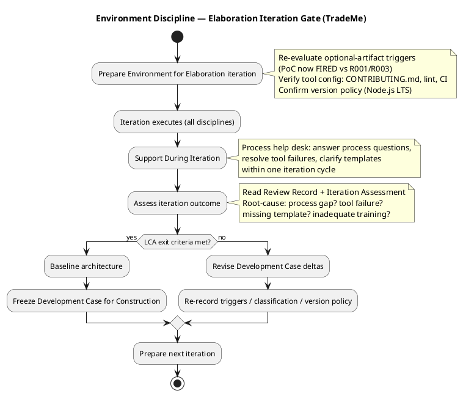
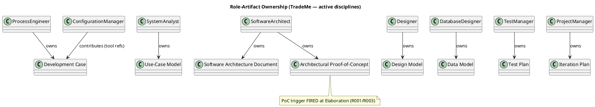

## Document Control
| Field | Value |
|---|---|
| Phase | Elaboration |
| Status | Draft — iteration 1 |
| Milestone Target | End-of-Elaboration review (Lifecycle Architecture Milestone) |

## Tailoring Overview
This Development Case is an **override delta** over the IARI DC baseline (25-role roster, 9 disciplines, 16 CORE + 6 OPTIONAL artifacts, fixed ownership). It records only project-specific deviations. Anything not stated here is per the baseline.

**Organization assessment (feeds tailoring):**
- **CON-022** — market intermediary, not a software firm; historically weak software discipline. The process must be operable by a small team and maintainable over a long horizon → lean ceremony, no heavyweight review boards.
- **R001** — legacy replacement failed multiple times. The process must be light enough to actually be followed; over-specification is a project risk, not rigor.
- **R002** — dev/leadership tension. The process must be transparent and evidence-based (traceability, review records) so decisions are auditable.
- **R003** — multi-jurisdiction regulatory complexity. Requirements and Test disciplines carry the highest risk weight; configuration-driven (CON-007, NFR-003) rather than code-branching.

**Elaboration refinement (this iteration):** Inception closed with stakeholder sanction GRANTED and one Minor finding deferred (Development Case#F3 — stale Document Control metadata, now corrected). The architecture is baselined (SAD iteration 1). Elaboration's process focus shifts from *scope agreement* to *architecture stabilization*: the Architectural Proof-of-Concept trigger is now re-evaluated against R001/R003 (see Optional Artifact Triggers), and the Environment discipline's per-iteration loop now gates on the Lifecycle Architecture (LCA) exit criteria rather than LCO.

**Tool assessment (updated):** `CONTRIBUTING.md` is still absent from the repository (verified this iteration). Lint config and CI workflows remain unproduced. These are owned by their discipline roles (Software Architect, Configuration Manager) and are **due during Elaboration** — the SAD's Implementation View explicitly commits the Software Architect to producing `CONTRIBUTING.md` and lint configuration this phase. The Development Case references them; it does not author them.

## Disciplines and Intensity

Intensity per discipline/phase is **per the canonical matrix** (no deviations requested).

**Discipline activation:**
- Requirements, Analysis & Design, Implementation, Test, Deployment, Configuration & Change Management, Project Management → ACTIVE (baseline).
- **Business Modeling → ACTIVE** (business-process-led = true). Rationale: the system automates a manual brokerage (220 representatives performing data entry and matching), FR-018 explicitly requires capturing "the hand-tuned policy representatives used for decades" in configurable form, and R004 records the risk of losing that tacit knowledge. The business process is the subject of the system, not merely its context.
- Environment → ONE-TIME at project start (Inception); its per-iteration loop continues as process support across all phases.

## Artifacts and Templates

All 16 CORE artifacts are produced per baseline. No CORE artifact is omitted.

**Project tool/guideline references (owned by discipline roles, referenced here):**
- `CONTRIBUTING.md` — coding/design/test/UI guidelines (Software Architect + discipline experts). **Gap: still absent — due Elaboration (SAD Implementation View commits the Software Architect to produce it).**
- `.github/workflows/` — CI/CD pipeline configuration (Configuration Manager). **Gap: still absent — due Elaboration.**
- Lint configuration — per-language (Software Architect). **Gap: still absent — due Elaboration.**

**Version policy (formalized this iteration):** the stakeholder declared the application runtime as **Node.js on the current LTS line, with TypeScript**. This is recorded as the authoritative framework pin (ecosystem `framework`, LTS-only floor). The Software Architect resolves the concrete LTS version against the registry; the pin governs over any registry "latest". No package-level pins were declared by the stakeholder, so none are recorded.

## Optional Artifact Triggers
| Optional Artifact | Trigger Condition | Verdict |
|---|---|---|
| Glossary | Specialist/regulated vocabulary | **FIRED** — multi-jurisdiction labor law, tax, certification terminology (CON-008..CON-016) requires stakeholder-validated definitions |
| Architectural Proof-of-Concept | Elaboration + technical risk requiring empirical validation | **FIRED** — Elaboration reached; R001 (legacy replacement failures) and R003 (multi-jurisdiction complexity) require empirical validation of the cloud/external-integration assumptions (CON-001, CON-002) the legacy could not satisfy. The Risk List (R001 mitigation) explicitly names the PoC as the Elaboration opener. |
| Data Model | Data-centric OR >10 entities OR data-migration | **FIRED** — worker/contractor/project/payment/certification/membership/assignment entities well exceed 10 |
| Deployment Model | Distributed/multi-node OR multi-environment non-trivial | **FIRED** — CON-017 requires both multi-tenant and single-tenant topologies |
| User-Interface Prototype | UX-critical OR UI complexity needing stakeholder validation | **FIRED** — NFR-001 (mobile access is a must-have) and NFR-002 (self-service channel replacing 220 representatives across 9 call centers) make the self-service UX the primary front door; the UI is UX-critical and warrants stakeholder validation before implementation |
| Test Plan | Formal delivery / regulatory audit / contractual reporting | **FIRED** — CON-014 regulatory reporting + AC-006 audit requirement |

## Roles and Ownership
All 25 baseline roles are active. Primary ownership per artifact is per the service-side allowlist (never reassigned). No roles are merged.

**Business Modeling roles** (BusinessProcessAnalyst, BusinessReviewer) are active because Business Modeling is active.

## Guidelines and Procedures
**Measurement policy (this project):** IARI measures two quantities — tokens consumed, and elapsed time split into agent time vs. human queue time. This project uses them as follows:
- **Tokens** → cost-boxing decisions: each iteration is cost-boxed; the Project Manager reads token consumption to decide whether an iteration's exit criteria can pass within budget or scope must bend.
- **Human queue time** → gate risk tracking: every `REQUIRES_USER_INPUT` is a human gate; queue time is measured and reported separately (never added to agent time), and any gate approaching the 14-day ceiling is escalated as a risk in the Risk List (R002 is the standing tension risk; R006 is the gate-queue risk).
- No other metrics are tracked. A metric whose decision cannot be named is not tracked.

**Process support:** The Process Engineer serves as the process help desk across all iterations. Process questions, tool failures, and template ambiguities are resolved within one iteration cycle; blocking issues escalate immediately.

**Elaboration entry/exit criteria (this iteration's refinement):**
- **Entry:** LCO sanction granted (Inception iteration 3); architecture baselined (SAD iteration 1); all CORE artifacts present.
- **Exit (LCA):** every active discipline has a tailoring section in this Development Case; the tool environment passes verification (CONTRIBUTING.md, lint, CI produced and working); the Architectural Proof-of-Concept empirically validates the cloud/external-integration assumptions (CON-001, CON-002) against R001/R003; the architecture is baselined and stable enough to freeze for Construction.

**Environment discipline workflow (per-iteration loop, Elaboration-gated):**

**Role–artifact ownership (active disciplines):**

## Traceability

| Element | Traces From | Link Type | Traces To |
|---|---|---|---|
| Business Modeling ACTIVE | FR-018 (hand-tuned policy capture), R004 | Derives | Business Use-Case Model |
| Glossary FIRED | CON-008..CON-016 (regulatory vocabulary) | Derives | Glossary |
| Architectural PoC FIRED | R001, R003, CON-001, CON-002 | Derives | Architectural Proof-of-Concept |
| Data Model FIRED | FR-001..FR-011 (entity-rich scope) | Derives | Data Model |
| Deployment Model FIRED | CON-017 (multi/single-tenant) | Derives | Deployment Model |
| UI Prototype FIRED | NFR-001, NFR-002 (self-service UX) | Derives | User-Interface Prototype |
| Test Plan FIRED | CON-014, AC-006 (regulatory audit) | Derives | Test Plan |
| Version policy (Node.js LTS) | stakeholder decision (runtime) | DependsOn | Software Architecture Document |
| Development Case#F3 (resolved) | Review Record (Inception) | DependsOn | Document Control (this artifact) |
