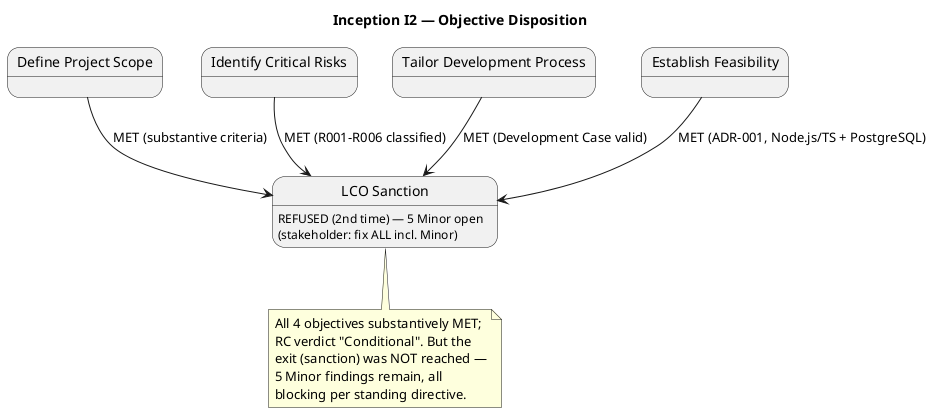
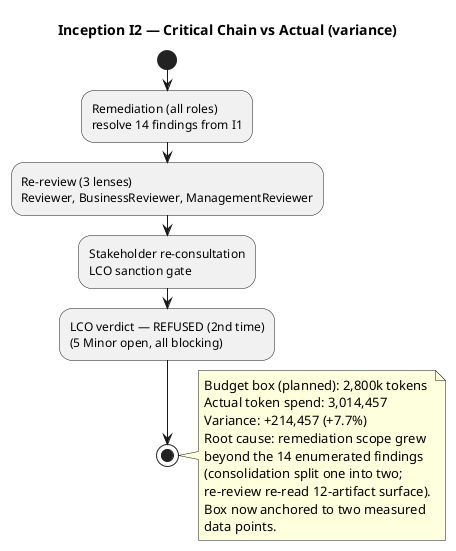

## Document Control

| Field | Value |
|---|---|
| Phase | Inception |
| Status | Draft — iteration 2 |
| Milestone Target | End-of-Inception review (LCO) |
| Milestone Verdict | LCO: iteration REQUIRED (scope incomplete) — recorded, not declared by PM |

## Iteration Objectives Reached

The iteration carried four planned objectives. Disposition against the Review Record (consolidated LCO re-review, three lenses) and the iteration's facts:

| # | Objective | Disposition | Evidence |
|---|---|---|---|
| 1 | Define Project Scope | **MET** | Review Coordinator verdict "Conditional — all substantive criteria MET"; 15 finding records resolved; scope agreement confirmed |
| 2 | Identify Critical Risks | **MET** | Risk List classifies R001–R006 with magnitude, strategy, mitigation, contingency; Risk List#F1 (Status/Trend columns) resolved |
| 3 | Tailor Development Process | **MET** | Development Case present; Development Case#F1 (roster 25) resolved |
| 4 | Establish Feasibility | **MET** | Software Architecture Document (ADR-001 modular monolith, Node.js/TS + PostgreSQL); SAD#F1 (UC-016 mapping) resolved |

**Overall:** All four planned objectives are substantively MET — the Review Coordinator's verdict is "Conditional (all substantive criteria MET)". However, the iteration's exit condition — stakeholder sanction to advance past LCO — was **REFUSED a second time**. Five Minor findings remain open, all blocking per the stakeholder's standing directive to fix ALL findings including Minors. The iteration therefore does NOT close successfully; a further remediation pass is required.

## Adherence to Plan

**Budget-box variance (iteration 2):**

| Measure | Planned (I2 box) | Actual | Variance |
|---|---|---|---|
| Token spend (agent work) | 2,800,000 | 3,014,457 | +214,457 (+7.7%) |
| Agent elapsed time | — | 0:43:29 | — |
| Human queue time (waiting) | — | 0:00:00 | — |

The iteration-2 box (2,800k, sized from the measured iteration-1 actual of 2,871,727) held within 7.7% — a material improvement over iteration 1's 3.8× overspend. Root cause of the residual variance: the remediation scope grew beyond the 14 findings originally enumerated (consolidation split one finding into two records, and the re-review pass re-read the full 12-artifact surface). The box is now anchored to two measured data points; the next forecast uses the 3,014,457-token actual.

**Human gates:** 11 user interactions, 0:00:00 queue time (waiting, not work). This excludes the end-of-iteration approval gate, which is not measured. Queue time stayed well under the 14-day ceiling (R006 did not trigger).

**Parallelism:** 11 agent invocations across the remediation roles — as planned. No parallelism escalation was attempted; the variance is spend-per-invocation, not invocation count.

## Use Cases and Scenarios Implemented

No new use cases were detailed this iteration — correct for a remediation iteration. The four architecturally significant use cases detailed in iteration 1 (UC-004, UC-012, UC-013, UC-014) remain the Inception detail set. Remediation work this iteration corrected the Use-Case Model's business-modeling content (BUC-004/BUC-011 associations, Business Object Model, BR-001..BR-016) rather than adding new use cases.

No use case was implemented to executable code this iteration — correct for Inception, where the deliverable is the architectural baseline, not a running system.

## Results Relative to Evaluation Criteria

The Iteration Plan carried two evaluation-criterion sets. Disposition of each:

**(a) Declared acceptance criteria (AC-001..AC-008):**

| AC | Disposition | Evidence |
|---|---|---|
| AC-001 | Addressed (design-level) | UC-013 + CON-007/NFR-003 configuration-driven compliance |
| AC-002 | Addressed (design-level) | CON-017 multi/single-tenant; Deployment Model |
| AC-003 | Addressed (design-level) | UC-004 → UC-012 end-to-end flow; NFR-002 self-service |
| AC-004 | Addressed (design-level) | UC-012/UC-013 jurisdiction-specific tax/certification/reporting |
| AC-005 | Addressed (design-level) | UC-004 race check (NFR-008) |
| AC-006 | Addressed (design-level) | CON-014/CON-015 retention + Test Plan |
| AC-007 | Addressed (design-level) | CON-005 + fraud data retention (NFR-004) |
| AC-008 | Addressed (design-level) | NFR-005 configurable matching policy |

All eight ACs are addressed at design level; none deferred. Full verification is Elaboration/Construction/Transition work.

**(b) This iteration's own exit criteria (LCO readiness):**

| Criterion | Disposition | Evidence |
|---|---|---|
| Vision, UC Model, Supp Spec, Glossary, DC present and consistent | **MET** | All 5 artifacts present; RC verdict "all substantive criteria MET" |
| Risk List classifies R001–R006 | **MET** | Risk List register complete; Status/Trend columns added |
| Stakeholders agree on scope | **MET** | Declared scope respected as ceiling; no expansion |
| Project viability assessed | **MET** | ADR-001; RC confirms feasibility |
| **Stakeholder sanction to advance** | **NOT MET** | REFUSED (2nd time) — "No"; 5 Minor findings remain open |

The iteration's own exit criteria are met on substance but the sanction gate is not passed. The iteration is therefore **not closed successfully**.

## Test Results

**No test execution occurred this iteration** — correct for Inception. No Test Evaluation Summary exists (the artifact is not present in the repository), and no test cases were executed against a running system (none exists yet). This is not a gap; it is the expected state of an Inception iteration whose deliverable is the architectural baseline.

## External Changes

No external changes occurred this iteration. The declared scope (26 FRs, 9 NFRs, 22 CONs, 8 ACs, 2 BGs, 3 declared risks) is unchanged. No change requests were raised or approved.

Stakeholder answers received this iteration (all incorporated, none re-opened):
- LCO re-review sanction: **REFUSED** — "No" (Management Reviewer question, iteration 2). The verdict was "Conditional (all substantive criteria MET; 5 Minor findings remain open, all blocking per your standing directive)".

## Rework Required

The Review Record records **5 open Minor findings** (0 Critical, 0 Major), all blocking per the stakeholder's standing directive. Rework required before LCO can be sanctioned:

| # | Finding | Owner | Status this pass |
|---|---|---|---|
| 1 | Development Case#F2 — UI Prototype trigger cites deferred open question as settled fact | Process Engineer | OPEN |
| 2 | Use-Case Model#F7 — BUC-004 diagram missing `Rep --> BUC4` association | Business Process Analyst | OPEN |
| 3 | Use-Case Model#F8 — BUC-011 diagram missing Worker/Contractor associations | Business Process Analyst | OPEN |
| 4 | Iteration Plan#F2 — budget box (750k) disproven by measured actual, not re-sized | Project Manager | **RESOLVED this pass** (box re-sized to 2,800k, measured actuals recorded) |
| 5 | Deployment Model#F1 — Document Control status stale ("iteration 1") | Deployment Manager | OPEN |

**Adjustments forced on iteration N+1 (the next remediation pass):**
- The next iteration is a **second remediation iteration**: resolve the 4 remaining open findings (Development Case#F2, Use-Case Model#F7, Use-Case Model#F8, Deployment Model#F1), then re-review by all three lenses, then re-consult the stakeholder for sanction.
- The budget box for the next iteration is sized from the **measured** 3,014,457-token iteration-2 actual, not an assumption.
- Iteration Plan#F2 (my own finding) is resolved in this pass; the remaining four are owned by other roles and are not mine to fix.

## Traceability

| Element | Traces From | Link Type | Traces To |
|---|---|---|---|
| Iteration Assessment (I2) | Iteration Plan (I2), Review Record (I2) | DependsOn | Iteration Plan (I3 remediation) |
| Objective 1 (scope) | Vision, Use-Case Model, Supplementary Specification, Glossary | DependsOn | LCO milestone |
| Objective 2 (risks) | R001..R006 | DependsOn | Risk List |
| Objective 3 (process) | Development Case | DependsOn | LCO milestone |
| Objective 4 (feasibility) | Software Architecture Document (ADR-001) | DependsOn | LCO milestone |
| Budget variance (I2) | Iteration Plan (I2) budget box | DependsOn | Iteration Plan (I3) re-sized box |
| Rework (5 findings) | Review Record (I2) | DependsOn | Iteration Plan (I3 remediation) |