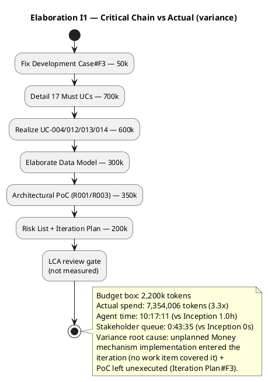

## Document Control

| Field | Value |
|---|---|
| Phase | Elaboration |
| Status | Draft — iteration 1 |
| Milestone Target | End-of-Elaboration review (Lifecycle Architecture Milestone) |
| Milestone Verdict (Review Coordinator) | LCA: iteration REQUIRED (scope incomplete) |

## Iteration Objectives Reached

The iteration planned five objectives. Disposition against the Review Record and Test Evaluation Summary:

| Objective | Disposition | Evidence |
|---|---|---|
| 1. Detail all remaining Must UCs (17) | **MET** | Use-Case Model carries the full Must-UC surface; Review Record confirms "17 Must UCs detailed" (Scope GREEN) |
| 2. Elaborate Data Model to entity level | **MET** | Data Model produced (10 entities + 3 control classes, JSONB); Design Model#F1/F2 are ID/type defects, not missing entities |
| 3. Run Architectural PoC (R001/R003) | **NOT MET** | Iteration Plan#F3 (Major): PoC planned but unexecuted — CON-001/CON-002 unverified |
| 4. Reappraise Risk List (R001–R006) | **PARTIAL** | Risk List#F2 (Major): R002 (HIGH, exposure 16) remains OPEN/STABLE with no retirement trend |
| 5. Fix Development Case#F3 (metadata) | **MET** | Prior Inception findings all Resolved (Review Record "Resolutions and Actions") |

**Net:** 3 of 5 objectives met, 1 partial, 1 not met. The two unmet/partial objectives are the two Major findings that block LCA: the unexecuted PoC and the unresolved R002.

## Adherence to Plan

**Budget-box variance — the box did not hold.** The iteration was boxed at **2,200k tokens**, sized from the measured Inception phase actual (2,186,548 tokens). Actual spend was **7,354,006 tokens** — **3.3× the box**. Agent time was **10:17:11** (vs Inception's 1.0 h); stakeholder queue was **0:43:35** (vs Inception's 0s).

**Root cause of the variance:** an unplanned work item entered the iteration — the **Money value-object mechanism** (ADR-004) was implemented and committed directly to `main`, bypassing the feature-branch → PR → review → merge flow. No work item in the Fine Plan covered it; it surfaced as four code-review findings (1 Critical, 2 Major, 1 Minor) in the Test Evaluation Summary, and it is the blocking condition for the monetary-integrity test suite (TI-007). The box was sized for the planned scope; the scope grew by an unplanned implementation, and the PoC that *was* planned (350k) was left unexecuted.

**Correction forced in I2:** the I2 box must be re-sized from the measured I4 actual (7,354,006 tokens), not from the Inception phase actual. The I4 box was an `[ASSUMPTION — requires validation]`; it is now validated as too small by a factor of ~3.3, and the measured figure replaces it.

## Use Cases and Scenarios Implemented

The four architecturally significant UCs (UC-004, UC-012, UC-013, UC-014) were realized end-to-end in the Design Model; the remaining 17 Must UCs were detailed in the Use-Case Model. Nice-to-have UCs (FR-016, FR-017, FR-024, FR-025, FR-026) remain deferred per the stakeholder's directive.

**No test execution occurred this iteration** — this was a test-design and planning iteration (per the Test Evaluation Summary). "Implemented" here means *designed/realized at the model level*, not *executed in code*. Full verification is Construction/Transition work.

## Results Relative to Evaluation Criteria

| Criterion | Result | Evidence |
|---|---|---|
| Detail all 17 remaining Must UCs | **Met** | Use-Case Model; Review Record Scope GREEN |
| Realize UC-004/012/013/014 end-to-end | **Met** | Design Model SEQ-001..004 |
| Data Model to entity level (10 + 3, JSONB) | **Met** | Data Model |
| Architectural PoC validates CON-001/CON-002 | **Not met** | Iteration Plan#F3 (Major) — PoC unexecuted |
| Development Case#F3 fixed | **Met** | Review Record — prior findings all Resolved |
| Risk List reappraised (R001/R003/R004/R005) | **Not met** | Risk List#F2 (Major) — R002 OPEN/STABLE |

**LCA exit criteria (from Review Record):**

| Criterion | Status |
|---|---|
| Architecture stable & baselined | MET |
| Critical risks resolved | NOT MET (R002 OPEN/STABLE; PoC unexecuted) |
| Construction plan credible | NOT MET (coarse roadmap only) |
| Stakeholder alignment | REFUSED (sanction "No"; close all findings incl. Minors) |

## Test Results

No test execution occurred this iteration (design/planning iteration). The Test Evaluation Summary reports a **PARTIALLY MET** mission verdict: the Master Test Plan was produced with measurable LCA acceptance criteria (LCA-T1..T7), but the monetary-integrity test suite (TI-007) is **blocked** by four open code-review findings on the Money mechanism (1 Critical, 2 Major, 1 Minor). LCA-T3 and LCA-T7 cannot be satisfied until the Money mechanism is re-baselined.

| Metric | Value | Goal (decision enabled) |
|---|---|---|
| Artifacts produced | 17 | Monitor — is the artifact surface complete for LCA? |
| Agent invocations | 23 | Monitor — process-leanness signal (R002) |
| User interactions | 23 | Monitor — stakeholder engagement cadence |
| Token spend | 7,354,006 | Evaluate — budget-box adherence (3.3× over box) |
| Avg quality | 10.0 | Monitor — reviewer-scored artifact quality |
| Agent time | 10:17:11 | Evaluate — effort vs Inception (1.0 h) |
| Stakeholder queue | 0:43:35 | Monitor — gate latency (R006 ceiling) |

## External Changes

The stakeholder answered three questions this iteration, all recorded in the Work Order:

1. **NFR-009 latency target** (Requirements Specifier): "fast enough so the representative doesn't have to wait during the call; you decide on the figure" — the Test Plan set p95 ≤ 2s for interactive channels.
2. **LCA sanction** (Management Reviewer): **"No"** — sanction refused; directive to close all findings including Minors.
3. **LCA consolidation** (Review Coordinator): "nothing else to add for this new iteration" — no additional requirement, correction, or priority.

No change requests were approved this iteration. No scope expansion was authorized; the Money-mechanism implementation that entered the iteration was **not** an authorized scope change — it is recorded as variance (see Adherence to Plan).

## Rework Required

The Review Record lists **8 open findings** (3 Major, 5 Minor), all blocking for LCA per the stakeholder's directive. These are the rework items for Elaboration I2:

| Finding | Severity | Owner | Rework |
|---|---|---|---|
| Risk List#F2 | Major | Project Manager | Escalate R002 to stakeholder for explicit disposition (accept with named contingency, or concrete mitigation) |
| Iteration Plan#F3 | Major | Software Architect | Execute PoC against baselined modular-monolith skeleton; record CON-001/CON-002 results |
| Design Model#F1 | Major | Designer | Relabel O/R Mapping to entity analysis-class IDs (ACL-013..ACL-023) |
| UCM#F9 | Minor | System Analyst | Anchor UC-016 in BUC-004 derivation bridge |
| UCM#F10 | Minor | System Analyst | Model Internal Representative (STK-003) in BOM |
| SAD#F2 | Minor | Software Architect | Add UC-014 sequence diagram or deferral note |
| Design Model#F2 | Minor | Designer | Change HoursEntry.hoursWorked to exact type (ADR-004) |
| Test Case#F1 | Minor | Test Designer | Update cited CI run to 34886064517 |

**Additional rework surfaced by the Test Evaluation Summary** (Money mechanism, blocking TI-007): 1 Critical (committed to main, no PR/review gate), 2 Major (subtract/convert missing; white-box branches untested), 1 Minor (CONTRIBUTING.md absent).

**Plus:** produce a credible fine-grained Construction plan grounded in measured Elaboration actuals (Review Record open action #7).

## Traceability

| Element | Traces From | Link Type | Traces To |
|---|---|---|---|
| Iteration Assessment (Elaboration I1) | Iteration Plan (I4), Review Record, Test Evaluation Summary | DependsOn | Iteration Plan (I5) |
| Risk List#F2 (R002 OPEN/STABLE) | R002 | DependsOn | Stakeholder disposition (I2) |
| Iteration Plan#F3 (PoC unexecuted) | R001, R003, CON-001, CON-002 | DependsOn | Architectural Proof-of-Concept (I2) |
| Money mechanism#F1..F4 | ADR-004, CON-004, FR-022 | DependsOn | TI-007 (monetary-integrity test suite) |
| Budget-box variance (3.3×) | Iteration Plan (I4) box, measured I4 actual | DependsOn | Iteration Plan (I5) box re-size |
| LCA verdict (iteration REQUIRED) | Risk List#F2, Iteration Plan#F3, Design Model#F1 | DependsOn | Elaboration I2 |