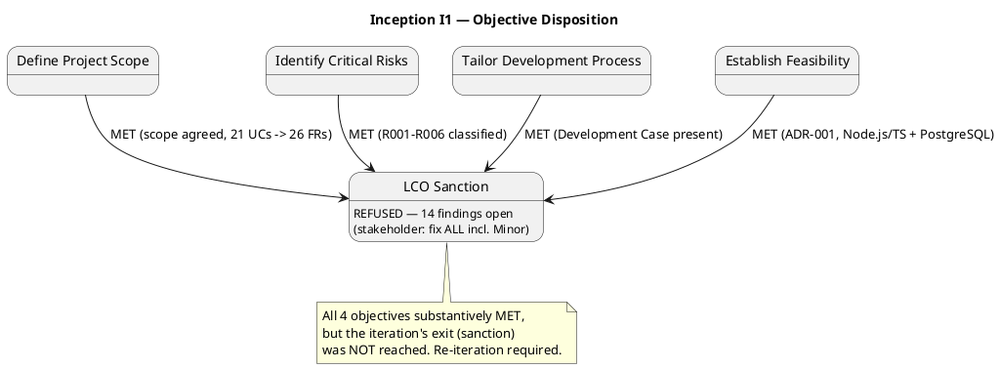
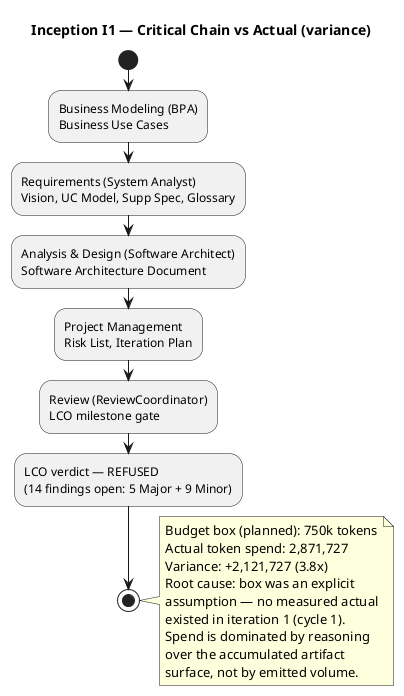

## Document Control

| Field | Value |
|---|---|
| Phase | Inception |
| Status | Draft — iteration 1 |
| Milestone Target | End-of-Inception review (LCO) |
| Milestone Verdict | LCO: iteration REQUIRED (scope incomplete) — recorded, not declared by PM |

## Iteration Objectives Reached

The iteration planned four objectives. Disposition against the Review Record (consolidated LCO review, three lenses) and the iteration's facts:

| # | Objective | Disposition | Evidence |
|---|---|---|---|
| 1 | Define Project Scope | **MET** | Vision, Use-Case Model (21 UCs), Supplementary Specification, Glossary all present; Review Record confirms "Scope agreement — MET (21 UCs trace to 26 FRs)" |
| 2 | Identify Critical Risks | **MET** | Risk List classifies R001–R006 with magnitude, strategy, mitigation, contingency; Review Record confirms "Risk identification — MET (R001–R006 classified)" |
| 3 | Tailor Development Process | **MET** | Development Case present and valid; Review Record confirms feasibility criterion met |
| 4 | Establish Feasibility | **MET** | Software Architecture Document (ADR-001 modular monolith, Node.js/TS + PostgreSQL); Review Record confirms "Feasibility — MET" |

**Overall:** All four planned objectives were substantively met. However, the iteration's exit condition — stakeholder sanction to advance past LCO — was **REFUSED**. The Review Coordinator's verdict is **LCO: iteration REQUIRED (scope incomplete)**. The iteration therefore does NOT close successfully; a re-iteration is required to resolve all open findings.

## Adherence to Plan

**Budget-box variance (the dominant deviation):**

| Measure | Planned | Actual | Variance |
|---|---|---|---|
| Token spend (agent work) | 750,000 | 2,871,727 | +2,121,727 (3.8×) |
| Agent elapsed time | — | 1:23:17 | — |
| Human queue time (waiting) | — | 0:04:38 | — |

The budget box did not hold. Root cause: the 750k box was an **explicit assumption** — iteration 1 of cycle 1 had no measured actual to size against, and the box was set as a nominal figure rather than derived from observed spend. Actual spend is dominated by reasoning over the accumulated artifact surface (11 artifacts, 10 reviewed at LCO) and re-reading it across roles — not by the volume the phase emitted. This is the first measured data point; it replaces the assumed box in every subsequent forecast.

**Human gates:** 13 user interactions, 0:04:38 queue time (waiting, not work). This excludes the end-of-iteration approval gate, which is not measured. Queue time stayed well under the 14-day ceiling (R006 did not trigger).

**Parallelism:** 11 agent invocations across 5 roles (BPA, System Analyst, Software Architect, Project Manager, Review Coordinator) — as planned. No parallelism escalation was attempted; the variance is spend-per-invocation, not invocation count.

## Use Cases and Scenarios Implemented

Inception details only the architecturally significant use cases. The four planned for detail were all produced:

| UC | Planned | Produced | Notes |
|---|---|---|---|
| UC-004 Request Workers for Project | Yes | Yes | Carries matching (FR-018), assignment (FR-019), availability race (NFR-008, AC-005) |
| UC-012 Process Payments | Yes | Yes | Financial-intermediary flow (CON-004), tax/currency jurisdiction logic |
| UC-013 Produce Regulatory Reports | Yes | Yes | Configuration-driven compliance (NFR-003, CON-007, AC-001) |
| UC-014 Terminate Worker Assignment | Yes | Yes | Contracts-must-be-honored (CON-013), denial rules (CON-006) |

The remaining 17 UCs are surveyed in the Use-Case Model and deferred to Elaboration, as planned. No use case was implemented to executable code this iteration — correct for Inception, where the deliverable is the architectural baseline, not a running system.

## Results Relative to Evaluation Criteria

The Iteration Plan carried two evaluation-criterion sets. Disposition of each:

**(a) Declared acceptance criteria (AC-001..AC-008):**

| AC | Disposition | Evidence |
|---|---|---|
| AC-001 | Addressed (design-level) | UC-013 + CON-007/NFR-003 configuration-driven compliance |
| AC-002 | Addressed (design-level) | CON-017 multi/single-tenant; Deployment Model |
| AC-003 | Addressed (design-level) | UC-004 → UC-012 end-to-end flow; NFR-002 self-service |
| AC-004 | Addressed (design-level) | UC-012/UC-013 jurisdiction-specific tax/certification/reporting |
| AC-005 | Addressed (design-level) | UC-004 race check (NFR-008) |
| AC-006 | Addressed (design-level) | CON-014/CON-015 retention + Test Plan |
| AC-007 | Addressed (design-level) | CON-005 + fraud data retention (NFR-004) |
| AC-008 | Addressed (design-level) | NFR-005 configurable matching policy |

All eight ACs are addressed at design level; none deferred. Full verification is Elaboration/Construction/Transition work.

**(b) This iteration's own exit criteria (LCO readiness):**

| Criterion | Disposition | Evidence |
|---|---|---|
| Vision, UC Model, Supp Spec, Glossary, DC present and consistent | **MET** | All 5 artifacts present; Review Record confirms scope agreement |
| Risk List classifies R001–R006 | **MET** | Risk List register complete |
| Stakeholders agree on scope | **MET** | Declared scope respected as ceiling; no expansion |
| Project viability assessed | **MET** | ADR-001; Review Record confirms feasibility |
| **Stakeholder sanction to advance** | **NOT MET** | REFUSED — "fix all findings even if they are minors" |

The iteration's own exit criteria are met on substance but the sanction gate is not passed. The iteration is therefore **not closed successfully**.

## Test Results

**No test execution occurred this iteration** — correct for Inception. The Test Plan exists (Draft) but no Test Evaluation Summary was produced, and no test cases were executed against a running system (none exists yet). This is not a gap; it is the expected state of an Inception iteration whose deliverable is the architectural baseline.

The Test Plan itself carries one open finding (Test Plan#F1 — unsourced "30–50% of project cost" claim), which is a documentation defect, not a test-result defect.

## External Changes

No external changes occurred this iteration. The declared scope (26 FRs, 9 NFRs, 22 CONs, 8 ACs, 2 BGs, 3 declared risks) is unchanged. No change requests were raised or approved.

Stakeholder answers received this iteration (all incorporated, none re-opened):
- Mobile access is a **must-have** (System Analyst question).
- Technology stack: **Node.js LTS + TypeScript, PostgreSQL, Keycloak OIDC** (Software Architect question).
- Money mechanism: **Money value object, exact amount + currency, no bare floating-point on any monetary path** (Software Architect question).
- LCO sanction: **REFUSED** — fix all findings including Minors (Management Reviewer question).
- Re-consultation: **"nothing else to add for this new iteration"** (Review Coordinator question).

## Rework Required

The Review Record records **14 open findings (5 Major, 9 Minor, 0 Critical)**. Per the stakeholder's directive, ALL are blocking — including the Minors. Rework required before LCO can be sanctioned:

**Major (5 — all business lens, all on Use-Case Model):**
1. Use-Case Model#F1 — business modeling scenario unstated (add scenario-selection statement).
2. Use-Case Model#F2 — BUC-012 has no initiating business actor.
3. Use-Case Model#F4 — no business entities modeled (add Business Object Model).
4. Use-Case Model#F5 — business rules not formalized as BR-NNN with testable conditions.
5. Use-Case Model#F6 — no business object model diagram.

**Minor (9):**
6. Vision#F1 — CON-020/021/022 relegated to Assumptions table.
7. Vision#F2 — use-case diagram omits Time actor; UC names misaligned with UCM.
8. Use-Case Model#F1 — UC-019/UC-021 placeholder primary actors.
9. Use-Case Model#F3 — BUC-007 initiating actor should be Time, not External Integration Partners.
10. Software Architecture Document#F1 — UC-016 not mapped to a subsystem.
11. Development Case#F1 — roster count (24 vs 25) mismatch.
12. Risk List#F1 — register lacks Status and Trend columns.
13. Iteration Plan#F1 — Gantt time-boxes ("1 days") contradict cost-boxing.
14. Test Plan#F1 — unsourced "30–50% of project cost" claim.

**Adjustments forced on iteration N+1 (the re-iteration):**
- The next iteration is a **remediation iteration**: resolve all 14 findings, then re-review by all three lenses, then re-consult the stakeholder for sanction.
- The budget box for the re-iteration must be re-sized from the **measured** 2,871,727-token actual, not the assumed 750k. The re-iteration is narrower in scope (fixes, not new production) but the measured spend-per-artifact is now known.
- Iteration Plan#F1 (my own finding) must be fixed: the Gantt must be cost-boxed or marked sequence-only — no "1 days" durations.

## Traceability

| Element | Traces From | Link Type | Traces To |
|---|---|---|---|
| Iteration Assessment (I1) | Iteration Plan (I1), Review Record (I1) | DependsOn | Iteration Plan (I2 remediation) |
| Objective 1 (scope) | Vision, Use-Case Model, Supplementary Specification, Glossary | DependsOn | LCO milestone |
| Objective 2 (risks) | R001..R006 | DependsOn | Risk List |
| Objective 3 (process) | Development Case | DependsOn | LCO milestone |
| Objective 4 (feasibility) | Software Architecture Document (ADR-001) | DependsOn | LCO milestone |
| Budget variance | Iteration Plan (I1) budget box | DependsOn | Iteration Plan (I2) re-sized box |
| Rework (14 findings) | Review Record (I1) | DependsOn | Iteration Plan (I2 remediation) |
