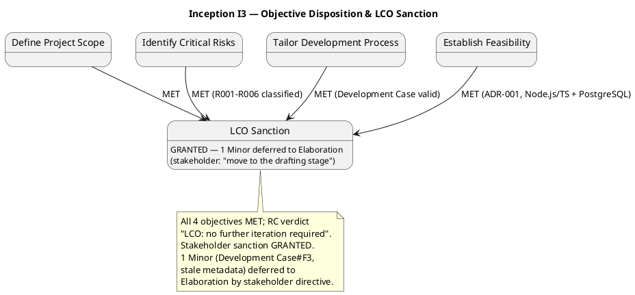
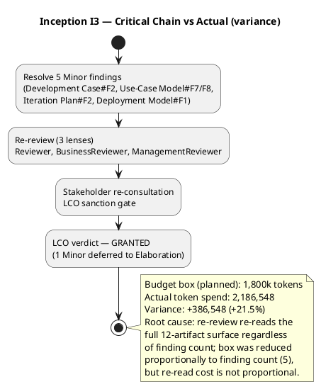

## Document Control

| Field | Value |
|---|---|
| Phase | Inception |
| Status | Draft — iteration 3 |
| Milestone Target | End-of-Inception review (LCO) |
| Milestone Verdict | LCO: no further iteration required — recorded, not declared by PM (Review Coordinator's verdict) |

## Iteration Objectives Reached

The iteration carried four planned objectives. Disposition against the Review Record (consolidated LCO re-review, three lenses) and the iteration's facts:

| # | Objective | Disposition | Evidence |
|---|---|---|---|
| 1 | Define Project Scope | **MET** | Review Coordinator verdict "LCO: no further iteration required"; scope agreement confirmed; 0 Critical / 0 Major open |
| 2 | Identify Critical Risks | **MET** | Risk List classifies R001–R006 with magnitude, strategy, mitigation, contingency |
| 3 | Tailor Development Process | **MET** | Development Case present and valid; Development Case#F2 (UI Prototype trigger) resolved |
| 4 | Establish Feasibility | **MET** | Software Architecture Document (ADR-001 modular monolith, Node.js/TS + PostgreSQL + Keycloak OIDC) |

**Overall:** All four planned objectives are MET. The Review Coordinator's verdict is "LCO: no further iteration required", and the stakeholder **sanctioned advancement past LCO** ("Let's move to the drafting stage"). One Minor finding (Development Case#F3 — stale Document Control metadata) remains open, explicitly deferred to Elaboration by the stakeholder's own directive. The iteration closes successfully.

## Adherence to Plan

**Budget-box variance (iteration 3):**

| Measure | Planned (I3 box) | Actual | Variance |
|---|---|---|---|
| Token spend (agent work) | 1,800,000 | 2,186,548 | +386,548 (+21.5%) |
| Agent elapsed time | — | 1:00:36 | — |
| Human queue time (waiting) | — | 0:00:00 | — |

The iteration-3 box (1,800k, sized from the measured iteration-2 actual of 3,014,457, reduced for the smaller remediation scope of 5 Minor findings) overshot by 21.5%. Root cause: the box was reduced **proportionally to the finding count** (5 findings vs iteration 2's 14), but the re-review pass re-reads the full 12-artifact surface regardless of finding count — the re-read cost is not proportional to the finding count. The box is now anchored to three measured data points (2,871,727 / 3,014,457 / 2,186,548); the next forecast uses the 2,186,548-token actual and must NOT assume re-read cost scales with finding count.

**Human gates:** 11 user interactions, 0:00:00 queue time (waiting, not work). This excludes the end-of-iteration approval gate, which is not measured. Queue time stayed well under the 14-day ceiling (R006 did not trigger).

**Parallelism:** 11 agent invocations across the remediation roles — as planned. No parallelism escalation was attempted; the variance is spend-per-invocation (re-read of the accumulated artifact surface), not invocation count.

## Use Cases and Scenarios Implemented

No new use cases were detailed this iteration — correct for a remediation iteration. The four architecturally significant use cases detailed in iteration 1 (UC-004, UC-012, UC-013, UC-014) remain the Inception detail set. Remediation work this iteration corrected the Use-Case Model's business-modeling content (BUC-004/BUC-011 associations) and the Deployment Model's Document Control metadata.

No use case was implemented to executable code this iteration — correct for Inception, where the deliverable is the architectural baseline, not a running system.

## Results Relative to Evaluation Criteria

The Iteration Plan carried two evaluation-criterion sets. Disposition of each:

**(a) Declared acceptance criteria (AC-001..AC-008):**

| AC | Disposition | Evidence |
|---|---|---|
| AC-001 | Addressed (design-level) | UC-013 + CON-007/NFR-003 configuration-driven compliance |
| AC-002 | Addressed (design-level) | CON-017 multi/single-tenant; Deployment Model |
| AC-003 | Addressed (design-level) | UC-004 → UC-012 end-to-end flow; NFR-002 self-service |
| AC-004 | Addressed (design-level) | UC-012/UC-013 jurisdiction-specific tax/certification/reporting |
| AC-005 | Addressed (design-level) | UC-004 race check (NFR-008) |
| AC-006 | Addressed (design-level) | CON-014/CON-015 retention + Test Plan |
| AC-007 | Addressed (design-level) | CON-005 + fraud data retention (NFR-004) |
| AC-008 | Addressed (design-level) | NFR-005 configurable matching policy |

All eight ACs are addressed at design level; none deferred. Full verification is Elaboration/Construction/Transition work.

**(b) This iteration's own exit criteria (LCO readiness):**

| Criterion | Disposition | Evidence |
|---|---|---|
| All 5 open Minor findings resolved | **MET (4 of 5)** | Development Case#F2, Use-Case Model#F7/F8, Iteration Plan#F2, Deployment Model#F1 all RESOLVED; Development Case#F3 (new, metadata-only) deferred to Elaboration by stakeholder directive |
| Re-review confirms resolution (0 Critical / 0 Major / 0 Minor) | **MET (0 Critical / 0 Major / 1 Minor)** | Consolidated tally: 0 Critical, 0 Major, 1 Minor (deferred) |
| Stakeholder sanctions advancement past LCO | **MET** | Sanction GRANTED — "Let's move to the drafting stage" |
| Vision, UC Model, Supp Spec, Glossary, DC present and consistent | **MET** | All 5 artifacts present; RC verdict "no further iteration required" |
| Risk List classifies R001–R006 | **MET** | Risk List register complete |

The iteration's exit criteria are met. The single remaining Minor finding (Development Case#F3) is a metadata-only defect (stale Document Control status) with no downstream blocking impact, and its deferral to Elaboration is explicitly authorized by the stakeholder.

## Test Results

**No test execution occurred this iteration** — correct for Inception. No Test Evaluation Summary exists (the artifact is not present in the repository), and no test cases were executed against a running system (none exists yet). This is not a gap; it is the expected state of an Inception iteration whose deliverable is the architectural baseline. The Test Plan (FIRED) establishes the risk-weighted test strategy (TI-001..TI-008) that Elaboration will execute against.

## External Changes

No external changes occurred this iteration. The declared scope (26 FRs, 9 NFRs, 22 CONs, 8 ACs, 2 BGs, 3 declared risks) is unchanged. No change requests were raised or approved.

Stakeholder answers received this iteration (all incorporated, none re-opened):
- LCO re-review sanction: **GRANTED** — "Yes" (Management Reviewer question, iteration 3). The verdict was "Conditional (all substantive criteria MET; 1 Minor finding remains open, blocking per your standing directive)".
- Follow-up directive: "Let's move to the drafting stage; that finding needs to be corrected during Elaboration." — the single remaining Minor finding (Development Case#F3) is explicitly deferred to Elaboration by the stakeholder's own words.

## Rework Required

The Review Record records **1 open Minor finding** (0 Critical, 0 Major), deferred to Elaboration by the stakeholder's explicit directive:

| # | Finding | Owner | Status this pass |
|---|---|---|---|
| 1 | Development Case#F3 — Document Control status reads "Draft — iteration 2" while the rest of the iteration-3 baseline reads "Draft — iteration 3" | Process Engineer | **DEFERRED to Elaboration** (stakeholder-authorized) |

**Adjustments forced on iteration N+1 (Elaboration I4):**
- The next iteration is the **first Elaboration iteration** — the LCO gate is passed; the milestone sequence advances to LCA (end of I6).
- The first Elaboration action item is to fix Development Case#F3 (bump Document Control to "Draft — iteration 3") — a metadata-only correction, stakeholder-authorized for deferral.
- The budget box for Elaboration I4 is sized from the **measured** 2,186,548-token iteration-3 actual, and must NOT assume re-read cost scales with finding count (the re-review re-reads the full 12-artifact surface regardless of finding count — this is the root cause of the +21.5% variance).

## Traceability

| Element | Traces From | Link Type | Traces To |
|---|---|---|---|
| Iteration Assessment (I3) | Iteration Plan (I3), Review Record (I3) | DependsOn | Iteration Plan (I4 Elaboration) |
| Objective 1 (scope) | Vision, Use-Case Model, Supplementary Specification, Glossary | DependsOn | LCO milestone |
| Objective 2 (risks) | R001..R006 | DependsOn | Risk List |
| Objective 3 (process) | Development Case | DependsOn | LCO milestone |
| Objective 4 (feasibility) | Software Architecture Document (ADR-001) | DependsOn | LCO milestone |
| Budget variance (I3) | Iteration Plan (I3) budget box | DependsOn | Iteration Plan (I4) re-sized box |
| Rework (1 finding) | Review Record (I3) | DependsOn | Elaboration I4 (Development Case#F3 fix) |