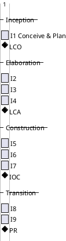
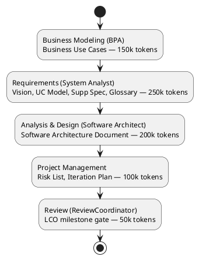

## Document Control

| Field | Value |
|---|---|
| Phase | Inception |
| Status | Draft — iteration 1 |
| Milestone Target | End-of-Inception review (LCO) |

## Iteration Objectives

1. Establish the project baseline from the stakeholder's declared scope: Vision, Use-Case Model (21 UCs), Supplementary Specification, Glossary, and a valid Development Case.
2. Identify, classify, and plan mitigation for the project's risks (Risk List).
3. Produce this Iteration Plan carrying both the coarse cross-iteration roadmap and the fine Inception iteration plan.
4. Assess Lifecycle Objectives (LCO) readiness: stakeholders agree on scope, the project is viable, and initial risks are identified.

## Plan and Milestones

### Coarse Roadmap (cross-iteration)

**Iteration count rationale:** 9 iterations total, within the "6 ± 3" rule's high extreme [1, 3, 3, 2]. Justified by the risk profile: R003 (multi-jurisdiction regulatory complexity) and R001 (legacy replacement failures) demand a full 3-iteration Elaboration to retire architectural and compliance risk before Construction; R002 (leadership tension) argues for a lean but complete process. The rubber profile (Inception ~5%) is stretched to a single Inception iteration because the scope is already well-declared by the stakeholder and Business Modeling is active.

**Milestone sequence:** LCO (end of I1) → LCA (end of I4) → IOC (end of I7) → PR (end of I9).

### Fine Plan — Inception Iteration 1 (critical chain)

**Iteration budget box:** 750k tokens (agent work), measured elapsed time reported at iteration close. Human gates (stakeholder questionnaires) are quoted separately in days of queue time and never summed with agent time.

| Work Item | Owner | Token Budget |
|---|---|---|
| Business Use Cases (BUC section of Use-Case Model) | Business Process Analyst | 150k |
| Vision, Use-Case Model, Supplementary Specification, Glossary | System Analyst | 250k |
| Software Architecture Document | Software Architect | 200k |
| Risk List + Iteration Plan | Project Manager | 100k |
| LCO milestone review | Review Coordinator | 50k |

## Resources

**Agent role profile (Inception I1):** Business Process Analyst, System Analyst, Software Architect, Project Manager, Review Coordinator. Business Modeling is ACTIVE per the Development Case (business-process-led).

**Budget split across roles:** BPA 150k · System Analyst 250k · Software Architect 200k · Project Manager 100k · Review Coordinator 50k — total 750k tokens.

**Human gates:** stakeholder questionnaires (`REQUIRES_USER_INPUT`) are the only human gates this iteration. Queue time is tracked per gate and escalated as a risk (R006) if any gate approaches the 14-day ceiling.

## Use Cases and Scenarios Addressed

Inception details only the architecturally significant use cases (10–20%). The four detailed this iteration, selected for architectural risk coverage:

| UC | Rationale for Inception detail |
|---|---|
| UC-004 Request Workers for Project | Carries matching (FR-018), assignment (FR-019), and the availability race (NFR-008, AC-005) — the highest architectural risk |
| UC-012 Process Payments | Carries the financial-intermediary flow (CON-004), tax/currency jurisdiction logic (CON-008..CON-010, FR-022) |
| UC-013 Produce Regulatory Reports | Carries configuration-driven compliance (NFR-003, CON-007, AC-001) — R003's anchor |
| UC-014 Terminate Worker Assignment | Carries contracts-must-be-honored (CON-013) and denial rules (CON-006) |

The remaining 17 UCs are surveyed (Use-Case Model) and detailed in Elaboration.

## Evaluation Criteria

**(a) Declared acceptance criteria — disposition this iteration:**

| AC | Disposition | Evidence |
|---|---|---|
| AC-001 | Addressed (design-level) | UC-013 + CON-007/NFR-003 configuration-driven compliance; verified end-to-end in later iterations |
| AC-002 | Addressed (design-level) | CON-017 multi/single-tenant; Deployment Model (FIRED) |
| AC-003 | Addressed (design-level) | UC-004 → UC-012 end-to-end flow; self-service NFR-002 |
| AC-004 | Addressed (design-level) | UC-012/UC-013 jurisdiction-specific tax/certification/reporting |
| AC-005 | Addressed (design-level) | UC-004 race check (NFR-008) |
| AC-006 | Addressed (design-level) | CON-014/CON-015 retention + Test Plan (FIRED) |
| AC-007 | Addressed (design-level) | CON-005 + fraud data retention (NFR-004) |
| AC-008 | Addressed (design-level) | NFR-005 configurable matching policy |

All eight ACs are addressed at design level this iteration; none are deferred. Full verification is the work of Elaboration/Construction/Transition.

**(b) This iteration's own exit criteria (LCO readiness):**
- Vision, Use-Case Model, Supplementary Specification, Glossary, Development Case all present and consistent.
- Risk List classifies R001–R006 with strategies and mitigations.
- Stakeholders agree on scope (declared scope is the ceiling; no scope expansion).
- Project viability assessed: the brokerage model is sound; the legacy architecture is the binding constraint (Vision root cause).

## Traceability

| Element | Traces From | Link Type | Traces To |
|---|---|---|---|
| Iteration Plan (I1) | BG-001, BG-002 | Derives | Risk List, Use-Case Model |
| UC-004 detail | FR-004, FR-018, FR-019, NFR-008 | Derives | Software Architecture Document |
| UC-012 detail | FR-014, FR-022, CON-004, CON-008..CON-010 | Derives | Software Architecture Document |
| UC-013 detail | FR-015, NFR-003, CON-007 | Derives | Software Architecture Document |
| UC-014 detail | FR-020, CON-006, CON-013 | Derives | Software Architecture Document |
| R001..R006 | declared risks + derived | DependsOn | Risk List |
