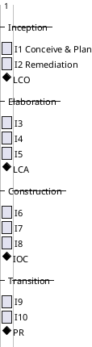
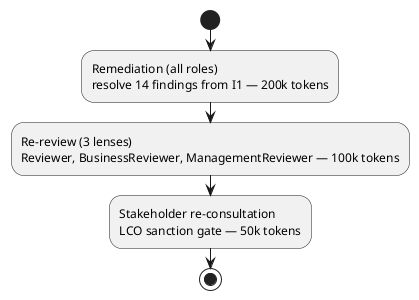

## Document Control

| Field | Value |
|---|---|
| Phase | Inception |
| Status | Draft — iteration 2 |
| Milestone Target | End-of-Inception review (LCO) |

## Iteration Objectives

1. Establish the project baseline from the stakeholder's declared scope: Vision, Use-Case Model (21 UCs), Supplementary Specification, Glossary, and a valid Development Case.
2. Identify, classify, and plan mitigation for the project's risks (Risk List).
3. Produce this Iteration Plan carrying both the coarse cross-iteration roadmap and the fine Inception iteration plan.
4. Assess Lifecycle Objectives (LCO) readiness: stakeholders agree on scope, the project is viable, and initial risks are identified.

## Plan and Milestones
### Coarse Roadmap (cross-iteration)

**Sequence-only, not a calendar.** The Gantt above expresses the *ordering* of iterations and the *position* of the four milestones (LCO, LCA, IOC, PR) — nothing more. The `lasts 1 days` bars are PlantUML placeholders required to render the sequence; they are **not** time-boxes and carry no calendar meaning. Iterations are bounded by their **token budget box** (see Fine Plan below), never by a duration. No iteration is sized in days, weeks, or person-time — units this system does not measure.

**Iteration count rationale:** 10 iterations total, within the "6 ± 3" rule's high extreme [1, 3, 3, 2] stretched by one Inception remediation iteration. The remediation iteration (I2) was forced by the stakeholder's directive to fix ALL findings — including Minors — before advancing past LCO. Justified by the risk profile: R003 (multi-jurisdiction regulatory complexity) and R001 (legacy replacement failures) demand a full 3-iteration Elaboration to retire architectural and compliance risk before Construction; R002 (leadership tension) argues for a lean but complete process.

**Milestone sequence:** LCO (end of I2) → LCA (end of I5) → IOC (end of I8) → PR (end of I10).

### Fine Plan — Inception Iteration 2 (remediation)

**Iteration budget box — measured, not assumed.** Iteration 1's box (750k tokens) was an explicit assumption with no measured actual to size against; it did not hold (measured actual 2,871,727 tokens, 3.8× overspend). That box is now **iteration-1 historical** and is superseded. The iteration-2 remediation box is sized from the measured iteration-1 actual:

| Work Item | Owner | Token Budget |
|---|---|---|
| Resolve 14 findings (5 Major + 9 Minor) | Business Process Analyst, System Analyst, Software Architect, Project Manager, Deployment Manager, Process Engineer | 2,000k |
| Re-review by three lenses | Reviewer, BusinessReviewer, ManagementReviewer | 500k |
| Stakeholder re-consultation (LCO sanction) | Review Coordinator | 300k |
| **Iteration-2 box total** | — | **2,800k** |

**Measured actuals (the basis for every subsequent forecast):**

| Iteration | Token spend (agent work) | Agent elapsed time | Human queue time (waiting) |
|---|---|---|---|
| I1 (conceive & plan) | 2,871,727 | 1:23:17 | 0:04:38 |
| I2 (remediation) | 3,014,457 | 0:43:29 | 0:00:00 |

Spend is dominated by reasoning over the accumulated artifact surface (12 artifacts) and re-reading it across roles — not by the volume the phase emits. The measured shape replaces every assumed share in every forecast made afterwards.
## Resources

**Agent role profile (Inception I1):** Business Process Analyst, System Analyst, Software Architect, Project Manager, Review Coordinator. Business Modeling is ACTIVE per the Development Case (business-process-led).

**Budget split across roles:** BPA 150k · System Analyst 250k · Software Architect 200k · Project Manager 100k · Review Coordinator 50k — total 750k tokens.

**Human gates:** stakeholder questionnaires (`REQUIRES_USER_INPUT`) are the only human gates this iteration. Queue time is tracked per gate and escalated as a risk (R006) if any gate approaches the 14-day ceiling.

## Use Cases and Scenarios Addressed

Inception details only the architecturally significant use cases (10–20%). The four detailed this iteration, selected for architectural risk coverage:

| UC | Rationale for Inception detail |
|---|---|
| UC-004 Request Workers for Project | Carries matching (FR-018), assignment (FR-019), and the availability race (NFR-008, AC-005) — the highest architectural risk |
| UC-012 Process Payments | Carries the financial-intermediary flow (CON-004), tax/currency jurisdiction logic (CON-008..CON-010, FR-022) |
| UC-013 Produce Regulatory Reports | Carries configuration-driven compliance (NFR-003, CON-007, AC-001) — R003's anchor |
| UC-014 Terminate Worker Assignment | Carries contracts-must-be-honored (CON-013) and denial rules (CON-006) |

The remaining 17 UCs are surveyed (Use-Case Model) and detailed in Elaboration.

## Evaluation Criteria

**(a) Declared acceptance criteria — disposition this iteration:**

| AC | Disposition | Evidence |
|---|---|---|
| AC-001 | Addressed (design-level) | UC-013 + CON-007/NFR-003 configuration-driven compliance; verified end-to-end in later iterations |
| AC-002 | Addressed (design-level) | CON-017 multi/single-tenant; Deployment Model (FIRED) |
| AC-003 | Addressed (design-level) | UC-004 → UC-012 end-to-end flow; self-service NFR-002 |
| AC-004 | Addressed (design-level) | UC-012/UC-013 jurisdiction-specific tax/certification/reporting |
| AC-005 | Addressed (design-level) | UC-004 race check (NFR-008) |
| AC-006 | Addressed (design-level) | CON-014/CON-015 retention + Test Plan (FIRED) |
| AC-007 | Addressed (design-level) | CON-005 + fraud data retention (NFR-004) |
| AC-008 | Addressed (design-level) | NFR-005 configurable matching policy |

All eight ACs are addressed at design level this iteration; none are deferred. Full verification is the work of Elaboration/Construction/Transition.

**(b) This iteration's own exit criteria (LCO readiness):**
- Vision, Use-Case Model, Supplementary Specification, Glossary, Development Case all present and consistent.
- Risk List classifies R001–R006 with strategies and mitigations.
- Stakeholders agree on scope (declared scope is the ceiling; no scope expansion).
- Project viability assessed: the brokerage model is sound; the legacy architecture is the binding constraint (Vision root cause).

## Traceability

| Element | Traces From | Link Type | Traces To |
|---|---|---|---|
| Iteration Plan (I1) | BG-001, BG-002 | Derives | Risk List, Use-Case Model |
| UC-004 detail | FR-004, FR-018, FR-019, NFR-008 | Derives | Software Architecture Document |
| UC-012 detail | FR-014, FR-022, CON-004, CON-008..CON-010 | Derives | Software Architecture Document |
| UC-013 detail | FR-015, NFR-003, CON-007 | Derives | Software Architecture Document |
| UC-014 detail | FR-020, CON-006, CON-013 | Derives | Software Architecture Document |
| R001..R006 | declared risks + derived | DependsOn | Risk List |