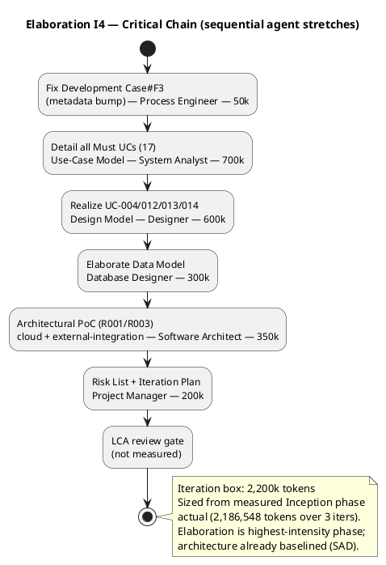

## Document Control

| Field | Value |
|---|---|
| Phase | Elaboration |
| Status | Draft — iteration 1 |
| Milestone Target | End-of-Elaboration review (Lifecycle Architecture Milestone) |

## Iteration Objectives

1. Detail all remaining Must use cases (17) in the Use-Case Model — the full functional surface, with the four architecturally significant UCs (UC-004, UC-012, UC-013, UC-014) realized end-to-end in the Design Model.
2. Elaborate the Data Model to the entity level (BOM: 10 entities + 3 control classes, JSONB for evolving structures).
3. Run the Architectural Proof-of-Concept (R001/R003) — empirically validate the cloud/external-integration assumptions (CON-001, CON-002) the legacy could not satisfy, on the baselined modular-monolith skeleton.
4. Reappraise the Risk List (R001–R006) against the baselined architecture; retire or re-classify where evidence supports it.
5. Fix Development Case#F3 (stale Document Control metadata) — the single Minor finding deferred from Inception by stakeholder directive.

## Plan and Milestones

### Coarse Roadmap (cross-iteration)

```plantuml
@startgantt
hide footbox
-- Inception (CLOSED) --
[I1 Conceive & Plan] lasts 1 days
[I2 Remediation] lasts 1 days
[I3 Remediation 2] lasts 1 days
[LCO] happens at [I3 Remediation 2]'s end
-- Elaboration (current) --
[I4 Detail Must UCs + PoC] lasts 1 days
[I5 Realize + Data Model] lasts 1 days
[I6 LCA review] lasts 1 days
[LCA] happens at [I6 LCA review]'s end
-- Construction (baselined) --
[I7 Core brokerage build] lasts 1 days
[I8 Financial + reporting build] lasts 1 days
[I9 Integration + hardening] lasts 1 days
[IOC] happens at [I9 Integration + hardening]'s end
-- Transition (baselined) --
[I10 Deployment + training] lasts 1 days
[I11 Release + closeout] lasts 1 days
[PR] happens at [I11 Release + closeout]'s end
@endgantt
```

**Sequence-only, not a calendar.** The Gantt above expresses the *ordering* of iterations and the *position* of the four milestones (LCO, LCA, IOC, PR) — nothing more. The `lasts 1 days` bars are PlantUML placeholders required to render the sequence; they are **not** time-boxes and carry no calendar meaning. Iterations are bounded by their **token budget box** (see Fine Plan below), never by a duration. No iteration is sized in days, weeks, or person-time — units this system does not measure.

**Iteration count rationale:** 11 iterations total, distributed [3, 3, 3, 2] across Inception/Elaboration/Construction/Transition. This exceeds the "6 ± 3" rule's high extreme [1, 3, 3, 2] by two Inception remediation iterations (I2 and I3), both forced by the stakeholder's directive to fix ALL findings — including Minors — before advancing past LCO. The stretch is justified by the risk profile: R003 (multi-jurisdiction regulatory complexity) and R001 (legacy replacement failures) demand a full 3-iteration Elaboration to retire architectural and compliance risk before Construction; R002 (leadership tension) argues for a lean but complete process. The two remediation iterations are process overhead imposed by the stakeholder's quality bar, not scope growth.

**Milestone sequence:** LCO (end of I3, ACHIEVED) → LCA (end of I6) → IOC (end of I9) → PR (end of I11).

**Construction baseline (this iteration's coarse-planning deliverable):** the Construction and Transition iteration boundaries are now baselined as the coarse roadmap above. Fine-grained Construction Gantts are NOT built here — that is speculation beyond the planning horizon; they are built from measured Elaboration actuals when Elaboration closes. The Construction agent-role profile is activated at LCA, not before.

### Fine Plan — Elaboration Iteration 1 (I4)

**Iteration budget box — measured, not assumed.** The Inception phase closed at **2,186,548 tokens / 1.0 h agent time / 0s stakeholder queue / 11 agent runs / 12 artifacts** (measured, not estimated). That is the only closed-phase actual available; there is no per-iteration velocity to quote (iterations inside a phase are not recorded separately). The Elaboration I4 box is sized from that phase actual, adjusted for Elaboration's higher intensity (architecture baselining + full UC detail + PoC):

| Work Item | Owner | Token Budget |
|---|---|---|
| Fix Development Case#F3 (metadata bump) | Process Engineer | 50k |
| Detail all remaining Must UCs (17) | System Analyst | 700k |
| Realize UC-004/012/013/014 (Design Model) | Designer | 600k |
| Elaborate Data Model (10 entities + 3 control classes) | Database Designer | 300k |
| Architectural PoC (R001/R003 — cloud + external integration) | Software Architect | 350k |
| Risk List + Iteration Plan (this artifact) | Project Manager | 200k |
| **Iteration-1 box total** | — | **2,200k** |

**Basis for the box:** the Inception phase actual (2,186,548 tokens) is the measured floor. Elaboration is the highest-intensity phase (architecture baselined, full UC detail, PoC), so the box is set at 2,200k — essentially the Inception phase actual, not a multiple of it. This is an `[ASSUMPTION — requires validation]`: no Elaboration iteration has closed yet, so the box is sized from the *phase* actual, not a per-iteration actual. The box will be re-sized from the measured I4 actual when I4 closes.

**Human gates:** the LCA review gate at the end of I6 is the only human gate this iteration's plan anticipates; it is not measured (end-of-iteration approval gates are excluded from the two clocks). Any `REQUIRES_USER_INPUT` raised mid-iteration is tracked per gate against the 14-day ceiling (R006).

## Resources

**Agent role profile (Elaboration I4):** Process Engineer (Development Case#F3 fix), System Analyst (UC detail), Designer (UC realizations), Database Designer (Data Model), Software Architect (PoC), Project Manager (Risk List + Iteration Plan). Business Modeling remains ACTIVE per the Development Case (brokerage is the subject of the system).

**Budget split across roles:** Process Engineer 50k · System Analyst 700k · Designer 600k · Database Designer 300k · Software Architect 350k · Project Manager 200k — total 2,200k tokens.

**Construction agent roles are NOT activated this iteration** — they ramp up at LCA (end of I6), per the rubber-profile heuristic (Elaboration ~20% of iterations, Construction roles activated at the LCA "go" decision).

**Human gates:** the LCA review gate (end of I6) is the next human gate. Queue time is tracked per gate and escalated as a risk (R006) if any gate approaches the 14-day ceiling. Inception measured 0:00:00 queue time across 11 user interactions — the lean process is holding.

## Use Cases and Scenarios Addressed

Elaboration details the full Must-UC surface. The four architecturally significant UCs detailed in Inception (UC-004, UC-012, UC-013, UC-014) are now realized end-to-end in the Design Model; the remaining 17 Must UCs are detailed in the Use-Case Model this iteration. Nice-to-have UCs (FR-016, FR-017, FR-024, FR-025, FR-026) are deferred per the stakeholder's directive ("All Must UCs fully specified in Elaboration; nice-to-haves deferred").

| UC | Rationale for Elaboration detail |
|---|---|
| UC-004 Request Workers (matching + assignment) | Realized end-to-end; carries matching (FR-018), assignment (FR-019), availability race (NFR-008, AC-005) — R004/R005 |
| UC-012 Process Payments | Realized end-to-end; financial intermediary (CON-004), currency (FR-022), tax (CON-009) — R003 |
| UC-013 Produce Regulatory Reports | Realized end-to-end; jurisdiction variation (CON-007), retention (CON-015), audit (AC-006) — R003 |
| UC-014 Terminate Worker Assignment | Realized end-to-end; contracts-must-be-honored (CON-013), denial rules (CON-006) — R003 |
| UC-001..UC-003, UC-005..UC-011, UC-015..UC-021 (17 remaining Must UCs) | Detailed this iteration — full functional surface for Construction |

## Evaluation Criteria

**(a) Declared acceptance criteria — disposition this iteration:**

| AC | Disposition | Evidence |
|---|---|---|
| AC-001 | Addressed (design-level) | UC-013 + CON-007/NFR-003 configuration-driven compliance; Configuration subsystem (I3) baselined |
| AC-002 | Addressed (design-level) | CON-017 multi/single-tenant; Deployment Model |
| AC-003 | Addressed (design-level) | UC-004 → UC-012 end-to-end flow; NFR-002 self-service |
| AC-004 | Addressed (design-level) | UC-012/UC-013 jurisdiction-specific tax/certification/reporting |
| AC-005 | Addressed (design-level) | UC-004 race check (NFR-008); COMP-007 atomic availability check |
| AC-006 | Addressed (design-level) | CON-014/CON-015 retention + tamper-evident audit (REQ-003) |
| AC-007 | Addressed (design-level) | CON-005 + fraud data retention (NFR-004) |
| AC-008 | Addressed (design-level) | NFR-005 configurable matching policy; COMP-001 |

All eight ACs are addressed at design level this iteration; none are deferred. Full verification is the work of Construction/Transition.

**(b) This iteration's own exit criteria (Elaboration I4):**
- All 17 remaining Must UCs detailed in the Use-Case Model.
- UC-004, UC-012, UC-013, UC-014 realized end-to-end in the Design Model.
- Data Model elaborated to entity level (10 entities + 3 control classes, JSONB for evolving structures).
- Architectural PoC validates cloud (CON-001) and external-integration (CON-002) assumptions — R001/R003 mitigation evidence.
- Development Case#F3 fixed (metadata bump).
- Risk List reappraised: R001/R003/R004/R005 status/trend updated against the baselined architecture.

## Traceability

| Element | Traces From | Link Type | Traces To |
|---|---|---|---|
| Iteration Plan (I4) | BG-001, BG-002 | Derives | Risk List, Use-Case Model, Design Model |
| Iteration Plan (I4) budget box | Iteration Assessment (Inception) measured actual | DependsOn | Iteration Plan (I4) box |
| UC-004 realization | FR-004, FR-018, FR-019, NFR-008 | Derives | Design Model, Software Architecture Document (COMP-001, COMP-007) |
| UC-012 realization | FR-014, FR-022, CON-004, CON-008..CON-010 | Derives | Design Model, Software Architecture Document (COMP-002) |
| UC-013 realization | FR-015, NFR-003, CON-007 | Derives | Design Model, Software Architecture Document (COMP-003) |
| UC-014 realization | FR-020, CON-006, CON-013 | Derives | Design Model, Software Architecture Document (COMP-007) |
| Architectural PoC | R001, R003, CON-001, CON-002 | DependsOn | Software Architecture Document |
| R001..R006 | declared risks + derived | DependsOn | Risk List |