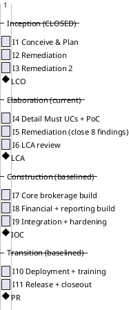
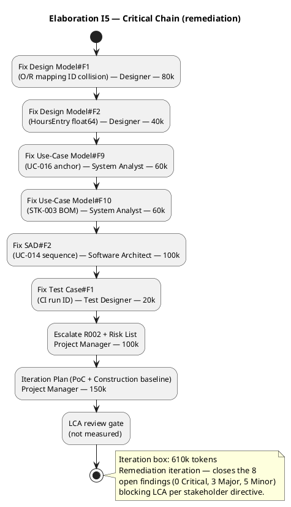

## Document Control

| Field | Value |
|---|---|
| Phase | Elaboration |
| Status | Draft — iteration 2 |
| Milestone Target | End-of-Elaboration review (Lifecycle Architecture Milestone) |

## Iteration Objectives

1. **Close the 8 open findings blocking LCA** (0 Critical, 3 Major, 5 Minor) — the stakeholder's directive ("you do need to close all findings even if they are minors") makes every finding, including Minors, blocking for LCA advancement.
2. **Record the executed Architectural Proof-of-Concept** (R001/R003) — the PoC is now complete (analysis-only disposition); CON-001 (cloud) and CON-002 (external integration) are retired by reasoning against the baselined stack, closing Iteration Plan#F3.
3. **Escalate R002 (HIGH, exposure 16) to the stakeholder** for explicit disposition — the HIGH-risk `Accept` is not the Project Manager's to grant (Risk List#F2).
4. **Baseline the Construction schedule** in the coarse roadmap, grounded in the measured Inception actuals (the only closed-phase actual available).

## Plan and Milestones

### Coarse Roadmap (cross-iteration)

**Sequence-only, not a calendar.** The Gantt above expresses the *ordering* of iterations and the *position* of the four milestones (LCO, LCA, IOC, PR) — nothing more. The `lasts 1 days` bars are PlantUML placeholders required to render the sequence; they are **not** time-boxes and carry no calendar meaning. Iterations are bounded by their **token budget box** (see Fine Plan below), never by a duration. No iteration is sized in days, weeks, or person-time — units this system does not measure.

**Iteration count rationale:** 11 iterations total, distributed [3, 3, 3, 2] across Inception/Elaboration/Construction/Transition. This exceeds the "6 ± 3" rule's high extreme [1, 3, 3, 2] by two Inception remediation iterations (I2 and I3), both forced by the stakeholder's directive to fix ALL findings — including Minors — before advancing past LCO. Elaboration I5 is a remediation iteration of the same kind: it closes the 8 findings (3 Major, 5 Minor) that blocked the LCA sanction. The stretch is justified by the risk profile: R003 (multi-jurisdiction regulatory complexity) and R001 (legacy replacement failures) demand a full 3-iteration Elaboration to retire architectural and compliance risk before Construction; R002 (leadership tension) argues for a lean but complete process.

**Milestone sequence:** LCO (end of I3, ACHIEVED) → LCA (end of I6) → IOC (end of I9) → PR (end of I11).

**Construction baseline (this iteration's coarse-planning deliverable):** the Construction and Transition iteration boundaries are baselined as the coarse roadmap above. Fine-grained Construction Gantts are NOT built here — that is speculation beyond the planning horizon; they are built from measured Elaboration actuals when Elaboration closes. The Construction agent-role profile is activated at LCA, not before.

### Fine Plan — Elaboration Iteration 2 (I5)

**Iteration budget box — measured, not assumed.** The Inception phase closed at **2,186,548 tokens / 1.0 h agent time / 0s stakeholder queue / 11 agent runs / 12 artifacts** (measured, not estimated). That is the only closed-phase actual available; there is no per-iteration velocity to quote (iterations inside a phase are not recorded separately). Elaboration I5 is a **remediation** iteration — its scope is the 8 open findings, not new functional surface — so its box is far smaller than I4's (2,200k):

| Work Item | Owner | Token Budget |
|---|---|---|
| Fix Design Model#F1 (O/R mapping ID collision) | Designer | 80k |
| Fix Design Model#F2 (HoursEntry float64) | Designer | 40k |
| Fix Use-Case Model#F9 (UC-016 anchor) | System Analyst | 60k |
| Fix Use-Case Model#F10 (STK-003 BOM) | System Analyst | 60k |
| Fix SAD#F2 (UC-014 sequence diagram) | Software Architect | 100k |
| Fix Test Case#F1 (CI run ID) | Test Designer | 20k |
| Escalate R002 + Risk List update | Project Manager | 100k |
| Iteration Plan (PoC + Construction baseline) | Project Manager | 150k |
| **Iteration-2 box total** | — | **610k** |

**Basis for the box:** the Inception phase actual (2,186,548 tokens) is the measured floor for a *full* iteration. I5 is a remediation iteration — its work is bounded by the 8 findings, each a localized correction, not a new artifact. The 610k box is sized from the finding count and the correction type (ID relabeling, type change, diagram addition, metadata bump), not from a phase multiple. This is an `[ASSUMPTION — requires validation]`: no Elaboration iteration has closed yet, so the box is sized from the *phase* actual and the *finding* scope, not a per-iteration actual. The box will be re-sized from the measured I5 actual when I5 closes.

**Human gates:** the LCA review gate at the end of I6 is the next human gate; it is not measured (end-of-iteration approval gates are excluded from the two clocks). The R002 escalation raised this iteration is a mid-iteration gate tracked against the 14-day ceiling (R006).

## Resources

**Agent role profile (Elaboration I5):** Designer (Design Model#F1, #F2), System Analyst (Use-Case Model#F9, #F10), Software Architect (SAD#F2), Test Designer (Test Case#F1), Project Manager (R002 escalation + Risk List + Iteration Plan). Business Modeling remains ACTIVE per the Development Case (brokerage is the subject of the system).

**Budget split across roles:** Designer 120k · System Analyst 120k · Software Architect 100k · Test Designer 20k · Project Manager 250k — total 610k tokens.

**Construction agent roles are NOT activated this iteration** — they ramp up at LCA (end of I6), per the rubber-profile heuristic (Elaboration ~20% of iterations, Construction roles activated at the LCA "go" decision).

**Human gates:** the LCA review gate (end of I6) is the next human gate. The R002 escalation is a mid-iteration gate. Queue time is tracked per gate and escalated as a risk (R006) if any gate approaches the 14-day ceiling. Inception measured 0:00:00 queue time across 11 user interactions — the lean process is holding.

## Use Cases and Scenarios Addressed

Elaboration I5 is a remediation iteration — it does not add new functional surface. The full Must-UC surface was detailed in I4 (17 remaining Must UCs) and the four architecturally significant UCs (UC-004, UC-012, UC-013, UC-014) were realized end-to-end. This iteration corrects the findings against that surface:

| Finding | UC / element affected | Correction |
|---|---|---|
| Use-Case Model#F9 | UC-016 (Record Rate Adjustments, FR-023) | Anchor UC-016 in BUC-004's derivation column |
| Use-Case Model#F10 | STK-003 (Internal Representative) | Model as `<<business worker>>` in BOM or note automation (BG-002) |
| SAD#F2 | UC-014 (Terminate Worker Assignment) | Add sequence diagram or explicit deferral note |
| Design Model#F1 | O/R mapping (Worker/Contractor/Membership) | Relabel to entity ACL IDs (ACL-013..ACL-023) |
| Design Model#F2 | HoursEntry.hoursWorked | Change float64 → exact type (string decimal / scaled integer) |
| Test Case#F1 | CI run citation | Update to current main build 34886064517 |

## Evaluation Criteria

**(a) Declared acceptance criteria — disposition this iteration:**

| AC | Disposition | Evidence |
|---|---|---|
| AC-001 | Addressed (design-level) | UC-013 + CON-007/NFR-003 configuration-driven compliance; Configuration subsystem (I3) baselined; PoC confirms feasibility |
| AC-002 | Addressed (design-level) | CON-017 multi/single-tenant; Deployment Model |
| AC-003 | Addressed (design-level) | UC-004 → UC-012 end-to-end flow; NFR-002 self-service |
| AC-004 | Addressed (design-level) | UC-012/UC-013 jurisdiction-specific tax/certification/reporting |
| AC-005 | Addressed (design-level) | UC-004 race check (NFR-008); COMP-007 atomic availability check |
| AC-006 | Addressed (design-level) | CON-014/CON-015 retention + tamper-evident audit (REQ-003) |
| AC-007 | Addressed (design-level) | CON-005 + fraud data retention (NFR-004) |
| AC-008 | Addressed (design-level) | NFR-005 configurable matching policy; COMP-001 |

All eight ACs are addressed at design level; none are deferred. Full verification is the work of Construction/Transition.

**(b) This iteration's own exit criteria (Elaboration I5):**
- All 8 open findings closed (0 Critical, 3 Major, 5 Minor) — per the stakeholder's directive that all findings, including Minors, are blocking.
- Architectural PoC recorded as executed (analysis-only) — CON-001/CON-002 retired by reasoning (Iteration Plan#F3 closed).
- R002 escalated to the stakeholder for explicit disposition (Risk List#F2).
- Construction schedule baselined in the coarse roadmap, grounded in measured Inception actuals.

## Traceability

| Element | Traces From | Link Type | Traces To |
|---|---|---|---|
| Iteration Plan (I5) | BG-001, BG-002 | Derives | Risk List, Use-Case Model, Design Model |
| Iteration Plan (I5) budget box | Iteration Assessment (Inception) measured actual | DependsOn | Iteration Plan (I5) box |
| UC-004 realization | FR-004, FR-018, FR-019, NFR-008 | Derives | Design Model, Software Architecture Document (COMP-001, COMP-007) |
| UC-012 realization | FR-014, FR-022, CON-004, CON-008..CON-010 | Derives | Design Model, Software Architecture Document (COMP-002) |
| UC-013 realization | FR-015, NFR-003, CON-007 | Derives | Design Model, Software Architecture Document (COMP-003) |
| UC-014 realization | FR-020, CON-006, CON-013 | Derives | Design Model, Software Architecture Document (COMP-007) |
| Architectural PoC | R001, R003, CON-001, CON-002 | DependsOn | Software Architecture Document |
| R001..R006 | declared risks + derived | DependsOn | Risk List |