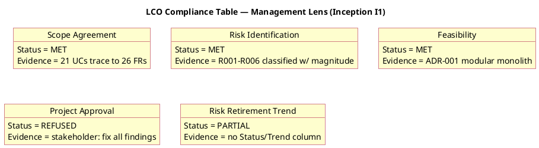
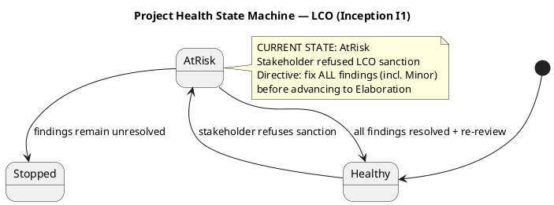
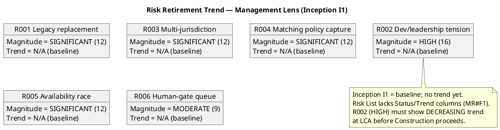

## Document Control

| Field | Value |
|---|---|
| Phase | Inception |
| Status | Draft — iteration 1 |
| Milestone Target | End-of-Inception review (LCO) |
| Review Type | Lifecycle Objectives (LCO) milestone review — management lens |
| Reviewer | Management Reviewer (project governance lens) |
| Date | 2026-09-14 |
| Artifacts Reviewed | Vision, Use-Case Model, Supplementary Specification, Software Architecture Document, Development Case, Risk List, Iteration Plan, Test Plan, Deployment Model, Glossary (10 total) |

## Review Scope and Criteria

This is the **Lifecycle Objectives (LCO)** milestone review, management lens. The evaluative question is **EXIT CRITERIA**: do the Inception artifacts collectively satisfy the conditions for phase transition to Elaboration, and is the project viable and acceptable to stakeholders?

**LCO exit criteria (management lens):**

| Criterion | Question |
|---|---|
| Scope agreement | Do stakeholders agree on what is in/out of scope? |
| Risk identification | Have key risks been identified with magnitude ratings? |
| Feasibility | Is the proposed approach and initial plan feasible? |
| Project Approval | Is there sanction to proceed to Elaboration? |

**Checklist applied (management lens):**

| Artifact | Checklist |
|---|---|
| Vision | Scope in/out clarity, stakeholder needs, viability, data-source verification |
| Iteration Plan | Objectives, cost-boxing (not time-boxing), AC disposition, milestone sequence |
| Risk List | Magnitude ratings, strategy/mitigation/contingency, status/trend tracking |
| Development Case | DC baseline conformance, optional trigger justification |
| Software Architecture Document | Feasibility of approach, risk-driven priorities |

## Findings

Two (2) findings recorded by the management lens, both **Minor**. Zero Major, zero Critical from this lens. The business lens (Business Reviewer) carries 5 Major findings; the technical lens (Reviewer) carries 7 Minor findings. **The stakeholder has directed that ALL findings — including Minor — be fixed before advancing to Elaboration.**

### Finding Detail — Management Lens

| # | Artifact | Key | Severity | Finding | Remediation |
|---|---|---|---|---|---|
| 1 | Risk List | F1 | Minor | The Risk Register lacks a Status column and a Trend column. It tracks P, I, Exposure, Magnitude, Strategy, and Owner, but not whether a risk is open/mitigating/retired nor whether its trend is improving/stable/worsening since the last review. Without these, risk retirement — the core of RUP's risk-driven approach — cannot be verified at future milestones (LCA/IOC/PR). R002 (HIGH, exposure 16) currently carries no trend line. | Add a Status column (open/mitigating/retired) and a Trend column (improving/stable/worsening) to the Risk Register, and update both at every major review so high-magnitude risks show a decreasing trend line rather than a static list. |
| 2 | Iteration Plan | F1 | Minor | The coarse-roadmap Gantt chart time-boxes iterations ("lasts 1 days" each), while the plan text cost-boxes them ("Iteration budget box: 750k tokens"). The IARI baseline (§8.1) mandates cost-boxing, not time-boxing; the "1 days" placeholder contradicts this and reads as a fabricated duration. | Replace the "1 days" durations with cost-box annotations (token budgets) or mark the Gantt as a coarse sequence-only roadmap with no duration semantics. |

## Resolutions and Actions

No prior-iteration management-lens findings exist (this is iteration 1, cycle 1). Both findings above are newly recorded this iteration.

**Stakeholder sanction: REFUSED.** The stakeholder declined to sanction advancement past LCO and directed: *"You do need to fix all findings even if they are minors before move to the next phase."*

**Open action items (all lenses, all blocking per stakeholder directive):**
- 5 Major (business lens) — BM scenario unstated; BUC-012 no actor; no business entities; business rules not formalized; no business object model.
- 7 Minor (technical lens) — DC roster count; Vision constraints; Vision diagram; UCM actor placeholders; SAD UC-016 mapping; Test Plan unsourced cost figure; Iteration Plan Gantt time-boxing.
- 2 Minor (management lens) — Risk List Status/Trend columns; Iteration Plan Gantt time-boxing (overlaps technical lens F1).

## Disposition

**No-Go (Conditional).** The LCO milestone is NOT sanctioned for advancement to Elaboration.

The Inception artifacts are substantively sound — scope is agreed and respected as the ceiling, risks are identified with magnitude ratings, and the approach (modular monolith, Node.js/TS + PostgreSQL, cost-boxed) is feasible. However, the stakeholder has explicitly refused sanction and directed that **all findings — including the Minor ones — be resolved before the phase advances**. This elevates every open finding to blocking status.

**Conditions to close before LCO can be sanctioned:**
1. All 5 Major (business lens) findings resolved.
2. All 7 Minor (technical lens) findings resolved.
3. All 2 Minor (management lens) findings resolved.
4. Re-review by all three lenses confirming resolution.
5. Stakeholder re-consulted for sanction.

## Traceability

| Element | Traces From | Link Type | Traces To |
|---|---|---|---|
| Review Record (I1) | Vision, Use-Case Model, Supplementary Specification, SAD, Development Case, Risk List, Iteration Plan, Test Plan, Deployment Model, Glossary | DependsOn | LCO milestone |
| Risk List#F1 (MR) | R001..R006 | DependsOn | Risk List |
| Iteration Plan#F1 (MR) | IARI cost-boxing mandate (§8.1) | DependsOn | Iteration Plan |
| Stakeholder sanction (REFUSED) | LCO milestone | DependsOn | Elaboration (blocked) |
