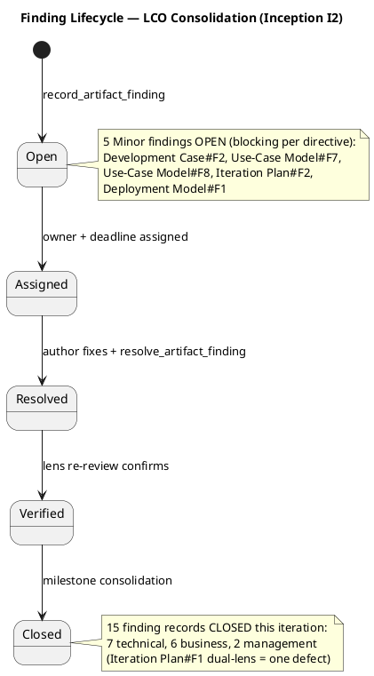
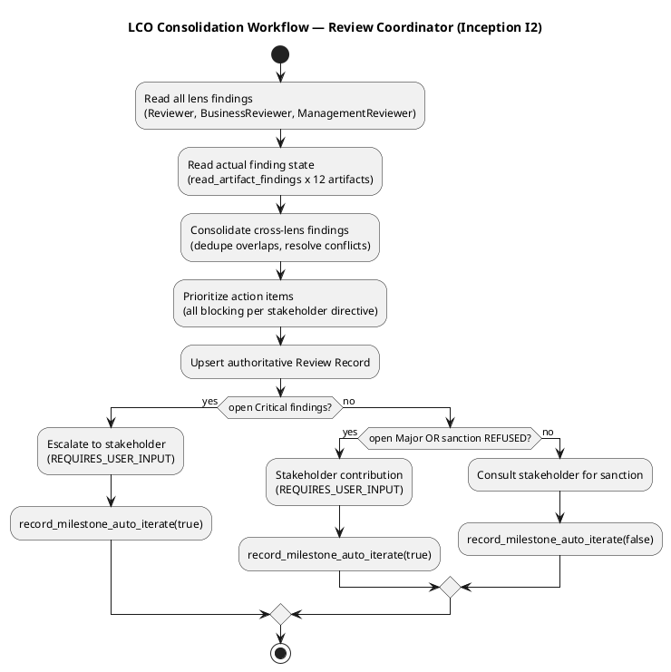
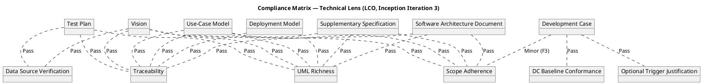
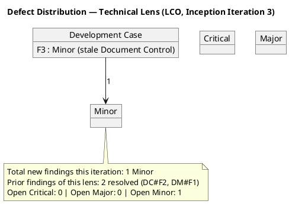
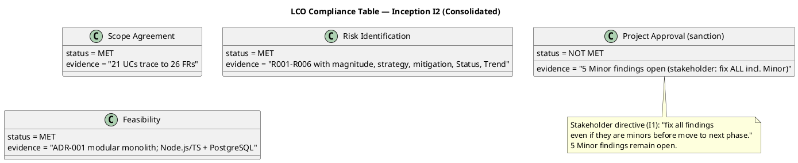

## Document Control

| Field | Value |
|---|---|
| Phase | Inception |
| Status | Draft — iteration 2 (consolidated) |
| Milestone Target | End-of-Inception review (LCO) |
| Review Type | Lifecycle Objectives (LCO) milestone review — consolidated |
| Reviewer | Review Coordinator (consolidation of three lenses) |
| Date | 2026-09-14 |
| Artifacts Reviewed | Vision, Use-Case Model, Supplementary Specification, Software Architecture Document, Development Case, Risk List, Iteration Plan, Test Plan, Deployment Model, Glossary (10 total) |

**Lens participation (authoritative):**

| Lens | Status |
|---|---|
| Technical / Reviewer | EXECUTED — 7 Minor findings (all resolved) + 2 new Minor |
| Business / BusinessReviewer | EXECUTED — 5 Major + 1 Minor (all resolved) + 2 new Minor |
| Management / ManagementReviewer | EXECUTED — 2 Minor (both resolved) + 1 new Minor |

**Stakeholder sanction: REFUSED** (iteration 2) — fix all findings including Minors before advancing to Elaboration.

## Review Scope and Criteria

This is the **Lifecycle Objectives (LCO)** milestone review, consolidated across three lenses. The evaluative question is **EXIT CRITERIA**: do the Inception artifacts collectively satisfy the conditions for phase transition to Elaboration, and is the project viable and acceptable to stakeholders?

**LCO exit criteria (consolidated):**

| Criterion | Question | Status |
|---|---|---|
| Scope agreement | Do stakeholders agree on what is in/out of scope? | MET (21 UCs trace to 26 FRs) |
| Risk identification | Have key risks been identified with magnitude ratings? | MET (R001–R006 classified) |
| Feasibility | Is the proposed approach and initial plan feasible? | MET (ADR-001 modular monolith, Node.js/TS + PostgreSQL) |
| Project Approval | Is there sanction to proceed to Elaboration? | **REFUSED** (stakeholder directive: fix ALL findings incl. Minor) |

## Findings
**Consolidated finding tally (iteration 2, authoritative): 0 Critical, 0 Major, 5 Minor — all OPEN.**

Cross-lens consolidation notes:
- **Iteration Plan#F1** (Gantt time-boxing) was recorded by BOTH the technical lens (Reviewer) and the management lens (ManagementReviewer). It is ONE defect with two lenses concurring — consolidated to a single action item, with the management lens as the authoritative owner (cost-boxing is a project-management discipline concern). Both finding records are RESOLVED.
- No conflicting verdicts between lenses: all three lenses concur that the artifacts are substantively sound but carry blocking defects per the stakeholder's directive.

### Open Findings (5 — all Minor, all blocking per stakeholder directive)

| # | Artifact | Key | Lens | Severity | Finding | Remediation | Owner |
|---|---|---|---|---|---|---|---|
| 1 | Development Case | F2 | Reviewer | Minor | UI Prototype trigger justification cites "low-technical-literacy users" as UX-critical, but "low technical literacy is a design concern" is a deferred out-of-cycle open question (Supplementary Specification REQ-010) — the DC cites an open question as settled fact. | Re-justify the UI Prototype trigger on settled ground (NFR-001 mobile must-have, NFR-002 self-service replacing 220 reps); drop or qualify the low-technical-literacy phrase. | Process Engineer |
| 2 | Use-Case Model | F7 | BusinessReviewer | Minor | BUC-004 "Broker Worker to Project" survey lists Internal Representative (STK-003) as a business worker, but the Business Use-Case Diagram does not draw an association from the Internal Representative worker to BUC-004. | Add `Rep --> BUC4` association in the Business Use-Case Diagram to match the survey (worker assists brokering, per FR-018 "hand-tuned policy representatives used for decades"). | Business Process Analyst |
| 3 | Use-Case Model | F8 | BusinessReviewer | Minor | BUC-011 "Handle Exceptions & Fallback" survey lists Worker and Contractor as business actors, but the Business Use-Case Diagram draws only `Rep --> BUC11` — the Worker and Contractor associations are missing. | Add `Worker --> BUC11` and `Contractor --> BUC11` associations to match the survey (fallback channel serves workers/contractors, FR-013). | Business Process Analyst |
| 4 | Iteration Plan | F2 | ManagementReviewer | Minor | The Iteration Plan's budget box (750k tokens) is disproven by the measured iteration-1 actual (2,871,727 tokens, 3.8x overspend) documented in the Iteration Assessment, yet the Iteration Plan still carries 750k as the current box with no re-sizing or supersession annotation. | Re-size the budget box from the measured 2,871,727-token actual (or annotate 750k as iteration-1 historical and add the iteration-2 remediation box), and align the fine-plan section header with the iteration-2 Document Control status. | Project Manager |
| 5 | Deployment Model | F1 | Reviewer | Minor | Deployment Model's Document Control status reads "Draft — iteration 1" while the rest of the iteration-2 baseline reads "Draft — iteration 2"; the artifact was preserved but its metadata was not bumped, leaving stale iteration metadata. | Update Document Control status to "Draft — iteration 2". | Deployment Manager |

---

### Iteration 3 — Technical lens (Reviewer) findings

**Technical-lens tally (iteration 3): 0 Critical, 0 Major, 1 Minor — OPEN.**

The technical baseline is substantively sound. All prior Critical and Major findings are closed; all prior Minor findings of this lens are closed. One new Minor finding was recorded this iteration.

#### New Findings (iteration 3, technical lens)

| # | Artifact | Key | Lens | Severity | Finding | Remediation | Owner |
|---|---|---|---|---|---|---|---|
| 1 | Development Case | F3 | Reviewer | Minor | Document Control status reads "Draft — iteration 2" while the rest of the iteration-3 baseline reads "Draft — iteration 3". The artifact was modified this iteration (UI Prototype trigger re-justified on NFR-001/NFR-002, resolving F2), but its metadata was not bumped. | Update Document Control status to "Draft — iteration 3". | Process Engineer |

#### Compliance Matrix (technical lens)

#### Defect Distribution (technical lens)

#### Technical-lens evaluation notes (per artifact)

- **Vision** — Scope adherence, traceability, UML richness, and data-source verification all pass. All 22 constraints listed; Time actor present; UC names aligned with UCM; no unsourced quantitative claims.
- **Use-Case Model** — Scope adherence, traceability, UML richness pass. All 21 UCs trace 1:1 to declared FR-NNN; no phantom UCs; no cross-cutting mechanism modeled as a UC; multi-actor processes correctly modeled as single UCs with multiple scenarios. Business Object Model, Business Rules (BR-001..BR-016), and derivation bridge all present.
- **Supplementary Specification** — Scope adherence, traceability, UML richness pass. Cross-cutting mechanisms (auth, audit, retention, residency, fraud, Money value object) correctly placed as REQ entries with `<<include>>`, not as UCs. Money mechanism (REQ-028) fully captures the stakeholder's mandatory decision including both closed edges (DB driver, JSON).
- **Software Architecture Document** — Scope adherence, traceability, UML richness pass. Subsystems named after encapsulated change (not layers/features); every Volatility:High UC mapped to a component; ADR-004 (Money) and ADR-005 (Keycloak/OIDC) capture the stakeholder's decisions verbatim.
- **Test Plan** — Traceability, UML richness, data-source verification pass. The 30–50% cost figure carries [ASSUMPTION — requires validation]; risk-weighted test items trace to R003/R004/R005.
- **Deployment Model** — Traceability, UML richness pass. Document Control bumped to iteration 3 (F1 resolved).
- **Development Case** — DC baseline conformance and optional-trigger justification pass (25-role roster, no ownership reassignment, no CORE omission, all FIRED triggers justified on settled ground). One Minor: stale Document Control (F3).

---

### Iteration 3 — Business lens (BusinessReviewer) findings

**Business-lens tally (iteration 3): 0 Critical, 0 Major, 0 Minor — CLEAN.**

The business sections of the Use-Case Model are complete, internally consistent, and derivation-ready. Both prior BusinessReviewer findings (F7, F8) are resolved this iteration. No new defects.

#### BUC Realization & Completeness Coverage Map (business lens)

```plantuml
@startuml
title BUC Realization & Completeness Coverage Map — Business Lens (LCO, Inception Iteration 3)

skinparam packageStyle rectangle

package "Business Use Cases (12)" {
  usecase "BUC-001 Onboard Worker" as B1
  usecase "BUC-002 Onboard Contractor" as B2
  usecase "BUC-003 Manage Project Lifecycle" as B3
  usecase "BUC-004 Broker Worker to Project" as B4
  usecase "BUC-005 Manage Assignment" as B5
  usecase "BUC-006 Capture Hours & Compute Wages" as B6
  usecase "BUC-007 Process Payments" as B7
  usecase "BUC-008 Manage Membership & Fees" as B8
  usecase "BUC-009 Track CE & Certifications" as B9
  usecase "BUC-010 Produce Regulatory Reports" as B10
  usecase "BUC-011 Handle Exceptions & Fallback" as B11
  usecase "BUC-012 Detect Fraud & Enforce Membership" as B12
}

note "PASS = actor-initiated + value-delivering + end-to-end\n+ automation annotation + volatility annotation" as N1

B1 .. N1
B2 .. N1
B3 .. N1
B4 .. N1
B5 .. N1
B6 .. N1
B7 .. N1
B8 .. N1
B9 .. N1
B10 .. N1
B11 .. N1
B12 .. N1

note bottom of N1
  Coverage: 12 of 12 BUCs PASS the completeness test.
  All carry automation + volatility annotations.
  Derivation bridge: 12 BUC -> 21 system UC mapping complete.
  Business rules: BR-001..BR-016 formalized.
  Prior BR findings F7/F8 RESOLVED this iteration.
  New BR findings: 0.
end note
@enduml
```

#### Business-lens evaluation notes (per criterion)

| Criterion | Result | Evidence |
|---|---|---|
| Scenario Selection | Pass | "Business Modeling Scenario: Revamp" stated with rationale at top of Business Use Cases section |
| Organizational Coverage | Pass | All 5 stakeholders (STK-001..005) + Time actor represented; Internal Representative correctly classified as business worker |
| BUC Actor Classification | Pass | All 12 BUCs initiated by external actors or Time; no worker-initiated BUC |
| Automation Annotation | Pass | Full/Partial automation disposition present on all 12 BUCs |
| Volatility Annotation | Pass | Volatility level + reason present on all 12 BUCs; 4 High-volatility BUCs flagged as architectural input |
| UML Presence | Pass | Use-case diagram with organizational boundary + business object model class diagram (workers + entities + control classes) |
| Business Rule Audit | Pass | BR-001..BR-016 each carry ID, source (CON-NNN), worker/entity constraint, testable condition |
| Derivation Bridge | Pass | BUC→UC mapping complete (12 BUC → 21 system UC); entity→analysis-class disposition present |
| Stakeholder Coverage | Pass | Front-office (worker/contractor self-service) and back-office (regulatory reporting, fraud, membership) both modeled |

**Business-lens verdict: Approved.** The business model is a sound, traceable, unambiguous foundation for the System Analyst's derivation of system use cases. No business-lens findings block the LCO milestone.
## Resolutions and Actions
**Iteration 1 (cycle 1):** No prior-iteration findings existed. All 14 findings were newly recorded and OPEN.

**Stakeholder sanction: REFUSED.** The stakeholder declined to sanction advancement past LCO and directed: *"You do need to fix all findings even if they are minors before move to the next phase."*

**Stakeholder note (consolidation pass):** On re-consultation for the next iteration, the stakeholder added: *"nothing else to add for this new iteration."* No new requirements, corrections, or priorities beyond the standing directive to fix all findings before advancing to Elaboration.

### Iteration 2 — Resolved Findings (15 finding records, all verified against corrected artifact content)

| Artifact | Key | Prior Severity | Lens | Resolution | Evidence |
|---|---|---|---|---|---|
| Vision | F1 | Minor | Reviewer | Resolved | Constraints section now lists all 22 (CON-020/021/022 as Operational/Performance); Assumptions reduced to A-001/A-002 |
| Vision | F2 | Minor | Reviewer | Resolved | Time actor added; UC names aligned with UCM |
| Use-Case Model | F1 | Minor | Reviewer | Resolved | UC-019 actor = Internal Representative; UC-021 actor = Contractor; derivation notes added |
| Use-Case Model | F1 | Major | BusinessReviewer | Resolved | "Business Modeling Scenario: Revamp" statement added with rationale |
| Use-Case Model | F2 | Major | BusinessReviewer | Resolved | BUC-012 now has Business Actor(s) = Time; Business Worker = Internal Representative |
| Use-Case Model | F3 | Minor | BusinessReviewer | Resolved | BUC-007 reclassified to Time (scheduled payment run); AP integration is downstream consumer |
| Use-Case Model | F4 | Major | BusinessReviewer | Resolved | Business Object Model added (entities + control classes with <<entity>>/<<control>> disposition) |
| Use-Case Model | F5 | Major | BusinessReviewer | Resolved | Business Rules BR-001..BR-016 formalized with ID, source, worker/entity, testable condition |
| Use-Case Model | F6 | Major | BusinessReviewer | Resolved | Business object model class diagram added (workers + entities + associations + multiplicities) |
| Software Architecture Document | F1 | Minor | Reviewer | Resolved | UC-016 mapped to COMP-002 via dedicated note + traceability row |
| Development Case | F1 | Minor | Reviewer | Resolved | Roster reconciled to 25 roles |
| Risk List | F1 | Minor | ManagementReviewer | Resolved | Status (OPEN/MITIGATING/RETIRED) and Trend (IMPROVING/STABLE/WORSENING) columns added |
| Iteration Plan | F1 | Minor | Reviewer + ManagementReviewer | Resolved | Gantt marked "Sequence-only, not a calendar"; cost-boxing preserved |
| Test Plan | F1 | Minor | Reviewer | Resolved | "30–50%" now carries [ASSUMPTION — requires validation] with basis |

### Prioritized Action Items (all blocking per stakeholder directive)

| Priority | Action | Owner | Deadline |
|---|---|---|---|
| 1 | Fix 5 open Minor findings (Development Case#F2, Use-Case Model#F7, Use-Case Model#F8, Iteration Plan#F2, Deployment Model#F1) | Process Engineer, Business Process Analyst, Project Manager, Deployment Manager | Before re-review |
| 2 | Re-review by all three lenses confirming resolution | Reviewer, BusinessReviewer, ManagementReviewer | After fixes |
| 3 | Stakeholder re-consulted for sanction | Review Coordinator | After re-review |

---

### Iteration 3 — Technical lens (Reviewer) resolutions

**Technical-lens closure (iteration 3):** 2 prior findings of this lens resolved.

| Artifact | Key | Prior Severity | Lens | Resolution | Evidence |
|---|---|---|---|---|---|
| Development Case | F2 | Minor | Reviewer | Resolved | UI Prototype trigger re-justified on settled ground: "NFR-001 (mobile access is a must-have) and NFR-002 (self-service channel replacing 220 representatives across 9 call centers) make the self-service UX the primary front door." The 'low-technical-literacy' phrase is dropped entirely. |
| Deployment Model | F1 | Minor | Reviewer | Resolved | Document Control status bumped to "Draft — iteration 3". |

**Technical-lens new finding (iteration 3):** 1 Minor — Development Case#F3 (stale Document Control, "Draft — iteration 2" vs iteration-3 baseline). Owner: Process Engineer.

**Technical-lens action item (iteration 3):**

| Priority | Action | Owner | Deadline |
|---|---|---|---|
| 1 | Fix Development Case#F3 (bump Document Control to "Draft — iteration 3") | Process Engineer | Before re-review |

---

### Iteration 3 — Business lens (BusinessReviewer) resolutions

**Business-lens closure (iteration 3):** 2 prior findings of this lens resolved.

| Artifact | Key | Prior Severity | Lens | Resolution | Evidence |
|---|---|---|---|---|---|
| Use-Case Model | F7 | Minor | BusinessReviewer | Resolved | `Rep --> BUC4` association added to the Business Use-Case Diagram, matching the survey's listing of Internal Representative (STK-003) as a business worker assisting the brokerage process (FR-018). |
| Use-Case Model | F8 | Minor | BusinessReviewer | Resolved | `Worker --> BUC11` and `Contractor --> BUC11` associations added to the Business Use-Case Diagram, matching the survey's actor list (fallback channel serves workers/contractors, FR-013). |

**Business-lens new findings (iteration 3):** 0. The business sections of the Use-Case Model are complete and derivation-ready.

**Business-lens action items (iteration 3):** none — all prior BusinessReviewer findings are closed.
## Disposition
**No-Go — iteration 2, consolidated across lenses.**

### Management lens (ManagementReviewer)

- Both prior management-lens findings RESOLVED (Risk List#F1 Status/Trend columns; Iteration Plan#F1 Gantt "Sequence-only").
- 1 new Minor finding (Iteration Plan#F2 — budget box disproven, not re-sized).
- 0 Critical, 0 Major. Verdict: **Approved with changes**.

### Technical lens (Reviewer)

- All 7 prior technical-lens findings RESOLVED.
- 2 new Minor findings (Deployment Model#F1 stale Document Control; Development Case#F2 UI Prototype justification citing an open question).
- 0 Critical, 0 Major. Verdict: **Approved with changes**.

### Business lens (BusinessReviewer)

- All 6 prior business-lens findings RESOLVED (5 Major + 1 Minor).
- 2 new Minor findings (Use-Case Model#F7, Use-Case Model#F8 — diagram/survey association mismatches).
- 0 Critical, 0 Major. Verdict: **Approved with changes**.

### Stakeholder sanction — iteration 2

**Stakeholder sanction: REFUSED.** The stakeholder was consulted with the management lens's Conditional verdict (0 Critical, 0 Major, 5 Minor open) and answered **"No"** — declining to sanction advancement past LCO. The standing directive remains in force: *"You do need to fix all findings even if they are minors before move to the next phase."*

**Overall LCO disposition: No-Go.** All three substantive LCO criteria (scope agreement, risk identification, feasibility) are MET, and no Critical or Major finding remains open from any lens. However, 5 Minor findings remain open (Development Case#F2, Use-Case Model#F7, Use-Case Model#F8, Iteration Plan#F2, Deployment Model#F1), and the stakeholder has refused sanction until ALL findings — including Minors — are resolved. The project does NOT advance to Elaboration; a further remediation iteration is required.

---

### Iteration 3 — Technical lens (Reviewer) disposition

**Technical-lens verdict (iteration 3): Approved with changes.**

- All prior technical-lens findings RESOLVED (Development Case#F2, Deployment Model#F1).
- 1 new Minor finding (Development Case#F3 — stale Document Control).
- 0 Critical, 0 Major, 1 Minor.

The technical baseline is substantively sound: scope adherence, traceability, UML richness, and data-source verification all pass across the seven technical artifacts. The single open Minor (Development Case#F3) is a metadata bump, not a substantive defect. Per the stakeholder's standing directive to fix ALL findings including Minors before advancing, this Minor remains blocking until the Process Engineer bumps the Document Control status.
## Traceability

| Element | Traces From | Link Type | Traces To |
|---|---|---|---|
| Development Case#F2 | Development Case | DependsOn | Supplementary Specification (REQ-010) |
| Use-Case Model#F7 | Use-Case Model (BUC-004) | DependsOn | FR-018 |
| Use-Case Model#F8 | Use-Case Model (BUC-011) | DependsOn | FR-013 |
| Iteration Plan#F2 | Iteration Plan | DependsOn | Iteration Assessment (measured 2,871,727-token actual) |
| Deployment Model#F1 | Deployment Model | DependsOn | — (metadata bump only) |
| LCO disposition (No-Go) | Review Record | DependsOn | Stakeholder sanction REFUSED |
