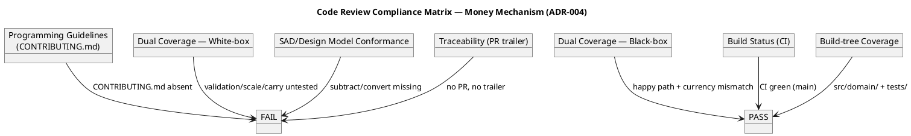
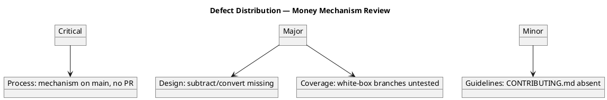

## Document Control

| Field | Value |
|---|---|
| Phase | Elaboration |
| Status | Draft — iteration 1 (Code Review: evolutionary architectural mechanism) |
| Milestone Target | End-of-Elaboration review (Lifecycle Architecture Milestone) |
| Review Type | Code Review — evolutionary architectural mechanism (Money, ADR-004) |
| Reviewers | Code Reviewer (technical) |
| Date | 2026-09-14 |

## Review Scope and Criteria

This iteration's code review targets the **evolutionary architectural mechanism** for Elaboration iteration 1: the **Money value object** (ADR-004), the stakeholder-declared mandatory mechanism that constrains every other mechanism derived from it. Per `BRANCHING_STRATEGY.md`, an Elaboration mechanism is built evolutionarily in `src/` on `feature/E{n}-{risk-id}[-{mechanism}]` based on `iteration/E{n}`, handed off via the `ready-for-review` label, opened as a PR (base `iteration/E1`), reviewed as production, and merged by the Integrator into `iteration/E1`.

**Code-review checklist applied (per §1.1):**

| Checklist Item | Result | Evidence |
|---|---|---|
| Programming guidelines conformance (CONTRIBUTING.md) | FAIL | `CONTRIBUTING.md` absent from repo tree |
| Dual coverage — black-box (given inputs → expected outputs) | PASS | `money.test.ts`: exact add (0.10+0.20=0.30), cross-currency rejection |
| Dual coverage — white-box (branches, loops, error handlers) | FAIL | `addExact` scale/carry branches, `Money.of` validation-reject branch untested |
| SAD / Design Model conformance | FAIL | CLS-008 `Money.subtract()` and `Money.convert()` missing from implementation |
| Traceability trailer (risk-id / UC-NNN) | FAIL | No PR, no trailer; mechanism traces to ADR-004/CON-004/FR-022 but is unrecorded |
| Build status (CI) | PASS | `main` CI green (run 34856326288) |
| Build-tree coverage (files under src/ or tests/) | PASS | `src/domain/money.ts`, `tests/money.test.ts` inside build tree |

## Findings

### Consolidated finding tally (Elaboration iteration 1, code review): 1 Critical, 2 Major, 1 Minor.

### Open Findings (Elaboration iteration 1)

| # | Artifact | Key | Lens | Severity | Finding | Remediation | Owner |
|---|---|---|---|---|---|---|---|
| 1 | Money mechanism (src/domain/money.ts) | F1 | Code Reviewer | Critical | The Money mechanism (ADR-004) was committed **directly to `main`**, bypassing the Elaboration mechanism review flow. `BRANCHING_STRATEGY.md` mandates: "Only the Integrator writes `main`" and "Elaboration mechanisms go on `feature/E{n}-{risk-id}[-{mechanism}]` based on `iteration/E{n}`". No `ready-for-review` label, no feature branch, no PR, no review gate — the mechanism entered the baseline unreviewed. | Re-route the mechanism through the proper flow: open `feature/E1-R003-money` (or equivalent) from `iteration/E1`, push the mechanism, apply the `ready-for-review` label, and open a PR with base `iteration/E1`. The Code Reviewer then reviews the PR and the Integrator merges APPROVED into `iteration/E1`. | Implementer |
| 2 | Money mechanism (src/domain/money.ts) | F2 | Code Reviewer | Major | Design Model conformance divergence: CLS-008 `Money` specifies `subtract(other: Money): Money` and `convert(rate: ExchangeRate): Money` (with `ExchangeRate` recording rate + moment, ADR-004). The implementation exposes only `add`. The `subtract` and `convert` operations — and the `ExchangeRate` type — are missing. | Implement `Money.subtract()` and `Money.convert(rate: ExchangeRate)` per CLS-008, and add the `ExchangeRate` value object (`from`, `to`, `rate`, `appliedAt`). Conversion must record the rate and the moment it was applied (ADR-004). | Implementer |
| 3 | Money mechanism (tests/money.test.ts) | F3 | Code Reviewer | Major | Dual-coverage gap (white-box): only 2 black-box tests present. The `addExact` method has untested branches — integer-only path (`scale === 0`), carry propagation (`0.90 + 0.20 = 1.10`), mixed-scale (`1.5 + 2 = 3.5`), and the `padStart`/`slice` boundary. `Money.of`'s validation regex has an untested reject branch (invalid amount throws). | Add white-box tests: carry propagation, integer-only addition, mixed-scale addition, invalid-amount rejection, and (once F2 is fixed) `subtract` and `convert` including the recorded `ExchangeRate`. | Implementer |
| 4 | Repository (CONTRIBUTING.md) | F4 | Code Reviewer | Minor | `CONTRIBUTING.md` is absent, so programming-guidelines conformance cannot be verified. The SAD Implementation View commits the Software Architect to produce it during Elaboration. | Software Architect produces `CONTRIBUTING.md` (coding/design/test/UI guidelines) and lint configuration, per the SAD Implementation View commitment. | Software Architect |

### Resolved findings (this iteration)

None — this is the first code review of the Elaboration mechanism.

### Prior-phase findings carried forward

The Inception LCO review closed with **0 Critical, 0 Major, 1 Minor** (Development Case#F3 — stale Document Control metadata), deferred to Elaboration by stakeholder directive. That finding is now resolved (Development Case Document Control reads "Draft — iteration 1"). No Inception findings remain open.

## Resolutions and Actions

### Action items

| Priority | Action | Owner | Deadline |
|---|---|---|---|
| 1 | Re-route Money mechanism through feature branch → PR (base `iteration/E1`) → review → merge (F1) | Implementer | This iteration |
| 2 | Implement `Money.subtract()` + `Money.convert()` + `ExchangeRate` per CLS-008 (F2) | Implementer | This iteration |
| 3 | Add white-box tests for `addExact` branches and `Money.of` validation (F3) | Implementer | This iteration |
| 4 | Produce `CONTRIBUTING.md` + lint config (F4) | Software Architect | This iteration |

## Disposition

**Code Review Verdict: REQUEST_CHANGES — the Money mechanism does NOT pass review.**

No PR exists to carry a terminal SCM disposition (the mechanism was committed directly to `main`), so the verdict is recorded here. The mechanism is **blocked from baseline** until:

1. It is re-routed through the feature-branch → PR → review → merge flow (F1, Critical).
2. `subtract` and `convert` are implemented per CLS-008 (F2, Major).
3. White-box coverage is added (F3, Major).

The `main` CI is green and the code is inside the build tree, but a green build does not substitute for the review gate — the mechanism entered the baseline unreviewed, which is the Critical finding.

## Traceability

| Element | Traces From | Link Type | Traces To |
|---|---|---|---|
| Money mechanism (src/domain/money.ts) | ADR-004, CON-004, FR-022 | Implements | CLS-008 (Design Model) |
| Money mechanism#F1 | BRANCHING_STRATEGY.md (Elaboration mechanism flow) | DependsOn | feature/E1-{risk-id}-{mechanism} |
| Money mechanism#F2 | CLS-008 (subtract/convert) | DependsOn | Design Model |
| Money mechanism#F3 | Dual-coverage checklist (§1.1) | DependsOn | tests/money.test.ts |
| Money mechanism#F4 | SAD Implementation View (CONTRIBUTING.md commitment) | DependsOn | Software Architect |
| CI run 34856326288 | main build (green) | DependsOn | Money mechanism |
