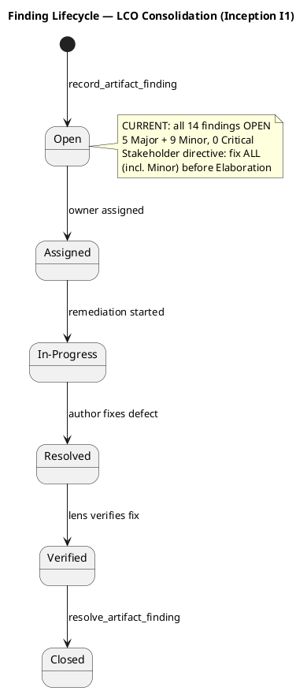
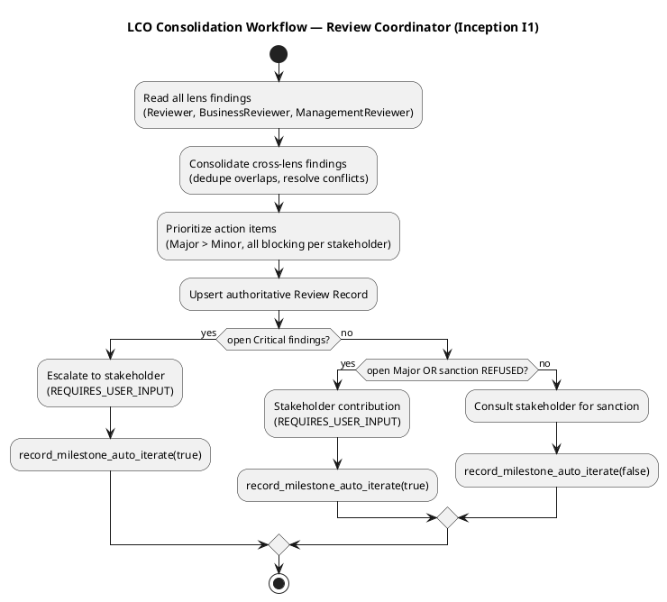
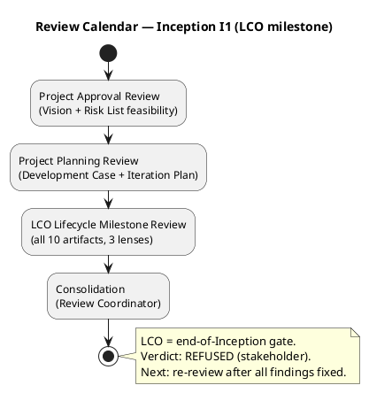

## Document Control

| Field | Value |
|---|---|
| Phase | Inception |
| Status | Draft — iteration 1 (consolidated) |
| Milestone Target | End-of-Inception review (LCO) |
| Review Type | Lifecycle Objectives (LCO) milestone review — consolidated |
| Reviewer | Review Coordinator (consolidation of three lenses) |
| Date | 2026-09-14 |
| Artifacts Reviewed | Vision, Use-Case Model, Supplementary Specification, Software Architecture Document, Development Case, Risk List, Iteration Plan, Test Plan, Deployment Model, Glossary (10 total) |

**Lens participation (authoritative):**

| Lens | Status |
|---|---|
| Technical / Reviewer | EXECUTED — 7 Minor findings |
| Business / BusinessReviewer | EXECUTED — 5 Major + 1 Minor findings |
| Management / ManagementReviewer | EXECUTED — 2 Minor findings (1 overlaps technical lens) |

## Review Scope and Criteria

This is the **Lifecycle Objectives (LCO)** milestone review, consolidated across three lenses. The evaluative question is **EXIT CRITERIA**: do the Inception artifacts collectively satisfy the conditions for phase transition to Elaboration, and is the project viable and acceptable to stakeholders?

**LCO exit criteria (consolidated):**

| Criterion | Question | Status |
|---|---|---|
| Scope agreement | Do stakeholders agree on what is in/out of scope? | MET (21 UCs trace to 26 FRs) |
| Risk identification | Have key risks been identified with magnitude ratings? | MET (R001–R006 classified) |
| Feasibility | Is the proposed approach and initial plan feasible? | MET (ADR-001 modular monolith, Node.js/TS + PostgreSQL) |
| Project Approval | Is there sanction to proceed to Elaboration? | **REFUSED** (stakeholder directive: fix ALL findings) |

## Findings

**Consolidated finding tally: 5 Major, 9 Minor, 0 Critical — all OPEN.**

Cross-lens consolidation notes:
- **Iteration Plan#F1** (Gantt time-boxing) is recorded by BOTH the technical lens (Reviewer) and the management lens (ManagementReviewer). It is ONE defect with two lenses concurring — consolidated to a single action item, with the management lens as the authoritative owner (cost-boxing is a project-management discipline concern).
- No conflicting verdicts between lenses: all three lenses concur that the artifacts are substantively sound but carry blocking defects per the stakeholder's directive.

### Major Findings (5 — all business lens, all on Use-Case Model)

| # | Artifact | Key | Lens | Severity | Finding | Remediation | Owner |
|---|---|---|---|---|---|---|---|
| 1 | Use-Case Model | F1 | BusinessReviewer | Major | Business modeling scenario unstated — the engagement is clearly "Revamp" but the BPA never identifies the scenario, so artifact expectations are unanchored. | Add explicit scenario-selection statement at top of Business Use Cases section. | Business Process Analyst |
| 2 | Use-Case Model | F2 | BusinessReviewer | Major | BUC-012 "Detect Fraud & Enforce Membership" has no initiating business actor — violates the BUC completeness test. | Identify initiating actor (Time-triggered, or fold into BUC-008, or name regulator/worker-reporting trigger). | Business Process Analyst |
| 3 | Use-Case Model | F4 | BusinessReviewer | Major | No business entities modeled — the entity half of the derivation bridge is missing. | Add Business Object Model (class diagram) with core entities and analysis-class disposition annotations. | Business Process Analyst |
| 4 | Use-Case Model | F5 | BusinessReviewer | Major | Business rules not formalized — CON-003..CON-019 appear only as scattered prose references, not as BR-NNN rules with testable conditions. | Produce Business Rules section formalizing each rule with ID, source, constrained worker/entity, testable condition. | Business Process Analyst |
| 5 | Use-Case Model | F6 | BusinessReviewer | Major | No business object model diagram — the structural complement to the behavioral use-case diagram is absent. | Add business object model class diagram (workers + entities + associations). | Business Process Analyst |

### Minor Findings (9)

| # | Artifact | Key | Lens | Severity | Finding | Remediation | Owner |
|---|---|---|---|---|---|---|---|
| 6 | Vision | F1 | Reviewer | Minor | Constraints section lists 17 of 22 declared constraints; CON-020/021/022 relegated to Assumptions table. | List CON-020/021/022 in Constraints section or add cross-reference note. | System Analyst |
| 7 | Vision | F2 | Reviewer | Minor | Use-case diagram omits Time actor and uses slightly different UC names vs UCM. | Align Vision diagram with UCM (add Time actor, identical UC names). | System Analyst |
| 8 | Use-Case Model | F1 | Reviewer | Minor | UC-019 and UC-021 have placeholder primary actors "(business)" and "(system)". | Identify proper primary actor for UC-019 (STK-003) and UC-021 (or model as alt-flow of UC-004). | System Analyst |
| 9 | Use-Case Model | F3 | BusinessReviewer | Minor | BUC-007 "Process Payments" lists External Integration Partners as actor, but payment is a scheduled internal process (CON-004). | Reclassify BUC-007 initiating actor as Time; AP integration is downstream consumer. | Business Process Analyst |
| 10 | Software Architecture Document | F1 | Reviewer | Minor | UC-016 "Record Rate Adjustments" not mapped to any subsystem in SAD traceability. | Add UC-016 to COMP-002 or COMP-001 trace row, or note as sub-flow. | Software Architect |
| 11 | Development Case | F1 | Reviewer | Minor | DC references "24-role roster" but baseline lists 25 roles. | Reconcile roster count to 25. | Process Engineer |
| 12 | Risk List | F1 | ManagementReviewer | Minor | Risk Register lacks Status and Trend columns — risk retirement cannot be verified. | Add Status (open/mitigating/retired) and Trend (improving/stable/worsening) columns. | Project Manager |
| 13 | Iteration Plan | F1 | Reviewer + ManagementReviewer | Minor | Gantt time-boxes iterations ("1 days") contradicting cost-boxing mandate. | Replace durations with cost-box annotations or mark Gantt as sequence-only. | Project Manager |
| 14 | Test Plan | F1 | Reviewer | Minor | "Testing is 30–50% of project cost" is an unsourced quantitative claim. | Mark as [ASSUMPTION — requires validation] with basis, or cite source. | Test Manager |

## Resolutions and Actions
No prior-iteration findings exist (iteration 1, cycle 1). All 14 findings above are newly recorded this iteration and are **OPEN**.

**Stakeholder sanction: REFUSED.** The stakeholder declined to sanction advancement past LCO and directed: *"You do need to fix all findings even if they are minors before move to the next phase."*

**Stakeholder note (consolidation pass):** On re-consultation for the next iteration, the stakeholder added: *"nothing else to add for this new iteration."* No new requirements, corrections, or priorities beyond the standing directive to fix all findings before advancing to Elaboration.

**Prioritized action items (all blocking per stakeholder directive):**

| Priority | Action | Owner | Deadline |
|---|---|---|---|
| 1 | Fix 5 Major business-lens findings (BM scenario, BUC-012 actor, business entities, business rules, BOM diagram) | Business Process Analyst | Before re-review |
| 2 | Fix 9 Minor findings across Vision, UCM, SAD, DC, Risk List, Iteration Plan, Test Plan | Respective owners (see table) | Before re-review |
| 3 | Re-review by all three lenses confirming resolution | Reviewer, BusinessReviewer, ManagementReviewer | After fixes |
| 4 | Stakeholder re-consulted for sanction | Review Coordinator | After re-review |
## Disposition

**No-Go (Conditional).** The LCO milestone is NOT sanctioned for advancement to Elaboration.

The Inception artifacts are substantively sound — scope is agreed and respected as the ceiling, risks are identified with magnitude ratings, and the approach (modular monolith, Node.js/TS + PostgreSQL, cost-boxed) is feasible. However, the stakeholder has explicitly refused sanction and directed that **all findings — including the Minor ones — be resolved before the phase advances**. This elevates every open finding to blocking status.

**Conditions to close before LCO can be sanctioned:**
1. All 5 Major (business lens) findings resolved.
2. All 9 Minor findings resolved.
3. Re-review by all three lenses confirming resolution.
4. Stakeholder re-consulted for sanction.

## Traceability

| Element | Traces From | Link Type | Traces To |
|---|---|---|---|
| Review Record (I1 consolidated) | Vision, Use-Case Model, Supplementary Specification, SAD, Development Case, Risk List, Iteration Plan, Test Plan, Deployment Model, Glossary | DependsOn | LCO milestone |
| Use-Case Model#F1..F6 (BR) | FR-018, CON-003..CON-019 | DependsOn | Use-Case Model |
| Vision#F1, Vision#F2 | CON-020..CON-022, Use-Case Model | DependsOn | Vision |
| SAD#F1 | FR-023, COMP-001, COMP-002 | DependsOn | Software Architecture Document |
| Development Case#F1 | IARI baseline roster | DependsOn | Development Case |
| Risk List#F1 | R001..R006 | DependsOn | Risk List |
| Iteration Plan#F1 | IARI cost-boxing mandate (§8.1) | DependsOn | Iteration Plan |
| Test Plan#F1 | anti-fabrication rule | DependsOn | Test Plan |
| Stakeholder sanction (REFUSED) | LCO milestone | DependsOn | Elaboration (blocked) |
