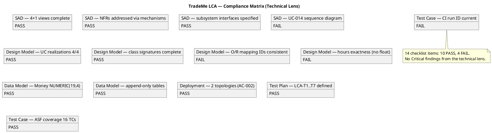
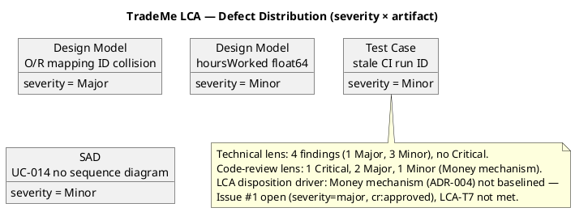

## Document Control

| Field | Value |
|---|---|
| Phase | Elaboration |
| Status | Draft — iteration 1 (LCA technical review + code review) |
| Milestone Target | End-of-Elaboration review (Lifecycle Architecture Milestone) |
| Review Type | Lifecycle Architecture Milestone (LCA) — technical lens + code review |
| Reviewers | Reviewer (technical), Code Reviewer (evolutionary mechanism) |
| Date | 2026-09-14 |

## Review Scope and Criteria

This Review Record consolidates two lenses exercised at the end-of-Elaboration (LCA) review point:

1. **Code Review** (Code Reviewer) — the evolutionary architectural mechanism (Money value object, ADR-004), the stakeholder-declared mandatory mechanism.
2. **Technical review** (Reviewer) — the full technical artifact surface: Software Architecture Document, Design Model, Data Model, Deployment Model, Test Plan, Test Case, Test Evaluation Summary, Use-Case Model, Supplementary Specification, Vision, Development Case, User-Interface Prototype, Glossary, Risk List, Iteration Plan.

**LCA review lens applied:** EXIT CRITERIA — "Do the artifacts collectively satisfy the conditions for phase transition?" The architecture must be baselined and stable enough to freeze for Construction.

### Code-review checklist (per §1.1, Money mechanism)

| Checklist Item | Result | Evidence |
|---|---|---|
| Programming guidelines conformance (CONTRIBUTING.md) | FAIL | `CONTRIBUTING.md` absent from repo tree |
| Dual coverage — black-box | PASS | `money.test.ts`: exact add, cross-currency rejection |
| Dual coverage — white-box | FAIL | `addExact` scale/carry branches, `Money.of` validation-reject untested |
| SAD / Design Model conformance | FAIL | CLS-008 `subtract()`/`convert()` missing |
| Traceability trailer (risk-id / UC-NNN) | FAIL | No PR, no trailer |
| Build status (CI) | PASS | `main` CI green |
| Build-tree coverage | PASS | `src/domain/money.ts`, `tests/money.test.ts` in build tree |

### Technical-review checklist (per artifact type)

## Findings

### Consolidated finding tally (Elaboration iteration 1)

**Code review (Money mechanism):** 1 Critical, 2 Major, 1 Minor.
**Technical review (artifact surface):** 0 Critical, 1 Major, 3 Minor.

### Open Findings — Code Review (Money mechanism)

| # | Artifact | Key | Lens | Severity | Finding | Remediation | Owner |
|---|---|---|---|---|---|---|---|
| 1 | Money mechanism (src/domain/money.ts) | F1 | Code Reviewer | Critical | The Money mechanism (ADR-004) was committed **directly to `main`**, bypassing the Elaboration mechanism review flow. No `ready-for-review` label, no feature branch, no PR, no review gate. | Re-route through feature branch → PR (base `iteration/E1`) → review → merge. | Implementer |
| 2 | Money mechanism (src/domain/money.ts) | F2 | Code Reviewer | Major | CLS-008 `Money.subtract()` and `Money.convert()` (with `ExchangeRate`) missing. | Implement `subtract`/`convert` + `ExchangeRate` per CLS-008. | Implementer |
| 3 | Money mechanism (tests/money.test.ts) | F3 | Code Reviewer | Major | White-box branches untested (`addExact` scale/carry, `Money.of` validation-reject). | Add white-box tests. | Implementer |
| 4 | Repository (CONTRIBUTING.md) | F4 | Code Reviewer | Minor | `CONTRIBUTING.md` absent; guideline conformance unverifiable. | Software Architect produces `CONTRIBUTING.md` + lint config. | Software Architect |

### Open Findings — Technical Review (artifact surface)

| # | Artifact | Key | Lens | Severity | Finding | Remediation | Owner |
|---|---|---|---|---|---|---|---|
| 5 | Design Model | F1 | Reviewer | Major | The 'Persistent Data Classes' O/R Mapping table's 'Design Class' column mislabels entity classes with service-class IDs that collide with the traceability table: Worker/Contractor/Membership all labeled 'CLS-009' (PartyService), Project 'CLS-010' (ProjectService), Trade/Certification 'CLS-011' (TaxonomyService). The entities have their own analysis-class IDs (ACL-013..ACL-023) the Data Model correctly uses. | Relabel the O/R Mapping 'Design Class' column to each entity's analysis-class ID (ACL-013..ACL-023), aligning with the Data Model's traceability. | Designer |
| 6 | Design Model | F2 | Reviewer | Minor | `HoursEntry.hoursWorked: number` (float64) feeds wage computation (computeWages → Money), but the Data Model maps `hours_worked` to NUMERIC(6,2). A float64 hours value can introduce floating-point error into the monetary path, contradicting ADR-004. | Change `hoursWorked` to an exact type (string decimal or scaled integer) consistent with NUMERIC(6,2). | Designer |
| 7 | Software Architecture Document | F2 | Reviewer | Minor | UC-014 is listed architecturally significant (priority 4) but has no sequence diagram in the SAD's Logical View (only UC-004/012/013 are realized there; UC-014 appears only in Design Model SEQ-004). | Add a UC-014 sequence diagram to the SAD Logical View, or note its realization is deferred to SEQ-004. | Software Architect |
| 8 | Test Case | F1 | Reviewer | Minor | The Test Case cites CI build 'run 34856326288' as smoke-test evidence, but the current main build is 'run 34886064517' (success). Stale run ID. | Update the cited CI run ID to 34886064517. | Test Designer |

### Resolved findings (this iteration)

- **Development Case#F3** (stale Document Control metadata) — resolved: Document Control now reads "Draft — iteration 1" with Phase = Elaboration.

### Prior-phase findings carried forward

The Inception LCO review closed with 0 Critical, 0 Major, 1 Minor (Development Case#F3), deferred to Elaboration by stakeholder directive. That finding is now resolved. No Inception findings remain open.

## Resolutions and Actions

### Action items

| Priority | Action | Owner | Deadline |
|---|---|---|---|
| 1 | Re-route Money mechanism through feature branch → PR (base `iteration/E1`) → review → merge (Code Review F1, Critical) | Implementer | This iteration |
| 2 | Implement `Money.subtract()` + `Money.convert()` + `ExchangeRate` per CLS-008 (Code Review F2) | Implementer | This iteration |
| 3 | Add white-box tests for `addExact` branches and `Money.of` validation (Code Review F3) | Implementer | This iteration |
| 4 | Produce `CONTRIBUTING.md` + lint config (Code Review F4) | Software Architect | This iteration |
| 5 | Relabel Design Model O/R Mapping 'Design Class' column to analysis-class IDs (Design Model F1, Major) | Designer | This iteration |
| 6 | Change `HoursEntry.hoursWorked` to an exact type (Design Model F2) | Designer | This iteration |
| 7 | Add UC-014 sequence diagram or deferral note to SAD Logical View (SAD F2) | Software Architect | This iteration |
| 8 | Update Test Case CI run ID to 34886064517 (Test Case F1) | Test Designer | This iteration |

## Disposition

### Technical-lens verdict (Reviewer)

The architecture is **well-formed and internally consistent**. The SAD presents a complete 4+1 model with every subsystem interface specified, every design mechanism derived from its analysis mechanism, and five ADRs that are coherent and traceable. The Design Model realizes all four architecturally significant use cases (UC-004, UC-012, UC-013, UC-014) with full class signatures and interface contracts. The Data Model correctly enforces ADR-004 (Money as NUMERIC(19,4) + CHAR(3), append-only tables, retention, residency). The Deployment Model satisfies AC-002 (two topologies). The Test Plan defines measurable LCA acceptance criteria (LCA-T1..T7).

**Technical-lens findings: 0 Critical, 1 Major, 3 Minor.** The single Major (Design Model O/R mapping ID collision) is a traceability defect, not an architectural defect — it does not undermine the architecture's soundness but must be corrected before Construction to avoid ambiguity in the O/R bridge.

### Overall LCA disposition: SANCTION WITHHELD

The architecture is sound, but the **Money mechanism (ADR-004) — the stakeholder-declared mandatory mechanism that constrains every other mechanism derived from it — is NOT baselined.** The Code Reviewer's Critical finding (F1: committed directly to `main`, no review gate) remains open, and Issue #1 (severity=major, cr:approved) is open in the SCM tracker. This means:

- **LCA-T7** (0 open Critical/Major findings on Money) is **not met**.
- **LCA-T3** (Money dual coverage, no bare float) is **blocked** — the mechanism is not baselined, so the monetary-integrity test suite cannot be designed against it.

The LCA milestone is **NOT YET ACHIEVED**. Sanction to proceed to Construction is withheld until the Money mechanism is re-routed through the feature-branch → PR → review → merge flow and re-baselined, and the technical-lens Major finding (Design Model F1) is corrected.

**No open pull requests exist** to carry a terminal SCM disposition — the Money mechanism was committed directly to `main` (Code Review F1), so there is no PR to approve or request changes on. The disposition is recorded here; the remediation is the Implementer's re-routing action.

## Traceability

| Element | Traces From | Link Type | Traces To |
|---|---|---|---|
| Money mechanism (src/domain/money.ts) | ADR-004, CON-004, FR-022 | Implements | CLS-008 (Design Model) |
| Money mechanism#F1 | BRANCHING_STRATEGY.md (Elaboration mechanism flow) | DependsOn | feature/E1-{risk-id}-{mechanism} |
| Money mechanism#F2 | CLS-008 (subtract/convert) | DependsOn | Design Model |
| Money mechanism#F3 | Dual-coverage checklist (§1.1) | DependsOn | tests/money.test.ts |
| Money mechanism#F4 | SAD Implementation View (CONTRIBUTING.md commitment) | DependsOn | Software Architect |
| Design Model#F1 | Data Model traceability (TBL-001..TBL-018) | DependsOn | Design Model O/R Mapping |
| Design Model#F2 | ADR-004 (no bare float on monetary path) | DependsOn | Data Model (NUMERIC(6,2)) |
| Software Architecture Document#F2 | UC-014 (architecturally significant) | DependsOn | Design Model SEQ-004 |
| Test Case#F1 | CI build (main) | DependsOn | run 34886064517 |
| Issue #1 | Money mechanism incomplete (subtract/convert/ExchangeRate) | DependsOn | TC-009, TC-007 |
| LCA-T7 | 0 open Critical/Major findings on Money | DependsOn | Money mechanism re-baseline |
