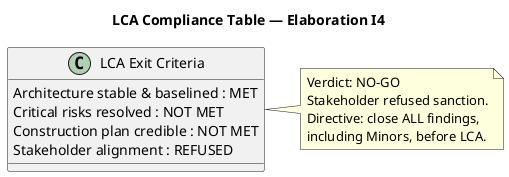
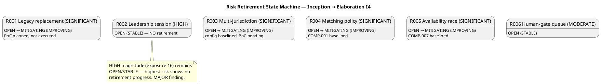
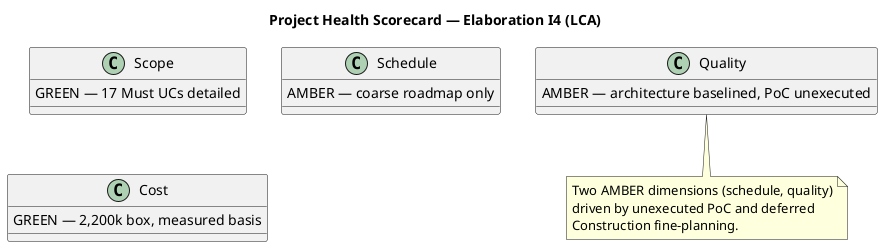

## Document Control

| Field | Value |
|---|---|
| Phase | Elaboration |
| Status | Draft — iteration 1 |
| Milestone Target | End-of-Elaboration review (Lifecycle Architecture Milestone) |
| Review Type | Lifecycle Milestone Review (LCA) + Project Planning Review |
| Reviewer | Management Reviewer (Project Review Authority) |
| Date | 2026-09-14 |

## Review Scope and Criteria

This review exercises the LCA gate — the highest-stakes milestone in RUP. Two-part review:

1. **Project Planning Review** — is the Iteration Plan (coarse roadmap + fine plan) feasible and acceptable?
2. **LCA Milestone** — is the architecture stable and are critical risks resolved?

**LCA exit criteria assessed:**

| Criterion | Status | Evidence |
|---|---|---|
| Architecture stable & baselined | MET | SAD baselined: ADR-001..005, complete 4+1 views, subsystem interfaces (COMP-001..009), design mechanisms derived from analysis mechanisms |
| Critical risks resolved | NOT MET | R002 (HIGH, exp 16) OPEN/STABLE; PoC (R001/R003) planned but unexecuted — CON-001/CON-002 unverified |
| Construction plan credible | NOT MET | Coarse roadmap only; fine-grained Construction planning deferred to "when Elaboration closes" |
| Stakeholder alignment | REFUSED | Stakeholder answered "No" to sanction; directive to close all findings including Minors |

## Findings

Two Major findings recorded this iteration (0 Critical, 2 Major). Both are blocking for LCA advancement per the stakeholder's directive.

| # | Artifact | Severity | Finding | Remediation |
|---|---|---|---|---|
| 1 | Iteration Plan | Major | Architectural PoC (R001/R003) planned but not executed; CON-001 (cloud) and CON-002 (external integration) remain unverified, so R001/R003 cannot be retired at LCA | Execute the PoC against the baselined modular-monolith skeleton and record results before LCA can close |
| 2 | Risk List | Major | R002 (HIGH, exposure 16) remains OPEN/STABLE with no retirement progress; highest-magnitude risk shows no decreasing trend line | Escalate R002 to the stakeholder for explicit disposition (accept with named contingency, or concrete mitigation) |

## Resolutions and Actions

**Prior findings reconciliation:** All prior Management Reviewer findings (Iteration Plan#F1, #F2; Risk List#F1) were already `Resolved` in Inception — no closure work this iteration. Zero prior MR findings remained open.

**Stakeholder disposition (this iteration):** Sanction **REFUSED** ("No"). Directive recorded verbatim: *"you do need to close all findings even if they are minors."* This re-affirms the standing quality bar: all findings — including Minor — are blocking for LCA advancement.

**Open actions for Elaboration I5:**
1. Execute the Architectural PoC (R001/R003) and record empirical results for CON-001/CON-002.
2. Escalate R002 to the stakeholder for explicit disposition.
3. Produce a credible Construction plan (fine-grained) grounded in measured Elaboration actuals.

## Disposition

**Verdict: NO-GO** — LCA not achieved. The architecture is baselined and stable (the core LCA technical criterion is met), but the milestone cannot close because (a) critical risks are not resolved (R002 OPEN/STABLE; PoC unexecuted), (b) the Construction plan is not yet credible, and (c) the stakeholder refused sanction and directed that all findings — including Minors — be closed first.

## Traceability

| Element | Traces From | Link Type | Traces To |
|---|---|---|---|
| Iteration Plan#F3 (PoC unexecuted) | R001, R003, CON-001, CON-002 | DependsOn | Architectural Proof-of-Concept |
| Risk List#F2 (R002 OPEN/STABLE) | R002 | DependsOn | Stakeholder disposition |
| LCA verdict (No-Go) | Iteration Plan#F3, Risk List#F2 | DependsOn | Elaboration I5 |
