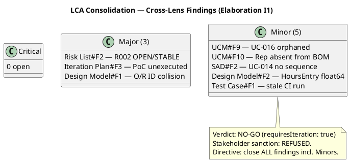
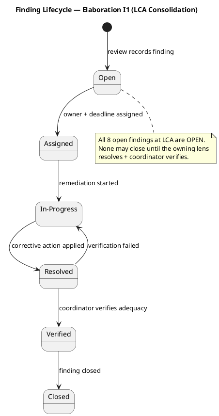
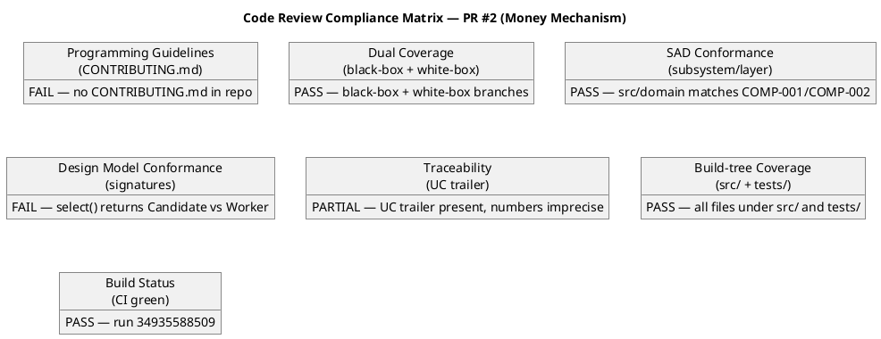
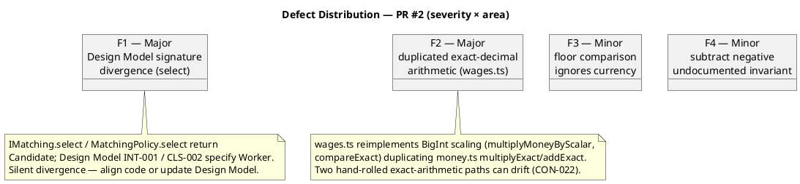
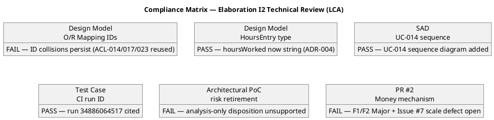
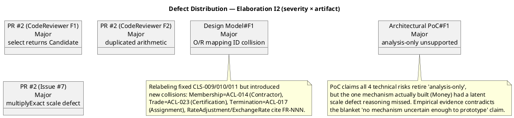
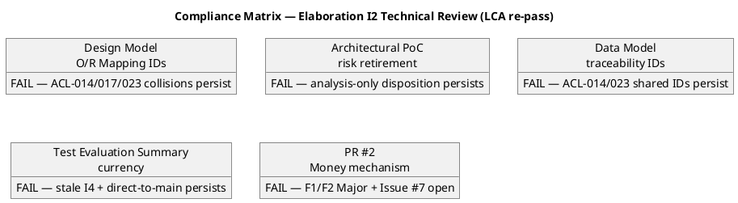
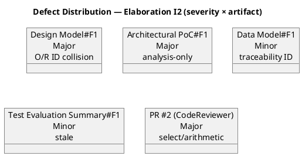
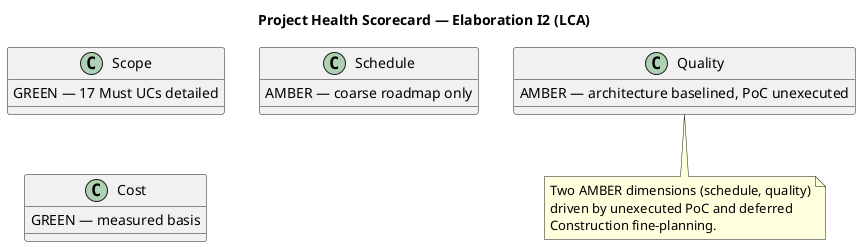
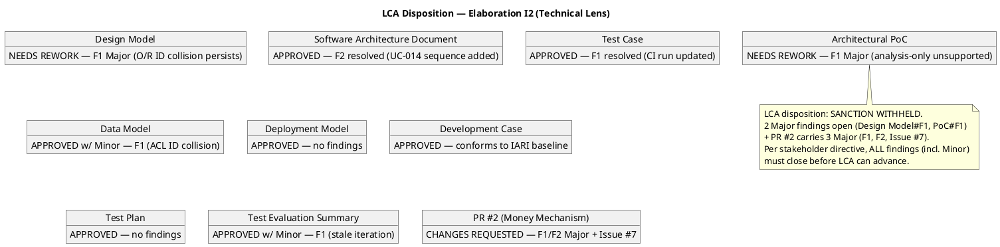

## Document Control
| Field | Value |
|---|---|
| Phase | Elaboration |
| Status | Draft — iteration 2 (LCA technical review) |
| Milestone Target | End-of-Elaboration review (Lifecycle Architecture Milestone) |
| Review Type | Lifecycle Milestone Review (LCA) — cross-lens consolidation + technical lens |
| Coordinator | Review Coordinator |
| Date | 2026-09-15 |

**Lens participation (authoritative):**

| Lens | Status |
|---|---|
| Technical / Reviewer | EXECUTED (iteration 2) |
| Business / BusinessReviewer | EXECUTED (iteration 1) |
| Management / ManagementReviewer | EXECUTED (iteration 1) |

## Review Scope and Criteria

This is the LCA milestone consolidation. The Review Coordinator consolidates findings from all three
executing lenses into a single authoritative disposition. The milestone decision is based only on the
lenses that executed (all three executed this review).

**LCA exit criteria assessed:**

| Criterion | Status | Evidence |
|---|---|---|
| Architecture stable & baselined | MET | SAD baselined (ADR-001..005, 4+1 views, COMP-001..009); Design Model and Data Model produced |
| Critical risks resolved | NOT MET | R002 (HIGH, exp 16) OPEN/STABLE; PoC (R001/R003) planned but unexecuted — CON-001/CON-002 unverified |
| Construction plan credible | NOT MET | Coarse roadmap only; fine-grained Construction planning deferred |
| Stakeholder alignment | REFUSED | Stakeholder answered "No" to sanction; directive to close ALL findings including Minors |

## Findings
### Consolidated open findings (prior lenses — Elaboration I1 LCA consolidation)

8 open: 0 Critical, 3 Major, 5 Minor. All blocking for LCA advancement per the stakeholder's directive to close all findings including Minors.

| # | Artifact | Lens | Severity | Finding | Owner | Remediation |
|---|---|---|---|---|---|---|
| 1 | Risk List | Management Reviewer | Major | R002 (HIGH, exposure 16) remains OPEN/STABLE with no retirement progress; highest-magnitude risk shows no decreasing trend line | Project Manager | Escalate R002 to stakeholder for explicit disposition (accept with named contingency, or concrete mitigation) |
| 2 | Iteration Plan | Management Reviewer | Major | Architectural PoC (R001/R003) planned but not executed; CON-001 (cloud) and CON-002 (external integration) unverified | Software Architect | Execute PoC against baselined modular-monolith skeleton and record results before LCA closes |
| 3 | Design Model | Reviewer | Major | O/R Mapping table mislabels entity classes with service-class IDs (CLS-009/010/011) colliding with traceability; Worker/Contractor/Membership all labeled CLS-009 | Designer | Relabel O/R Mapping 'Design Class' column to entity analysis-class IDs (ACL-013..ACL-023), aligning with Data Model |
| 4 | Use-Case Model | Business Reviewer | Minor | UC-016 (Record Rate Adjustments, FR-023) orphaned in derivation bridge — appears in no BUC's 'Derives System UC(s)' column | System Analyst | Add UC-016 to BUC-004's derivation column or model as explicit sub-flow |
| 5 | Use-Case Model | Business Reviewer | Minor | Internal Representative (STK-003) absent from Business Object Model class diagram | System Analyst | Add Rep as `<<business worker>>` class or note it is being automated away (BG-002) |
| 6 | Software Architecture Document | Reviewer | Minor | UC-014 (Terminate Worker Assignment) has no sequence diagram in SAD Logical View (only in Design Model SEQ-004) | Software Architect | Add UC-014 sequence diagram or explicit deferral note |
| 7 | Design Model | Reviewer | Minor | HoursEntry.hoursWorked is float64, contradicting ADR-004 (no bare float in monetary path); Data Model uses NUMERIC(6,2) | Designer | Change to exact type (string decimal / scaled integer) |
| 8 | Test Case | Reviewer | Minor | Cites stale CI run 34856326288; current main build is 34886064517 | Test Designer | Update cited CI run ID to 34886064517 |

### Code Review — Elaboration Iteration 2 (evolutionary architectural mechanism)

**Artifact reviewed:** PR #2 `feature/E2-money-mechanism` → `iteration/E2` (Money Mechanism — R001/R003 PoC, CON-001/CON-002 verification)
**Review type:** Code review (terminal disposition)
**Reviewer:** Code Reviewer (Implementation discipline)
**Build status:** success (run 34935588509)
**Disposition:** REQUEST CHANGES (0 Critical, 2 Major, 2 Minor)

| # | Severity | Location | Finding | Remediation |
|---|---|---|---|---|
| F1 | Major | `src/domain/matching/service.ts`, `policy.ts` | `IMatching.select` / `MatchingPolicy.select` return `Candidate`; Design Model INT-001 / CLS-002 specify `Worker`. `name` field added, not in Design Model. Silent divergence (SAD guideline 1). | Change `select` to return `Worker` (drop/document `name`), or update Design Model in the same PR chain to specify `Candidate`. |
| F2 | Major | `src/domain/pricing/wages.ts` | Reimplements BigInt-scaled arithmetic (`multiplyMoneyByScalar`, `compareExact`) duplicating `money.ts` (`multiplyExact`, `addExact`, `subtractExact`). Two hand-rolled exact-arithmetic paths can drift (CON-022). | Add `Money.multiply(scalar)` and `Money.compare(other)` to the value object reusing existing helpers; have `wages.ts` consume them. |
| F3 | Minor | `src/domain/pricing/wages.ts` | `computeWage` floor comparison ignores currency — cross-currency floor yields meaningless comparison. | Assert same currency before comparing (or compare via `Money.compare` that enforces it). |
| F4 | Minor | `src/domain/money.ts` | `subtractExact` rejects negative results; non-negative invariant not documented in Design Model CLS-008 `Money.subtract`. | Document the non-negative invariant on `Money.subtract` and in Design Model CLS-008. |

**Note (not a finding against the code):** `CONTRIBUTING.md` is absent (owned by Software Architect, due during Elaboration) — programming-guideline conformance could not be verified against a style guide. PR body UC trailer cites UC-014 (Terminate), which this PR does not implement; should cite UC-004 (matching), UC-012 (payments/money), FR-007/FR-022 (wages/currency).

**Positive conformance evidence:** ADR-004 fully honored — `Money.amount`, `ExchangeRate.rate`, `hoursWorked`, `riskPremiumMultiplier` are exact decimal strings; no bare float on any monetary path. Dual coverage satisfied (black-box contract + white-box branch/error paths). SAD subsystem placement correct (matching → COMP-001, pricing → COMP-002). Build-tree coverage correct (all files under `src/` and `tests/`).

### Technical Review — Elaboration Iteration 2 (LCA milestone, technical lens)

**Reviewer:** Reviewer (Project Management discipline, technical lens)
**Review type:** Lifecycle Architecture Milestone review (exit-criteria lens)
**Artifacts reviewed:** Design Model, Software Architecture Document, Test Case, Architectural Proof-of-Concept, Data Model, Deployment Model, Development Case, Test Plan, Test Evaluation Summary, PR #2 (Money Mechanism).

**Prior-finding reconciliation (this lens):** 3 of 4 prior findings resolved (Design Model#F2 HoursEntry float64 → string; SAD#F2 UC-014 sequence added; Test Case#F1 CI run updated). Design Model#F1 (O/R mapping ID collision) **persists** — the relabeling fixed the CLS-009/010/011 collision but introduced new collisions.

**New findings (this lens, Elaboration I2):**

| # | Artifact | Severity | Finding | Remediation |
|---|---|---|---|---|
| F1 | Design Model | Major | O/R Mapping 'Design Class' column still carries ID collisions after relabeling: Membership=ACL-014 (collides with Contractor), Trade=ACL-023 (collides with Certification), Termination=ACL-017 (collides with Assignment), RateAdjustment/ExchangeRate cite FR-NNN in a class-ID column. Five entities (Membership, Trade, Termination, RateAdjustment, ExchangeRate) lack unique analysis-class IDs. | Assign unique ACL IDs (ACL-024..ACL-028) to the five missing entities, add them to the Domain Model entity package, reference them in the O/R mapping. |
| F1 | Architectural Proof-of-Concept | Major | PoC disposes all four technical risks (R001/R003/R004/R005) as 'analysis-only', asserting no empirical validation is warranted. Contradicted by the one mechanism actually built (Money, PR #2) which had a latent scale defect (Issue #7) reasoning missed. CON-001/CON-002 asserted 'by construction' with no executed artifact. | Either execute the PoC empirically (build/run the availability-race mechanism + a config-driven jurisdiction scenario against real PostgreSQL), or downgrade disposition to 'mitigating, verification deferred to Construction' and mark R001/R003/R004/R005 OPEN (not retired) in the Risk List. |
| F1 | Data Model | Minor | Traceability table shares the ACL ID collision: ACL-014 cited for both Contractor (TBL-002) and Membership (TBL-003); ACL-023 for both Trade (TBL-005) and Certification (TBL-006). | Once the Designer assigns unique ACL IDs, update the Data Model traceability to reference them (TBL-003→ACL-024, TBL-005→ACL-025, TBL-012→ACL-026, TBL-015→ACL-027, TBL-016→ACL-028). |
| F1 | Test Evaluation Summary | Minor | Stale — Document Control reads 'iteration 1 (I4)'; 'Blocking condition' describes the Money mechanism as 'committed directly to main (F1 Critical)', which is no longer true (PR #2 shows it correctly branched). Misrepresents current defect state. | Update to iteration 2 (I5): reflect PR #2 under review (REQUEST CHANGES, F1-F4 + Issue #7), note the I1 direct-to-main Critical is remediated, and the current blocker is the open Major findings. |

**Artifacts with no findings (Approved from this lens):** Software Architecture Document (F2 resolved), Test Case (F1 resolved), Deployment Model, Development Case (conforms to IARI baseline), Test Plan.

**PR disposition:** PR #2 — **CHANGES REQUESTED** (review 5212508092). Blocking: F1 (select returns Candidate), F2 (duplicated arithmetic), Issue #7 (multiplyExact scale defect), plus F3/F4 Minor. The PR is the in-scope evolutionary architectural mechanism; it stays open and converges next iteration.

### Re-review Confirmation — Elaboration Iteration 2 (technical lens, this pass)

This pass re-read the four artifacts carrying open findings from this lens and confirmed **none of the remediations have been applied** — the defects persist unchanged:

| Artifact | Finding | Status this pass |
|---|---|---|
| Design Model | F1 (Major) — O/R ID collision | PERSISTS — `Membership (ACL-014)`, `Trade (ACL-023)`, `Termination (ACL-017)`, `RateAdjustment (FR-023)`, `ExchangeRate (FR-022)` still present |
| Architectural Proof-of-Concept | F1 (Major) — analysis-only disposition | PERSISTS — all four risks still 'analysis-only', no executed artifact |
| Data Model | F1 (Minor) — ACL traceability collision | PERSISTS — `ACL-014 (membership)`, `ACL-023 (taxonomy)` still cited |
| Test Evaluation Summary | F1 (Minor) — stale iteration | PERSISTS — Document Control still 'iteration 1 (I4)' |

The four findings were re-recorded under their existing findingKeys (updating in place — no duplicate ledger entries). PR #2's diff was re-inspected and all CodeReviewer findings (F1, F2, Issue #7, F3, F4) remain present; the PR was re-disposed CHANGES REQUESTED (review 5214698605).

## Resolutions and Actions
**Prior findings reconciliation (this lens, Elaboration I2):** 3 of 4 prior technical findings resolved:
- **Design Model#F2 (Minor)** — HoursEntry.hoursWorked float64 → `string` (exact decimal), consistent with ADR-004 and Data Model NUMERIC(6,2). **RESOLVED.**
- **SAD#F2 (Minor)** — UC-014 Terminate Worker Assignment now has a sequence diagram in the Logical View. **RESOLVED.**
- **Test Case#F1 (Minor)** — stale CI run 34856326288 → current 34886064517. **RESOLVED.**
- **Design Model#F1 (Major)** — O/R mapping ID collision **PERSISTS** in a new form (see Findings). Re-recorded under the same findingKey.

All Inception findings across all lenses remain `Resolved` (Development Case#F1-F3, Vision#F1-F2, Use-Case Model#F1-F8, Risk List#F1, Iteration Plan#F1-F2, SAD#F1, Test Plan#F1, Deployment Model#F1).

**Stakeholder disposition (this iteration):** Sanction **REFUSED** ("No"). Directive recorded verbatim: *"you do need to close all findings even if they are minors."* This re-affirms the standing quality bar: all findings — including Minor — are blocking for LCA advancement.

**Stakeholder note (LCA consolidation, this iteration):** On the consolidation question (3 Major + 5 Minor open, prior sanction refused), the stakeholder answered: *"nothing else to add for this new iteration."* No additional requirement, correction, or priority was added; the team proceeds to close the 8 open findings as already scoped.

**Stakeholder decision (R002, this iteration):** The stakeholder **accepted R002** (leadership tension, HIGH, exposure 16) with the named contingency: if leadership tension blocks a milestone, surface the evidence trail and re-scope to the minimum viable increment leadership will accept. This retires the Risk List#F2 escalation (the disposition is now explicit).

**Open actions for Elaboration I3 (next iteration):**
1. **Design Model#F1 (Major, persists):** Assign unique ACL IDs (ACL-024..ACL-028) to Membership, Trade, Termination, RateAdjustment, ExchangeRate; add them to the Domain Model entity package; reference them in the O/R mapping. Update Data Model traceability to match (Data Model#F1 Minor).
2. **Architectural PoC#F1 (Major, new):** Either execute the PoC empirically (availability-race mechanism + config-driven jurisdiction scenario against real PostgreSQL) or downgrade the disposition to 'mitigating, verification deferred to Construction' and mark R001/R003/R004/R005 OPEN in the Risk List.
3. **PR #2 (Money Mechanism):** Resolve F1 (select returns Candidate), F2 (duplicated arithmetic), Issue #7 (multiplyExact scale defect), F3/F4 (Minor), then re-submit for review.
4. **Test Evaluation Summary#F1 (Minor, new):** Update to iteration 2 (I5) — reflect PR #2 under review, note the I1 direct-to-main Critical is remediated.
5. **Iteration Plan#F3 (Major, prior):** The PoC is now produced but its 'analysis-only' disposition is contested (PoC#F1); the Iteration Plan's claim that CON-001/CON-002 are verified must be reconciled with the PoC's actual (non-empirical) evidence.
6. **Risk List#F2 (Major, prior):** R002 disposition now explicit (stakeholder accepted with contingency) — update the Risk List to record the acceptance.
7. **UCM#F9/F10 (Minor, prior):** Anchor UC-016 in the derivation bridge; model the Internal Representative in the BOM.
8. Produce a credible fine-grained Construction plan grounded in measured Elaboration actuals.

## Disposition
**Verdict: NO-GO** — LCA not achieved. The architecture is baselined and stable (the core LCA technical criterion is met), but the milestone cannot close because (a) critical risks are not resolved (R002 OPEN/STABLE; PoC unexecuted), (b) the Construction plan is not yet credible, and (c) the stakeholder refused sanction and directed that all findings — including Minors — be closed first.

### Code Review Disposition — Elaboration Iteration 2

**PR #2** (`feature/E2-money-mechanism` → `iteration/E2`, Money Mechanism): **REQUEST CHANGES** — 0 Critical, 2 Major (F1 Design Model signature divergence; F2 duplicated exact-decimal arithmetic), 2 Minor (F3 currency-ignoring floor comparison; F4 undocumented non-negative subtract invariant), plus Issue #7 (Major, multiplyExact scale defect). Build green (run 34935588509). The money mechanism correctly implements ADR-004 (no bare float on any monetary path) and satisfies dual coverage; the Major findings must be resolved before the Integrator may merge. No other `ready-for-review` branches were present this iteration.

### Technical Review Disposition — Elaboration Iteration 2 (LCA, technical lens)

**LCA disposition (technical lens): SANCTION WITHHELD.** The architecture is baselined and stable, and three of four prior technical findings are resolved. However, the milestone cannot close from the technical lens because:

1. **Design Model#F1 (Major)** — the O/R mapping ID collision persists in a new form (ACL-014/017/023 reused across distinct entities; FR-NNN cited in a class-ID column). The Designer must assign unique ACL IDs (ACL-024..ACL-028) to the five missing entities.
2. **Architectural Proof-of-Concept#F1 (Major)** — the PoC disposes all four technical risks as 'analysis-only' with no executed artifact, a claim contradicted by the latent scale defect (Issue #7) that reasoning alone missed in the one mechanism actually built.
3. **PR #2 (Money Mechanism)** — carries 3 Major findings (F1 select-returns-Candidate, F2 duplicated arithmetic, Issue #7 scale defect) and 2 Minor; CHANGES REQUESTED.

Per the stakeholder's standing directive ("close all findings even if they are minors"), all findings — including the Minor findings on Data Model and Test Evaluation Summary — are blocking for LCA advancement.

### Re-review Confirmation — Elaboration Iteration 2 (this pass)

This pass re-read the four artifacts carrying open findings from this lens and confirmed **none of the remediations have been applied** — the defects persist unchanged:

| Artifact | Finding | Status this pass |
|---|---|---|
| Design Model | F1 (Major) — O/R ID collision | PERSISTS — `Membership (ACL-014)`, `Trade (ACL-023)`, `Termination (ACL-017)`, `RateAdjustment (FR-023)`, `ExchangeRate (FR-022)` still present |
| Architectural Proof-of-Concept | F1 (Major) — analysis-only disposition | PERSISTS — all four risks still 'analysis-only', no executed artifact |
| Data Model | F1 (Minor) — ACL traceability collision | PERSISTS — `ACL-014 (membership)`, `ACL-023 (taxonomy)` still cited |
| Test Evaluation Summary | F1 (Minor) — stale iteration | PERSISTS — Document Control still 'iteration 1 (I4)' |

The four findings were re-recorded under their existing findingKeys (updating in place — no duplicate ledger entries). PR #2's diff was re-inspected and all CodeReviewer findings (F1, F2, Issue #7, F3, F4) remain present; the PR was re-disposed CHANGES REQUESTED (review 5214698605).

**Terminal verdicts given to in-scope PRs this iteration:**

| PR | Verdict | Review |
|---|---|---|
| #2 (Money Mechanism) | CHANGES REQUESTED | 5214698605 |

**Open actions for Elaboration I3 (next iteration):**
1. **Design Model#F1 (Major):** Assign unique ACL IDs (ACL-024..ACL-028) to Membership, Trade, Termination, RateAdjustment, ExchangeRate; add them to the Domain Model entity package; reference them in the O/R mapping. Update Data Model traceability to match (Data Model#F1 Minor).
2. **Architectural PoC#F1 (Major):** Either execute the PoC empirically (availability-race mechanism + config-driven jurisdiction scenario against real PostgreSQL) or downgrade the disposition to 'mitigating, verification deferred to Construction' and mark R001/R003/R004/R005 OPEN in the Risk List.
3. **PR #2 (Money Mechanism):** Resolve F1 (select returns Candidate), F2 (duplicated arithmetic), Issue #7 (multiplyExact scale defect), F3/F4 (Minor), then re-submit for review.
4. **Test Evaluation Summary#F1 (Minor):** Update to iteration 2 (I5) — reflect PR #2 under review, note the I1 direct-to-main Critical is remediated.
5. **Iteration Plan#F3 (Major, prior):** The PoC is now produced but its 'analysis-only' disposition is contested (PoC#F1); the Iteration Plan's claim that CON-001/CON-002 are verified must be reconciled with the PoC's actual (non-empirical) evidence.
6. **Risk List#F2 (Major, prior):** R002 disposition now explicit (stakeholder accepted with contingency) — update the Risk List to record the acceptance.
7. **UCM#F9/F10 (Minor, prior):** Anchor UC-016 in the derivation bridge; model the Internal Representative in the BOM.
8. Produce a credible fine-grained Construction plan grounded in measured Elaboration actuals.
## Traceability
| Element | Traces From | Link Type | Traces To |
|---|---|---|---|
| Risk List#F2 (R002 OPEN/STABLE) | R002 | DependsOn | Stakeholder disposition (accepted w/ contingency) |
| Iteration Plan#F3 (PoC unexecuted) | R001, R003, CON-001, CON-002 | DependsOn | Architectural Proof-of-Concept |
| Design Model#F1 (O/R ID collision) | ACL-013..ACL-023 | DependsOn | Data Model |
| Design Model#F2 (HoursEntry float64) | ADR-004 | DependsOn | Data Model |
| UCM#F9 (UC-016 orphaned) | FR-023, BUC-004 | DependsOn | Use-Case Model |
| UCM#F10 (Rep absent from BOM) | STK-003, BG-002 | DependsOn | Use-Case Model |
| SAD#F2 (UC-014 no sequence) | UC-014 | DependsOn | Design Model SEQ-004 |
| Test Case#F1 (stale CI run) | ci-run-34886064517 | DependsOn | Test Case |
| Architectural PoC#F1 (analysis-only unsupported) | R001, R003, R004, R005, CON-001, CON-002 | DependsOn | Risk List |
| Data Model#F1 (ACL ID collision) | ACL-014, ACL-023 | DependsOn | Design Model |
| Test Evaluation Summary#F1 (stale iteration) | PR #2 | DependsOn | Test Evaluation Summary |
| PR #2 (Money Mechanism) | R001, R003, CON-001, CON-002, ADR-004 | DependsOn | Design Model, Test Case |
| LCA verdict (No-Go) | Design Model#F1, PoC#F1, PR #2 | DependsOn | Elaboration I3 |

