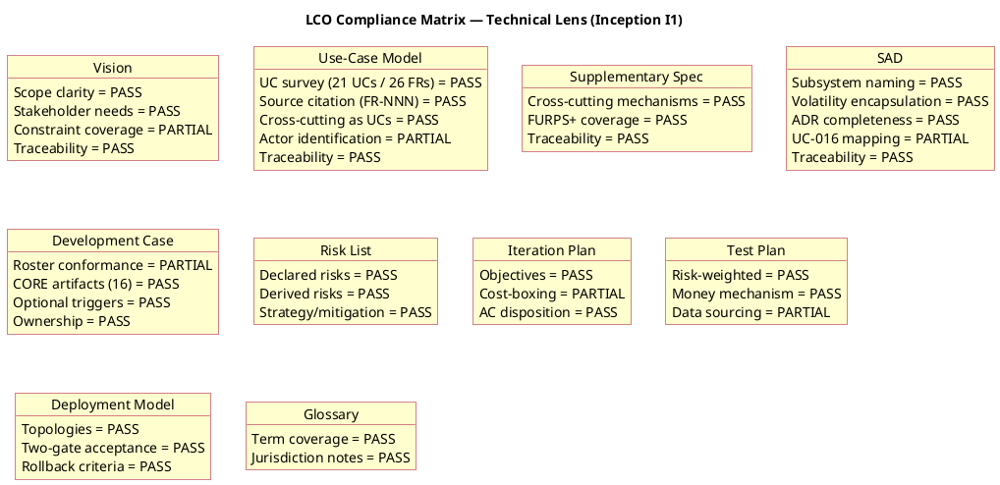
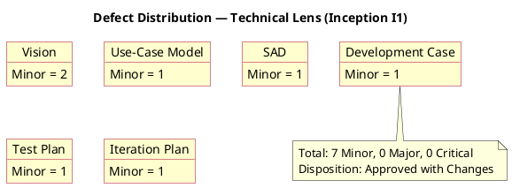
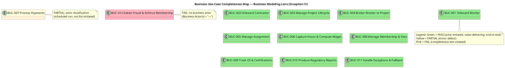
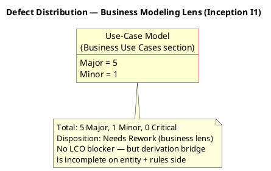

## Document Control

| Field | Value |
|---|---|
| Phase | Inception |
| Status | Draft — iteration 1 |
| Milestone Target | End-of-Inception review (LCO) |
| Review Type | Technical review (LCO milestone — feasibility lens) |
| Reviewer | Reviewer (technical lens) |
| Date | 2026-09-14 |
| Artifacts Reviewed | Development Case, Vision, Use-Case Model, Supplementary Specification, Software Architecture Document, Risk List, Iteration Plan, Test Plan, Deployment Model, Glossary (10 total) |

## Review Scope and Criteria

This is the **Lifecycle Objectives (LCO)** milestone review, technical lens. The evaluative question is **FEASIBILITY**: are the Inception artifacts feasible and acceptable to stakeholders, and do they collectively satisfy the LCO exit criteria (Vision clarity, initial risk identification, use-case survey level, stakeholder agreement on scope and feasibility)?

**Checklist applied (per artifact type):**

| Artifact | Checklist |
|---|---|
| Vision | Problem statement, product position, stakeholder needs, scope in/out, constraints, traceability |
| Use-Case Model | UC survey completeness, source citation (FR-NNN), cross-cutting-as-UC guard, actor identification, traceability |
| Supplementary Specification | Cross-cutting mechanisms (not UCs), FURPS+ coverage, traceability |
| Software Architecture Document | Subsystem naming (not layers/features), volatility encapsulation, ADR completeness, traceability |
| Development Case | DC baseline conformance (roster/CORE/ownership), optional trigger justification |
| Risk List | Declared + derived risks, strategy/mitigation/contingency |
| Iteration Plan | Objectives, cost-boxing, AC disposition |
| Test Plan | Risk-weighting, money mechanism, data sourcing |
| Deployment Model | Topologies, acceptance gates, rollback criteria |
| Glossary | Term coverage, jurisdiction notes |

**Scope guard applied:** every UC/BUC/REQ/COMP must trace to declared FR/NFR/CON/AC; cross-cutting mechanisms never as UCs; multi-actor processes as single UCs; non-literal elements carry correct markers.

## Findings
Seven (7) findings recorded by the technical lens (Reviewer), all **Minor** severity. Zero Major, zero Critical. No LCO blockers.

### Finding Detail — Technical Lens

| # | Artifact | Key | Severity | Finding | Remediation |
|---|---|---|---|---|---|
| 1 | Development Case | F1 | Minor | References "24-role roster" / "All 24 baseline roles are active"; the IARI baseline lists 25 active roles. Numerical discrepancy only — no role omitted, reassigned, or merged. | Reconcile roster count to 25. |
| 2 | Vision | F1 | Minor | Constraints section lists 17 of 22 declared constraints; CON-020/CON-021/CON-022 relegated to Assumptions table (A-003..A-005). | List CON-020..CON-022 in Constraints, or cross-reference the Assumptions table. |
| 3 | Vision | F2 | Minor | Use-case diagram omits the Time actor and uses slightly different UC names than the Use-Case Model. | Align Vision diagram with UCM (add Time actor, identical UC names) or note it as a simplified subset. |
| 4 | Use-Case Model | F1 | Minor | UC-019 primary actor "(business)" and UC-021 primary actor "(system)" are placeholders, not proper actors. | Name the proper actor for UC-019 (likely STK-003); for UC-021 consider modeling as an alternative flow of UC-004 or name the triggering actor. |
| 5 | Software Architecture Document | F1 | Minor | UC-016 (Record Rate Adjustments, FR-023, Volatility: High) not mapped to any subsystem in the traceability table. | Add UC-016 to COMP-002 or COMP-001 trace row, or note it as a sub-flow to be detailed in Elaboration. |
| 6 | Test Plan | F1 | Minor | "Testing is 30–50% of project cost" is an unsourced quantitative claim. | Mark as [ASSUMPTION — requires validation] with basis, or cite source. |
| 7 | Iteration Plan | F1 | Minor | Gantt chart time-boxes iterations ("lasts 1 days") while text cost-boxes them (750k tokens); contradicts the cost-boxing mandate. | Replace durations with cost-box annotations or mark Gantt as sequence-only. |

---

### Business Modeling Lens (Business Reviewer)

**Verdict: [BR-NEEDS-REWORK] — Business Modeling active (BPL=true); derivation bridge incomplete on entity + rules side**

**Scenario assessment (Heuristic 1):** The engagement is a **Revamp** — the system replaces an organically-grown legacy brokerage (220 representatives, 9 call centers) whose business process is the subject of the system, not merely its context. The BPA did NOT state this scenario explicitly; the review applies Revamp standards (full realization depth expected in Elaboration, business object model required).

**Business-process-led signal:** Confirmed by Development Case §4 (`isBusinessProcessLed: true`) and by the presence of a "Business Use Cases" section in the Use-Case Model. Business Modeling discipline is correctly ACTIVE.

#### BUC Completeness Coverage Map

#### Defect Distribution — Business Modeling Lens

#### Finding Detail — Business Modeling Lens

| # | Key | Severity | Finding | Remediation |
|---|---|---|---|---|
| 1 | F1 | Major | Scenario not stated. The BPA never identifies which of the six BM scenarios applies (clearly Revamp). | Add explicit "Scenario: Revamp" statement anchoring the review standard and Elaboration realization depth. |
| 2 | F2 | Major | BUC-012 "Detect Fraud & Enforce Membership" has Business Actor(s) = "—" — no initiating actor, violating the BUC completeness test. | Model BUC-012 as Time-initiated (like UC-017), or fold into BUC-008, or name the worker-reporting trigger. Do not leave the actor column empty. |
| 3 | F3 | Minor | BUC-007 "Process Payments" lists External Integration Partners as actor, but payment is a scheduled financial-intermediary process (CON-004); AP integration (FR-017) is nice-to-have. | Reclassify BUC-007's initiating actor as Time (scheduled run), consistent with UC-012. |
| 4 | F4 | Major | No business entities modeled — no entity→analysis-class annotations; the entity half of the derivation bridge is missing. | Add a Business Object Model (class diagram) of core entities (Worker, Contractor, Project, Assignment, Certification, Membership, Payment, Hours, Rate) with candidate analysis-class disposition. |
| 5 | F5 | Major | Business rules not formalized. CON-003..CON-019 are business rules but lack unique IDs, sources, worker/entity attachment, and testable conditions. | Produce a Business Rules section formalizing each rule (BR-NNN, source, constrained worker/entity, testable condition); prioritize CON-006, CON-013, CON-008, CON-009, CON-015. |
| 6 | F6 | Major | No business object model diagram — the structural complement to the behavioral use-case diagram is absent. | Add a business object model class diagram showing workers and entities with associations. |

## Resolutions and Actions

No prior-iteration findings exist (this is iteration 1, cycle 1). All seven findings above are newly recorded this iteration.

**Open action items:** all seven Minor findings are open. None block LCO. They are recommended corrections for the authors to apply before or during Elaboration; none require stakeholder escalation.

## Disposition

**Approved with Changes.**

The Inception artifacts collectively satisfy the LCO exit criteria:
- **Vision clarity** — problem statement, root cause, product position, and success criteria are clear and measurable (AC-001, AC-003, AC-004, AC-005).
- **Initial risk identification** — Risk List classifies R001–R006 with strategies, mitigations, and contingencies; the three declared risks (R001, R002, R003) plus three derived risks (R004, R005, R006) are all addressed.
- **Use-case survey level** — 21 system UCs surveyed, 4 architecturally significant UCs detailed (UC-004, UC-012, UC-013, UC-014); all 26 declared FRs are covered by at least one UC.
- **Stakeholder agreement on scope and feasibility** — declared scope is respected as the ceiling; no scope expansion detected; cross-cutting mechanisms correctly placed in Supplementary Spec; money mechanism (ADR-004) faithfully captures the stakeholder's mandatory decision.

The seven Minor findings are non-blocking corrections. No Critical or Major findings exist, so no stakeholder escalation is required and the LCO gate is not blocked by this lens.

## Traceability

| Element | Traces From | Link Type | Traces To |
|---|---|---|---|
| Review Record (I1) | Vision, Use-Case Model, Supplementary Specification, SAD, Development Case, Risk List, Iteration Plan, Test Plan, Deployment Model, Glossary | DependsOn | LCO milestone |
| Development Case#F1 | IARI baseline (25-role roster) | DependsOn | Development Case |
| Vision#F1 | CON-020, CON-021, CON-022 | DependsOn | Vision |
| Vision#F2 | Use-Case Model (Time actor, UC names) | DependsOn | Vision |
| Use-Case Model#F1 | FR-024, FR-026 | DependsOn | Use-Case Model |
| Software Architecture Document#F1 | FR-023, UC-016 | DependsOn | Software Architecture Document |
| Test Plan#F1 | (unsourced cost figure) | DependsOn | Test Plan |
| Iteration Plan#F1 | IARI cost-boxing mandate | DependsOn | Iteration Plan |
