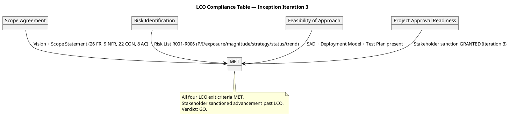
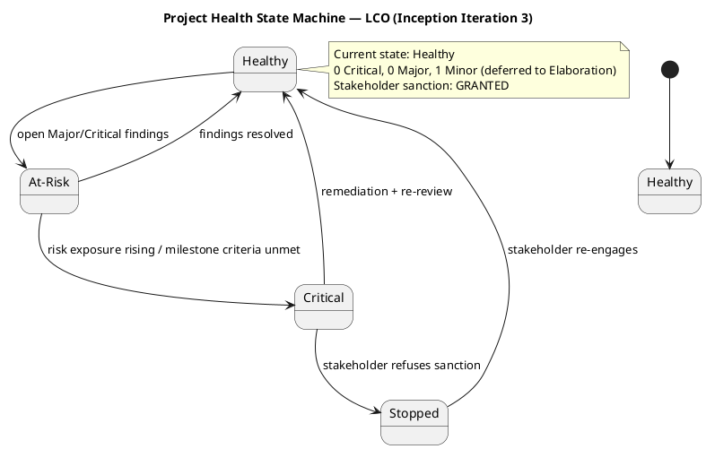

## Document Control

| Field | Value |
|---|---|
| Phase | Inception |
| Status | Draft — iteration 3 |
| Milestone Target | End-of-Inception review (LCO) |
| Review Type | Lifecycle Objectives (LCO) Milestone Review |
| Reviewers | Reviewer (technical), BusinessReviewer (business), ManagementReviewer (management) |
| Date | 2026-09-14 |

## Review Scope and Criteria

This Review Record is the cumulative audit trail for the TradeMe project across Inception iterations 1–3. It consolidates findings from three lenses — technical (Reviewer), business (BusinessReviewer), and management (ManagementReviewer) — against the Lifecycle Objectives (LCO) milestone exit criteria.

**LCO exit criteria assessed this iteration:**

| Criterion | Result | Evidence |
|---|---|---|
| Scope agreement (stakeholders agree on in/out of scope) | MET | Vision + Scope Statement present; 26 FR, 9 NFR, 22 CON, 8 AC declared and traced |
| Key risks identified with magnitude ratings | MET | Risk List R001–R006 with P/I/exposure/magnitude/strategy/status/trend |
| Feasibility of proposed approach | MET | SAD, Deployment Model, Test Plan present; architecture substantively sound |
| Project Approval readiness (sanction to Elaboration) | MET | Stakeholder sanction GRANTED (iteration 3) |

## Findings

### Consolidated finding tally (iteration 3, authoritative): 0 Critical, 0 Major, 1 Minor — 1 OPEN (deferred to Elaboration).

Cross-lens consolidation notes:
- **Iteration Plan#F1** (Gantt time-boxing) was recorded by BOTH the technical lens (Reviewer) and the management lens (ManagementReviewer). It is ONE defect with two lenses concurring — consolidated to a single action item, with the management lens as the authoritative owner (cost-boxing is a project-management discipline concern). Both finding records are RESOLVED.
- No conflicting verdicts between lenses: all three lenses concur that the artifacts are substantively sound.

### Open Findings (1 — Minor, deferred to Elaboration per stakeholder directive)

| # | Artifact | Key | Lens | Severity | Finding | Remediation | Owner |
|---|---|---|---|---|---|---|---|
| 1 | Development Case | F3 | Reviewer | Minor | Document Control status reads "Draft — iteration 2" while the rest of the iteration-3 baseline reads "Draft — iteration 3". The artifact was modified this iteration (UI Prototype trigger re-justified on NFR-001/NFR-002, resolving F2), but its metadata was not bumped. | Update Document Control status to "Draft — iteration 3". | Process Engineer |

### Resolved findings (iteration 3)

| Artifact | Key | Prior Severity | Lens | Resolution |
|---|---|---|---|---|
| Development Case | F2 | Minor | Reviewer | Resolved — UI Prototype trigger re-justified on NFR-001/NFR-002; low-technical-literacy phrase dropped |
| Deployment Model | F1 | Minor | Reviewer | Resolved — Document Control bumped to iteration 3 |
| Use-Case Model | F7 | Minor | BusinessReviewer | Resolved — `Rep --> BUC4` association added |
| Use-Case Model | F8 | Minor | BusinessReviewer | Resolved — `Worker --> BUC11` and `Contractor --> BUC11` associations added |
| Iteration Plan | F2 | Minor | ManagementReviewer | Resolved — budget box re-sized from measured iteration-1 actual (2,871,727 tokens); 750k annotated as iteration-1 historical; Document Control and fine-plan header aligned to iteration 3 |

## Resolutions and Actions

### Management-lens closure (iteration 3)

| Artifact | Key | Prior Severity | Lens | Resolution | Evidence |
|---|---|---|---|---|---|
| Iteration Plan | F2 | Minor | ManagementReviewer | Resolved | Budget box re-sized from measured iteration-1 actual (2,871,727 tokens); 750k annotated "iteration-1 historical" and superseded; iteration-2 box (2,800k) and iteration-3 box (1,800k) sized from measured actuals; Document Control "Draft — iteration 3"; fine-plan header "Fine Plan — Inception Iteration 3 (second remediation)" |

**Management-lens new findings (iteration 3):** 0. All prior ManagementReviewer findings are closed.

### Stakeholder sanction (iteration 3)

**Stakeholder sanction: GRANTED.** The stakeholder accepted the project scope and objectives and sanctioned advancement past the Lifecycle Objectives milestone.

**Stakeholder acceptance (verbatim):** *"Let's move to the drafting stage; that finding needs to be corrected during Elaboration."*

The single remaining Minor finding (Development Case#F3 — stale Document Control metadata) is explicitly deferred to Elaboration by the stakeholder's own directive. It is a metadata-only defect with no downstream blocking impact; the stakeholder has authorized its correction during Elaboration rather than holding the LCO gate for a third remediation iteration.

### Action items

| Priority | Action | Owner | Deadline |
|---|---|---|---|
| 1 | Fix Development Case#F3 (bump Document Control to "Draft — iteration 3") | Process Engineer | During Elaboration (stakeholder-authorized deferral) |

## Disposition

**LCO Milestone Verdict: GO — Approved to proceed to Elaboration.**

All four LCO exit criteria are MET. The stakeholder has sanctioned advancement past the Lifecycle Objectives milestone. The single remaining Minor finding (Development Case#F3) is a metadata-only defect explicitly deferred to Elaboration by the stakeholder's own directive.

**Prior milestone history:**
- Iteration 1: Stakeholder sanction REFUSED — 0 Critical, 5 Major, 9 Minor open; directive to fix ALL findings including Minors.
- Iteration 2: Stakeholder sanction REFUSED — 0 Critical, 0 Major, 5 Minor open; same standing directive.
- Iteration 3: Stakeholder sanction GRANTED — 0 Critical, 0 Major, 1 Minor open (deferred to Elaboration).

## Traceability

| Element | Traces From | Link Type | Traces To |
|---|---|---|---|
| LCO verdict (GO) | Vision, Risk List, SAD, Deployment Model, Test Plan | DependsOn | Elaboration phase |
| Development Case#F3 | Development Case (Document Control) | DependsOn | Elaboration remediation |
| Iteration Plan#F2 (resolved) | Iteration Assessment (I2) measured actual | DependsOn | Iteration Plan (I3) re-sized box |
| Stakeholder sanction (GRANTED) | LCO exit criteria | DependsOn | Elaboration phase |
