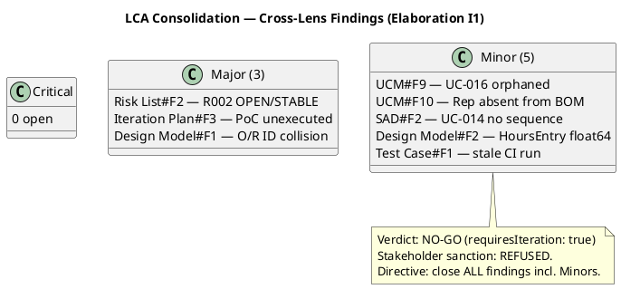
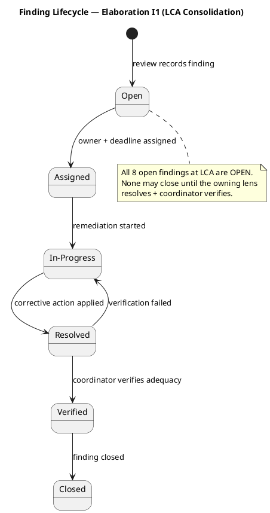

## Document Control

| Field | Value |
|---|---|
| Phase | Elaboration |
| Status | Draft — iteration 1 (LCA consolidation) |
| Milestone Target | End-of-Elaboration review (Lifecycle Architecture Milestone) |
| Review Type | Lifecycle Milestone Review (LCA) — cross-lens consolidation |
| Coordinator | Review Coordinator |
| Date | 2026-09-15 |

**Lens participation (authoritative):**

| Lens | Status |
|---|---|
| Technical / Reviewer | EXECUTED |
| Business / BusinessReviewer | EXECUTED |
| Management / ManagementReviewer | EXECUTED |

## Review Scope and Criteria

This is the LCA milestone consolidation. The Review Coordinator consolidates findings from all three
executing lenses into a single authoritative disposition. The milestone decision is based only on the
lenses that executed (all three executed this review).

**LCA exit criteria assessed:**

| Criterion | Status | Evidence |
|---|---|---|
| Architecture stable & baselined | MET | SAD baselined (ADR-001..005, 4+1 views, COMP-001..009); Design Model and Data Model produced |
| Critical risks resolved | NOT MET | R002 (HIGH, exp 16) OPEN/STABLE; PoC (R001/R003) planned but unexecuted — CON-001/CON-002 unverified |
| Construction plan credible | NOT MET | Coarse roadmap only; fine-grained Construction planning deferred |
| Stakeholder alignment | REFUSED | Stakeholder answered "No" to sanction; directive to close ALL findings including Minors |

## Findings

Consolidated open findings across all three executing lenses (8 open: 0 Critical, 3 Major, 5 Minor).
All are blocking for LCA advancement per the stakeholder's directive to close all findings including Minors.

| # | Artifact | Lens | Severity | Finding | Owner | Remediation |
|---|---|---|---|---|---|---|
| 1 | Risk List | Management Reviewer | Major | R002 (HIGH, exposure 16) remains OPEN/STABLE with no retirement progress; highest-magnitude risk shows no decreasing trend line | Project Manager | Escalate R002 to stakeholder for explicit disposition (accept with named contingency, or concrete mitigation) |
| 2 | Iteration Plan | Management Reviewer | Major | Architectural PoC (R001/R003) planned but not executed; CON-001 (cloud) and CON-002 (external integration) unverified | Software Architect | Execute PoC against baselined modular-monolith skeleton and record results before LCA closes |
| 3 | Design Model | Reviewer | Major | O/R Mapping table mislabels entity classes with service-class IDs (CLS-009/010/011) colliding with traceability; Worker/Contractor/Membership all labeled CLS-009 | Designer | Relabel O/R Mapping 'Design Class' column to entity analysis-class IDs (ACL-013..ACL-023), aligning with Data Model |
| 4 | Use-Case Model | Business Reviewer | Minor | UC-016 (Record Rate Adjustments, FR-023) orphaned in derivation bridge — appears in no BUC's 'Derives System UC(s)' column | System Analyst | Add UC-016 to BUC-004's derivation column or model as explicit sub-flow |
| 5 | Use-Case Model | Business Reviewer | Minor | Internal Representative (STK-003) absent from Business Object Model class diagram | System Analyst | Add Rep as `<<business worker>>` class or note it is being automated away (BG-002) |
| 6 | Software Architecture Document | Reviewer | Minor | UC-014 (Terminate Worker Assignment) has no sequence diagram in SAD Logical View (only in Design Model SEQ-004) | Software Architect | Add UC-014 sequence diagram or explicit deferral note |
| 7 | Design Model | Reviewer | Minor | HoursEntry.hoursWorked is float64, contradicting ADR-004 (no bare float in monetary path); Data Model uses NUMERIC(6,2) | Designer | Change to exact type (string decimal / scaled integer) |
| 8 | Test Case | Reviewer | Minor | Cites stale CI run 34856326288; current main build is 34886064517 | Test Designer | Update cited CI run ID to 34886064517 |

## Resolutions and Actions

**Prior findings reconciliation:** All Inception findings across all lenses are `Resolved` (Development Case#F1-F3, Vision#F1-F2, Use-Case Model#F1-F8, Risk List#F1, Iteration Plan#F1-F2, SAD#F1, Test Plan#F1, Deployment Model#F1). Zero prior findings remain open.

**Stakeholder disposition (this iteration):** Sanction **REFUSED** ("No"). Directive recorded verbatim: *"you do need to close all findings even if they are minors."* This re-affirms the standing quality bar: all findings — including Minor — are blocking for LCA advancement.

**Open actions for Elaboration I2 (next iteration):**
1. Execute the Architectural PoC (R001/R003) and record empirical results for CON-001/CON-002 (Iteration Plan#F3).
2. Escalate R002 to the stakeholder for explicit disposition (Risk List#F2).
3. Fix Design Model O/R mapping ID collision (Design Model#F1) and HoursEntry float64 (Design Model#F2).
4. Anchor UC-016 in the derivation bridge (UCM#F9) and model the Internal Representative in the BOM (UCM#F10).
5. Add UC-014 sequence diagram or deferral note to SAD (SAD#F2).
6. Update Test Case CI run ID (Test Case#F1).
7. Produce a credible fine-grained Construction plan grounded in measured Elaboration actuals.

## Disposition

**Verdict: NO-GO** — LCA not achieved. The architecture is baselined and stable (the core LCA technical criterion is met), but the milestone cannot close because (a) critical risks are not resolved (R002 OPEN/STABLE; PoC unexecuted), (b) the Construction plan is not yet credible, and (c) the stakeholder refused sanction and directed that all findings — including Minors — be closed first.

## Traceability

| Element | Traces From | Link Type | Traces To |
|---|---|---|---|
| Risk List#F2 (R002 OPEN/STABLE) | R002 | DependsOn | Stakeholder disposition |
| Iteration Plan#F3 (PoC unexecuted) | R001, R003, CON-001, CON-002 | DependsOn | Architectural Proof-of-Concept |
| Design Model#F1 (O/R ID collision) | ACL-013..ACL-023 | DependsOn | Data Model |
| Design Model#F2 (HoursEntry float64) | ADR-004 | DependsOn | Data Model |
| UCM#F9 (UC-016 orphaned) | FR-023, BUC-004 | DependsOn | Use-Case Model |
| UCM#F10 (Rep absent from BOM) | STK-003, BG-002 | DependsOn | Use-Case Model |
| SAD#F2 (UC-014 no sequence) | UC-014 | DependsOn | Design Model SEQ-004 |
| Test Case#F1 (stale CI run) | ci-run-34886064517 | DependsOn | Test Case |
| LCA verdict (No-Go) | Risk List#F2, Iteration Plan#F3, Design Model#F1 | DependsOn | Elaboration I2 |
