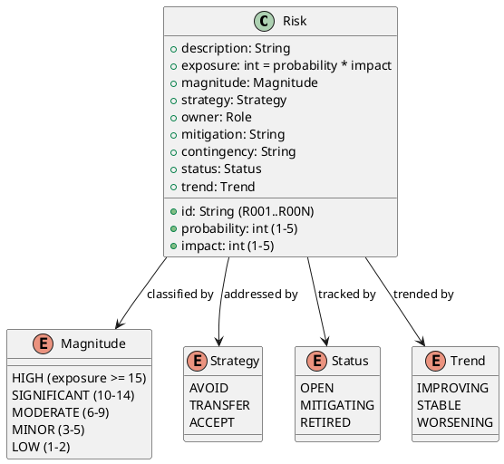

## Document Control

| Field | Value |
|---|---|
| Phase | Inception |
| Status | Draft — iteration 2 |
| Milestone Target | End-of-Inception review |

## Risk Classification

**Classification rule:** magnitude = probability × impact (exposure). HIGH ≥ 15, SIGNIFICANT 10–14, MODERATE 6–9, MINOR 3–5, LOW 1–2. Every risk carries a strategy (avoid / transfer / accept); accepted risks carry both mitigation and contingency.

**Status and Trend (measurement goal — risk retirement verification):** every risk carries a `Status` (OPEN / MITIGATING / RETIRED) and a `Trend` (IMPROVING / STABLE / WORSENING), updated each iteration. The goal of these two attributes is to make risk retirement verifiable: a risk may only be marked RETIRED when its mitigation has demonstrably reduced exposure, and the Trend column records the direction of that movement between iterations. Without them, the register is a static list and the stakeholder cannot verify that the highest-magnitude risks are actually being confronted and retired.

## Risk Register

| ID | Risk | P | I | Exposure | Magnitude | Strategy | Owner | Status | Trend |
|---|---|---|---|---|---|---|---|---|---|
| R001 | Legacy replacement has failed multiple times; root causes not yet understood | 3 | 4 | 12 | SIGNIFICANT | Accept | Project Manager | OPEN | STABLE |
| R002 | Dev/leadership tension — management historically does not understand what proper development takes | 4 | 4 | 16 | HIGH | Accept | Project Manager | OPEN | STABLE |
| R003 | Multi-jurisdiction regulatory complexity (UK, Ireland, Canada) — distinct labor law, tax, reporting | 3 | 4 | 12 | SIGNIFICANT | Accept | Software Architect | OPEN | STABLE |
| R004 | Matching policy capture — the hand-tuned policy lives in 220 representatives' heads (FR-018); risk of loss or un-codifiable tacit knowledge | 4 | 3 | 12 | SIGNIFICANT | Accept | System Analyst | OPEN | STABLE |
| R005 | Availability race condition (NFR-008, AC-005) — concurrent match/assignment integrity under a small team | 3 | 4 | 12 | SIGNIFICANT | Accept | Software Architect | OPEN | STABLE |
| R006 | Human-gate queue time — every `REQUIRES_USER_INPUT` is a gate; queue time approaching the 14-day ceiling stalls the iteration | 3 | 3 | 9 | MODERATE | Accept | Project Manager | OPEN | STABLE |

## Risk Mitigation and Contingency

| ID | Mitigation | Contingency |
|---|---|---|
| R001 | Confront early: Elaboration opens with an Architectural Proof-of-Concept (Development Case re-evaluates the PoC trigger at Elaboration against R001/R003) to empirically validate the cloud/external-integration assumptions (CON-001, CON-002) that the legacy could not satisfy. Do not defer architectural risk to Construction. | If PoC reveals a blocking architectural constraint, reduce scope to a single-jurisdiction, single-tenant first deployment and re-plan the expansion roadmap. |
| R002 | Keep the process lean and auditable (CON-022): evidence-based traceability and review records so every decision is defensible to leadership. Report human queue time separately from agent time; escalate any gate approaching the 14-day ceiling. | If leadership tension blocks a milestone, surface the evidence trail (traceability + review record) and re-scope to the minimum viable increment that leadership will accept. |
| R003 | Configuration-driven compliance (CON-007, NFR-003): jurisdiction rules as deployment configuration, not code branching. Requirements and Test disciplines carry the highest risk weight; AC-001 and AC-004 are the verification anchors. | If a jurisdiction's rules cannot be expressed in configuration, isolate that jurisdiction to a single-tenant deployment (CON-017) and treat its rules as a documented exception rather than branching core code. |
| R004 | Capture the matching policy in configurable, explainable form (NFR-005, AC-008) during Elaboration; Business Modeling is active precisely to extract the manual brokerage process. | If the policy cannot be fully codified, ship a first-acceptable-match default with a published weighting extension point, and iterate the policy as configuration. |
| R005 | Design the match→assign transition as an atomic availability check (NFR-008) with the race resolved in the UC-004 sub-flow; verify via AC-005. | If the race cannot be closed atomically, serialize assignment through a single availability ledger and accept a modest throughput cost (CON-021 says throughput is not binding). |
| R006 | Ask consequential questions in the same turn they are marked; never leave a marker to retire by attrition. Track queue time per gate. | If a gate stalls, proceed on the recorded assumption (tagged `[ASSUMPTION]`) and re-open the decision when the stakeholder answers. |

## Traceability

| Element | Traces From | Link Type | Traces To |
|---|---|---|---|
| R001 | CON-001, CON-002 | DependsOn | Architectural Proof-of-Concept (Elaboration) |
| R002 | CON-022 | DependsOn | Iteration Plan (gate tracking) |
| R003 | CON-007, NFR-003, AC-001, AC-004 | DependsOn | Supplementary Specification |
| R004 | FR-018, NFR-005, AC-008 | DependsOn | Use-Case Model (UC-004) |
| R005 | NFR-008, AC-005 | DependsOn | Use-Case Model (UC-004) |
| R006 | R002 | DependsOn | Iteration Plan (Resources) |