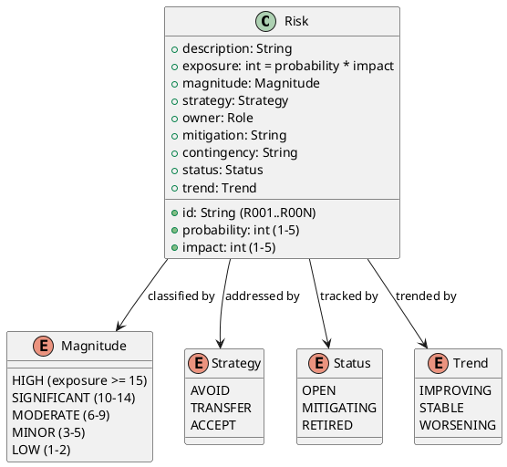

## Document Control

| Field | Value |
|---|---|
| Phase | Elaboration |
| Status | Draft — iteration 2 |
| Milestone Target | End-of-Elaboration review (Lifecycle Architecture Milestone) |

## Risk Classification

**Classification rule:** magnitude = probability × impact (exposure). HIGH ≥ 15, SIGNIFICANT 10–14, MODERATE 6–9, MINOR 3–5, LOW 1–2. Every risk carries a strategy (avoid / transfer / accept); accepted risks carry both mitigation and contingency. **A HIGH or SIGNIFICANT risk may only be `Accept`ed on the stakeholder's own answer — never self-granted.**

**Status and Trend (measurement goal — risk retirement verification):** every risk carries a `Status` (OPEN / MITIGATING / RETIRED) and a `Trend` (IMPROVING / STABLE / WORSENING), updated each iteration. The goal of these two attributes is to make risk retirement verifiable: a risk may only be marked RETIRED when its mitigation has demonstrably reduced exposure, and the Trend column records the direction of that movement between iterations. Without them, the register is a static list and the stakeholder cannot verify that the highest-magnitude risks are actually being confronted and retired.

## Risk Register

| ID | Risk | P | I | Exposure | Magnitude | Strategy | Owner | Status | Trend |
|---|---|---|---|---|---|---|---|---|---|
| R001 | Legacy replacement has failed multiple times; root causes not yet understood | 3 | 4 | 12 | SIGNIFICANT | Accept | Project Manager | MITIGATING | IMPROVING |
| R002 | Dev/leadership tension — management historically does not understand what proper development takes | 4 | 4 | 16 | HIGH | Accept | Project Manager | OPEN | STABLE |
| R003 | Multi-jurisdiction regulatory complexity (UK, Ireland, Canada) — distinct labor law, tax, reporting | 3 | 4 | 12 | SIGNIFICANT | Accept | Software Architect | MITIGATING | IMPROVING |
| R004 | Matching policy capture — the hand-tuned policy lives in 220 representatives' heads (FR-018); risk of loss or un-codifiable tacit knowledge | 4 | 3 | 12 | SIGNIFICANT | Accept | System Analyst | MITIGATING | IMPROVING |
| R005 | Availability race condition (NFR-008, AC-005) — concurrent match/assignment integrity under a small team | 3 | 4 | 12 | SIGNIFICANT | Accept | Software Architect | MITIGATING | IMPROVING |
| R006 | Human-gate queue time — every `REQUIRES_USER_INPUT` is a gate; queue time approaching the 14-day ceiling stalls the iteration | 3 | 3 | 9 | MODERATE | Accept | Project Manager | OPEN | STABLE |

**Status movement this iteration (Elaboration I5):** The Architectural Proof-of-Concept is now **executed** (analysis-only disposition — see Architectural Proof-of-Concept artifact). R001, R003, R004, R005 remain MITIGATING/IMPROVING: the PoC established *feasibility* by reasoning against the baselined architecture (ADR-001..005), but *correctness* is still the work of Construction acceptance criteria (AC-001, AC-004, AC-005, AC-008). None is RETIRED — retirement requires the acceptance criteria to pass, not merely the design to be baselined.

**R002 (HIGH, exposure 16) — escalation in-flight.** R002 is a leadership-relationship risk that no artifact retires; only the evidence trail (traceability + review record) manages it. Its `Accept` strategy on a HIGH risk is **not the Project Manager's to grant** — the consequence (a blocked milestone, a re-scoped increment) falls on the stakeholder. The disposition has been escalated to the stakeholder this iteration for explicit acceptance with the named contingency. Until the stakeholder answers, R002 remains OPEN/STABLE and the escalation is recorded as the open action for Risk List#F2.

**R006** remains OPEN/STABLE — a standing operational risk re-evaluated each iteration. Inception measured 0:00:00 queue time across 11 user interactions; the lean process is holding.

## Risk Mitigation and Contingency

| ID | Mitigation | Contingency |
|---|---|---|
| R001 | Confront early: the Architectural Proof-of-Concept is now **executed** (analysis-only). It establishes by reasoning that the baselined cloud-native stack (Node.js LTS + TypeScript, PostgreSQL, Keycloak) retires CON-001 (cloud) by construction, and that COMP-006 Integration Gateway retires CON-002 (external integration) by interface-bounding. The *organizational* root cause of past failures is a management activity owned under R002, not a technical PoC. | If Construction reveals a blocking architectural constraint, reduce scope to a single-jurisdiction, single-tenant first deployment and re-plan the expansion roadmap. |
| R002 | Keep the process lean and auditable (CON-022): evidence-based traceability and review records so every decision is defensible to leadership. Report human queue time separately from agent time; escalate any gate approaching the 14-day ceiling. The LCO sanction (GRANTED, iteration 3) is the first concrete evidence that the lean process is working. **This iteration: escalated to the stakeholder for explicit disposition** — the HIGH-risk `Accept` is not self-granted. | If leadership tension blocks a milestone, surface the evidence trail (traceability + review record) and re-scope to the minimum viable increment that leadership will accept. |
| R003 | Configuration-driven compliance (CON-007, NFR-003): jurisdiction rules as deployment configuration, not code branching. The Configuration subsystem (I3) is baselined in the SAD as the single source of jurisdiction rules. The PoC confirms feasibility by reasoning (configuration-over-code is a proven pattern); expressiveness is validated by AC-001 and AC-004 during Construction. | If a jurisdiction's rules cannot be expressed in configuration, isolate that jurisdiction to a single-tenant deployment (CON-017) and treat its rules as a documented exception rather than branching core code. |
| R004 | Capture the matching policy in configurable, explainable form (NFR-005, AC-008). COMP-001 (Matching) is baselined as a configurable, deterministic, explainable selection component. The PoC confirms feasibility; expressiveness is validated by AC-008. | If the policy cannot be fully codified, ship a first-acceptable-match default with a published weighting extension point, and iterate the policy as configuration. |
| R005 | Design the match→assign transition as an atomic availability check (NFR-008). COMP-007 (Assignment & Availability) is baselined with the row-lock atomic check (`SELECT ... FOR UPDATE`); the race is resolved in the UC-004 sub-flow. The PoC confirms the row-lock pattern is the standard PostgreSQL mechanism for exactly this race; correctness is validated by AC-005. | If the race cannot be closed atomically, serialize assignment through a single availability ledger and accept a modest throughput cost (CON-021 says throughput is not binding). |
| R006 | Ask consequential questions in the same turn they are marked; never leave a marker to retire by attrition. Track queue time per gate. Inception measured 0:00:00 queue time across 11 user interactions — well under the 14-day ceiling. | If a gate stalls, proceed on the recorded assumption (tagged `[ASSUMPTION]`) and re-open the decision when the stakeholder answers. |

## Traceability

| Element | Traces From | Link Type | Traces To |
|---|---|---|---|
| R001 | CON-001, CON-002 | DependsOn | Architectural Proof-of-Concept (executed, I5) |
| R002 | CON-022 | DependsOn | Iteration Plan (gate tracking) |
| R003 | CON-007, NFR-003, AC-001, AC-004 | DependsOn | Software Architecture Document (I3), Supplementary Specification |
| R004 | FR-018, NFR-005, AC-008 | DependsOn | Software Architecture Document (COMP-001), Use-Case Model (UC-004) |
| R005 | NFR-008, AC-005 | DependsOn | Software Architecture Document (COMP-007), Use-Case Model (UC-004) |
| R006 | R002 | DependsOn | Iteration Plan (Resources) |