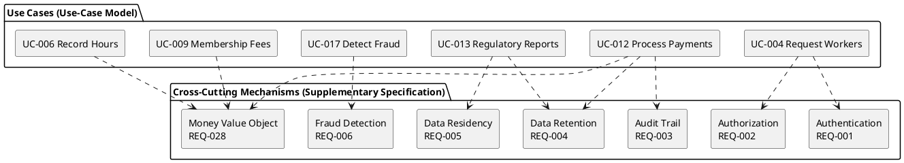

## Document Control
| Field | Value |
|---|---|
| Phase | Elaboration |
| Status | Draft — iteration 1 |
| Milestone Target | End-of-Elaboration review |
## Functionality
Security, licensing, and cross-cutting functional mechanisms. These are NOT use cases — they are constraints included by each dependent use case via `<<include>>`.

| ID | Requirement | Source | Notes |
|---|---|---|---|
| REQ-001 | Authentication for workers and contractors on the self-service channel | NFR-002 (self-service requires authentication) | Cross-cutting mechanism; included by UC-001, UC-002, UC-004, UC-006, UC-007, UC-008, UC-016. Mechanism decided: Keycloak as the identity provider over OIDC, with the provider chosen at deployment time through configuration. |
| REQ-002 | Authorization: workers and contractors access only their own records; representatives access exception cases | CON-003, CON-004 | Cross-cutting mechanism |
| REQ-003 | Audit trail of all financial and assignment transactions (tamper-evident) | CON-014, AC-006 | Cross-cutting mechanism; included by UC-012, UC-014, UC-015 |
| REQ-004 | Data retention honoring the longest applicable regulatory window | CON-015 | Cross-cutting mechanism |
| REQ-005 | Personal-data residency enforcement per jurisdiction | CON-016 | Cross-cutting mechanism; deployment-topology driver (CON-017) |
| REQ-006 | Membership-violation detection (contractor bypassing marketplace to hire directly) | CON-005, AC-007 | Cross-cutting mechanism; included by UC-008, UC-017 |
| REQ-028 | Money value object: every monetary amount carries an exact amount and its currency; arithmetic only between same-currency Money; crossing currencies requires an explicit conversion recording the rate and the moment applied; rounding policy declared once and identical in domain, persistence, and API; no monetary amount ever exists as a bare number | CON-004, FR-022 (stakeholder decision) | Cross-cutting mechanism; included by UC-006, UC-009, UC-012. Two edges closed explicitly: (a) the database driver must not degrade an exact numeric column to floating-point on read; (b) JSON amounts crossing the API boundary must not pass through a floating-point representation. A bare floating-point number anywhere on a monetary path is a critical defect. |

## Usability
| ID | Requirement | Source | Notes |
|---|---|---|---|
| REQ-007 | Self-service channel for workers and contractors | NFR-002 | Replaces representative-mediated interaction |
| REQ-008 | Mobile accessibility — must-have | NFR-001 | Stakeholder decision: mobile access is a must-have requirement (not nice-to-have) |
| REQ-009 | Channel equivalence: same matching, financial flow, compliance across self-service and phone | NFR-006 | |
| REQ-010 | Low technical literacy is a design concern | deferred — out-of-cycle open question | Out-of-cycle open question; returns to stakeholder when cycle closes |

## Reliability

| ID | Requirement | Source | Notes |
|---|---|---|---|
| REQ-011 | Availability race condition resolution without losing worker record or contractor request | NFR-008, AC-005 | Concurrency on worker availability |
| REQ-012 | Availability target and recovery expectation for payment processing | deferred | Deferred — out-of-cycle open question; not designed for this cycle |

## Performance

| ID | Requirement | Source | Notes |
|---|---|---|---|
| REQ-013 | User-facing channel responsiveness (self-service and phone) | NFR-009 | Throughput NOT a binding constraint (CON-021); do not over-engineer for scale |
| REQ-014 | Throughput is not a binding constraint | CON-021 | Modest transaction volume; bounded by worker supply and contractor demand |

## Supportability

| ID | Requirement | Source | Notes |
|---|---|---|---|
| REQ-015 | Multi-jurisdiction regulatory configuration (no per-jurisdiction code branching) | NFR-003, CON-007, AC-001 | |
| REQ-016 | Trade-and-skill taxonomy as configurable data | CON-018 | |
| REQ-017 | Certification frameworks configurable (authorities, names, cadences, verification) | CON-018 | |
| REQ-018 | Matching policy configurable and explainable | NFR-005, AC-008 | |
| REQ-019 | Pricing model evolvable | CON-019 | |
| REQ-020 | Integration extensibility without restructuring | NFR-007 | |
| REQ-021 | Operable by a small team, maintainable over a long horizon | CON-022 | |
| REQ-022 | Data retention for future analytics (fraud detection, demand projection) | NFR-004 | |

## Design Constraints

| ID | Constraint | Source |
|---|---|---|
| CON-001 | Deployable on cloud-hosted infrastructure | [DERIVED] |
| CON-002 | Connect to external systems | [DERIVED] |
| CON-017 | Multi-tenant default; single-tenant where residency requires | declared |
| CON-018 | Trade-and-skill taxonomy configurable | declared |
| CON-019 | Pricing model evolvable | declared |
| CON-020 | Legacy operates alongside; no historical data migration | declared |
| CON-021 | Throughput not binding | declared |
| CON-022 | Operable by small team | declared |
| REQ-029 | Implementation constraint — technology stack: Node.js on the current LTS line with TypeScript (application runtime); PostgreSQL latest (persistence). Identity provider is Keycloak over OIDC (see REQ-001). | Stakeholder decision (iteration 1) |

## Interfaces

| ID | Interface | Source | Notes |
|---|---|---|---|
| REQ-023 | Contractor accounts-payable system integration (payment submission) | FR-017, NFR-007 | Near-term; mechanism deferred (out-of-cycle) |
| REQ-024 | Third-party credential validators (certification verification) | STK-005, NFR-007 | Verification strategy deferred (out-of-cycle) |
| REQ-025 | Fraud-detection capability consuming retained data | FR-016, NFR-004 | Detection approach deferred (out-of-cycle) |

## Applicable Standards

| ID | Standard | Source |
|---|---|---|
| REQ-026 | Jurisdiction-specific labor law, tax, and reporting compliance | CON-008..CON-016, R003 |
| REQ-027 | Regulatory reporting format and cadence per jurisdiction | CON-014 |

## Traceability

| Element | Traces From | Link Type | Traces To |
|---|---|---|---|
| REQ-001 | NFR-002 (self-service) | Derives | UC-001, UC-002, UC-004, UC-006, UC-007, UC-008, UC-016 |
| REQ-002 | CON-003, CON-004 | Derives | UC-010, UC-011 |
| REQ-003 | CON-014, AC-006 | Derives | UC-012, UC-014, UC-015 |
| REQ-004 | CON-015 | Derives | (all data-retaining UCs) |
| REQ-005 | CON-016 | Derives | (deployment topology) |
| REQ-006 | CON-005, AC-007 | Derives | UC-008, UC-017 |
| REQ-007 | NFR-002 | Derives | UC-001..UC-016 |
| REQ-008 | NFR-001 | Derives | UC-001..UC-016 |
| REQ-009 | NFR-006 | Derives | UC-010, UC-011 |
| REQ-011 | NFR-008, AC-005 | Derives | UC-004 |
| REQ-013 | NFR-009 | Derives | (all user-facing UCs) |
| REQ-015 | NFR-003, CON-007, AC-001 | Derives | UC-013 |
| REQ-016 | CON-018 | Derives | UC-001, UC-003 |
| REQ-018 | NFR-005, AC-008 | Derives | UC-004 |
| REQ-019 | CON-019 | Derives | UC-012, UC-016 |
| REQ-020 | NFR-007 | Derives | UC-018 |
| REQ-022 | NFR-004 | Derives | UC-017, UC-019 |
| REQ-023 | FR-017 | Derives | UC-018 |
| REQ-024 | STK-005 | Derives | UC-001 |
| REQ-025 | FR-016 | Derives | UC-017 |
| REQ-028 | CON-004, FR-022 | Derives | UC-006, UC-009, UC-012 |
| REQ-029 | CON-022 (small-team operable) | Derives | (all UCs — implementation-wide) |
