## Document Control
| Field | Value |
|---|---|
| Phase | Elaboration |
| Status | Draft — iteration 1 |
| Milestone Target | End-of-Elaboration review |
## Use-Case Diagram
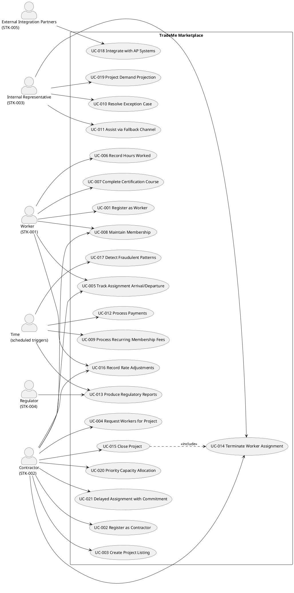
## Actors

| ID | Actor | Type | Description |
|---|---|---|---|
| STK-001 | Worker | Human | Independent skilled-trade individual; registers, lists trades/skills/certifications/availability/rates, finds work, records hours, receives payment, tracks CE. High-frequency self-service user. |
| STK-002 | Contractor | Human | General contractor; registers, lists projects, requests workers (preferences not insistence), pays through the system. High-frequency self-service user. |
| STK-003 | Internal Representative | Human | Operations team (220 today → single small backup call center). Exception handling, escalations, complex cases, fallback channel. |
| STK-004 | Regulator | External system (human-driven) | Requires jurisdiction-specific reports on labor activity, payment flows, certifications, on required cadences. |
| STK-005 | External Integration Partners | External system | Consumers of system outputs: contractors' AP systems, third-party credential validators, fraud-detection capability. |
| — | Time | Time-trigger | Scheduled triggers for recurring fees (UC-009), payment runs (UC-012), regulatory reports (UC-013), fraud scans (UC-017). |

## Use-Case Survey
| ID | Use Case | Source | Primary Actor | Priority | Volatility |
|---|---|---|---|---|---|
| UC-001 | Register as Worker | FR-001 | Worker | Must | Medium |
| UC-002 | Register as Contractor | FR-002 | Contractor | Must | Low |
| UC-003 | Create Project Listing | FR-003 | Contractor | Must | Medium |
| UC-004 | Request Workers for Project | FR-004, FR-018, FR-019 | Contractor | Must | High |
| UC-005 | Track Assignment Arrival/Departure | FR-005 | Worker, Contractor | Must | Medium |
| UC-006 | Record Hours Worked | FR-006, FR-007 | Worker | Must | Medium |
| UC-007 | Complete Certification Course | FR-008, FR-009 | Worker | Must | Medium |
| UC-008 | Maintain Membership | FR-010 | Worker, Contractor | Must | Low |
| UC-009 | Process Recurring Membership Fees | FR-011 | Time | Must | Low |
| UC-010 | Resolve Exception Case | FR-012 | Internal Representative | Must | Medium |
| UC-011 | Assist via Fallback Channel | FR-013 | Internal Representative | Must | Medium |
| UC-012 | Process Payments | FR-014, FR-022 | Time | Must | High |
| UC-013 | Produce Regulatory Reports | FR-015 | Regulator, Time | Must | High |
| UC-014 | Terminate Worker Assignment | FR-020 | Contractor, Internal Representative | Must | Medium |
| UC-015 | Close Project | FR-021 | Contractor | Must | Medium |
| UC-016 | Record Rate Adjustments | FR-023 | Worker, Contractor | Should | High |
| UC-017 | Detect Fraudulent Patterns | FR-016 | Time | Could | High |
| UC-018 | Integrate with AP Systems | FR-017 | External Integration Partners | Could | High |
| UC-019 | Project Demand Projection | FR-024 | Internal Representative | Could | High |
| UC-020 | Priority Capacity Allocation | FR-025 | Contractor | Could | High |
| UC-021 | Delayed Assignment with Commitment | FR-026 | Contractor | Could | High |

**Derivation notes (REFINE, not expansion):**
- UC-004 realizes three declared requirements: FR-004 (request), FR-018 (matching), FR-019 (assignment). Matching and assignment are system behaviors triggered within the contractor's request — not standalone actor goals — so they are modeled as included sub-flows of UC-004, not separate use cases.
- UC-006 realizes FR-006 (hours) and FR-007 (wage computation) — wage computation is a system behavior within hours recording.
- UC-007 realizes FR-008 (course) and FR-009 (certification recording).
- UC-012 realizes FR-014 (payments) and FR-022 (currency conversion).
- UC-019 (Project Demand Projection, FR-024) is initiated by the Internal Representative (STK-003) — the operations team uses demand projection to proactively recruit for scarce trades. It is a NICE-TO-HAVE (Could) capability.
- UC-021 (Delayed Assignment with Availability Commitment, FR-026) is initiated by the Contractor — it is a variant of UC-004's assignment flow where the system delays final assignment while committing availability. It is a NICE-TO-HAVE (Could) capability.
## Use-Case Specifications
Elaboration details ~80% of all use cases. The architecturally significant use cases (UC-004, UC-012, UC-013, UC-014) were detailed in Inception and are refined here; the remaining Must-priority use cases are now fully specified with activity diagrams. Should/Could (nice-to-have) use cases remain at survey level pending stakeholder prioritization.

### UC-001 Register as Worker

| Field | Value |
|---|---|
| Primary Actor | Worker (STK-001) |
| Trigger | Worker initiates registration on the self-service channel |
| Precondition | None (new worker) |
| Postcondition | Worker record created with trades, skills, certifications, availability, expected rate; membership initiated |
| Main Flow | 1. Worker provides identity and contact details. 2. Worker lists trades performed, skill level per trade, geographic availability, and expected rate (rate varies by trade, skill level, experience, project type, location, union membership, certifications — FR-001). 3. Worker lists certifications held. 4. System validates against the configurable trade-and-skill taxonomy and certification frameworks (CON-018). 5. System creates the worker record and initiates membership (UC-008). |
| Alternatives | A1: Certification claimed but not verifiable → recorded as self-attested pending verification (verification strategy deferred — out-of-cycle). A2: Trade/skill not in taxonomy → taxonomy extended via configuration (CON-018), not code. |
| Volatility | Medium — taxonomy and certification frameworks are configurable data (CON-018) |

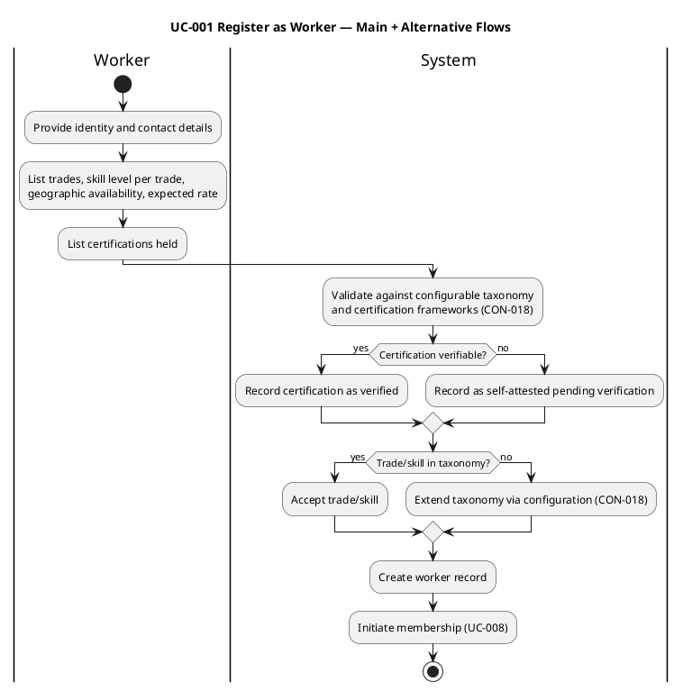

### UC-002 Register as Contractor

| Field | Value |
|---|---|
| Primary Actor | Contractor (STK-002) |
| Trigger | Contractor initiates registration on the self-service channel |
| Precondition | None (new contractor) |
| Postcondition | Contractor record created; membership initiated |
| Main Flow | 1. Contractor provides identity and contact details. 2. System creates the contractor record. 3. System initiates membership (UC-008). |
| Alternatives | None |
| Volatility | Low — stable registration process |

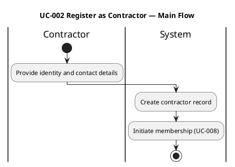

### UC-003 Create Project Listing

| Field | Value |
|---|---|
| Primary Actor | Contractor (STK-002) |
| Trigger | Contractor lists a new project |
| Precondition | Contractor registered (UC-002); membership active (UC-008) |
| Postcondition | Project listing created with required trades, skill levels, location, bill rate, duration |
| Main Flow | 1. Contractor specifies project details: required trades, skill levels, location, bill rate, duration. 2. Contractor specifies per-period trade needs (different trades may be needed for different periods within one project — FR-003). 3. System validates trades against the configurable taxonomy (CON-018). 4. System creates the project listing. |
| Alternatives | A1: Project requirement changes → treated as a variation of project creation (FR-003), not a separate operation. |
| Volatility | Medium — trades vary by jurisdiction; taxonomy configurable (CON-018) |

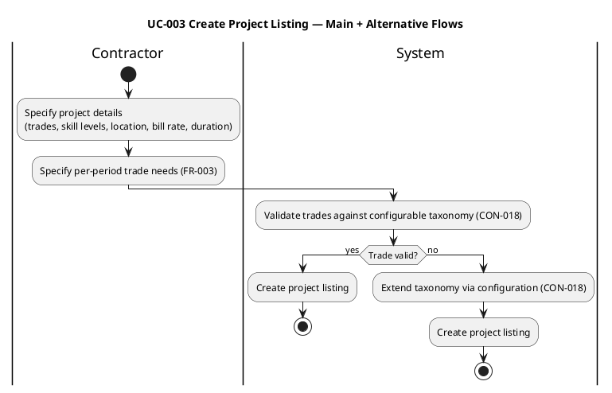

### UC-005 Track Assignment Arrival/Departure

| Field | Value |
|---|---|
| Primary Actor | Worker (STK-001), Contractor (STK-002) |
| Trigger | Worker arrives at or departs from a project |
| Precondition | Active assignment exists (UC-004) |
| Postcondition | Arrival/departure recorded against the assignment; assignment status reflects current presence |
| Main Flow | 1. Worker (or contractor) signals arrival at the project. 2. System records arrival timestamp against the assignment. 3. Worker (or contractor) signals departure. 4. System records departure timestamp. 5. System updates assignment status (workers can come and go on a single project — FR-005). |
| Alternatives | A1: Departure without return → assignment remains open until termination (UC-014) or project closure (UC-015). |
| Volatility | Medium |

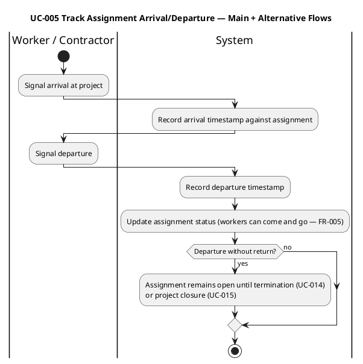

### UC-006 Record Hours Worked

| Field | Value |
|---|---|
| Primary Actor | Worker (STK-001) |
| Trigger | Worker records hours worked on an assigned project |
| Precondition | Active assignment exists (UC-004); worker present (UC-005) |
| Postcondition | Hours recorded; wages computed (FR-007) |
| Main Flow | 1. Worker selects the assigned project. 2. Worker records hours worked (date, hours). 3. System validates hours against the assignment. 4. System computes wages owed from recorded hours and agreed rates (FR-007), applying jurisdiction-specific minimum wage floors (CON-008) and risk premiums (CON-010). |
| Alternatives | A1: Hours exceed assignment duration → flagged for review. A2: Wage below jurisdiction floor → floor applied (CON-008). |
| Volatility | Medium — wage computation depends on jurisdiction-specific floors/premiums (CON-008, CON-010) |

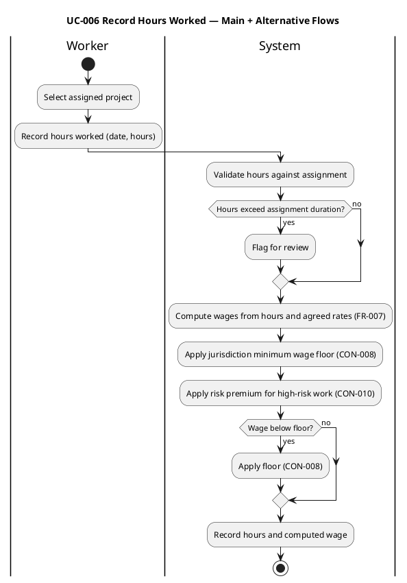

### UC-007 Complete Certification Course

| Field | Value |
|---|---|
| Primary Actor | Worker (STK-001) |
| Trigger | Worker registers for a certification course |
| Precondition | Worker registered (UC-001) |
| Postcondition | Course completion recorded; certification recorded on worker record (FR-009) |
| Main Flow | 1. Worker registers for a course (basic CE tracking — FR-008). 2. Worker attends and completes the course. 3. System records completion. 4. System records the resulting certification on the worker's record (FR-009), so credential status is current for matching and regulatory purposes. |
| Alternatives | A1: Course delivery/test administration/accreditation → out of scope (deep CE excluded). |
| Volatility | Medium — certification frameworks jurisdiction-specific (CON-018) |

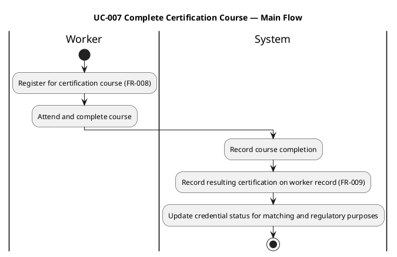

### UC-008 Maintain Membership

| Field | Value |
|---|---|
| Primary Actor | Worker (STK-001), Contractor (STK-002) |
| Trigger | Membership lifecycle event (renewal, lapse) |
| Precondition | Worker or contractor registered |
| Postcondition | Membership status current (active, lapsed, renewed) |
| Main Flow | 1. System tracks membership status and records (FR-010). 2. On renewal, system updates status to renewed. 3. On non-payment, system marks membership lapsed. 4. System enforces membership-violation detection (CON-005, AC-007) via REQ-006. |
| Alternatives | A1: Lapsed membership → worker/contractor restricted from new matches until renewed. |
| Volatility | Low — stable lifecycle |

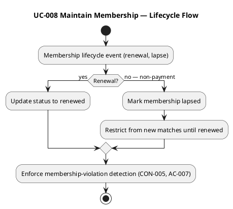

### UC-009 Process Recurring Membership Fees

| Field | Value |
|---|---|
| Primary Actor | Time (scheduled trigger) |
| Trigger | Annual membership fee due |
| Precondition | Membership active (UC-008) |
| Postcondition | Annual fee processed for workers and contractors |
| Main Flow | 1. System identifies memberships with fees due. 2. System processes the recurring annual fee (FR-011). 3. System records the payment (Money value object — REQ-028). |
| Alternatives | A1: Payment fails → membership marked lapsed (UC-008). |
| Volatility | Low |

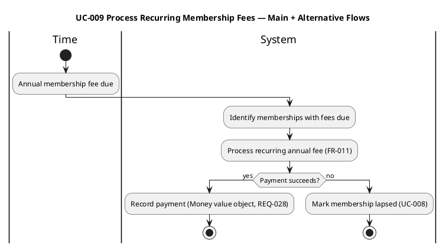

### UC-010 Resolve Exception Case

| Field | Value |
|---|---|
| Primary Actor | Internal Representative (STK-003) |
| Trigger | A case falls outside the automated self-service path |
| Precondition | Exception/escalation/complex case identified |
| Postcondition | Case resolved |
| Main Flow | 1. Representative accesses the exception case. 2. Representative applies human judgment to resolve (FR-012). 3. System records the resolution. |
| Alternatives | A1: Case requires escalation → routed to a higher authority. |
| Volatility | Medium — human judgment retained for exceptions |

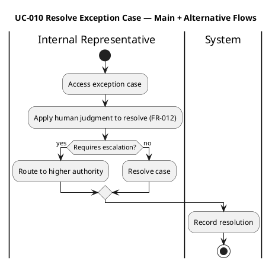

### UC-011 Assist via Fallback Channel

| Field | Value |
|---|---|
| Primary Actor | Internal Representative (STK-003) |
| Trigger | Worker or contractor prefers human interaction over self-service |
| Precondition | Worker or contractor contacts the fallback channel |
| Postcondition | User's need served through the human channel |
| Main Flow | 1. Representative receives the user's request via phone. 2. Representative performs the same operation the self-service channel would (channel equivalence — NFR-006). 3. System applies the same matching, financial flow, and compliance regardless of channel. |
| Alternatives | A1: Operation requires self-service-only capability → representative performs on user's behalf. |
| Volatility | Medium — channel equivalence required (NFR-006) |

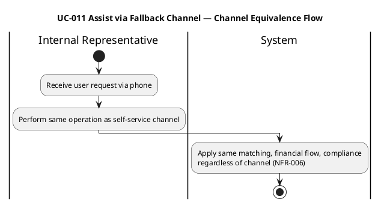

### UC-015 Close Project

| Field | Value |
|---|---|
| Primary Actor | Contractor (STK-002) |
| Trigger | Project completes or is cancelled |
| Precondition | Project exists (UC-003) |
| Postcondition | Project moved to closed state; workers released; records retained |
| Main Flow | 1. Contractor signals project closure. 2. System verifies the request. 3. System releases any workers still assigned via the termination flow (UC-014). 4. System moves the project to a closed state. 5. System retains project records for the regulatory retention period (CON-015). |
| Alternatives | A1: Workers still assigned → termination flow invoked (UC-014). |
| Volatility | Medium |

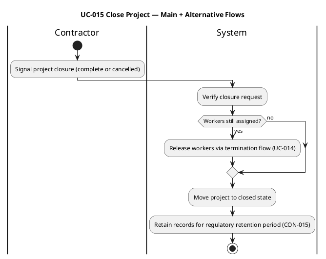

### UC-016 Record Rate Adjustments

| Field | Value |
|---|---|
| Primary Actor | Worker (STK-001), Contractor (STK-002) |
| Trigger | Worker or contractor adjusts a rate |
| Precondition | Worker or contractor registered |
| Postcondition | Rate adjustment recorded |
| Main Flow | 1. Contractor raises offered rate when a project sits idle (FR-023). 2. Worker lowers expected rate when idle to attract matches. 3. System records the adjustment. 4. System does not actively price-set or steer the market beyond the matching policy. |
| Alternatives | A1: Rate adjustment affects matching → matching policy re-evaluates (UC-004). |
| Volatility | High — pricing model evolvable (CON-019) |

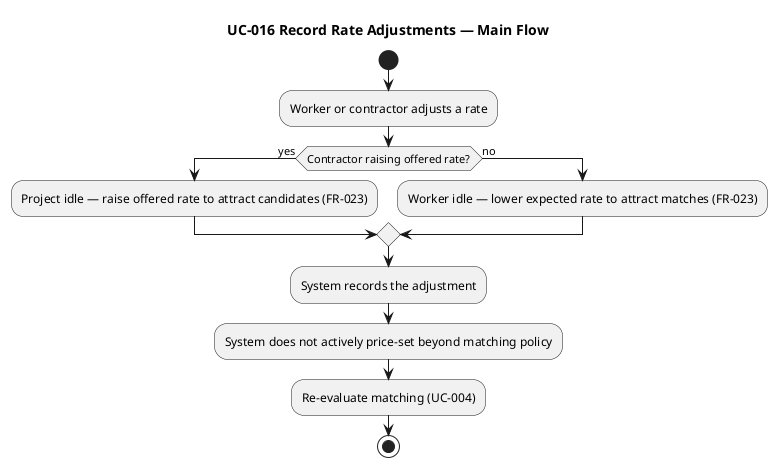

### UC-004 Request Workers for Project (architecturally significant — refined)

| Field | Value |
|---|---|
| Primary Actor | Contractor |
| Trigger | Contractor submits a request for workers matching a project's needs |
| Precondition | Project listing exists (UC-003); contractor membership active (UC-008) |
| Postcondition | Worker assigned to project (or request remains open awaiting match) |
| Main Flow | 1. Contractor selects project and specifies needs (trades, skill levels, location, duration, rate, preferred workers). 2. System analyzes needs and searches available worker population (FR-018). 3. System selects best available fit per configurable matching policy (FR-018, NFR-005). 4. System verifies worker still available (race check, NFR-008). 5. System commits assignment (FR-019). |
| Alternatives | A1: No candidate found → request remains open; contractor may raise offered rate (FR-023). A2: Worker became unavailable between match and assignment → revert to matching (FR-019, NFR-008). A3: Contractor expresses preference for specific worker → preference weighted, not insisted (CON-006). |
| Volatility | High — matching policy must be configurable (NFR-005, AC-008); fairness objectives evolve |

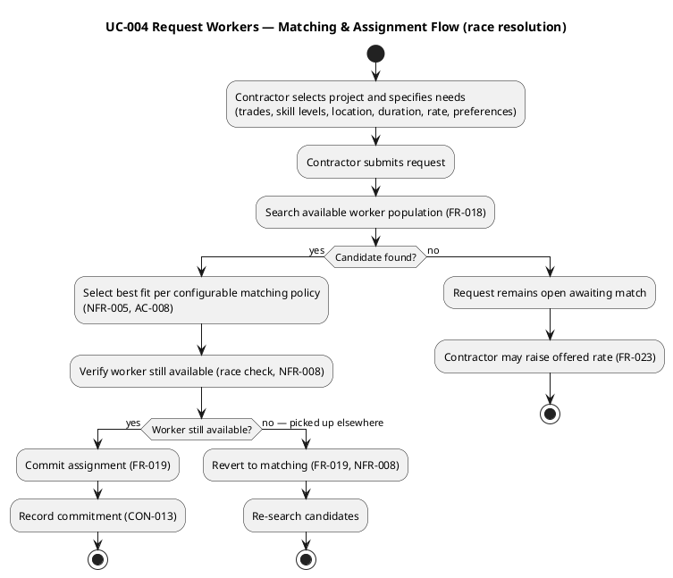

### UC-012 Process Payments (architecturally significant — refined)

| Field | Value |
|---|---|
| Primary Actor | Time (scheduled payment run) |
| Trigger | Payment run scheduled |
| Precondition | Hours recorded (UC-006); wages computed (FR-007); contractor funds collected |
| Postcondition | Workers paid; payment records retained |
| Main Flow | 1. System computes wages owed from recorded hours and agreed rates (FR-007). 2. System applies jurisdiction-specific tax withholding (CON-009), minimum wage floors (CON-008), risk premiums (CON-010). 3. System performs currency conversion where contractor and worker are in different currency boundaries (FR-022). 4. System submits payment to worker from contractor-collected funds (FR-014, CON-004). |
| Alternatives | A1: Single-currency deployment → no conversion (FR-022). A2: Cross-jurisdiction → conversion applied. |
| Volatility | High — pricing model evolvable (CON-019); tax/currency jurisdiction-specific |

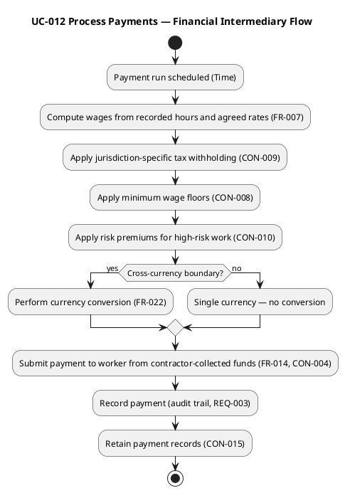

### UC-013 Produce Regulatory Reports (architecturally significant — refined)

| Field | Value |
|---|---|
| Primary Actor | Regulator (via Time trigger) |
| Trigger | Jurisdiction-specific reporting cadence reached |
| Precondition | Operational data retained (CON-015) |
| Postcondition | Report produced in required format, on required cadence (CON-014) |
| Main Flow | 1. System identifies jurisdiction's reporting requirements from configuration (NFR-003, CON-007). 2. System assembles labor activity, payment flows, certification status, tax withholding data. 3. System produces report in required format. |
| Alternatives | A1: Jurisdiction requires different cadence/format → configuration, not code (AC-001). |
| Volatility | High — regulatory variation across jurisdictions (R003) |

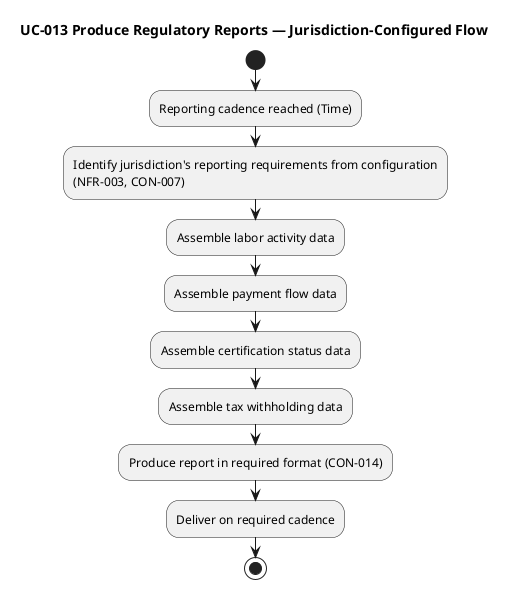

### UC-014 Terminate Worker Assignment (architecturally significant — refined)

| Field | Value |
|---|---|
| Primary Actor | Contractor, Internal Representative |
| Trigger | Worker no longer needed (project end, illness, walk-off, cancellation) |
| Precondition | Active assignment exists (UC-004) |
| Postcondition | Worker removed from active assignment; available for new matches |
| Main Flow | 1. System verifies termination request. 2. System removes worker from active assignment. 3. System makes worker available for new matches. 4. System records the termination and deviation from commitment (CON-013). |
| Alternatives | A1: Termination without verifiable cause → rejected (CON-006, contracts-must-be-honored CON-013). |
| Volatility | Medium — must not encourage casual termination (CON-013) |

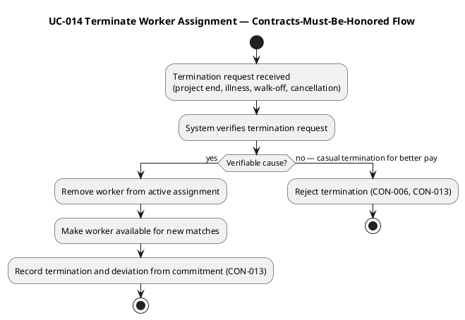

### UC-017 Detect Fraudulent Patterns (nice-to-have — survey level)

| Field | Value |
|---|---|
| Primary Actor | Time (scheduled scan) |
| Trigger | Fraud scan scheduled |
| Precondition | Operational data retained (NFR-004) |
| Postcondition | Suspicious patterns flagged for review |
| Main Flow | 1. System analyzes retained operational data. 2. System applies pattern detection (e.g., contractor terminating workers shortly after assignment — wage-avoidance). 3. System flags suspicious patterns for representative review. |
| Alternatives | A1: Detection approach deferred (out-of-cycle); data retention supports later implementation (NFR-004). |
| Volatility | High — detection approach and enforcement response both deferred |

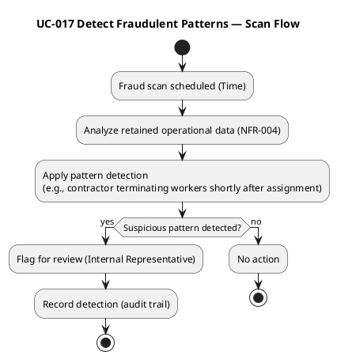

## Business Use Cases
**Business Modeling Scenario: Revamp.** The engagement is a *revamp* of an existing business process: the brokerage's manual matching-and-data-entry operation (220 representatives across 9 call centers) is being re-engineered into an automated self-service front door (BG-002), while the core brokerage function — matching independent workers to general contractors for a margin, with the company as financial intermediary (CON-003, CON-004) — is preserved. The business use cases below model the **organizational** processes at the organization boundary (the brokerage), not the software. The SystemAnalyst's system use cases (UC-001..UC-021) derive from these via the derivation bridge.

### Business Actors and Workers

| ID | Role | Classification | Rationale |
|---|---|---|---|
| STK-001 | Worker | Business Actor (external) | Independent contractor, not employed by the brokerage (CON-003); outside the organization boundary |
| STK-002 | Contractor | Business Actor (external) | General contractor; outside the organization boundary |
| STK-004 | Regulator | Business Actor (external) | Jurisdiction-specific body; outside the organization |
| STK-005 | External Integration Partners | Business Actor (external) | AP systems, credential validators; outside the organization |
| STK-003 | Internal Representative | Business Worker (internal) | Employed by the brokerage; performs the manual matching/data-entry work being automated |
| — | Time | Business Actor (system) | Scheduled/periodic triggers for internal processes (payment runs, regulatory reporting, fraud-pattern analysis) |

### Business Use-Case Diagram

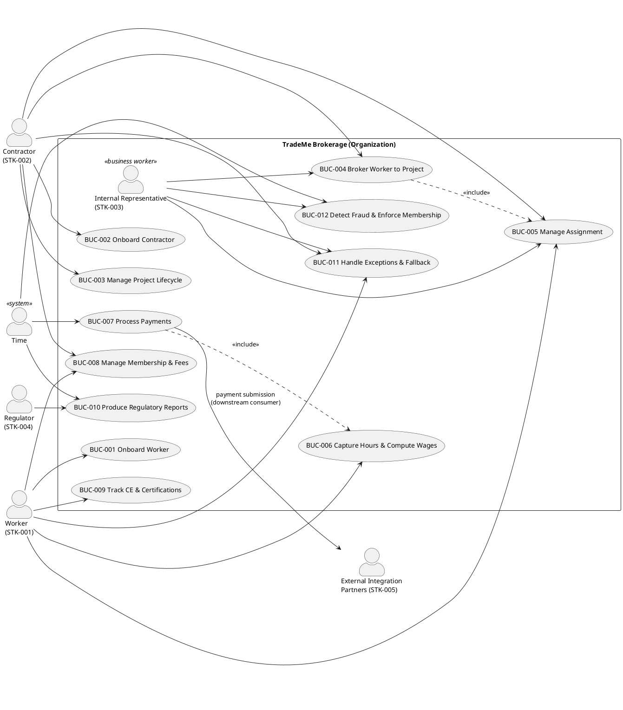

### Business Use-Case Survey

| ID | Business Use Case | Business Actor(s) | Business Worker(s) | Automation Potential | Volatility | Volatility Reason |
|---|---|---|---|---|---|---|
| BUC-001 | Onboard Worker | Worker | — | Full | Medium | Trade/skill taxonomy and certification frameworks are configurable data (CON-018); rate factors evolve |
| BUC-002 | Onboard Contractor | Contractor | — | Full | Low | Stable registration process |
| BUC-003 | Manage Project Lifecycle | Contractor | — | Full | Medium | Project requirement changes treated as variation of creation (FR-003); trades vary by jurisdiction |
| BUC-004 | Broker Worker to Project | Contractor | Internal Representative | Full | High | Matching policy must be configurable (NFR-005, AC-008); fairness objectives evolve; hand-tuned policy captured (FR-018) |
| BUC-005 | Manage Assignment | Worker, Contractor | Internal Representative | Full | Medium | Contracts-must-be-honored rule (CON-013); termination must not encourage casual churn |
| BUC-006 | Capture Hours & Compute Wages | Worker | — | Full | Medium | Wage computation depends on jurisdiction-specific floors/premiums (CON-008, CON-010) |
| BUC-007 | Process Payments | Time | — | Full | High | Pricing model evolvable (CON-019); currency conversion (FR-022); tax withholding (CON-009) |
| BUC-008 | Manage Membership & Fees | Worker, Contractor | — | Full | Low | Recurring annual fee; stable lifecycle |
| BUC-009 | Track CE & Certifications | Worker | — | Full | Medium | Certification frameworks jurisdiction-specific (CON-018) |
| BUC-010 | Produce Regulatory Reports | Regulator, Time | — | Full | High | Regulatory variation across jurisdictions (R003, CON-007) |
| BUC-011 | Handle Exceptions & Fallback | Worker, Contractor | Internal Representative | Partial | Medium | Human judgment retained for exceptions; channel equivalence required (NFR-006) |
| BUC-012 | Detect Fraud & Enforce Membership | Time | Internal Representative | Partial | High | Detection in scope (FR-016); enforcement response deferred (out-of-scope open question) |

### Detailed Business Process Flows (Elaboration)

Each business use case is elaborated with a swimlane activity diagram showing the worker/actor handoffs and the automation boundary. The core brokerage process (BUC-004) is modeled **As-Is → To-Be** to make the re-engineering gap explicit; the remaining BUCs are modeled at the To-Be (automated) state, which is the project's target.

#### BUC-004 Broker Worker to Project — As-Is (Manual Brokerage)

The As-Is process is the tacit-knowledge operation the project replaces (BG-002). It is the source of the hand-tuned matching policy (FR-018) that must be captured in configurable form.

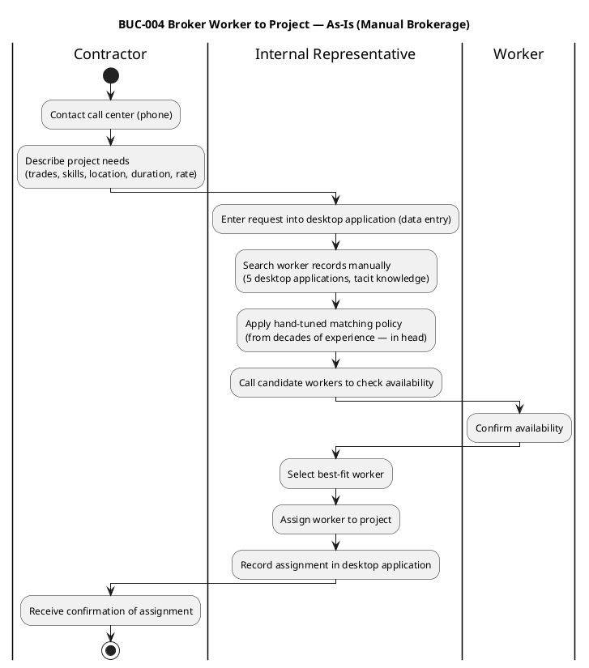

#### BUC-004 Broker Worker to Project — To-Be (Automated Self-Service)

```plantuml
@startuml
title BUC-004 Broker Worker to Project — To-Be (Automated Self-Service)

|Contractor|
start
:Submit request via self-service\n(trades, skills, location, duration, rate, preferences);

|System (automated)|
:Search available worker population (FR-018);
if (Candidate found?) then (yes)
  :Apply configurable matching policy\n(NFR-005, AC-008 — captures hand-tuned policy);
  :Verify worker still available (race check, NFR-008);
  if (Still available?) then (yes)
    :Commit assignment (FR-019);
    :Record commitment (CON-013);
    stop
  else (no)
    :Revert to matching (FR-019, NFR-008);
    stop
  endif
else (no)
  :Request remains open;
  :Contractor may raise offered rate (FR-023);
  stop
endif
@enduml
```

#### BUC-001 Onboard Worker

```plantuml
@startuml
title BUC-001 Onboard Worker

|Worker|
start
:Provide identity and contact details;
:List trades, skill level, availability, expected rate;
:List certifications held;

|System (automated)|
:Validate against configurable taxonomy (CON-018);
if (Certification verifiable?) then (yes)
  :Record as verified;
else (no)
  :Record as self-attested pending verification;
endif
:Create worker record;
:Initiate membership (BUC-008);
stop
@enduml
```

#### BUC-002 Onboard Contractor

```plantuml
@startuml
title BUC-002 Onboard Contractor

|Contractor|
start
:Provide identity and contact details;

|System (automated)|
:Create contractor record;
:Initiate membership (BUC-008);
stop
@enduml
```

#### BUC-003 Manage Project Lifecycle

```plantuml
@startuml
title BUC-003 Manage Project Lifecycle

|Contractor|
start
:Specify project details\n(trades, skill levels, location, bill rate, duration);
:Specify per-period trade needs (FR-003);

|System (automated)|
:Validate trades against taxonomy (CON-018);
:Create project listing;

|Contractor|
:Signal project closure (complete or cancelled);

|System (automated)|
:Verify closure request;
:Release workers via termination flow (BUC-005);
:Move project to closed state;
:Retain records for retention period (CON-015);
stop
@enduml
```

#### BUC-005 Manage Assignment — Arrival/Departure/Termination

```plantuml
@startuml
title BUC-005 Manage Assignment — Arrival/Departure/Termination

|Worker / Contractor|
start
:Signal arrival at project;

|System (automated)|
:Record arrival timestamp;

|Worker / Contractor|
:Signal departure;

|System (automated)|
:Record departure timestamp;
:Update assignment status (FR-005);

|Contractor / Internal Representative|
:Request termination\n(project end, illness, walk-off, cancellation);

|System (automated)|
:Verify termination request;
if (Verifiable cause?) then (yes)
  :Remove worker from active assignment;
  :Make worker available for new matches;
  :Record deviation from commitment (CON-013);
  stop
else (no)
  :Reject termination (CON-006, CON-013);
  stop
endif
@enduml
```

#### BUC-006 Capture Hours & Compute Wages

```plantuml
@startuml
title BUC-006 Capture Hours & Compute Wages

|Worker|
start
:Record hours worked on assigned project;

|System (automated)|
:Validate hours against assignment;
:Compute wages from hours and rates (FR-007);
:Apply minimum wage floor (CON-008);
:Apply risk premium (CON-010);
:Record hours and computed wage;
stop
@enduml
```

#### BUC-007 Process Payments — Financial Intermediary Flow

```plantuml
@startuml
title BUC-007 Process Payments — Financial Intermediary Flow

|Contractor|
:Pay system for project\n(contractor to system, CON-004);

|System (automated)|
:Collect contractor funds;
:Compute wages from hours and rates (FR-007);
:Apply tax withholding (CON-009);
:Apply minimum wage floor (CON-008);
:Apply risk premium (CON-010);
if (Cross-currency?) then (yes)
  :Convert currency (FR-022);
else (no)
endif
:Apply margin (CON-004);
:Submit payment to worker (system to worker);

|Worker|
:Receive payment;
stop
@enduml
```

#### BUC-008 Manage Membership & Fees

```plantuml
@startuml
title BUC-008 Manage Membership & Fees

|Time|
start
:Annual fee due;

|System (automated)|
:Identify memberships with fees due;
:Process recurring annual fee (FR-011);
if (Payment succeeds?) then (yes)
  :Update status to renewed;
  :Record payment;
  stop
else (no)
  :Mark membership lapsed;
  :Restrict from new matches until renewed;
  stop
endif
@enduml
```

#### BUC-009 Track CE & Certifications

```plantuml
@startuml
title BUC-009 Track CE & Certifications

|Worker|
start
:Register for certification course (FR-008);
:Attend and complete course;

|System (automated)|
:Record course completion;
:Record resulting certification on worker record (FR-009);
:Update credential status for matching and regulatory purposes;
stop
@enduml
```

#### BUC-010 Produce Regulatory Reports — Jurisdiction-Configured

```plantuml
@startuml
title BUC-010 Produce Regulatory Reports — Jurisdiction-Configured

|Time|
start
:Reporting cadence reached;

|System (automated)|
:Load jurisdiction reporting config (NFR-003, CON-007);
:Assemble labor activity data;
:Assemble payment flow data;
:Assemble certification status data;
:Assemble tax withholding data;
:Produce report in required format (CON-014);
:Deliver on required cadence;

|Regulator|
:Receive report;
stop
@enduml
```

#### BUC-011 Handle Exceptions & Fallback — Partial Automation

```plantuml
@startuml
title BUC-011 Handle Exceptions & Fallback — Partial Automation

|Worker / Contractor|
start
:Contact fallback channel (phone);

|Internal Representative|
:Receive request;
:Perform same operation as self-service\n(channel equivalence, NFR-006);

|System (automated)|
:Apply same matching, financial flow, compliance\nregardless of channel (NFR-006);
stop
@enduml
```

#### BUC-012 Detect Fraud & Enforce Membership — Partial Automation

```plantuml
@startuml
title BUC-012 Detect Fraud & Enforce Membership — Partial Automation

|Time|
start
:Fraud scan scheduled;

|System (automated)|
:Analyze retained operational data (NFR-004);
:Apply pattern detection\n(e.g., contractor terminating workers shortly after assignment);
if (Suspicious pattern?) then (yes)
  :Flag for review;
else (no)
  :No action;
  stop
endif

|Internal Representative|
:Review flagged pattern;
:Apply human judgment;
:Record enforcement decision (deferred — out-of-cycle);
stop
@enduml
```

### Business Object Model

The structural complement to the behavioral use-case diagram. Entities carry the analysis-class disposition (`<<entity>>` for persistent business objects, `<<control>>` for the volatile policy/decision processes the SoftwareArchitect must encapsulate). The Internal Representative (STK-003) is modeled as a `<<business worker>>` — an internal actor whose manual matching/data-entry work is being automated away (BG-002), leaving a residual role in exception handling and fallback (FR-012, FR-013).

```plantuml
@startuml
skinparam classAttributeIconSize 0
skinparam packageStyle rectangle

package "TradeMe Brokerage — Business Object Model" {

  class InternalRepresentative <<business worker>> {
    repId
    role
  }

  class Worker <<entity>> {
    workerId
    trades[]
    skills[]
    certifications[]
    geographicAvailability
    expectedRate : Money
    membershipStatus
  }

  class Contractor <<entity>> {
    contractorId
    projects[]
    membershipStatus
  }

  class Project <<entity>> {
    projectId
    requiredTrades[]
    skillLevels[]
    location
    billRate : Money
    duration
    status
  }

  class Assignment <<entity>> {
    assignmentId
    startDate
    endDate
    status
  }

  class HoursEntry <<entity>> {
    hoursEntryId
    date
    hoursWorked
  }

  class WageComputation <<control>> {
    computeWages(hours, rate) : Money
  }

  class Payment <<entity>> {
    paymentId
    amount : Money
    currency
    direction
  }

  class Membership <<entity>> {
    membershipId
    status
    renewalDate
  }

  class Course <<entity>> {
    courseId
    title
  }

  class Certification <<entity>> {
    certificationId
    authority
    renewalCadence
  }

  class RegulatoryReport <<entity>> {
    reportId
    jurisdiction
    cadence
  }

  class MatchingPolicy <<control>> {
    match(candidates, preferences) : Worker
  }

  class PricingModel <<control>> {
    applyMargin(amount) : Money
  }

  Worker "1" -- "0..*" Assignment
  Contractor "1" -- "0..*" Project
  Project "1" -- "0..*" Assignment
  Worker "1" -- "0..*" HoursEntry
  Assignment "1" -- "0..*" HoursEntry
  HoursEntry --> WageComputation
  WageComputation --> Payment
  Worker "1" -- "0..1" Membership
  Contractor "1" -- "0..1" Membership
  Worker "1" -- "0..*" Certification
  Course "1" -- "0..*" Certification
  Project --> MatchingPolicy
  MatchingPolicy --> Assignment
  Payment --> PricingModel
  Project --> RegulatoryReport
  Payment --> RegulatoryReport
  Certification --> RegulatoryReport

  InternalRepresentative ..> MatchingPolicy : <<business worker>>\nhand-tuned policy source (FR-018)
  InternalRepresentative ..> Assignment : <<business worker>>\nexception handling (FR-012, FR-013)

  note bottom of InternalRepresentative
    STK-003 — being automated away (BG-002):
    footprint shrinks to a single small backup
    call center for exception handling and fallback.
  end note
}
@enduml
```

### Business Rules

Formalized from the declared constraints (CON-003..CON-019). Each rule carries a stable ID, its source constraint, the worker/entity it constrains, and a testable condition.

| ID | Rule | Source | Constrains | Testable Condition |
|---|---|---|---|---|
| BR-001 | Workers are independent contractors, not employees; the brokerage is an impartial intermediary and does not employ workers. | CON-003 | Worker, Assignment | No employment relationship record exists between brokerage and any Worker; Worker is never a payroll employee of the brokerage. |
| BR-002 | The brokerage is the financial intermediary: contractors pay the system, the system pays workers, and the brokerage takes a margin. | CON-004 | Payment | Every worker payment traces to a contractor payment; margin = contractor-paid − worker-received, and margin > 0 for every settled transaction. |
| BR-003 | Workers found through the marketplace cannot be employed directly by contractors outside the marketplace. | CON-005 | Worker, Contractor, Assignment | No direct-hire arrangement is recorded between a Contractor and a Worker who met through the marketplace; violations surface via payment-pattern/membership analysis (AC-007). |
| BR-004 | Contractors may express preferences for specific workers but cannot insist; outright denial requires a verifiable skills/integrity concern. | CON-006 | Assignment, MatchingPolicy | A contractor's stated preference is recorded as a soft signal, never a hard exclusion; any denial carries a recorded verifiable cause. |
| BR-005 | Regulator demands vary by jurisdiction and are accommodated through configuration, not per-jurisdiction code branching. | CON-007 | RegulatoryReport, Certification | Adding a jurisdiction requires only configuration data; no code change (AC-001). |
| BR-006 | The system respects jurisdiction-specific minimum wage floors. | CON-008 | WageComputation | Computed wage ≥ jurisdiction minimum wage floor for every hours entry. |
| BR-007 | The system handles employment-tax obligations on behalf of workers as the financial intermediary. | CON-009 | Payment | Every worker payment carries the correct jurisdiction-specific tax withholding. |
| BR-008 | The system applies risk-premium adjustments for high-risk work as required by jurisdiction. | CON-010 | WageComputation | High-risk work (e.g., high-voltage, skyscraper) carries the jurisdiction-mandated premium in the computed wage. |
| BR-009 | The system enforces certification requirements for specific tasks as mandated by jurisdiction. | CON-011 | Certification, Assignment | A worker cannot be assigned to a task requiring certification without a current, valid certification for that task. |
| BR-010 | The system respects wage-leaning protections (claims against future wages) as required by jurisdiction. | CON-012 | Payment | No payment is issued that violates a jurisdiction's wage-leaning protection rule. |
| BR-011 | Contracts must be honored: a worker committed to a project for a stated duration is not unilaterally re-assigned to a more lucrative opportunity. | CON-013 | Assignment | An active assignment is not terminated for a better-paying opportunity; deviation from commitment is recorded and tracked. |
| BR-012 | Regulatory reporting must be complete and on time, in the required format and cadence. | CON-014 | RegulatoryReport | Every report is produced in the required format on the required cadence; missing/late reports are a compliance failure. |
| BR-013 | Records are retained for the regulatory retention window; not deleted before the period elapses except under explicit legal authority. | CON-015 | Worker, Contractor, Project, Payment | No record is deleted before the longest applicable retention period across served jurisdictions. |
| BR-014 | Personal-data residency is respected; where a jurisdiction requires data to remain within its borders, the system honors it. | CON-016 | Worker, Contractor | Resident personal data is stored within the jurisdiction's borders where required (may force single-tenant topology). |
| BR-015 | The trade-and-skill taxonomy and certification frameworks are configurable data, not hard-coded enumerations. | CON-018 | Worker, Certification | New trades/certifications are added via configuration, not code change. |
| BR-016 | The pricing model is evolvable; today's pricing is not locked in. | CON-019 | PricingModel | New pricing strategies can be introduced without restructuring the core financial flow. |

### Process Scope vs Project Scope

The business process is the **brokerage** — matching workers to contractors for a margin, with the company as financial intermediary. The project automates the **front door** (BG-002): the self-service channel that replaces 220 representatives. The following business processes are **out of project scope** and are documented as recommendations, not modeled:

- `[RECOMMENDATION — requires CR]` Deep continuing-education (course delivery, test administration, accreditation pipeline) — declared out of scope.
- `[RECOMMENDATION — requires CR]` Detailed billing and collections mechanics (invoicing, dunning, late-payment, dispute resolution) — declared out of scope.
- `[RECOMMENDATION — requires CR]` Demand planning / project-optimization consulting / cross-training scheduling — declared adjacent businesses, not entered.

### Derivation Bridge (Business → System)

| Business UC | Automation | Derives System UC(s) | Notes |
|---|---|---|---|
| BUC-001 Onboard Worker | Full | UC-001 | Worker self-service registration |
| BUC-002 Onboard Contractor | Full | UC-002 | Contractor self-service registration |
| BUC-003 Manage Project Lifecycle | Full | UC-003, UC-015 | Project creation and closure |
| BUC-004 Broker Worker to Project | Full | UC-004 (incl. matching FR-018, assignment FR-019), UC-016 | The core brokerage process; matching/assignment are sub-flows; rate adjustments (FR-023) are recorded when a project or worker sits idle awaiting a match |
| BUC-005 Manage Assignment | Full | UC-005, UC-014 | Arrival/departure tracking and termination |
| BUC-006 Capture Hours & Compute Wages | Full | UC-006 (incl. wage computation FR-007) | Hours and wage computation |
| BUC-007 Process Payments | Full | UC-012 (incl. currency FR-022), UC-018 | Financial intermediary flow; AP integration is a downstream consumer |
| BUC-008 Manage Membership & Fees | Full | UC-008, UC-009 | Membership lifecycle and recurring fees |
| BUC-009 Track CE & Certifications | Full | UC-007 (incl. certification recording FR-009) | CE tracking and certification recording |
| BUC-010 Produce Regulatory Reports | Full | UC-013 | Jurisdiction-specific reporting |
| BUC-011 Handle Exceptions & Fallback | Partial | UC-010, UC-011 | Human judgment retained; channel equivalence (NFR-006) |
| BUC-012 Detect Fraud & Enforce Membership | Partial | UC-017 | Detection in scope; enforcement deferred |

### Volatility → Architectural Input

The following business processes are annotated **Volatility: High** and are architectural input for the SoftwareArchitect — each should be encapsulated in a dedicated component so the volatile policy can evolve without restructuring:

- **BUC-004 Broker Worker to Project** — matching policy (NFR-005, AC-008), fairness objectives.
- **BUC-007 Process Payments** — pricing model (CON-019), currency (FR-022), tax (CON-009).
- **BUC-010 Produce Regulatory Reports** — jurisdiction variation (R003, CON-007).
- **BUC-012 Detect Fraud & Enforce Membership** — detection approach and enforcement response both deferred.

### Business Traceability

| Element | Traces From | Link Type | Traces To |
|---|---|---|---|
| BUC-001 | FR-001 | Derives | UC-001 |
| BUC-002 | FR-002 | Derives | UC-002 |
| BUC-003 | FR-003, FR-021 | Derives | UC-003, UC-015 |
| BUC-004 | FR-004, FR-018, FR-019, FR-023 | Derives | UC-004, UC-016 |
| BUC-005 | FR-005, FR-020 | Derives | UC-005, UC-014 |
| BUC-006 | FR-006, FR-007 | Derives | UC-006 |
| BUC-007 | FR-014, FR-022, FR-017 | Derives | UC-012, UC-018 |
| BUC-008 | FR-010, FR-011 | Derives | UC-008, UC-009 |
| BUC-009 | FR-008, FR-009 | Derives | UC-007 |
| BUC-010 | FR-015 | Derives | UC-013 |
| BUC-011 | FR-012, FR-013 | Derives | UC-010, UC-011 |
| BUC-012 | FR-016, CON-005 | Derives | UC-017 |
| BR-001 | CON-003 | Refines | Worker, Assignment |
| BR-002 | CON-004 | Refines | Payment |
| BR-003 | CON-005 | Refines | Worker, Contractor, Assignment |
| BR-004 | CON-006 | Refines | Assignment, MatchingPolicy |
| BR-005 | CON-007 | Refines | RegulatoryReport, Certification |
| BR-006 | CON-008 | Refines | WageComputation |
| BR-007 | CON-009 | Refines | Payment |
| BR-008 | CON-010 | Refines | WageComputation |
| BR-009 | CON-011 | Refines | Certification, Assignment |
| BR-010 | CON-012 | Refines | Payment |
| BR-011 | CON-013 | Refines | Assignment |
| BR-012 | CON-014 | Refines | RegulatoryReport |
| BR-013 | CON-015 | Refines | Worker, Contractor, Project, Payment |
| BR-014 | CON-016 | Refines | Worker, Contractor |
| BR-015 | CON-018 | Refines | Worker, Certification |
| BR-016 | CON-019 | Refines | PricingModel |
## Traceability

| Element | Traces From | Link Type | Traces To |
|---|---|---|---|
| UC-001 | FR-001 | Derives | — |
| UC-002 | FR-002 | Derives | — |
| UC-003 | FR-003 | Derives | — |
| UC-004 | FR-004, FR-018, FR-019 | Derives | — |
| UC-005 | FR-005 | Derives | — |
| UC-006 | FR-006, FR-007 | Derives | — |
| UC-007 | FR-008, FR-009 | Derives | — |
| UC-008 | FR-010 | Derives | — |
| UC-009 | FR-011 | Derives | — |
| UC-010 | FR-012 | Derives | — |
| UC-011 | FR-013 | Derives | — |
| UC-012 | FR-014, FR-022 | Derives | — |
| UC-013 | FR-015 | Derives | — |
| UC-014 | FR-020 | Derives | — |
| UC-015 | FR-021 | Derives | — |
| UC-016 | FR-023 | Derives | — |
| UC-017 | FR-016 | Derives | — |
| UC-018 | FR-017 | Derives | — |
| UC-019 | FR-024 | Derives | — |
| UC-020 | FR-025 | Derives | — |
| UC-021 | FR-026 | Derives | — |
