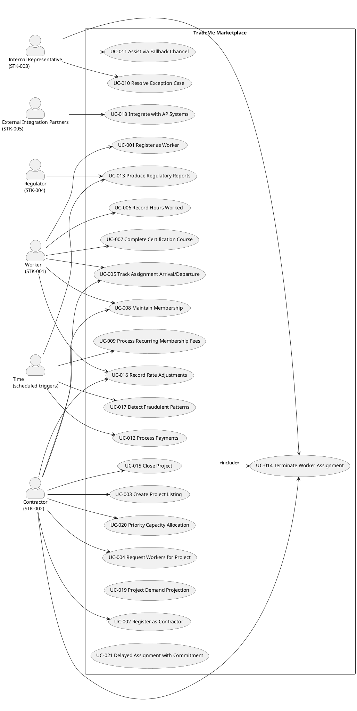

## Document Control

| Field | Value |
|---|---|
| Phase | Inception |
| Status | Draft — iteration 1 |
| Milestone Target | End-of-Inception review |

## Use-Case Diagram

## Actors

| ID | Actor | Type | Description |
|---|---|---|---|
| STK-001 | Worker | Human | Independent skilled-trade individual; registers, lists trades/skills/certifications/availability/rates, finds work, records hours, receives payment, tracks CE. High-frequency self-service user. |
| STK-002 | Contractor | Human | General contractor; registers, lists projects, requests workers (preferences not insistence), pays through the system. High-frequency self-service user. |
| STK-003 | Internal Representative | Human | Operations team (220 today → single small backup call center). Exception handling, escalations, complex cases, fallback channel. |
| STK-004 | Regulator | External system (human-driven) | Requires jurisdiction-specific reports on labor activity, payment flows, certifications, on required cadences. |
| STK-005 | External Integration Partners | External system | Consumers of system outputs: contractors' AP systems, third-party credential validators, fraud-detection capability. |
| — | Time | Time-trigger | Scheduled triggers for recurring fees (UC-009), payment runs (UC-012), regulatory reports (UC-013), fraud scans (UC-017). |

## Use-Case Survey

| ID | Use Case | Source | Primary Actor | Priority | Volatility |
|---|---|---|---|---|---|
| UC-001 | Register as Worker | FR-001 | Worker | Must | Medium |
| UC-002 | Register as Contractor | FR-002 | Contractor | Must | Low |
| UC-003 | Create Project Listing | FR-003 | Contractor | Must | Medium |
| UC-004 | Request Workers for Project | FR-004, FR-018, FR-019 | Contractor | Must | High |
| UC-005 | Track Assignment Arrival/Departure | FR-005 | Worker, Contractor | Must | Medium |
| UC-006 | Record Hours Worked | FR-006, FR-007 | Worker | Must | Medium |
| UC-007 | Complete Certification Course | FR-008, FR-009 | Worker | Must | Medium |
| UC-008 | Maintain Membership | FR-010 | Worker, Contractor | Must | Low |
| UC-009 | Process Recurring Membership Fees | FR-011 | Time | Must | Low |
| UC-010 | Resolve Exception Case | FR-012 | Internal Representative | Must | Medium |
| UC-011 | Assist via Fallback Channel | FR-013 | Internal Representative | Must | Medium |
| UC-012 | Process Payments | FR-014, FR-022 | Time | Must | High |
| UC-013 | Produce Regulatory Reports | FR-015 | Regulator, Time | Must | High |
| UC-014 | Terminate Worker Assignment | FR-020 | Contractor, Internal Representative | Must | Medium |
| UC-015 | Close Project | FR-021 | Contractor | Must | Medium |
| UC-016 | Record Rate Adjustments | FR-023 | Worker, Contractor | Should | High |
| UC-017 | Detect Fraudulent Patterns | FR-016 | Time | Could | High |
| UC-018 | Integrate with AP Systems | FR-017 | External Integration Partners | Could | High |
| UC-019 | Project Demand Projection | FR-024 | (business) | Could | High |
| UC-020 | Priority Capacity Allocation | FR-025 | Contractor | Could | High |
| UC-021 | Delayed Assignment with Commitment | FR-026 | (system) | Could | High |

**Derivation notes (REFINE, not expansion):**
- UC-004 realizes three declared requirements: FR-004 (request), FR-018 (matching), FR-019 (assignment). Matching and assignment are system behaviors triggered within the contractor's request — not standalone actor goals — so they are modeled as included sub-flows of UC-004, not separate use cases.
- UC-006 realizes FR-006 (hours) and FR-007 (wage computation) — wage computation is a system behavior within hours recording.
- UC-007 realizes FR-008 (course) and FR-009 (certification recording).
- UC-012 realizes FR-014 (payments) and FR-022 (currency conversion).

## Use-Case Specifications

Inception details only the architecturally significant use cases (10-20%). The Requirements Specifier details the remaining flows in Elaboration.

### UC-004 Request Workers for Project (architecturally significant)

| Field | Value |
|---|---|
| Primary Actor | Contractor |
| Trigger | Contractor submits a request for workers matching a project's needs |
| Precondition | Project listing exists (UC-003); contractor membership active (UC-008) |
| Postcondition | Worker assigned to project (or request remains open awaiting match) |
| Main Flow | 1. Contractor selects project and specifies needs (trades, skill levels, location, duration, rate, preferred workers). 2. System analyzes needs and searches available worker population (FR-018). 3. System selects best available fit per configurable matching policy (FR-018, NFR-005). 4. System verifies worker still available (race check, NFR-008). 5. System commits assignment (FR-019). |
| Alternatives | A1: No candidate found → request remains open; contractor may raise offered rate (FR-023). A2: Worker became unavailable between match and assignment → revert to matching (FR-019, NFR-008). A3: Contractor expresses preference for specific worker → preference weighted, not insisted (CON-006). |
| Volatility | High — matching policy must be configurable (NFR-005, AC-008); fairness objectives evolve |

### UC-012 Process Payments (architecturally significant)

| Field | Value |
|---|---|
| Primary Actor | Time (scheduled payment run) |
| Trigger | Payment run scheduled |
| Precondition | Hours recorded (UC-006); wages computed (FR-007); contractor funds collected |
| Postcondition | Workers paid; payment records retained |
| Main Flow | 1. System computes wages owed from recorded hours and agreed rates (FR-007). 2. System applies jurisdiction-specific tax withholding (CON-009), minimum wage floors (CON-008), risk premiums (CON-010). 3. System performs currency conversion where contractor and worker are in different currency boundaries (FR-022). 4. System submits payment to worker from contractor-collected funds (FR-014, CON-004). |
| Alternatives | A1: Single-currency deployment → no conversion (FR-022). A2: Cross-jurisdiction → conversion applied. |
| Volatility | High — pricing model evolvable (CON-019); tax/currency jurisdiction-specific |

### UC-013 Produce Regulatory Reports (architecturally significant)

| Field | Value |
|---|---|
| Primary Actor | Regulator (via Time trigger) |
| Trigger | Jurisdiction-specific reporting cadence reached |
| Precondition | Operational data retained (CON-015) |
| Postcondition | Report produced in required format, on required cadence (CON-014) |
| Main Flow | 1. System identifies jurisdiction's reporting requirements from configuration (NFR-003, CON-007). 2. System assembles labor activity, payment flows, certification status, tax withholding data. 3. System produces report in required format. |
| Alternatives | A1: Jurisdiction requires different cadence/format → configuration, not code (AC-001). |
| Volatility | High — regulatory variation across jurisdictions (R003) |

### UC-014 Terminate Worker Assignment (architecturally significant)

| Field | Value |
|---|---|
| Primary Actor | Contractor, Internal Representative |
| Trigger | Worker no longer needed (project end, illness, walk-off, cancellation) |
| Precondition | Active assignment exists (UC-004) |
| Postcondition | Worker removed from active assignment; available for new matches |
| Main Flow | 1. System verifies termination request. 2. System removes worker from active assignment. 3. System makes worker available for new matches. 4. System records the termination and deviation from commitment (CON-013). |
| Alternatives | A1: Termination without verifiable cause → rejected (CON-006, contracts-must-be-honored CON-013). |
| Volatility | Medium — must not encourage casual termination (CON-013) |

## Business Use Cases

Business Modeling is active (Development Case). The Business Process Analyst will contribute the Business Use Cases section in a later iteration. The system use cases above derive from the manual brokerage process (220 representatives performing data entry and matching); FR-018 requires capturing the hand-tuned matching policy in configurable form.

## Traceability

| Element | Traces From | Link Type | Traces To |
|---|---|---|---|
| UC-001 | FR-001 | Derives | — |
| UC-002 | FR-002 | Derives | — |
| UC-003 | FR-003 | Derives | — |
| UC-004 | FR-004, FR-018, FR-019 | Derives | — |
| UC-005 | FR-005 | Derives | — |
| UC-006 | FR-006, FR-007 | Derives | — |
| UC-007 | FR-008, FR-009 | Derives | — |
| UC-008 | FR-010 | Derives | — |
| UC-009 | FR-011 | Derives | — |
| UC-010 | FR-012 | Derives | — |
| UC-011 | FR-013 | Derives | — |
| UC-012 | FR-014, FR-022 | Derives | — |
| UC-013 | FR-015 | Derives | — |
| UC-014 | FR-020 | Derives | — |
| UC-015 | FR-021 | Derives | — |
| UC-016 | FR-023 | Derives | — |
| UC-017 | FR-016 | Derives | — |
| UC-018 | FR-017 | Derives | — |
| UC-019 | FR-024 | Derives | — |
| UC-020 | FR-025 | Derives | — |
| UC-021 | FR-026 | Derives | — |
