## Document Control
| Field | Value |
|---|---|
| Phase | Elaboration |
| Status | Draft — iteration 1 |
| Milestone Target | End-of-Elaboration review |

## Prototype Scope and Goals

The User-Interface Prototype is triggered (UX-critical) because the self-service channel (NFR-002) replaces 220 representatives across 9 call centers (BG-002) — the front-door user experience is the single largest determinant of whether workers and contractors (STK-001, STK-002) can move off the phone channel. Mobile accessibility is a must-have (NFR-001, REQ-008).

**Goals:**
1. Validate that the self-service flows for the highest-frequency operations (register, request workers, record hours) are navigable by a non-technical user without representative intervention (AC-003).
2. Confirm channel equivalence (NFR-006): the same matching, financial flow, and compliance reach the user whether they arrive via self-service or via a representative on the fallback channel (UC-011).
3. Surface the configurable-taxonomy and certification-framework touchpoints (CON-018) where the UI must render jurisdiction-specific data without code changes.

**Out of scope for the prototype:** deep continuing-education delivery, billing/collections mechanics, and the nice-to-have capabilities (UC-017..UC-021) — all declared out of scope or deferred.

## Storyboards
Storyboards visualize the critical self-service flows for stakeholder validation. Each storyboard traces to a use case in the Use-Case Model and renders the interaction sequence as a screen-by-screen flow. The highest-frequency operations (register, request workers, record hours) are the primary validation targets for AC-003 (end-to-end without representative intervention).

### Storyboard 1 — Worker Registration (UC-001)

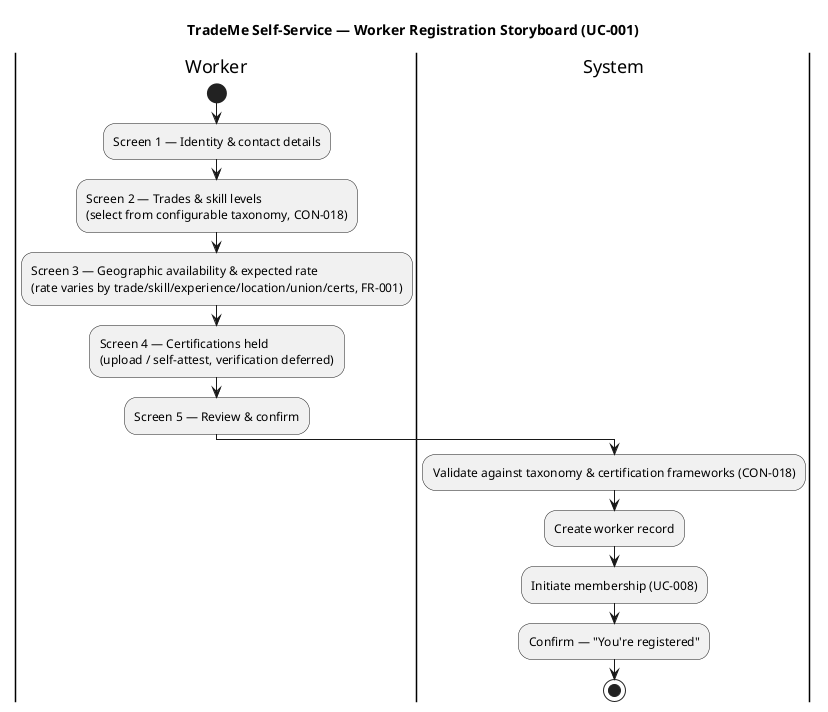

### Storyboard 2 — Contractor Registration (UC-002)

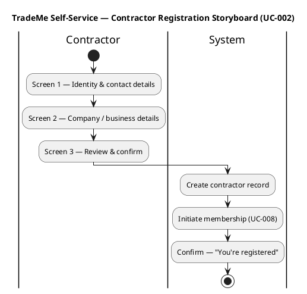

### Storyboard 3 — Create Project Listing (UC-003)

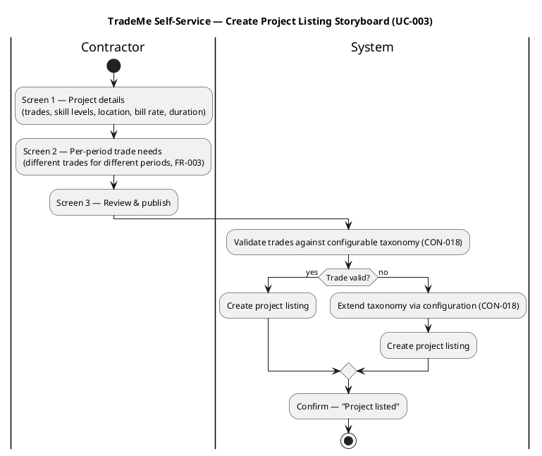

### Storyboard 4 — Contractor Request Workers (UC-004)

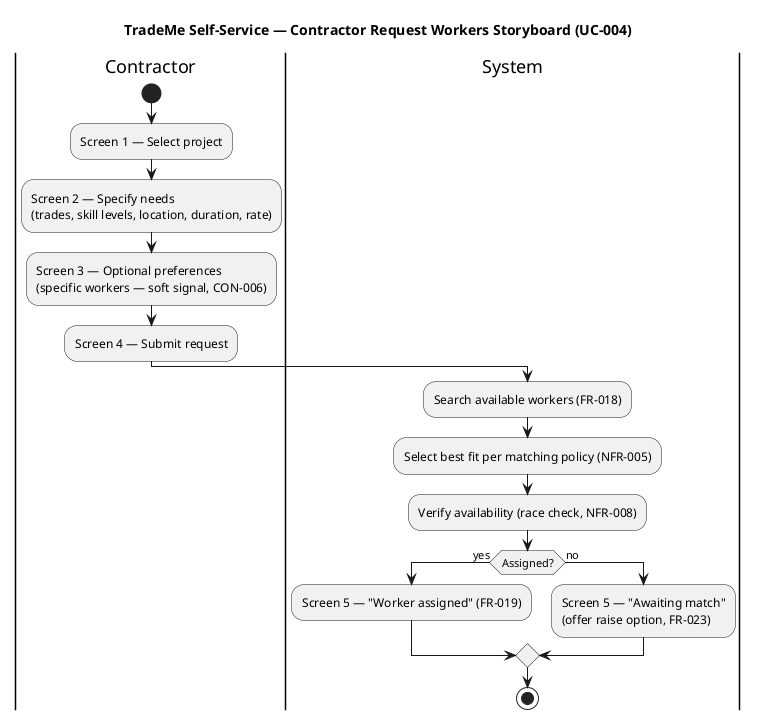

### Storyboard 5 — Track Arrival/Departure (UC-005)

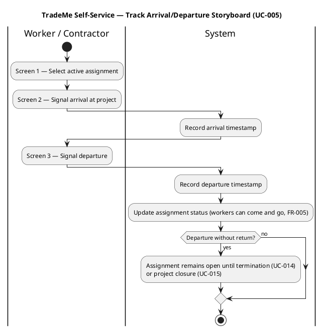

### Storyboard 6 — Record Hours Worked (UC-006)

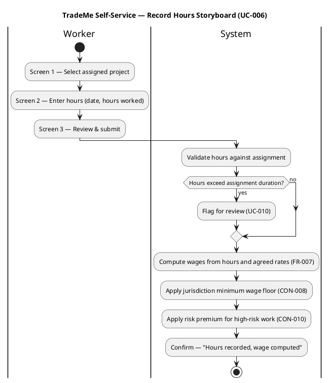

### Storyboard 7 — Complete Certification Course (UC-007)

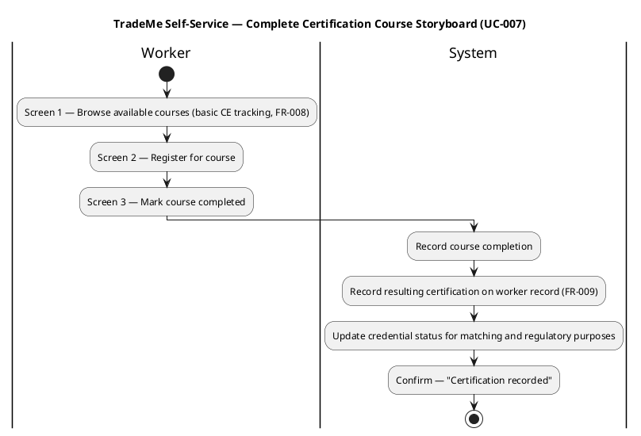

### Storyboard 8 — Maintain Membership (UC-008)

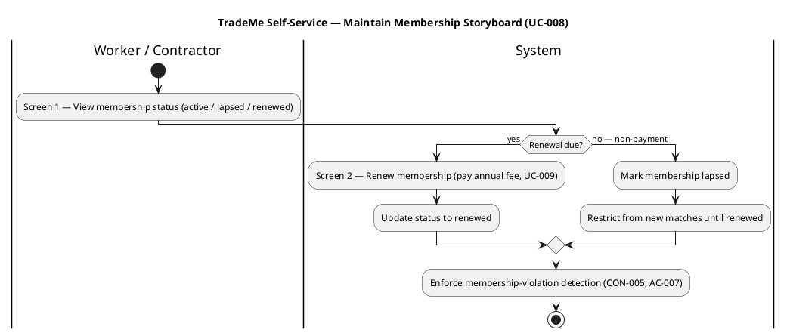

### Storyboard 9 — Terminate Assignment (UC-014)

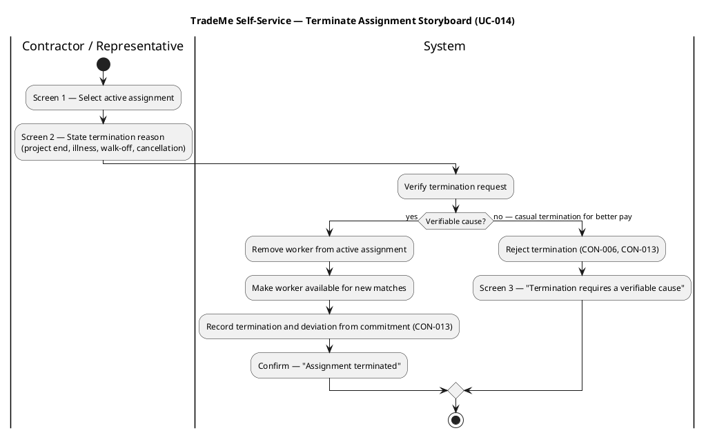

### Storyboard 10 — Close Project (UC-015)

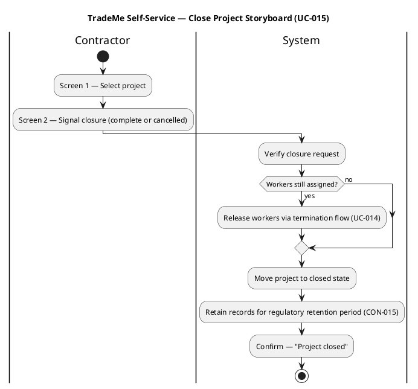

### Storyboard 11 — Record Rate Adjustments (UC-016)

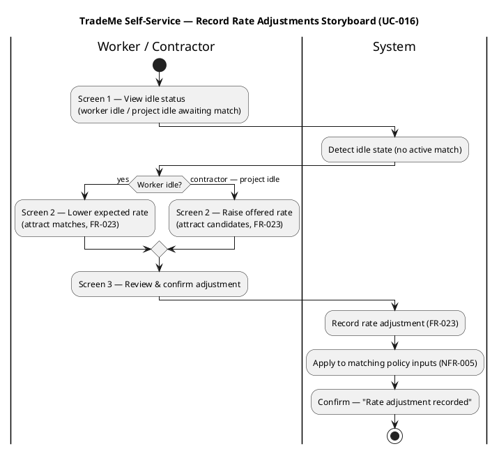

### Wireframes — Primary Screens (Salt)

The following Salt wireframes render the primary screens for the highest-frequency flows. They are the tangible realization of the storyboards above and the basis the Implementer builds from.

**Wireframe W-1 — Worker Registration, Screen 2 (Trades & Skills):**

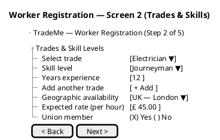

**Wireframe W-2 — Contractor Request Workers, Screen 2 (Specify Needs):**

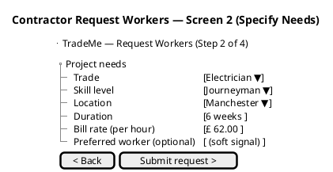

**Wireframe W-3 — Worker Record Hours, Screen 2 (Enter Hours):**

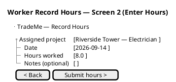

**Wireframe W-4 — Worker Dashboard (post-login):**

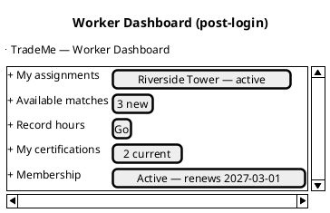

### Storyboard Coverage Note

The storyboards above cover all Must-priority self-service use cases (UC-001..UC-008, UC-014, UC-015) plus the Should-priority rate-adjustment flow (UC-016). The remaining Must-priority use cases are system-triggered (UC-009 membership fees, UC-012 payments, UC-013 regulatory reports — Time actor) or representative-mediated (UC-010 exception, UC-011 fallback) and do not require self-service storyboards; they are covered by the Navigation Flow and the channel-equivalence validation below. Nice-to-have use cases (UC-017..UC-021) remain at survey level pending stakeholder prioritization and are out of prototype scope.
## Navigation Flow
The authoritative navigation model is the **Navigation Topology** — a formal state machine in the Design Model's "Boundary Classes and Navigation Map" section. Every screen is a state; every user action causing a screen change is a directed edge with a guard condition. The prototype's storyboards (SB-1..SB-10) are the screen-by-screen realizations of the transitions in that state machine.

The Navigation Topology is reproduced here for prototype validation convenience; the Design Model copy is authoritative.

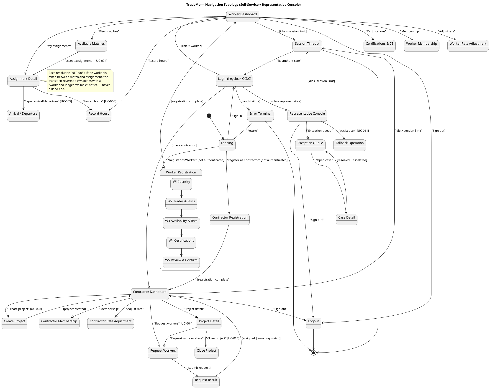

### Navigation Topology — Completeness & Consistency Checks

| Check | Result |
|---|---|
| Every screen reachable from Landing | Yes — all states trace to Landing via Login or registration |
| No dead-end screens | Yes — every screen has an onward transition (back to dashboard, logout, or timeout) |
| Terminal states explicit | Yes — Logout, Session Timeout, Error Terminal are all explicit `[*]` sinks |
| Race-resolution path (NFR-008) | Reversion to WMatches, not a dead-end (see note) |
| Channel equivalence (NFR-006) | Representative Console reuses the same controllers as self-service; no divergent screen set |
| Role guards | Login branches on role (worker/contractor/representative); no cross-role screen access |

### Storyboard → Navigation Topology Mapping

| Storyboard | Navigation Topology States |
|---|---|
| SB-1 Worker Registration (UC-001) | Landing → WReg (W1..W5) → WDash |
| SB-2 Contractor Registration (UC-002) | Landing → CReg → CDash |
| SB-3 Create Project Listing (UC-003) | CDash → CProject → CDash |
| SB-4 Request Workers (UC-004) | CDash → CRequest → CResult → CDash |
| SB-5 Track Arrival/Departure (UC-005) | WAssign → WArrDep |
| SB-6 Record Hours (UC-006) | WAssign → WHours |
| SB-7 Complete Certification Course (UC-007) | WDash → WCE |
| SB-8 Maintain Membership (UC-008) | WDash → WMember / CDash → CMember |
| SB-9 Terminate Assignment (UC-014) | WAssign (termination path) |
| SB-10 Close Project (UC-015) | CProjectDetail → CClose |

## Validation Feedback
The prototype is validated against the following declared acceptance criteria and NFRs:

| Validation Point | Criterion | Status |
|---|---|---|
| Worker registers, matched, assigned, completes, paid end-to-end without representative intervention | AC-003 | Prototype covers register (UC-001), request (UC-004), hours (UC-006), arrival/departure (UC-005), certification (UC-007), membership (UC-008), termination (UC-014), and closure (UC-015); payment (UC-012) is a system-triggered downstream flow the prototype links to |
| Same scenario in two jurisdictions produces correct tax/certification/reporting | AC-004 | Prototype renders taxonomy/certification from configuration (CON-018); jurisdiction-specific rendering is a configuration concern, not a UI-code concern |
| Channel equivalence — self-service and phone produce the same outcome | NFR-006 | UC-011 fallback channel performs the same operations; the prototype's flows are the canonical operations the representative mirrors |
| Mobile accessibility is a must-have | NFR-001, REQ-008 | Prototype targets mobile-first rendering |
| Interactive-channel responsiveness p95 ≤ 2s | NFR-009, REQ-013 | Storyboards assume each screen transition completes within the 2s ceiling; the search/match/register/hours-entry operations are the latency-sensitive paths |

`[ASSUMPTION — requires validation]` Low technical literacy (REQ-010) is an out-of-cycle open question; the prototype does not yet commit to a low-literacy design treatment until the stakeholder answers it.

## Traceability
| Element | Traces From | Link Type | Traces To |
|---|---|---|---|
| UI Prototype — Worker Registration storyboard (SB-1) | UC-001, FR-001 | Derives | UC-001 |
| UI Prototype — Contractor Registration storyboard (SB-2) | UC-002, FR-002 | Derives | UC-002 |
| UI Prototype — Create Project Listing storyboard (SB-3) | UC-003, FR-003 | Derives | UC-003 |
| UI Prototype — Request Workers storyboard (SB-4) | UC-004, FR-004, FR-018, FR-019 | Derives | UC-004 |
| UI Prototype — Track Arrival/Departure storyboard (SB-5) | UC-005, FR-005 | Derives | UC-005 |
| UI Prototype — Record Hours storyboard (SB-6) | UC-006, FR-006, FR-007 | Derives | UC-006 |
| UI Prototype — Complete Certification Course storyboard (SB-7) | UC-007, FR-008, FR-009 | Derives | UC-007 |
| UI Prototype — Maintain Membership storyboard (SB-8) | UC-008, FR-010 | Derives | UC-008 |
| UI Prototype — Terminate Assignment storyboard (SB-9) | UC-014, FR-020 | Derives | UC-014 |
| UI Prototype — Close Project storyboard (SB-10) | UC-015, FR-021 | Derives | UC-015 |
| UI Prototype — Wireframes W-1..W-4 | SB-1, SB-4, SB-6 | Refines | UC-001, UC-004, UC-006 |
| UI Prototype — Navigation Flow | NFR-002, NFR-001, REQ-008 | Derives | UC-001..UC-016 |
| UI Prototype — Channel equivalence | NFR-006 | Derives | UC-011 |

