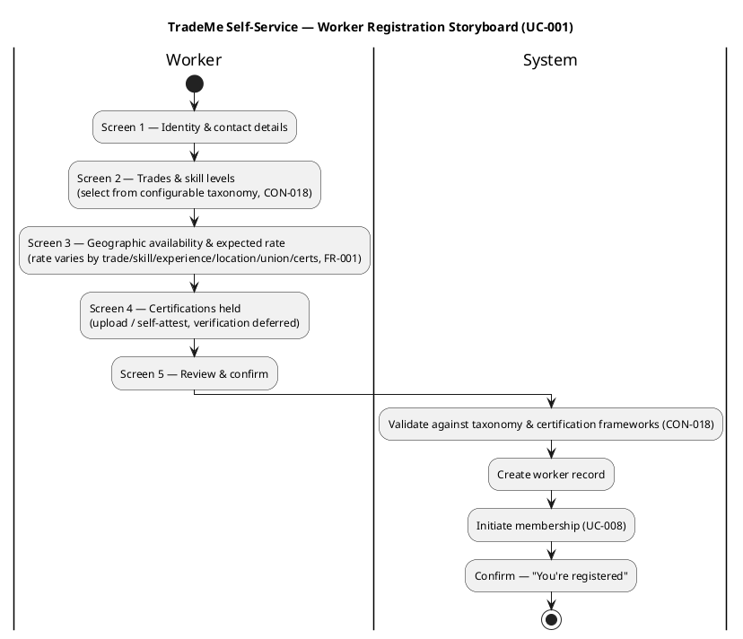
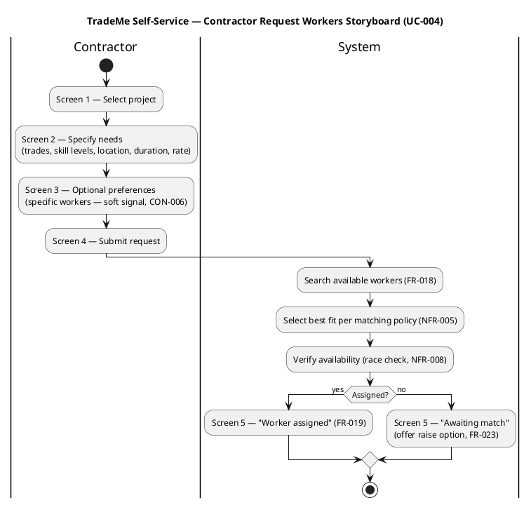
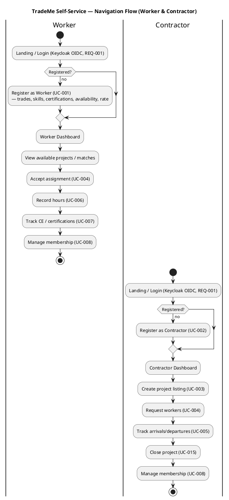

## Document Control
| Field | Value |
|---|---|
| Phase | Elaboration |
| Status | Draft — iteration 1 |
| Milestone Target | End-of-Elaboration review |

## Prototype Scope and Goals

The User-Interface Prototype is triggered (UX-critical) because the self-service channel (NFR-002) replaces 220 representatives across 9 call centers (BG-002) — the front-door user experience is the single largest determinant of whether workers and contractors (STK-001, STK-002) can move off the phone channel. Mobile accessibility is a must-have (NFR-001, REQ-008).

**Goals:**
1. Validate that the self-service flows for the highest-frequency operations (register, request workers, record hours) are navigable by a non-technical user without representative intervention (AC-003).
2. Confirm channel equivalence (NFR-006): the same matching, financial flow, and compliance reach the user whether they arrive via self-service or via a representative on the fallback channel (UC-011).
3. Surface the configurable-taxonomy and certification-framework touchpoints (CON-018) where the UI must render jurisdiction-specific data without code changes.

**Out of scope for the prototype:** deep continuing-education delivery, billing/collections mechanics, and the nice-to-have capabilities (UC-017..UC-021) — all declared out of scope or deferred.

## Storyboards

### Storyboard 1 — Worker Registration (UC-001)

### Storyboard 2 — Contractor Request Workers (UC-004)

## Navigation Flow

## Validation Feedback

The prototype is validated against the following declared acceptance criteria and NFRs:

| Validation Point | Criterion | Status |
|---|---|---|
| Worker registers, matched, assigned, completes, paid end-to-end without representative intervention | AC-003 | Prototype covers register (UC-001) and request (UC-004); hours (UC-006) and payment (UC-012) are downstream flows the prototype links to |
| Same scenario in two jurisdictions produces correct tax/certification/reporting | AC-004 | Prototype renders taxonomy/certification from configuration (CON-018); jurisdiction-specific rendering is a configuration concern, not a UI-code concern |
| Channel equivalence — self-service and phone produce the same outcome | NFR-006 | UC-011 fallback channel performs the same operations; the prototype's flows are the canonical operations the representative mirrors |
| Mobile accessibility is a must-have | NFR-001, REQ-008 | Prototype targets mobile-first rendering |

`[ASSUMPTION — requires validation]` Low technical literacy (REQ-010) is an out-of-cycle open question; the prototype does not yet commit to a low-literacy design treatment until the stakeholder answers it.

## Traceability

| Element | Traces From | Link Type | Traces To |
|---|---|---|---|
| UI Prototype — Worker Registration storyboard | UC-001, FR-001 | Derives | UC-001 |
| UI Prototype — Request Workers storyboard | UC-004, FR-004, FR-018, FR-019 | Derives | UC-004 |
| UI Prototype — Navigation Flow | NFR-002, NFR-001, REQ-008 | Derives | UC-001..UC-016 |
| UI Prototype — Channel equivalence | NFR-006 | Derives | UC-011 |
