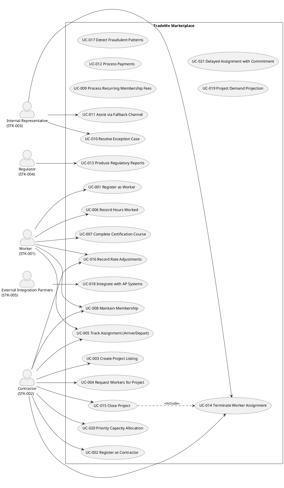

## Document Control

| Field | Value |
|---|---|
| Phase | Inception |
| Status | Draft — iteration 1 |
| Milestone Target | End-of-Inception review |

## Problem Statement

| | |
|---|---|
| **The problem of** | replacing a century-old, organically-grown skilled-trade labor brokerage system that cannot support multi-country expansion, new capabilities, or modern infrastructure |
| **Affects** | Workers (STK-001), Contractors (STK-002), Internal Representatives (STK-003), Regulators (STK-004), External Integration Partners (STK-005) |
| **The impact of which is** | the legacy system (9 call centers, 220 representatives, 5 desktop applications) cannot move to cloud-hosted infrastructure, cannot connect to external systems, and cannot open the new geographies (UK, Ireland, Canada) or channels (self-service, mobile) the business requires |
| **A successful solution would** | replicate the core brokerage function — matching independent workers to general contractors for a margin — while opening new geographies, channels, and capabilities, without overshooting into adjacent businesses the company has chosen not to enter |

**Root cause:** the legacy system's architecture (desktop-bound, call-center-mediated, no external connectivity) is the binding constraint, not the brokerage business model itself. The business model is sound; the system that carries it is not.

**Success criteria (measurable):**
- A new jurisdiction can be added through configuration alone (AC-001).
- A worker can register → match → assign → complete → be paid end-to-end without representative intervention beyond exception handling (AC-003).
- The same scenario in two jurisdictions produces correct jurisdiction-specific tax, certification, and reporting (AC-004).
- The availability race condition resolves without losing either request or producing an inconsistent state (AC-005).

## Product Position Statement

| | |
|---|---|
| **For** | independent skilled-trade workers and general contractors who need to find each other and transact |
| **Who** | currently rely on 220 representatives across 9 call centers for data entry and manual matching |
| **The TradeMe Marketplace** | is a self-service brokerage platform that matches workers to projects, tracks assignments, computes wages, and processes payments as the financial intermediary |
| **That** | automates the front door (BG-002) and opens three new countries (BG-001) through configuration, not per-country call centers |
| **Unlike** | the legacy system, which is desktop-bound, call-center-mediated, and unable to connect to external systems or move to cloud |
| **Our product** | delivers self-service channels (NFR-002), mobile access (NFR-001), configurable multi-jurisdiction compliance (NFR-003), and external integration (NFR-007) |

## Stakeholder Summary

| ID | Stakeholder | Influence | Needs |
|---|---|---|---|
| STK-001 | Workers | High | Register, list trades/skills/certifications/availability/rates, find work, record hours, receive payment, track continuing-education — via self-service |
| STK-002 | Contractors | High | Register, list projects, request workers (preferences, not insistence), pay through the system — via self-service |
| STK-003 | Internal Representatives | Medium | Exception handling, escalations, complex cases, fallback human channel; footprint shrinks to a single small backup call center |
| STK-004 | Regulators | High | Jurisdiction-specific reports on labor activity, payment flows, worker certifications, on required cadences |
| STK-005 | External Integration Partners | Low | Consume system outputs: contractors' AP systems, third-party credential validators, fraud-detection capability |

## Product Overview
**In scope:** worker and contractor records (identity, skills, certifications, geographic availability, rates, project history); active and historical project records; contractor requests for workers with automated matching and assignment; assignment tracking (arrival/departure); hours tracking and wage computation; payment processing (contractor pays system, system pays worker); regulatory reporting by jurisdiction; basic continuing-education tracking; membership tracking with recurring annual fees.

**Not in scope:**
- Matching outside skilled trades (personal services, remote technical professionals)
- Adjacent businesses (demand planning, project-optimization consulting, cross-training scheduling)
- Deep continuing-education (course delivery, test administration, accreditation pipeline)
- Detailed billing and collections mechanics (invoicing, dunning, late-payment handling, dispute resolution)
- Migration of historical data from legacy
- Project requirement changes as a distinct operation (treated as variation of project creation)
- Contractors arbitrarily denying specific workers without verifiable cause

## Features

| ID | Feature | Source | Priority | Volatility |
|---|---|---|---|---|
| FEAT-001 | Worker registration with trades, skills, certifications, availability, rates | FR-001 | Must | Medium |
| FEAT-002 | Contractor registration | FR-002 | Must | Low |
| FEAT-003 | Project listing with trades, skill levels, location, bill rate, duration | FR-003 | Must | Medium |
| FEAT-004 | Worker request with automated matching and assignment | FR-004, FR-018, FR-019 | Must | High |
| FEAT-005 | Assignment tracking (arrival/departure) | FR-005 | Must | Medium |
| FEAT-006 | Hours recording and wage computation | FR-006, FR-007 | Must | Medium |
| FEAT-007 | Continuing-education tracking and certification recording | FR-008, FR-009 | Must | Medium |
| FEAT-008 | Membership tracking and recurring fees | FR-010, FR-011 | Must | Low |
| FEAT-009 | Exception handling and fallback channel | FR-012, FR-013 | Must | Medium |
| FEAT-010 | Payment processing (financial intermediary) | FR-014, FR-022 | Must | High |
| FEAT-011 | Regulatory reporting | FR-015 | Must | High |
| FEAT-012 | Assignment termination and project closure | FR-020, FR-021 | Must | Medium |
| FEAT-013 | Rate adjustment recording | FR-023 | Should | High |
| FEAT-014 | Fraud detection | FR-016 | Could | High |
| FEAT-015 | AP-system integration | FR-017 | Could | High |
| FEAT-016 | Demand projection | FR-024 | Could | High |
| FEAT-017 | Priority capacity allocation | FR-025 | Could | High |
| FEAT-018 | Delayed assignment with availability commitment | FR-026 | Could | High |

## Assumptions and Dependencies

| # | Assumption / Dependency | Basis |
|---|---|---|
| A-001 | The new system is deployable on cloud-hosted infrastructure | CON-001 [DERIVED] |
| A-002 | The new system can connect to external systems | CON-002 [DERIVED] |
| A-003 | The legacy system continues to operate alongside the new system; no historical data migration | CON-020 |
| A-004 | Throughput is not a binding constraint; do not over-engineer for scale | CON-021 |
| A-005 | The system must be operable by a small team and maintainable over a long horizon | CON-022 |

## Constraints

| ID | Constraint | Category |
|---|---|---|
| CON-003 | Workers are independent contractors, not employees | BusinessRule |
| CON-004 | Company is the financial intermediary (contractors pay system, system pays workers) | BusinessRule |
| CON-005 | Workers cannot be employed directly by contractors outside the marketplace | BusinessRule |
| CON-006 | Contractors cannot arbitrarily deny specific workers | BusinessRule |
| CON-007 | Regulatory variation accommodated through configuration, not code branching | Architectural |
| CON-008 | Jurisdiction-specific minimum wage floors | Regulatory |
| CON-009 | Employment-tax obligations on behalf of workers | Regulatory |
| CON-010 | Risk-premium adjustments for high-risk work | Regulatory |
| CON-011 | Certification requirements for specific tasks | Regulatory |
| CON-012 | Wage-leaning protections | Regulatory |
| CON-013 | Contracts must be honored | BusinessRule |
| CON-014 | Regulatory reporting complete and on time | Regulatory |
| CON-015 | Records retained for regulatory retention window | Regulatory |
| CON-016 | Personal-data residency respected | Regulatory |
| CON-017 | Multi-tenant default; single-tenant where residency requires | Architectural |
| CON-018 | Trade-and-skill taxonomy as configurable data | Architectural |
| CON-019 | Pricing model evolvable | Architectural |

## Other Product Requirements

| ID | Requirement | Source |
|---|---|---|
| NFR-001 | Mobile accessibility | declared |
| NFR-002 | Self-service channel for workers and contractors | declared |
| NFR-003 | Multi-jurisdiction regulatory configuration | declared |
| NFR-004 | Data retention for future analytics | declared [DERIVED] |
| NFR-005 | Explainable and deterministic matching selection | declared [DERIVED] |
| NFR-006 | Channel equivalence across self-service and phone | declared |
| NFR-007 | Integration extensibility without restructuring | declared |
| NFR-008 | Availability race condition resolution | declared |
| NFR-009 | User-facing channel responsiveness | declared |

## Business Context

The system automates a manual brokerage: 220 representatives across 9 call centers perform data entry and manual matching today. FR-018 explicitly requires capturing "the hand-tuned policy representatives used for decades" in configurable, explainable form. The business process is the subject of the system, not merely its context — Business Modeling is active, and the Business Process Analyst will contribute a Business Use Cases section to the Use-Case Model.

## Traceability

| Element | Traces From | Link Type | Traces To |
|---|---|---|---|
| FEAT-001 | FR-001 | Derives | UC-001 |
| FEAT-002 | FR-002 | Derives | UC-002 |
| FEAT-003 | FR-003 | Derives | UC-003 |
| FEAT-004 | FR-004, FR-018, FR-019 | Derives | UC-004, UC-018, UC-019 |
| FEAT-005 | FR-005 | Derives | UC-005 |
| FEAT-006 | FR-006, FR-007 | Derives | UC-006, UC-007 |
| FEAT-007 | FR-008, FR-009 | Derives | UC-008, UC-009 |
| FEAT-008 | FR-010, FR-011 | Derives | UC-010, UC-011 |
| FEAT-009 | FR-012, FR-013 | Derives | UC-012, UC-013 |
| FEAT-010 | FR-014, FR-022 | Derives | UC-014, UC-022 |
| FEAT-011 | FR-015 | Derives | UC-015 |
| FEAT-012 | FR-020, FR-021 | Derives | UC-020, UC-021 |
| FEAT-013 | FR-023 | Derives | UC-023 |
| FEAT-014 | FR-016 | Derives | UC-016 |
| FEAT-015 | FR-017 | Derives | UC-017 |
| FEAT-016 | FR-024 | Derives | UC-024 |
| FEAT-017 | FR-025 | Derives | UC-025 |
| FEAT-018 | FR-026 | Derives | UC-026 |
| BG-001 | declared | — | FEAT-001..FEAT-018 |
| BG-002 | declared | — | FEAT-001..FEAT-018 |
