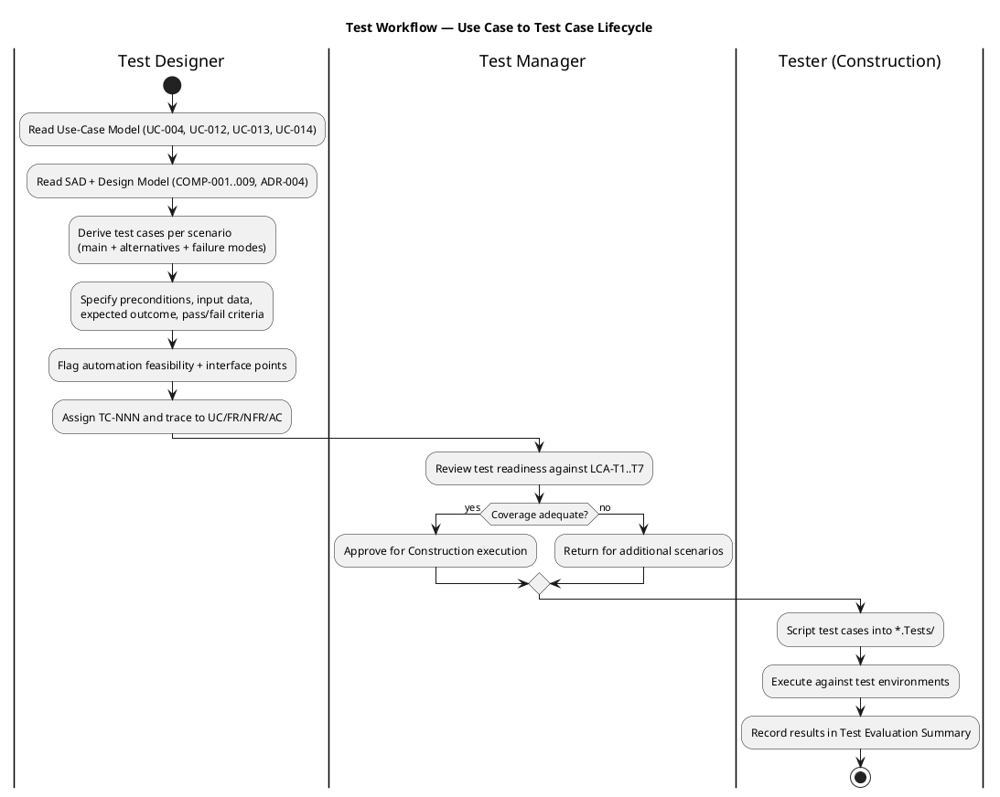
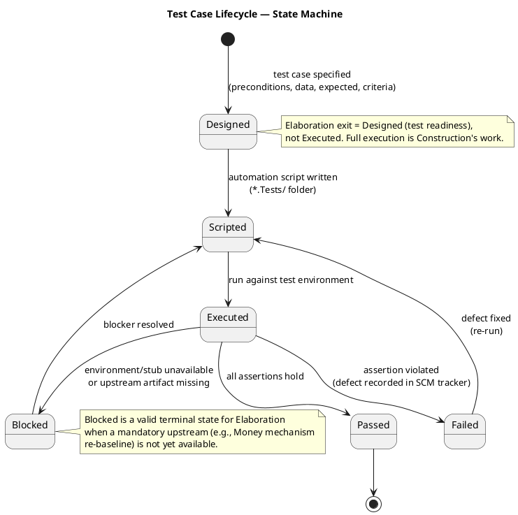
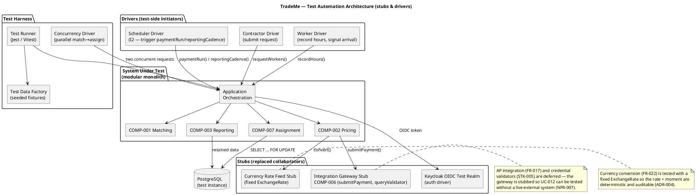

## Document Control
| Field | Value |
|---|---|
| Phase | Elaboration |
| Status | Draft — iteration 1 |
| Milestone Target | End-of-Elaboration review (Lifecycle Architecture Milestone) |

## Test Scope

This artifact specifies the **test cases** for the architecturally significant use-case scenarios, per the Test Plan's Elaboration mandate (LCA-T1..T7). Elaboration's exit criterion is **test readiness**, not execution: each test case below is fully specified (preconditions, input data, expected outcome, pass/fail criteria, automation hints, interface points, environment prerequisites) so the Tester can script and execute it in Construction without re-deriving intent.

**Scope boundary.** Test cases cover the four architecturally significant use cases (UC-004, UC-012, UC-013, UC-014), the Money value object (ADR-004), and the cross-cutting mechanisms they exercise (auth/authz REQ-001/REQ-002, audit REQ-003, responsiveness REQ-013). The remaining Must/Should flows (UC-001..UC-003, UC-005..UC-011, UC-015, UC-016) are covered by the Test Plan's TI-005 and are **not** elaborated here — they are standard scenario tests with no architectural risk, deferred to Construction per the Test Plan's schedule. Nice-to-have capabilities (UC-017..UC-021) are tested only for retained-data support (NFR-004), not behavior.

**Adversarial posture.** Every test case targets a *plausible failure mode*, not a confirmation of the happy path. Where a test case has no failure scenario in mind, it is not a test — it is a demonstration. The failure mode is stated explicitly in each case's "Failure mode targeted" field.

**Risk weighting.** R003 (multi-jurisdiction, exposure 12), R004 (matching-policy capture, 12), R005 (availability race, 12) are the significant risks de-risked first. R002 (leadership tension, 16) is a process risk mitigated by traceability, not test cases.

## Test Case Catalog

### Test Automation Architecture

The test harness drives the modular monolith through its public interfaces; collaborators that are deferred or external are stubbed so the system under test is exercised without a live external dependency (NFR-007). The availability race (NFR-008) is driven by a concurrency driver that issues two simultaneous match→assign requests.

### TC-001 — UC-004 Main Flow: Match and Assign (happy path)

| Field | Value |
|---|---|
| Traces to | UC-004, FR-004, FR-018, FR-019, COMP-001, COMP-007 |
| Test type | Functional (scenario) |
| Priority | Must |
| Failure mode targeted | The system fails to commit a valid assignment when a candidate exists — i.e., the core brokerage function silently drops a match. |

**Preconditions.** Contractor registered (UC-002) with active membership (UC-008); project listing exists (UC-003); at least one worker is available in the required trade/location with a matching expected rate.

**Input data.** A `WorkerRequest` with valid `projectId`, non-empty `needs` (one trade, one skill level, one location, one duration, one bill rate), and empty `preferences`.

**Procedure.** 1. Contractor driver submits `requestWorkers(projectId, needs, preferences)`. 2. Matching (COMP-001) searches the available population and selects a best fit per the configured policy. 3. Assignment (COMP-007) verifies availability and commits.

**Expected outcome.** Exactly one `Assignment` is created; the worker's availability transitions to `ASSIGNED`; the commitment is recorded (CON-013); the contractor receives an assignment confirmation.

**Pass/fail criteria.** PASS iff exactly one assignment exists, the worker's availability is `ASSIGNED`, and the commitment record is present. FAIL if zero or more-than-one assignment results, or if availability is left in an inconsistent state.

**Automation hint.** Scriptable as a black-box scenario against the Application orchestration; no stubs required beyond the OIDC test realm. Interface points: `IMatching.match/select`, `IAssignment.commitAssignment`.

### TC-002 — UC-004 Alternative A1: No Candidate Found

| Field | Value |
|---|---|
| Traces to | UC-004, FR-023, COMP-001 |
| Test type | Functional (negative) |
| Priority | Must |
| Failure mode targeted | The system fabricates a match when none exists, or crashes instead of leaving the request open. |

**Preconditions.** Contractor registered; project listing exists; **no** worker available in the required trade/location.

**Input data.** A `WorkerRequest` whose `needs` reference a trade with zero available workers.

**Procedure.** Submit the request; observe the matching result.

**Expected outcome.** No assignment is created; the request remains `open` awaiting match; the contractor is offered the option to raise the offered rate (FR-023).

**Pass/fail criteria.** PASS iff no assignment is created and the request status is `open`. FAIL if an assignment is fabricated or the system errors out.

**Automation hint.** Seed the test data factory with an empty available-worker population for the target trade. Interface point: `IMatching.match` returns empty candidate list.

### TC-003 — UC-004 Alternative A2: Availability Race (AC-005, NFR-008)

| Field | Value |
|---|---|
| Traces to | UC-004, FR-019, NFR-008, AC-005, COMP-007, R005 |
| Test type | Concurrency |
| Priority | Must |
| Failure mode targeted | Two concurrent requests both commit the same worker — a double-assignment that violates data integrity (the exact failure AC-005 forbids). |

**Preconditions.** One worker available; two contractors each submit a request for that worker's trade/location simultaneously.

**Input data.** Two `WorkerRequest`s targeting the same scarce worker, issued by the concurrency driver in parallel.

**Procedure.** The concurrency driver issues both `commitAssignment` calls concurrently against the `AvailabilityLedger` (`SELECT ... FOR UPDATE`).

**Expected outcome.** Exactly one assignment commits; the other request reverts to matching (FR-019) and re-searches. Neither the worker's record nor either contractor's request is lost; no inconsistent state results.

**Pass/fail criteria.** PASS iff exactly one assignment is committed, the losing request reverts (not errors, not dead-ends), and the availability ledger shows a single consistent state. FAIL if both commit, if either request is lost, or if the ledger is inconsistent.

**Automation hint.** This is the LCA-T2 concurrency test. Requires the concurrency driver and a real PostgreSQL test instance (the row lock is the mechanism under test — it cannot be stubbed). Interface point: `IAssignment.commitAssignment` + `AvailabilityLedger.lockAvailability`.

### TC-004 — UC-004 Alternative A3: Preference Weighting (CON-006)

| Field | Value |
|---|---|
| Traces to | UC-004, CON-006, NFR-005, COMP-001 |
| Test type | Functional (policy) |
| Priority | Must |
| Failure mode targeted | A contractor's preference is treated as a hard exclusion — i.e., the system lets a contractor insist on (or deny) a specific worker, violating the fairness objective. |

**Preconditions.** Multiple candidates available; contractor expresses a preference for a specific worker.

**Input data.** A `WorkerRequest` with `preferences` naming a specific worker.

**Procedure.** Submit the request; observe which worker is selected and whether the preference acted as a soft signal or a hard filter.

**Expected outcome.** The preference is recorded as a soft signal (weighted, not insisted); the selected worker is the best fit per the published policy, which may or may not be the preferred worker. No candidate is hard-excluded on preference alone.

**Pass/fail criteria.** PASS iff the preference is weighted (not a hard filter) and the selection is deterministic and explainable. FAIL if the preference hard-excludes any candidate without a verifiable cause.

**Automation hint.** Exercise both `FirstAcceptableMatchPolicy` and `PreferenceWeightedPolicy` strategies (CLS-002) via configuration. Interface point: `IMatching.select`.

### TC-005 — Matching Policy Configurability (AC-008, NFR-005)

| Field | Value |
|---|---|
| Traces to | UC-004, NFR-005, AC-008, COMP-001, R004 |
| Test type | Config-driven |
| Priority | Must |
| Failure mode targeted | The matching policy is hard-coded, so a fairness adjustment requires a code change — the exact failure AC-008 forbids. |

**Preconditions.** A candidate set where the two policy strategies (`FirstAcceptableMatchPolicy`, `PreferenceWeightedPolicy`) would select different workers.

**Input data.** A candidate set + preferences that discriminate between the two strategies.

**Procedure.** Run selection under strategy A, then switch configuration to strategy B, and re-run on the same input.

**Expected outcome.** The selection changes to match the configured strategy, with no code change; the selection is deterministic and explainable (published policy, not hidden ordering).

**Pass/fail criteria.** PASS iff switching configuration (not code) changes the selection to the configured policy's deterministic result. FAIL if the policy is hard-coded or the selection is non-deterministic.

**Automation hint.** This is the LCA-T4 config-driven test's matching-policy half. Interface point: `IMatching.select` with injected `MatchingPolicy` strategy.

### TC-006 — UC-012 Main Flow: Wage Computation with Floor/Premium/Tax

| Field | Value |
|---|---|
| Traces to | UC-012, FR-007, FR-014, CON-008, CON-009, CON-010, COMP-002 |
| Test type | Functional (scenario) + boundary-value |
| Priority | Must |
| Failure mode targeted | A wage is computed below the jurisdiction minimum floor, or without the mandated risk premium / tax withholding — a compliance failure (CON-008/CON-009/CON-010). |

**Preconditions.** Hours recorded (UC-006) against an active assignment; agreed rates present; jurisdiction configuration loaded (I3).

**Input data.** Hours entries whose raw wage falls **below** the jurisdiction floor; a high-risk trade (e.g., high-voltage electrical) requiring a premium; a jurisdiction with a known tax-withholding rate.

**Procedure.** Trigger `paymentRun(window)`; observe the computed wages.

**Expected outcome.** Each wage is a `Money` value object with the floor applied (wage ≥ floor), the risk premium added for high-risk work, and the jurisdiction-specific tax withheld. No bare float appears on any monetary path.

**Pass/fail criteria.** PASS iff every computed wage ≥ the jurisdiction floor, the premium is present for high-risk work, and the withholding matches the jurisdiction rate. FAIL if any wage is below the floor, a premium is missing, or withholding is wrong.

**Automation hint.** Boundary-value: test exactly-at-floor and just-below-floor inputs. Interface point: `IPricing.computeWages` + `TaxCalculator.applyWithholding`.

### TC-007 — UC-012 Currency Conversion (FR-022, ADR-004)

| Field | Value |
|---|---|
| Traces to | UC-012, FR-022, ADR-004, COMP-002 |
| Test type | Functional (boundary) + monetary-integrity |
| Priority | Must |
| Failure mode targeted | A cross-currency payment is computed without recording the rate and the moment applied — an unauditable conversion (ADR-004). |

**Preconditions.** Contractor and worker in different currency boundaries; a fixed `ExchangeRate` stub is configured.

**Input data.** A wage in currency A to be paid in currency B, with a known fixed rate.

**Procedure.** Trigger the payment run; observe the conversion.

**Expected outcome.** The wage is converted to currency B using the fixed rate; the `ExchangeRate` (from, to, rate, appliedAt) is recorded; the result is a `Money` value object (exact amount + currency), never a bare float.

**Pass/fail criteria.** PASS iff the converted amount is exact, the `ExchangeRate` (rate + moment) is recorded, and no bare float appears. FAIL if the rate/moment is not recorded or a float appears.

**Automation hint.** Uses the Currency Rate Feed Stub for determinism. Interface point: `IPricing.convert` + `CurrencyConverter`.

### TC-008 — UC-012 Single-Currency Deployment (FR-022)

| Field | Value |
|---|---|
| Traces to | UC-012, FR-022, COMP-002 |
| Test type | Functional (boundary) |
| Priority | Must |
| Failure mode targeted | A single-currency deployment performs an unnecessary (and potentially lossy) conversion. |

**Preconditions.** Contractor and worker in the same currency boundary.

**Input data.** A wage in currency A to be paid in currency A.

**Procedure.** Trigger the payment run.

**Expected outcome.** No conversion is performed; the wage passes through unchanged as a `Money` value object.

**Pass/fail criteria.** PASS iff no conversion occurs and the amount is unchanged. FAIL if a conversion is attempted.

**Automation hint.** Boundary case of TC-007. Interface point: `IPricing.convert` is not invoked.

### TC-009 — Money Value Object Integrity (ADR-004, TI-007)

| Field | Value |
|---|---|
| Traces to | ADR-004, CON-004, FR-022, REQ-028, COMP-002 |
| Test type | Monetary-integrity (static + dynamic) |
| Priority | Must |
| Failure mode targeted | A bare floating-point number appears on a monetary path (domain, HTTP boundary, or DB driver read) — the critical defect ADR-004 forbids. |

**Preconditions.** The Money mechanism is **re-baselined** (Review Record F1..F4 closed). Until then this test case is **BLOCKED** — see note below.

**Input data.** Exact arithmetic cases: `0.10 + 0.20 = 0.30`; carry propagation `0.90 + 0.20 = 1.10`; mixed-scale `1.5 + 2 = 3.5`; cross-currency rejection; invalid-amount rejection; `subtract` and `convert` (once F2 is fixed).

**Procedure.** 1. Static: inspect the domain, HTTP boundary, and DB-driver type handling for any float. 2. Dynamic: run the arithmetic cases and assert exact results.

**Expected outcome.** All arithmetic is exact (no `0.30000000000000004`); cross-currency arithmetic is rejected; `subtract`/`convert` behave per CLS-008; the DB driver returns `NUMERIC` as string/decimal, never a JS `number`.

**Pass/fail criteria.** PASS iff zero bare-float occurrences and all arithmetic exact. FAIL if any float appears or any arithmetic is inexact.

**Automation hint.** This is the LCA-T3 dual-coverage test (black-box + white-box). White-box branches: `addExact` scale/carry, `Money.of` validation reject. **BLOCKED** until the Money mechanism is re-routed through the feature-branch → PR → review → merge flow (Review Record F1, Critical) and `subtract`/`convert` are implemented (F2, Major).

### TC-010 — Jurisdiction-Specific Tax Withholding (CON-009, AC-004)

| Field | Value |
|---|---|
| Traces to | UC-012, CON-009, AC-004, COMP-002, I3 |
| Test type | Config-driven |
| Priority | Must |
| Failure mode targeted | Two jurisdictions with different tax rules produce the same withholding — a per-jurisdiction correctness failure (AC-004). |

**Preconditions.** Two jurisdiction configurations loaded (I3) with different tax-withholding rules.

**Input data.** The same hours/rate scenario executed under jurisdiction A and jurisdiction B.

**Procedure.** Run `computeWages` under each jurisdiction's configuration.

**Expected outcome.** Each jurisdiction produces its own correct withholding; the results differ where the rules differ, and each is correct for its jurisdiction.

**Pass/fail criteria.** PASS iff the two jurisdictions produce jurisdiction-correct (and where applicable, different) withholding. FAIL if they produce identical results despite different rules, or if either is incorrect.

**Automation hint.** This is the LCA-T4 config-driven test's tax half. Interface point: `TaxCalculator.applyWithholding` reading from `JurisdictionConfig` (I3).

### TC-011 — UC-013 Config-Driven Two-Jurisdiction Report (AC-001, AC-004)

| Field | Value |
|---|---|
| Traces to | UC-013, FR-015, CON-014, NFR-003, AC-001, AC-004, COMP-003, R003 |
| Test type | Config-driven (equivalence) |
| Priority | Must |
| Failure mode targeted | A new jurisdiction's reporting requires a code change, or two jurisdictions produce the same report despite different rules — the failures AC-001/AC-004 forbid. |

**Preconditions.** Two jurisdiction configurations loaded (I3) with different reporting rules (format, cadence, fields).

**Input data.** The same operational window (labor activity, payment flows, certification status, tax withholding) under both jurisdictions.

**Procedure.** Trigger `reportingCadence(jurisdiction)` for each; observe the assembled report.

**Expected outcome.** Each jurisdiction produces a report in its own required format, on its own cadence, with its own fields — driven entirely by configuration, no code change.

**Pass/fail criteria.** PASS iff the two reports differ per their configured rules and each is correct for its jurisdiction, with no code change. FAIL if a code change is required or the reports are jurisdiction-incorrect.

**Automation hint.** This is the LCA-T4 config-driven test's reporting half. Interface point: `IReporting.produceReport` + `ConfigurationService.reportingRules`.

### TC-012 — Audit Tamper-Evidence (AC-006, REQ-003)

| Field | Value |
|---|---|
| Traces to | UC-012, UC-014, REQ-003, AC-006, CON-014 |
| Test type | Audit (simulation) |
| Priority | Must |
| Failure mode targeted | A financial/assignment record is updated in place (not appended), or the audit trail is out of order — a tamper-evidence failure (AC-006). |

**Preconditions.** A multi-month window of payment and assignment transactions recorded.

**Input data.** A simulated audit over the window.

**Procedure.** 1. Attempt to update an existing payment/assignment record in place. 2. Read the audit trail and verify ordering and completeness.

**Expected outcome.** Append-only tables (`payment`, `termination`, `rate_adjustment`, `exchange_rate`, `regulatory_report`) reject in-place updates; the audit trail is complete and correctly ordered.

**Pass/fail criteria.** PASS iff in-place updates are rejected and the trail is complete and correctly ordered. FAIL if a record can be mutated in place or the trail is incomplete/out-of-order.

**Automation hint.** This is the LCA-T5 audit-simulation test. Interface point: the ORM repository exposes only insert/read on append-only tables (Design Model binding rule 3).

### TC-013 — UC-014 Termination with Verifiable Cause

| Field | Value |
|---|---|
| Traces to | UC-014, FR-020, CON-013, COMP-007 |
| Test type | Functional (scenario) |
| Priority | Must |
| Failure mode targeted | A legitimate termination (project end, illness, walk-off) is rejected, stranding the worker in a stale assignment. |

**Preconditions.** An active assignment exists; a termination request with a verifiable cause (e.g., project end).

**Input data.** `terminate(assignmentId, cause)` where `cause.verifiable = true`.

**Procedure.** Submit the termination; observe the result.

**Expected outcome.** The worker is removed from the active assignment, released to `AVAILABLE`, and the deviation from commitment is recorded (CON-013).

**Pass/fail criteria.** PASS iff the assignment is terminated, availability is `AVAILABLE`, and the deviation is recorded. FAIL if a legitimate termination is rejected or the worker is not released.

**Automation hint.** Interface point: `IAssignment.terminate`.

### TC-014 — UC-014 Termination Without Verifiable Cause (CON-006, CON-013)

| Field | Value |
|---|---|
| Traces to | UC-014, CON-006, CON-013, COMP-007 |
| Test type | Functional (negative) |
| Priority | Must |
| Failure mode targeted | A casual termination (worker chasing better pay) is accepted — the contracts-must-be-honored violation CON-013 forbids. |

**Preconditions.** An active assignment exists; a termination request with **no** verifiable cause.

**Input data.** `terminate(assignmentId, cause)` where `cause.verifiable = false`.

**Procedure.** Submit the termination; observe the result.

**Expected outcome.** The termination is rejected; the assignment remains active; the worker is not released.

**Pass/fail criteria.** PASS iff the termination is rejected and the assignment remains active. FAIL if a casual termination is accepted.

**Automation hint.** Negative case of TC-013. Interface point: `IAssignment.terminate` + `TerminationCause.verifiable` flag.

### TC-015 — Authorization Scoping (REQ-001, REQ-002)

| Field | Value |
|---|---|
| Traces to | REQ-001, REQ-002, CON-003, CON-004, ADR-005 |
| Test type | Security |
| Priority | Must |
| Failure mode targeted | A worker or contractor reads another party's records — an authorization breach (REQ-002). |

**Preconditions.** Two workers registered; Keycloak OIDC test realm provisioned.

**Input data.** An authenticated request from worker A attempting to read worker B's records.

**Procedure.** Authenticate as worker A; attempt to access worker B's hours/payment/assignment records.

**Expected outcome.** Access is denied; worker A sees only their own records. The identity provider is a deployment-time configuration choice (CON-017).

**Pass/fail criteria.** PASS iff cross-party access is denied and own-record access succeeds. FAIL if any cross-party read succeeds.

**Automation hint.** Uses the Keycloak OIDC test realm. Interface point: Security (I4) authorization scoping.

### TC-016 — Interactive-Channel Responsiveness (NFR-009, REQ-013)

| Field | Value |
|---|---|
| Traces to | NFR-009, REQ-013, NFR-006 |
| Test type | Performance (responsiveness) |
| Priority | Must |
| Failure mode targeted | An interactive operation (search/match/register/hours) exceeds the p95 ≤ 2s ceiling, stalling the fallback channel (UC-011). |

**Preconditions.** Test environment provisioned; representative console and self-service channel reachable.

**Input data.** A representative-console search/match operation during a simulated call.

**Procedure.** Measure the p95 latency of search/match/register/hours operations on both channels.

**Expected outcome.** p95 ≤ 2 seconds on both self-service and phone channels (channel equivalence, NFR-006).

**Pass/fail criteria.** PASS iff p95 ≤ 2s on both channels. FAIL if p95 > 2s on either channel.

**Automation hint.** This is the LCA-T6 responsiveness test. No load/scale testing (CON-021 — throughput not binding); only a responsiveness check.

## Test Data

| Data Set | Purpose | Source |
|---|---|---|
| Two-jurisdiction configuration set (jurisdiction A, jurisdiction B with different tax/reporting rules) | TC-010, TC-011 (AC-001, AC-004) | Configuration subsystem (I3) — seeded fixtures |
| Fixed `ExchangeRate` stub (deterministic rate + moment) | TC-007 (FR-022) | Currency Rate Feed Stub |
| Empty available-worker population for a target trade | TC-002 (no-candidate) | Test Data Factory |
| Scarce-worker fixture (one worker, two concurrent requests) | TC-003 (race) | Concurrency Driver + Test Data Factory |
| Candidate set discriminating between two matching strategies | TC-005 (AC-008) | Test Data Factory |
| High-risk trade fixture (high-voltage electrical) | TC-006 (CON-010) | Test Data Factory |
| Multi-month payment/assignment transaction window | TC-012 (AC-006) | Seeded retained-data store |
| Keycloak OIDC test realm (two workers, one contractor, one representative) | TC-015 (REQ-001/REQ-002) | Security (I4) test realm |

**Environment prerequisites** (from Test Plan Environmental Needs): multi-tenant test instance, single-tenant test instance, two-jurisdiction configuration set, CI pipeline, Keycloak OIDC test realm. The concurrency test (TC-003) and monetary-integrity test (TC-009) require a **real PostgreSQL test instance** — the row lock and the DB-driver type handling are the mechanisms under test and cannot be stubbed.

## Traceability

| Element | Traces From | Link Type | Traces To |
|---|---|---|---|
| TC-001 | UC-004, FR-004, FR-018, FR-019 | Tests | COMP-001, COMP-007 |
| TC-002 | UC-004, FR-023 | Tests | COMP-001 |
| TC-003 | UC-004, FR-019, NFR-008, AC-005 | Tests | COMP-007 |
| TC-004 | UC-004, CON-006, NFR-005 | Tests | COMP-001 |
| TC-005 | UC-004, NFR-005, AC-008 | Tests | COMP-001 |
| TC-006 | UC-012, FR-007, FR-014, CON-008, CON-009, CON-010 | Tests | COMP-002 |
| TC-007 | UC-012, FR-022, ADR-004 | Tests | COMP-002 |
| TC-008 | UC-012, FR-022 | Tests | COMP-002 |
| TC-009 | ADR-004, CON-004, FR-022, REQ-028 | Tests | COMP-002 |
| TC-010 | UC-012, CON-009, AC-004 | Tests | COMP-002, I3 |
| TC-011 | UC-013, FR-015, CON-014, NFR-003, AC-001, AC-004 | Tests | COMP-003 |
| TC-012 | UC-012, UC-014, REQ-003, AC-006, CON-014 | Tests | COMP-002, COMP-007 |
| TC-013 | UC-014, FR-020, CON-013 | Tests | COMP-007 |
| TC-014 | UC-014, CON-006, CON-013 | Tests | COMP-007 |
| TC-015 | REQ-001, REQ-002, CON-003, CON-004 | Tests | I4 |
| TC-016 | NFR-009, REQ-013, NFR-006 | Tests | (all user-facing UCs) |
