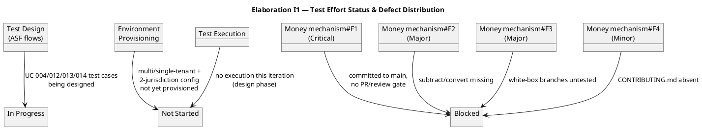

## Document Control
| Field | Value |
|---|---|
| Phase | Elaboration |
| Status | Draft — iteration 1 |
| Milestone Target | End-of-Elaboration review (Lifecycle Architecture Milestone) |

## Test Scope

**Iteration under evaluation:** Elaboration iteration 1 (I4).

**Mission for this iteration.** Evolve the Inception test strategy into a Master Test Plan sized, scheduled, and resourced against the baselined architecture, and set the architecture-milestone (LCA) acceptance criteria. This iteration is a **test-design and planning** iteration — no test execution is expected; the deliverable is test readiness for the architecturally significant flows.

**In scope:** Test Plan evolution (Master Test Plan with schedule, resources, test types, LCA acceptance criteria); test-case design for the four architecturally significant use cases (UC-004, UC-012, UC-013, UC-014); environment provisioning plan (multi-tenant + single-tenant + two-jurisdiction config + OIDC realm); monetary-integrity test suite design (ADR-004).

**Out of scope this iteration:** Test execution (Construction's work); nice-to-have capability behavior testing (UC-017..UC-021 — retained-data support only); load/scale testing (CON-021 says throughput is not binding).

## Test Summary

**What was produced this iteration.** The Test Plan was evolved from Inception depth to Elaboration depth: measurable acceptance thresholds per quality attribute (p95 ≤ 2s for interactive channels, per the stakeholder's NFR-009 answer), a formal defect lifecycle state machine, a detailed schedule (Elaboration design → Construction execution → Transition regression), a resource plan sized from the measured Inception actuals, and seven architecture-milestone (LCA) acceptance criteria (LCA-T1..T7).

**Test readiness status.** Test-case design for the architecturally significant flows is **in progress**; environment provisioning is **not started** (planned for I5); test execution is **not started** (Construction's work). This is consistent with the Elaboration exit criterion — test readiness, not execution.

**Blocking condition.** The Money value object (ADR-004, TI-007) is **blocked from baseline** by open code-review findings (Review Record: 1 Critical, 2 Major, 1 Minor). The mechanism was committed directly to `main` bypassing the feature-branch → PR → review → merge flow (F1, Critical); `subtract`/`convert` are missing per CLS-008 (F2, Major); white-box branches are untested (F3, Major); `CONTRIBUTING.md` is absent (F4, Minor). Until these close, the monetary-integrity test suite (TI-007) cannot be designed against a baselined mechanism, and LCA-T3 and LCA-T7 cannot be satisfied.

## Defects and Incidents

**Defect data source:** SCM issue tracker and the Review Record (the authoritative source for defect metrics). No test execution occurred this iteration, so no test-discovered defects exist. The defects below are **code-review findings** on the Money mechanism, carried as the blocking condition for the monetary-integrity test suite.

| Finding | Severity | Status | Impact on Test Effort |
|---|---|---|---|
| Money mechanism#F1 (committed to main, no PR/review gate) | Critical | Open | Blocks TI-007 design; mechanism not baselined |
| Money mechanism#F2 (subtract/convert missing) | Major | Open | Blocks TI-007 design; CLS-008 conformance gap |
| Money mechanism#F3 (white-box branches untested) | Major | Open | Blocks TI-007 white-box coverage |
| Money mechanism#F4 (CONTRIBUTING.md absent) | Minor | Open | Blocks guideline-conformance verification |

**Incidents.** None — no test execution occurred this iteration.

## Conclusions

**Mission verdict: PARTIALLY MET.** The Master Test Plan was produced and committed (the primary deliverable of this iteration), with measurable LCA acceptance criteria, a detailed schedule, a resource plan, and a formal defect lifecycle. However, the monetary-integrity test suite (TI-007) is **blocked** by the open Money-mechanism code-review findings, which means LCA-T3 and LCA-T7 cannot yet be satisfied.

**Recommendation.** The test effort is on track for the LCA milestone **provided** the Money-mechanism findings (F1..F4) are closed this iteration by the Implementer and Software Architect (per the Review Record's action items). The monetary-integrity test suite design is gated on that closure. No test-effort re-planning is required; the blocking condition is upstream (implementation/architecture), not in the test strategy.

**Go/no-go for LCA (preliminary):** CONDITIONAL — the test strategy is ready, but the LCA test-readiness criteria LCA-T3 and LCA-T7 depend on the Money mechanism being re-baselined, which is not yet done.

## Traceability

| Element | Traces From | Link Type | Traces To |
|---|---|---|---|
| Test Plan (Elaboration I1) | Test Plan (Inception), Software Architecture Document, Risk List | DependsOn | Test Evaluation Summary |
| TI-007 (Money integrity) | ADR-004, CON-004, FR-022 | Tests | Money mechanism (src/domain/money.ts) |
| Money mechanism#F1..F4 | Review Record (Code Review) | DependsOn | TI-007 |
| LCA-T1..T7 | AC-001, AC-004, AC-005, AC-006, ADR-004, NFR-009 | DependsOn | Software Architecture Document |
