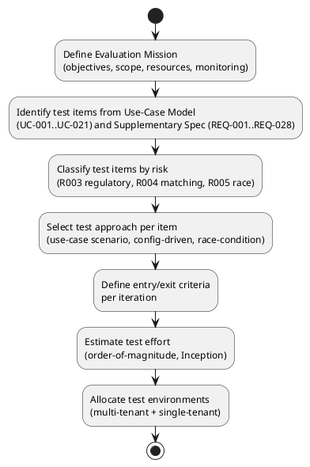

## Document Control

| Field | Value |
|---|---|
| Phase | Inception |
| Status | Draft — iteration 2 |
| Milestone Target | End-of-Inception review |

## Evaluation Mission

**Purpose.** Establish the initial test strategy for the TradeMe marketplace: what will be tested, how, with what resources, and what "acceptable" means — so that the end-of-Inception review can judge whether the test effort is scoped and resourced to de-risk the project's top risks.

**Objectives (Inception iteration 2).**
1. Anchor the test effort to the project's risk profile — R003 (multi-jurisdiction regulatory complexity), R004 (matching-policy capture), R005 (availability race condition) — rather than to a generic coverage target.
2. Define the test items and the approach for each, at order-of-magnitude depth (Inception does not yet define detailed acceptance thresholds).
3. Identify the test environments the architecture implies (multi-tenant default + single-tenant where residency requires, CON-017) and the cost of testing as a planning constraint ([ASSUMPTION — requires validation: testing ≈ 30–50% of project cost; basis: RUP planning heuristic / industry-standard test-effort proportion, not yet validated against this project's actuals]).
4. Establish entry/exit criteria that will gate each iteration's test effort, with the Evaluation Mission — not a 100% pass rate — as the exit standard.

**Scope.** The test effort covers the 21 system use cases (UC-001..UC-021) and the cross-cutting mechanisms (REQ-001..REQ-006, REQ-028) that the Use-Case Model and Supplementary Specification define. Testing is **risk-weighted**: the architecturally significant use cases (UC-004, UC-012, UC-013, UC-014) and the race-condition / regulatory / matching-policy mechanisms carry the highest test weight. Nice-to-have capabilities (UC-017..UC-021) are tested only to the extent their retained-data support (NFR-004) is verified; their full behavior is deferred.

**Resource strategy.** Testing is a lifecycle-wide activity, not a Construction-phase concentration. Inception allocates effort to strategy and risk identification only; Elaboration adds test design for the architecturally significant flows; Construction carries the bulk of execution; Transition carries regression and acceptance. Every iteration includes regression of prior increments (no undiscovered defect debt).

**Monitoring.** Test progress is measured against the Evaluation Mission per iteration, reported in the Test Evaluation Summary, and grounded in SCM defect metrics (issue tracker) and CI build status — never in prose assertions.

## Target Test Items

| ID | Test Item | Source | Risk Weight | Test Priority |
|---|---|---|---|---|
| TI-001 | UC-004 Request Workers (matching + assignment sub-flows) | FR-004, FR-018, FR-019, NFR-005, NFR-008 | High (R004, R005) | Must |
| TI-002 | UC-012 Process Payments (wage computation, tax, currency) | FR-014, FR-022, CON-008..CON-010 | High (R003) | Must |
| TI-003 | UC-013 Produce Regulatory Reports | FR-015, CON-014, NFR-003 | High (R003) | Must |
| TI-004 | UC-014 Terminate Worker Assignment (contracts-must-be-honored) | FR-020, CON-013, CON-006 | Medium | Must |
| TI-005 | UC-001..UC-003, UC-005..UC-011, UC-015, UC-016 (remaining Must/Should flows) | FR-001..FR-003, FR-005..FR-013, FR-021, FR-023 | Medium | Must/Should |
| TI-006 | Cross-cutting mechanisms (REQ-001..REQ-006: auth, authz, audit, retention, residency, fraud) | CON-003..CON-005, CON-014..CON-016, AC-006, AC-007 | High | Must |
| TI-007 | Money value object integrity (no bare floats on monetary paths) | REQ-028 (Money mechanism) | High | Must |
| TI-008 | Nice-to-have capabilities (UC-017..UC-021) — retained-data support only | FR-016, FR-017, FR-024..FR-026, NFR-004 | Low | Could |

**Risk weighting rationale.** R003 (exposure 12), R004 (12), R005 (12) are the SIGNIFICANT risks the test effort must de-risk first; R002 (16, HIGH) is a process risk mitigated by evidence-based traceability, not by test cases. The Money value object (TI-007, REQ-028) is a mandatory mechanism from the Software Architect's decision — a bare floating-point number anywhere on a monetary path is a critical defect, not a style preference.

## Test Approach

| Item | Approach | Technique |
|---|---|---|
| TI-001 | Use-case scenario testing of UC-004 main flow + alternatives A1 (no candidate), A2 (race revert), A3 (preference weighting). Race condition (NFR-008, AC-005) tested as a concurrency scenario. | Scenario-based; concurrency test |
| TI-002 | Use-case scenario testing of UC-012 with jurisdiction-specific tax/floors/premiums; currency conversion (FR-022) as boundary cases. Money value object verified at domain, API, and DB-driver edges. | Scenario-based; boundary-value; edge-integrity |
| TI-003 | Config-driven testing: same report scenario across two jurisdictions produces jurisdiction-specific output (AC-001, AC-004). | Configuration matrix; equivalence |
| TI-004 | Scenario testing of termination with/without verifiable cause (CON-006, CON-013). | Scenario-based; negative |
| TI-005 | Standard use-case scenario testing per flow. | Scenario-based |
| TI-006 | Cross-cutting mechanism verification: audit tamper-evidence (AC-006), retention window (CON-015), residency (CON-016), membership-violation detection (AC-007). | Mechanism verification; audit simulation |
| TI-007 | Static + dynamic: no bare float on any monetary path (domain, HTTP boundary, DB driver). | Code inspection + boundary test |
| TI-008 | Verify retained data supports future analytics (NFR-004); no full behavior test this cycle. | Data-shape verification |

**Regression.** Every iteration re-runs the prior increment's test set. Regression coverage is explicitly identified per iteration in the Iteration Plan; no iteration ships without it.

## Entry and Exit Criteria

**Entry criteria (per iteration).**
- The increment's use cases are specified (Use-Case Model) and their acceptance criteria are traceable to declared FR/NFR/AC.
- The build is available and CI is green for the increment under test.
- Test data and environments (multi-tenant + single-tenant) are provisioned.

**Exit criteria (per iteration).**
- The Evaluation Mission for that iteration is met — not a 100% pass rate.
- All Must-priority test items pass; Should/Could items are triaged and recorded as known limitations.
- Defects are recorded in the SCM issue tracker with severity; no open critical defect blocks the increment.
- The Test Evaluation Summary maps results to the mission and states a go/no-go verdict.

**Inception-specific note.** Inception does not yet define detailed acceptance thresholds (those are Elaboration's work). The Inception exit criterion is: the test strategy, scope, and resource plan are established and risk-weighted, and the test effort is sized at order-of-magnitude.

## Deliverables

| Deliverable | Phase | Owner |
|---|---|---|
| Test Plan (this artifact) | Inception | Test Manager |
| Test Evaluation Summary | Every iteration | Test Manager |
| Test cases / procedures for architecturally significant flows (UC-004, UC-012, UC-013, UC-014) | Elaboration | Test Designer |
| Regression test set | Every iteration from Construction | Test Designer |

## Environmental Needs

| Environment | Purpose | Justification |
|---|---|---|
| Multi-tenant test instance | Default topology (CON-017) — one instance serving multiple jurisdictions | Primary test environment |
| Single-tenant test instance | Residency-forced topology (CON-016, CON-017) | Verify residency enforcement and single-tenant deployment |
| Two-jurisdiction configuration set | AC-001, AC-004 — same scenario, different rules | Regulatory configuration matrix |
| CI pipeline with build status | Ground test results in observable build state | SCM defect metrics as quality intelligence |

**Cost awareness.** Testing is estimated at 30–50% of project cost ([ASSUMPTION — requires validation: basis = RUP planning heuristic / industry-standard test-effort proportion; not yet validated against this project's actuals]). The environment count above is the minimum the architecture implies (two topologies + a two-jurisdiction config set); no additional environments are justified at Inception depth.

## Traceability

| Element | Traces From | Link Type | Traces To |
|---|---|---|---|
| TI-001 | UC-004, NFR-005, NFR-008, R004, R005 | Tests | UC-004 |
| TI-002 | UC-012, CON-008, CON-009, CON-010, R003 | Tests | UC-012 |
| TI-003 | UC-013, CON-014, NFR-003, R003 | Tests | UC-013 |
| TI-004 | UC-014, CON-013, CON-006 | Tests | UC-014 |
| TI-005 | UC-001..UC-003, UC-005..UC-011, UC-015, UC-016 | Tests | UC-001..UC-016 |
| TI-006 | REQ-001..REQ-006, AC-006, AC-007 | Tests | REQ-001..REQ-006 |
| TI-007 | REQ-028 (Money mechanism) | Tests | UC-012, UC-006 |
| TI-008 | FR-016, FR-017, FR-024..FR-026, NFR-004 | Tests | UC-017..UC-021 |
