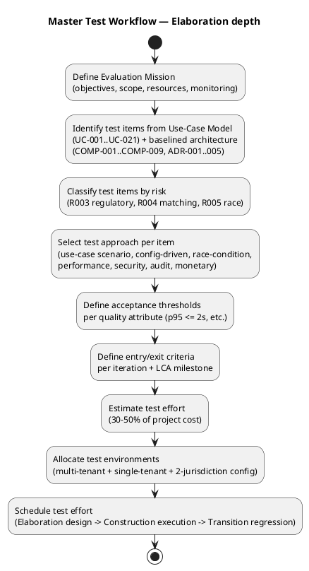
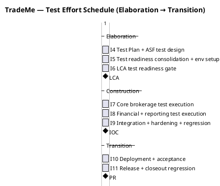
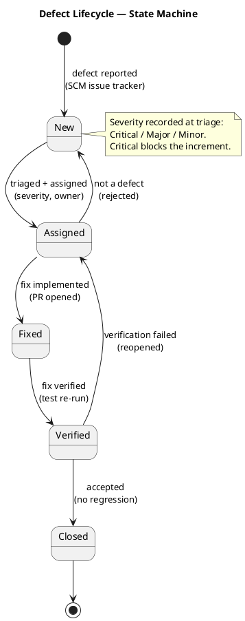

## Document Control
| Field | Value |
|---|---|
| Phase | Elaboration |
| Status | Draft — iteration 2 |
| Milestone Target | End-of-Elaboration review (Lifecycle Architecture Milestone) |

## Evaluation Mission

**Purpose.** Evolve the Inception test strategy into a **Master Test Plan** that sizes, schedules, and resources the test effort against the now-baselined architecture (SAD, ADR-001..005, COMP-001..009), so the end-of-Elaboration review (LCA) can judge whether the test effort is sufficient to de-risk the project's top risks before Construction.

**Objectives (Elaboration iteration 2).**
1. Anchor the test effort to the **baselined architecture**, not a generic coverage target: the four architecturally significant use cases (UC-004, UC-012, UC-013, UC-014) and the mechanisms they exercise (matching policy COMP-001, pricing/settlement COMP-002, regulatory reporting COMP-003, assignment/availability COMP-007, Money value object ADR-004) carry the highest test weight.
2. Define **measurable acceptance thresholds** per quality attribute — the Inception plan deferred these; Elaboration must set them so the LCA review has go/no-go criteria, not prose.
3. Specify the **test types** (functional, concurrency, config-driven, monetary-integrity, audit, performance, security) and the technique for each, at a depth sufficient to hand to the Test Designer.
4. Produce a **detailed schedule** (Elaboration design → Construction execution → Transition regression) and a **resource plan** (roles, environments, budget) sized from the measured Inception actuals.
5. Define the **architecture-milestone (LCA) acceptance criteria** — the specific, measurable conditions the test effort must satisfy for the architecture to be judged stable enough to enter Construction.

**Scope.** The test effort covers the 21 system use cases (UC-001..UC-021) and the cross-cutting mechanisms the baselined architecture defines (REQ-001..REQ-006, REQ-013, REQ-022, ADR-004 Money). Testing is **risk-weighted**: R003 (multi-jurisdiction, exposure 12), R004 (matching-policy capture, 12), R005 (availability race, 12) are the SIGNIFICANT risks the test effort must de-risk first; R002 (leadership tension, 16, HIGH) is a process risk — **accepted by the stakeholder this iteration** with the named contingency (if leadership tension blocks a milestone, surface the evidence trail and re-scope to the minimum viable increment leadership will accept) — and is mitigated by evidence-based traceability, not by test cases. Nice-to-have capabilities (UC-017..UC-021) are tested only to the extent their retained-data support (NFR-004) is verified.

**Resource strategy.** Testing is lifecycle-wide, not Construction-concentrated. Elaboration allocates effort to test design for the architecturally significant flows and environment provisioning; Construction carries the bulk of execution; Transition carries regression and acceptance. Every iteration includes regression of prior increments (no undiscovered defect debt). The test effort is sized at 30–50% of project cost ([ASSUMPTION — requires validation: basis = RUP planning heuristic / industry-standard test-effort proportion; not yet validated against this project's actuals]).

**Monitoring.** Test progress is measured against the Evaluation Mission per iteration, reported in the Test Evaluation Summary, and grounded in SCM defect metrics (issue tracker) and CI build status — never in prose assertions. The Money mechanism (ADR-004) is under active code review this iteration: PR #2 (`feature/E2-money-mechanism`) was reviewed with disposition **REQUEST CHANGES** (0 Critical, 2 Major, 2 Minor — findings F1..F4), build success (run 34935588509). The mechanism is **not yet baselined**; the test effort must not treat it as baselined until those findings close. The current main build is run 34886064517 (success).

## Target Test Items

| ID | Test Item | Source | Risk Weight | Test Priority |
|---|---|---|---|---|
| TI-001 | UC-004 Request Workers (matching + assignment sub-flows) | FR-004, FR-018, FR-019, NFR-005, NFR-008, COMP-001, COMP-007 | High (R004, R005) | Must |
| TI-002 | UC-012 Process Payments (wage computation, tax, currency) | FR-014, FR-022, CON-008..CON-010, COMP-002 | High (R003) | Must |
| TI-003 | UC-013 Produce Regulatory Reports | FR-015, CON-014, NFR-003, COMP-003 | High (R003) | Must |
| TI-004 | UC-014 Terminate Worker Assignment (contracts-must-be-honored) | FR-020, CON-013, CON-006, COMP-007 | Medium | Must |
| TI-005 | UC-001..UC-003, UC-005..UC-011, UC-015, UC-016 (remaining Must/Should flows) | FR-001..FR-003, FR-005..FR-013, FR-021, FR-023 | Medium | Must/Should |
| TI-006 | Cross-cutting mechanisms (REQ-001..REQ-006: auth, authz, audit, retention, residency, fraud) | CON-003..CON-005, CON-014..CON-016, AC-006, AC-007 | High | Must |
| TI-007 | Money value object integrity (no bare floats on monetary paths) | ADR-004, CON-004, FR-022 | High | Must |
| TI-008 | Nice-to-have capabilities (UC-017..UC-021) — retained-data support only | FR-016, FR-017, FR-024..FR-026, NFR-004 | Low | Could |

**Risk weighting rationale.** R003 (12), R004 (12), R005 (12) are the SIGNIFICANT risks the test effort must de-risk first; R002 (16, HIGH) is a process risk **accepted by the stakeholder this iteration** and mitigated by evidence-based traceability, not by test cases. The Money value object (TI-007, ADR-004) is the stakeholder-declared mandatory mechanism — a bare floating-point number anywhere on a monetary path is a critical defect, not a style preference. TI-007 is currently **under code review** (PR #2, REQUEST CHANGES — 0 Critical, 2 Major, 2 Minor); its white-box tests become part of the permanent regression set once the mechanism is re-baselined.

## Test Approach

| Item | Approach | Technique | Test Type |
|---|---|---|---|
| TI-001 | Use-case scenario testing of UC-004 main flow + alternatives A1 (no candidate), A2 (race revert), A3 (preference weighting). Race condition (NFR-008, AC-005) tested as a concurrency scenario against COMP-007's atomic availability check. | Scenario-based; concurrency test | Functional + Concurrency |
| TI-002 | Use-case scenario testing of UC-012 with jurisdiction-specific tax/floors/premiums; currency conversion (FR-022) as boundary cases. Money value object verified at domain, API, and DB-driver edges. | Scenario-based; boundary-value; edge-integrity | Functional + Monetary-integrity |
| TI-003 | Config-driven testing: same report scenario across two jurisdictions produces jurisdiction-specific output (AC-001, AC-004). | Configuration matrix; equivalence | Config-driven |
| TI-004 | Scenario testing of termination with/without verifiable cause (CON-006, CON-013). | Scenario-based; negative | Functional |
| TI-005 | Standard use-case scenario testing per flow. | Scenario-based | Functional |
| TI-006 | Cross-cutting mechanism verification: audit tamper-evidence (AC-006), retention window (CON-015), residency (CON-016), membership-violation detection (AC-007), auth/authz (REQ-001, REQ-002). | Mechanism verification; audit simulation | Audit + Security |
| TI-007 | Static + dynamic: no bare float on any monetary path (domain, HTTP boundary, DB driver). | Code inspection + boundary test | Monetary-integrity |
| TI-008 | Verify retained data supports future analytics (NFR-004); no full behavior test this cycle. | Data-shape verification | Data-shape |

**Performance testing (NFR-009, REQ-013).** The one performance constraint is interactive-channel responsiveness: p95 ≤ 2 seconds on self-service and phone channels (stakeholder answer: "fast enough so the representative doesn't have to wait during the call; you decide on the figure" → the SAD baselined p95 ≤ 2s). Throughput is NOT a binding constraint (CON-021), so no load/scale testing is planned — only a responsiveness check on the interactive channels.

**Security testing (REQ-001, REQ-002).** Authentication via Keycloak OIDC (ADR-005) and authorization scoped to own records. Test that workers/contractors see only their own records, and that the provider is a deployment-time configuration choice (CON-017).

**Regression.** Every iteration re-runs the prior increment's test set. Regression coverage is explicitly identified per iteration in the Iteration Plan; no iteration ships without it. The Money mechanism's white-box tests (PR #2 findings F3, F4) become part of the permanent regression set once the mechanism is re-baselined.

## Entry and Exit Criteria

**Entry criteria (per iteration).**
- The increment's use cases are specified (Use-Case Model) and their acceptance criteria are traceable to declared FR/NFR/AC.
- The build is available and CI is green for the increment under test.
- Test data and environments (multi-tenant + single-tenant + two-jurisdiction config) are provisioned.

**Exit criteria (per iteration).**
- The Evaluation Mission for that iteration is met — not a 100% pass rate.
- All Must-priority test items pass; Should/Could items are triaged and recorded as known limitations.
- Defects are recorded in the SCM issue tracker with severity; no open critical defect blocks the increment.
- The Test Evaluation Summary maps results to the mission and states a go/no-go verdict.

**Architecture-milestone (LCA) acceptance criteria — the specific, measurable conditions the test effort must satisfy for the architecture to be judged stable enough to enter Construction:**

| # | LCA Test Acceptance Criterion | Verifies | Measurable Threshold |
|---|---|---|---|
| LCA-T1 | The four architecturally significant UCs (UC-004, UC-012, UC-013, UC-014) have test cases designed and traceable to their FR/NFR/AC sources. | Test readiness | 4/4 UCs with designed test cases |
| LCA-T2 | The availability race (NFR-008, AC-005) has a concurrency test that exercises the match→assign transition and demonstrates exactly-one-assignment under concurrent access. | AC-005 | 1 concurrency test designed; race revert path covered |
| LCA-T3 | The Money value object (ADR-004) has dual coverage (black-box + white-box) and no bare float on any monetary path. | ADR-004 | 0 bare-float occurrences; white-box branches covered |
| LCA-T4 | The two-jurisdiction configuration set is provisioned and a config-driven test demonstrates jurisdiction-specific output (AC-001, AC-004). | AC-001, AC-004 | 2 jurisdictions configured; 1 equivalence test designed |
| LCA-T5 | The audit mechanism (REQ-003, AC-006) has a tamper-evidence test designed (append-only, correctly-ordered). | AC-006 | 1 audit-simulation test designed |
| LCA-T6 | The interactive-channel responsiveness constraint (NFR-009, REQ-013) has a test designed with the p95 ≤ 2s threshold. | NFR-009 | 1 responsiveness test designed with p95 ≤ 2s |
| LCA-T7 | The Money-mechanism code-review findings (PR #2 F1..F4) are closed and the mechanism is re-baselined. | Baseline integrity | 0 open Critical/Major findings on Money |

**Elaboration-specific note.** Elaboration's exit criterion is **test readiness**, not test execution: the test cases for the architecturally significant flows are designed, the environments are provisioned, and the acceptance thresholds are set. Full execution is Construction's work. The LCA-T1..T7 criteria above are the measurable form of that readiness.

## Deliverables

| Deliverable | Phase | Owner |
|---|---|---|
| Test Plan (this artifact) | Elaboration | Test Manager |
| Test Evaluation Summary | Every iteration | Test Manager |
| Test cases / procedures for architecturally significant flows (UC-004, UC-012, UC-013, UC-014) | Elaboration | Test Designer |
| Concurrency test for the availability race (AC-005) | Elaboration | Test Designer |
| Monetary-integrity test suite (ADR-004) | Elaboration | Test Designer |
| Config-driven two-jurisdiction test set (AC-001, AC-004) | Elaboration | Test Designer |
| Regression test set | Every iteration from Construction | Test Designer |

## Environmental Needs

| Environment | Purpose | Justification |
|---|---|---|
| Multi-tenant test instance | Default topology (CON-017) — one instance serving multiple jurisdictions | Primary test environment |
| Single-tenant test instance | Residency-forced topology (CON-016, CON-017) | Verify residency enforcement and single-tenant deployment |
| Two-jurisdiction configuration set | AC-001, AC-004 — same scenario, different rules | Regulatory configuration matrix |
| CI pipeline with build status | Ground test results in observable build state | SCM defect metrics as quality intelligence |
| Keycloak OIDC test realm | Auth/authz testing (ADR-005, REQ-001, REQ-002) | Security test environment |

**Cost awareness.** Testing is estimated at 30–50% of project cost ([ASSUMPTION — requires validation: basis = RUP planning heuristic / industry-standard test-effort proportion; not yet validated against this project's actuals]). The environment count above is the minimum the architecture implies (two topologies + a two-jurisdiction config set + an OIDC realm); no additional environments are justified at Elaboration depth.

**Resource plan (sized from measured Inception actuals).** The Inception phase closed at 2,186,548 tokens / 1.0 h agent time / 0s stakeholder queue / 11 agent runs / 12 artifacts (measured, not estimated). No per-iteration velocity is quotable (iterations inside a phase are not recorded separately). Elaboration I5 is a **remediation** iteration (box 610k tokens, per the Iteration Plan) — its test work is the Test Case#F1 CI-run-ID correction (Test Designer, 20k), not new test surface. The test roles are: Test Manager (this role — strategy, mission, monitoring) and Test Designer (test-case design, activated for the architecturally significant flows). Test design for the architecturally significant flows is allocated ~15–20% of a full iteration box ([ASSUMPTION — requires validation: basis = test-effort proportion of the iteration box; no test-specific actual has closed yet]).

**Schedule.** The test effort is distributed across the lifecycle, aligned to the Iteration Plan's baselined coarse roadmap (Elaboration I4/I5/I6 → Construction I7/I8/I9 → Transition I10/I11). Elaboration is test *readiness* (design + environment provisioning); Construction is test *execution*; Transition is regression + acceptance.

**Defect lifecycle.** Defects are recorded in the SCM issue tracker and follow a formal state machine; severity (Critical/Major/Minor) is recorded at triage, and a Critical defect blocks the increment.

## Traceability

| Element | Traces From | Link Type | Traces To |
|---|---|---|---|
| TI-001 | UC-004, NFR-005, NFR-008, R004, R005, COMP-001, COMP-007 | Tests | UC-004 |
| TI-002 | UC-012, CON-008, CON-009, CON-010, R003, COMP-002 | Tests | UC-012 |
| TI-003 | UC-013, CON-014, NFR-003, R003, COMP-003 | Tests | UC-013 |
| TI-004 | UC-014, CON-013, CON-006, COMP-007 | Tests | UC-014 |
| TI-005 | UC-001..UC-003, UC-005..UC-011, UC-015, UC-016 | Tests | UC-001..UC-016 |
| TI-006 | REQ-001..REQ-006, AC-006, AC-007 | Tests | REQ-001..REQ-006 |
| TI-007 | ADR-004, CON-004, FR-022 | Tests | UC-012, UC-006 |
| TI-008 | FR-016, FR-017, FR-024..FR-026, NFR-004 | Tests | UC-017..UC-021 |
| LCA-T1..T7 | AC-001, AC-004, AC-005, AC-006, ADR-004, NFR-009 | DependsOn | Software Architecture Document, Review Record |
